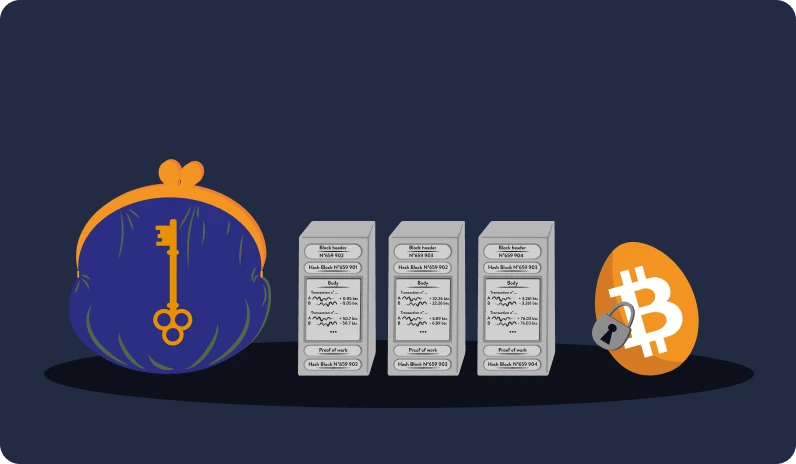
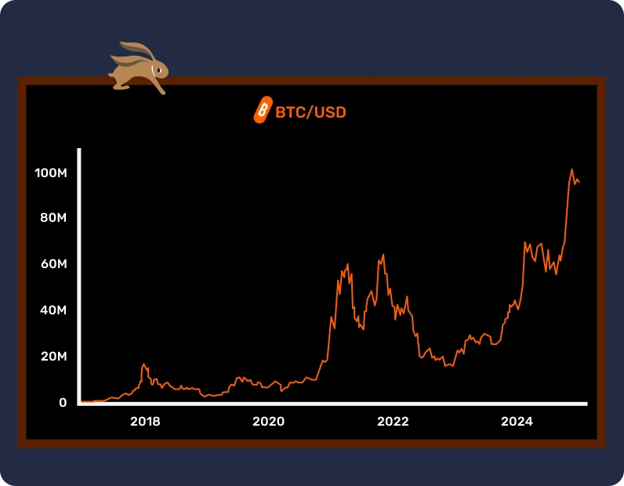

# Prima ta aventură Bitcoin

În acest curs, vom explica elementele de bază ale Bitcoin în 25 de capitole, astfel încât să puteți înțelege această tehnologie într-un mod simplu și eficient. Cursul explorează elementele de bază ale industriei, inclusiv subiecte precum miningul, portofelele, platformele de cumpărare/vânzare și multe altele. Materiale educaționale suplimentare vor fi disponibile de-a lungul călătoriei și, de asemenea, vă invităm să verificați "21 de postere" din secțiunea de resurse după ce ați terminat acest curs.

Nu aveți nevoie de cunoștințe specifice pentru a începe. De fapt, următorul conținut este accesibil studenților de toate nivelurile și ar trebui să dureze aproximativ 15 ore pentru a-l termina.

+++
# Introducere

<partId>3cd2ac82-026c-53e1-874a-baf5842adc6d</partId>

## Un salt în necunoscut

<chapterId>27e3fb60-4b50-556b-9e70-c4f5475c121d</chapterId>

### Bine ați venit într-o nouă paradigmă monetară și tehnologică.

Bitcoin este o revoluție tehnologică și monetară, capabilă să ne facă să punem la îndoială relația noastră cu banii și cu societatea. De fapt, Bitcoin (denumit BTC) este o monedă **neutră** și **descentralizată**, ceea ce înseamnă că nu este controlată de nicio entitate sau instituție. Este o inovație care merge dincolo de o simplă "monedă de internet": este atât un protocol informatic (Bitcoin), cât și o unitate monetară (bitcoin).

Protocolul utilizează tehnologii de bază precum criptografia, comunicarea în rețea și celebra "blockchain", în timp ce unitatea bitcoin servește drept moneda necesară pentru buna funcționare a acestui protocol. În viața de zi cu zi, Salvadorienii și bitcoinerii din întreaga lume folosesc moneda bitcoin pentru a cumpăra și vinde bunuri și servicii, bazându-se pe această tehnologie pentru a-și îmbunătăți viața.

### Un curriculum cuprinzător, dar accesibil

În cadrul acestui curs, vom discuta unele aspecte monetare ale Bitcoin, inclusiv modul de a cumpăra și vinde bitcoini, de a-i stoca în siguranță în portofele digitale și de a-i utiliza pentru tranzacții. Vom examina, de asemenea, rolul minerilor, care sunt esențiali pentru crearea de noi bitcoini și securizarea rețelei Bitcoin. În cele din urmă, vom explora viitorul Bitcoin și modul în care tehnologia Lightning Network poate îmbunătăți tranzacțiile Bitcoin.


Este esențial să înțelegem că Bitcoin este un nou sistem monetar care schimbă complet relația noastră cu banii, astfel învățarea modului de utilizare a acestuia este o abilitate necesară pentru oricine dorește să dețină controlul asupra propriilor fonduri.

**Secțiunea 1 - Bani**


- Capitolul 1 - Ce sunt banii?
- Capitolul 2 - Moneda Fiat
- Capitolul 3 - Hiperinflația
- Capitolul 4 - Politica monetară Bitcoin

**Secțiunea 2 - Portofele Bitcoin**


- Capitolul 5 - Cum funcționează portofelele Bitcoin?
- Capitolul 6 - Alegerea securității
- Capitolul 7 - Configurarea portofelului dvs
- Capitolul 8 - Protejarea împotriva timpului

**Secțiunea 3 - Caracteristici tehnice ale Bitcoin**


- Capitolul 9 - Ce este o tranzacție?
- Capitolul 10 - Noduri Bitcoin
- Capitolul 11 - Minerii
- Capitolul 12 - Minerii și ecologia

**Secțiunea 4 - Economisirea în Bitcoin**


- Capitolul 13 - Prețul Bitcoin
- Capitolul 14 - Cum să cumperi Bitcoin?
- Capitolul 15 - Munca pentru Bitcoin
- Capitolul 16 - Hiper-bitcoinizarea

**Secțiunea 5 - Lightning Network**


- Capitolul 17 - Introducere la Lightning Network
- Capitolul 18 - Cazuri de utilizare a Lightning Network

Înainte de a prezenta definiția banilor și funcția lor în societate (capitolul 1), ar trebui să pornim de la geneza Bitcoin. Lansat în 2009, Bitcoin este o tehnologie relativ nouă, diferită de orice altceva. Prin urmare, este normal să nu înțelegem totul despre ea, dintr-o dată. De fapt, la fel ca atunci când învățați să utilizați internetul sau să conduceți o mașină, nu trebuie să cunoașteți imediat toate detaliile tehnice: puteți începe prin a învăța cum să primiți, să plătiți și să vă asigurați fondurile, iar apoi să faceți pași mici pentru a o studia mai profund.

La urma urmei, suntem doar la începutul adoptării sale, deoarece am depășit faza de decolare: ați ajuns la timp pentru a dobândi cât de multe cunoștințe doriți cu privire la această inovație importantă.


Important aici este să înțelegeți această nouă tehnologie într-un mod general, așa că sperăm să vă placă acest curs și să continuați să faceți progrese în această nouă paradigmă monetară globală.

## Preistoria Bitcoin

<chapterId>9a94b627-5b69-5d81-9125-f1fa9b0aa6ad</chapterId>

Înainte ca termenul "Bitcoin" să devină sinonim cu moneda digitală și transformare financiară, bazele pentru crearea sa au fost construite printr-o serie de idei, inovații și mișcări sociale. Dintre acestea, mișcarea cypherpunk se remarcă ca un element-cheie în preistoria Bitcoin.

### Cypherpunks: vizionari ai lumii digitale


În mijlocul evoluției tehnologice din anii 1980 și 1990, un grup de persoane a început să pună profund sub semnul întrebării rolul vieții private și al libertății în era digitală. Aceste persoane, care mai târziu vor fi cunoscute sub numele de "cypherpunks", credeau cu tărie că criptografia poate servi drept instrument de protecție a drepturilor individuale împotriva intervenției guvernelor și a marilor corporații.

Personalități emblematice precum Julian Assange, Wei Dai, Tim May și David Chaum au jucat un rol esențial în conturarea filosofiei și viziunii mișcării. Acești gânditori și-au împărtășit ideile pe o influentă mailing list, unde participanți din întreaga lume s-au angajat în dezbateri cu privire la cele mai bune modalități de a valorifica tehnologia pentru o mai mare libertate individuală.

### Cele trei documente fundamentale ale Cypherpunks


Mișcarea cypherpunk, adânc înrădăcinată în activismul digital și criptografia, s-a bazat pe mai multe texte fundamentale pentru a-și articula principiile și viziunea asupra viitorului. Dintre aceste scrieri, trei ies în evidență în mod special:


- "Manifestul Cypherpunk":

scris de Eric Hughes în 1993, "Manifestul Cypherpunk" afirmă că viața privată este un drept fundamental. Autorul susține că abilitatea de a comunica liber și confidențial este esențială pentru o societate liberă. Manifestul afirmă: "Nu ne putem aștepta ca guvernele, corporațiile sau alte organizații mari, fără față, să ne acorde intimitate [...]. Trebuie să ne apărăm propria intimitate dacă ne așteptăm să avem parte de ea".


- "Manifestul criptoanarhist":

scris de Timothy C. May în 1992, acest document explică modul în care utilizarea criptografiei ar putea conduce la o eră a anarhiei criptografice în care guvernele ar fi neputincioase să intervină în afacerile private ale cetățenilor. May a imaginat un viitor în care oamenii vor face schimb anonim de informații și bani fără intervenția unei terțe părți.


- "Declarația de independență a spațiului cibernetic":

deși nu este exclusiv cypherpunk, acest text reflectă sentimentele multor participanți la această mișcare. Scris în 1996 de John Perry Barlow, acesta este un răspuns la reglementarea tot mai strictă a internetului de către guverne. Declarația afirmă că spațiul cibernetic este un tărâm distinct de sfera fizică și nu ar trebui să fie supus acelorași legi. După cum se afirmă în declarație, "nu avem un guvern ales și nici nu este probabil să avem unul".

### Predecesorii Bitcoin

Înainte de apariția Bitcoin, au existat mai multe încercări de a crea o monedă digitală. De exemplu, David Chaum a introdus conceptul de "monedă electronică anonimă" cu proiectul său "DigiCash" în anii 1980. Din păcate, din cauza diferitelor constrângeri, DigiCash nu a cunoscut niciodată un boom.

Un alt precursor important este "B-money" al lui Wei Dai. Deși nu a fost niciodată pusă în aplicare, aceasta a prezentat ideea unei monede digitale anonime în care detectarea fraudelor era realizată de o comunitate de evaluatori, mai degrabă decât de o autoritate centrală.

Imaginea de mai jos ilustrează clar dezvoltarea mișcării prin numeroasele sale inovații tehnologice.


În acest mediu fertil, misteriosul Satoshi Nakamoto a publicat Whitepaper-ul Bitcoin în 2008. În acest document, el a combinat mai multe idei din mișcarea cypherpunk, cum ar fi proof of work și timestamps criptografic, pentru a crea o monedă digitală descentralizată și rezistentă la cenzură.

Cu toate acestea, Bitcoin a fost mai mult decât atât: a reprezentat realizarea idealurilor cypherpunk. Dincolo de tehnologia sa, a simbolizat o revoluție împotriva sistemelor financiare tradiționale și a oferit o alternativă bazată pe transparență, descentralizare și suveranitate individuală.

### Concluzie

Preistoria Bitcoin este adânc înrădăcinată în mișcarea cypherpunk și în căutarea colectivă pentru o mai mare libertate în era digitală. Prin combinarea principiilor de criptografie, descentralizare și integritate, Bitcoin a devenit mult mai mult decât o monedă. De fapt, este produsul unei revoluții filosofice și tehnologice care continuă să ne remodeleze lumea.

Prin urmare, Bitcoin este un protocol care se întinde pe perioade lungi de timp și ne încurajează să punem la îndoială relația noastră cu energia, timpul și banii.

Cu toate acestea, este Bitcoin o monedă "reală"? Pentru a înțelege acest lucru, trebuie mai întâi să înțelegem conceptul de bani și diferitele sale forme, pe care le vom explora în capitolul următor.

Dacă doriți să explorați istoria Bitcoin în mai multe detalii, vă recomandăm cursul nostru HIS 201, unde veți descoperi originile și apariția lentă a Bitcoin, precum și începuturile istoriei și comunității sale. Acest curs este complet documentat și fundamentat, cu, desigur, multe anecdote:

https://planb.network/courses/a51c7ceb-e079-4ac3-bf69-6700b985a082
# Bani

<partId>e913df1a-4cbd-5380-ba67-ca2a0414f671</partId>

## Banii de-a lungul istoriei

<chapterId>c838e64d-d59f-5703-8c74-ea5e8c4fdd31</chapterId>

Evoluția banilor este un aspect fascinant al istoriei omenirii, care reflectă ingeniozitatea civilizațiilor de-a lungul timpului în satisfacerea nevoilor economice în continuă evoluție.


### De la cochilii la conturi bancare

Inițial, moneda era un bun tangibil, cum ar fi cerealele, animalele sau alte mărfuri. Cu toate acestea, aceste bunuri aveau dezavantajul major de a fi perisabile, ceea ce făcea dificilă utilizarea lor ca mijloc de economisire pe termen lung. De exemplu, recoltele slabe sau bolile animalelor puteau distruge averea unui individ peste noapte.

Astfel, pe măsură ce civilizațiile avansau și comerțul se extindea la noi regiuni, a apărut nevoia unui mijloc universal de schimb. Indivizii au experimentat mai întâi cu obiecte precum scoici și pietre prețioase, dar acestea nu erau atât de durabile sau rare pe cât credeau. În cele din urmă, aurul a devenit standardul, datorită rarității, durabilității și divizibilității sale. A fost, și rămâne până în prezent, un simbol al bogăției și puterii.


### Care este rolul banilor?

Banii sunt un instrument de comunicare extrem de sofisticat:


- Ea permite comunicarea între prezent și viitor, deoarece transformă timpul și energia noastră într-un activ care poate fi reutilizat în viitor fără riscul devalorizării.
- Acesta facilitează comunicarea într-un limbaj universal: fără să se cunoască sau să vorbească aceeași limbă, doi străini pot face schimburi, comerț și pot conveni asupra valorii lucrurilor.

Funcția sa în lumea noastră este dificil de reprodus artificial. De fapt, niciun individ sau grup nu poate crea bani, aceștia fiind un fenomen natural care trebuie să apară din piață și din consensul voluntar. În acest sens, prețurile servesc drept semnale și informații care ghidează societatea în alocarea resurselor.

Din aceste motive, aurul ca monedă este rezultatul a 4.000 de ani de darwinism monetar bazat pe următoarele funcții aristotelice:


- Depozit de valoare**: banii pot fi utilizați pentru a transfera puterea de cumpărare în viitor, deci trebuie să fie un material durabil;
- Mijloc de schimb**: banii pot fi folosiți în schimbul bunurilor și serviciilor în loc de troc, evitându-se astfel coincidența dorințelor între comercianți;
- Unitate de cont**: banii ne permit, de asemenea, să comparăm valorile diferitelor bunuri pentru a înțelege mai bine utilitatea lor relativă.


### Caracteristicile banilor

Aurul îndeplinește în mod ideal criteriile unei monede eficiente: raritatea sa naturală îl face valoros, în timp ce proprietățile sale chimice garantează că nu se erodează în timp. Aceste caracteristici au făcut din aur un excelent **magazin de valoare**, dar nu o monedă obișnuită, deoarece această formă de bani nu este ușor divizibilă sau transportabilă pe distanțe lungi. Într-o lume globalizată și digitală, aurul se luptă să țină pasul și are nevoie de o entitate centrală care să îl facă divizibil și ușor schimbabil (de exemplu, prin monede bătute).

La polul opus, monedele fiduciare de stat (fiat) sunt ușor de utilizat, dar sunt constant devalorizate de entitățile care le controlează (regi, bănci centrale, împărați, dictatori).

Pentru a explica mai bine acest concept, vom analiza caracteristicile unei monede eficiente:


- Fungibilitate**, ceea ce înseamnă că este interschimbabil cu o altă unitate de același tip fără a-și pierde valoarea;
- Divizibilitate**, deoarece poate fi împărțit în unități mai mici pentru a facilita tranzacțiile de volume diferite;
- Lichiditate**, ceea ce înseamnă că este ușor convertibil în bunuri sau servicii.

Pentru a îndeplini aceste criterii, moneda a evoluat istoric prin diferite etape:


- Piatră brută -> Monedă
- Bancnotă -> Card bancar
- Blockchain -> Rețeaua Lightning

Monedele continuă să evolueze și astăzi, adaptându-și formele pentru a răspunde diferitelor cazuri de utilizare. Așa cum am spus, deși aurul este un excelent depozit de valoare, acesta nu mai este potrivit pentru economia globalizată actuală. În mod similar, monedele fiduciare, cum ar fi dolarul și euro, sunt foarte lichide și ușor de transportat, deoarece acum sunt în mare parte digitale, dar valoarea lor este în mod constant redusă de inflația monetară.

Pe de altă parte, Bitcoin prezintă noi posibilități. Proprietățile sale, cum ar fi oferta strict limitată, îl fac un excelent depozit de valoare. În plus, în calitate de monedă neutră pe internet, aceasta servește drept **mijloc de schimb** viabil care depășește frontierele. Cu toate acestea, ea nu este încă acceptată pe scară largă în comerț, în ciuda [adoptării sale constante] (https://btcmap.org/map).

## Valute fiduciare

<chapterId>25151d46-7db1-5b48-8bba-cbde1944555a</chapterId>

> "Cei care nu își pot aminti trecutul sunt condamnați să îl repete", spunea George Santayana.
Un adevăr care rezonează perfect când vine vorba de sistemul monetar actual.

### Fiduciar = Încredere

În prezent, monedele importante precum euro și dolarul sunt considerate fiduciare. Aceasta înseamnă că nu au valoare intrinsecă și depind în întregime de încrederea pe care o acordăm instituțiilor care le guvernează.

O monedă fiduciară este o formă de bani care este decretată ca atare de o instituție, și anume un stat, precum China cu yuanul, sau o uniune politico-economică, precum Uniunea Europeană cu euro. Entitatea însărcinată cu emiterea sa este banca centrală (de exemplu, putem menționa Banca Populară a Chinei, Rezerva Federală a Statelor Unite sau Banca Centrală a Republicii Guineea). Tocmai aceste entități sunt responsabile de formularea politicii monetare și, prin urmare, de cantitatea de bani care trebuie pusă în circulație sau tipărită.


### Devalorizarea monetară: o strategie la fel de veche ca Imperiul Roman

Încă din antichitate, aurul a servit drept referință monetară, însă rigiditatea sa i-a determinat adesea pe conducători, fie ei împărați romani sau guverne moderne, să adopte monede alternative, adesea fiduciare.

Mecanismul este simplu și se inspiră din practici care au existat încă de la începuturile civilizației. Liderii, dornici să exercite controlul asupra bogăției, încep prin a centraliza aurul, adesea exploatându-și puterea și promițând protecție și securitate. Cu această rezervă prețioasă în mâini, ei introduc o nouă monedă, echivalentă în valoare cu aurul, dar bătută în efigia lor. Această monedă începe apoi să circule, iar oamenii se adaptează rapid la comoditatea utilizării sale simple.

Cu toate acestea, acești lideri încep apoi să devalorizeze treptat noua monedă, reducând de facto valoarea acesteia cu câteva procente în fiecare an în comparație cu prețul inițial al aurului. Această devalorizare tăcută este adesea justificată ca fiind în interesul poporului. În realitate, cei care economisesc în această monedă fiduciară văd cum valoarea economiilor lor se erodează, în timp ce statul își finanțează proiectele prin inflație. În plus, această devalorizare face ca datoriile să fie mai ușor de rambursat.


La un moment critic, liderul face anunțul: moneda nu mai este susținută de aur. Publicul, acum obișnuit cu moneda fiduciară și adesea dezinformat cu privire la aspectele financiare, acceptă această realitate, permițând statului să manipuleze liber masa monetară și să tipărească sume enorme de bani aproape fără costuri.

Imprimarea monetară conduce apoi la inflație și sărăcește treptat populația. În plus, sistemul financiar este reglementat și restricționat pentru a evita prăbușirea sa, deoarece orice perturbare ar putea provoca o criză economică majoră. Spre deosebire de mase, instituțiile financiare și persoanele bogate beneficiază foarte mult de pe urma acestui sistem, care creează un decalaj al inegalității și favorizează autoritarismul. În acest context, ei nu sunt stimulați să facă schimbări radicale, permițând sistemului să își continue cursul până la o posibilă implozie.

Atunci când este bine pusă în aplicare, această strategie poate dura zeci de ani. Cu toate acestea, este important să rețineți că o devalorizare foarte rapidă sau pierderea încrederii poate duce la hiperinflație (a se vedea capitolul următor). Istoria arată că dolarul și-a pierdut 98% din valoare în 100 de ani, euro 30% în 20 de ani, iar lira sterlină 99% de la crearea sa.

În cele din urmă, moneda ar putea să nu mai aibă nicio legătură cu aurul, la fel ca monedele romane de la sfârșitul Imperiului, sau chiar să fie redusă la o simplă valoare numerică, deconectată de realitatea tangibilă.

Astăzi, suntem martorii unui punct de cotitură istoric. Dolarul, care a dominat mult timp, pare să fie în declin, în timp ce aurul și-a pierdut rolul central. Ne aflăm în pragul unui nou ciclu monetar, amintindu-ne că lecțiile istoriei sunt adesea uitate


### Este Bitcoin o soluție?

Datorită acestor premise, revoluția Bitcoin capătă amploare. Spre deosebire de monedele anterioare, aceasta nu necesită **nici o terță parte de încredere** și urmărește să separe statul de bani.


De fapt, Bitcoin se prezintă ca un răspuns la aceste provocări sistemice prin propunerea unei soluții descentralizate și a unui nou sistem monetar paralel. Din punct de vedere istoric, dacă aurul a fost favorizat ca monedă datorită rezistenței sale la contrafacere, Bitcoin nu poate fi falsificat. În plus, acesta este limitat la 21 de milioane de unități, datorită naturii sale descentralizate și criptografice. Bitcoin este o monedă care se bazează pe transparență și neutralitate, oferind o alternativă atractivă la actualul sistem monetar centralizat.


Un alt motiv pentru care Bitcoin a captat atenția este apariția monedelor digitale ale băncilor centrale, sau CBDC, care pare inevitabilă. Această nouă formă de monedă ar dezvolta o economie planificată mai centralizat și ar putea atât să împiedice libertatea financiară a persoanelor, cât și să faciliteze abuzurile autoritare.

Putem încheia acest capitol cu citatul lui F.A Hayek, laureat al Premiului Nobel în 1984:

> "Nu cred că ar trebui să mai avem vreodată bani buni, înainte de a-i scoate din mâinile guvernului. Dacă nu le putem lua prin violență din mâinile guvernului, tot ce putem face este să introducem într-un mod viclean sau ocolit ceva ce ei nu pot opri."
Pentru a afla mai multe despre falsurile economice și libertate, vă invităm să descoperiți cursul nostru ECO 102, care urmărește viața și ideile lui Frédéric Bastiat, un gânditor francez din secolul al XIX-lea care ar fi apreciat cu siguranță apariția Bitcoin:

https://planb.network/courses/d07b092b-fa9a-4dd7-bf94-0453e479c7df
## Hiperinflația

<chapterId>b04c024c-54f3-50cb-997f-58721cfc74be</chapterId>

Hiperinflația este un fenomen monetar specific monedelor fiat: este cartatizată prin pierderea completă a încrederii într-o monedă și creșterea drastică a inflației ca urmare a tipăririi monetare de către autorități. Ca urmare, economiile acumulate de indivizi se pot risipi într-o perioadă relativ scurtă de timp, împingând țara în pragul colapsului economic, social și politic.

### Inflația se dezlănțuie!

Pentru a înțelege impactul inflației asupra economiilor, trebuie să luăm în considerare diferite rate ale inflației.


- Cu o inflație de 2%, pierzi anual 2% din puterea ta de cumpărare, ceea ce înseamnă 10% pe o perioadă de 5 ani.
- Cu 7%, pierzi jumătate din sumă în 10 ani.
- Cu 20%, pierzi aproape jumătate din sumă în 3 ani.

Atunci când apare hiperinflația, nu mai vorbim de 20% pe an, ci mai degrabă de 20% pe lună sau, la vârf, chiar pe zi. Experimentarea unei inflații de 100% pe zi pe parcursul a trei zile este un scenariu realist care a avut loc și continuă să aibă loc în lumea noastră.

Este esențial să înțelegem că hiperinflația nu apare din întâmplare, din cauza capitalismului sau a atacurilor politice ale adversarilor. Hiperinflația este consecința directă a deciziilor monetare greșite luate de bancherii centrali și de politicieni. Urmările sale afectează fiecare cetățean și chiar generațiile următoare. Vă invităm să petreceți cinci minute citind următorul tabel pentru a realiza pe deplin impactul real al acestui fenomen (cursul ECO204 aprofundează acest subiect). După cum puteți vedea, nicio țară sau monedă nu este potențial sigură.


### Care sunt fazele hiperinflației?


Pentru ca hiperinflația să apară, trebuie să aibă loc anumite evenimente.

Faza 1 - Pierderea încrederii


- Centralizarea puterii monetare facilitează crearea de bani și abuzurile acestora. În acest context, anumiți factori externi pot declanșa hiperinflația, de obicei războaiele, măsurile sociale sau creșterea prețului unor resurse-cheie precum grâul sau benzina. Astfel, poate apărea o pierdere a încrederii într-o monedă, iar indivizii încep să pună la îndoială originea banilor și beneficiile politicii monetare mandatate.

Faza 2 - Prăbușirea monedei și creșterea prețurilor


- Pe măsură ce guvernele pierd controlul încrederii, persoanele încep să își schimbe moneda cu una mai stabilă, așa cum s-a întâmplat în Venezuela cu dolarul american. Această situație duce la o creștere a prețurilor, creând un cerc vicios în care bunurile și serviciile devin din ce în ce mai scumpe. Pentru a satisface aceste nevoi și a corecta politica monetară, statul tipărește mai mulți bani, rezultând o inflație exponențială.

Faza 3 - Cercul vicios al tipăririi banilor


- Astfel, sunt necesare din ce în ce mai multe bancnote pentru a achiziționa bunuri, ceea ce duce la scumpirea banilor de hârtie. Ca răspuns, guvernele recurg la tipărirea mai multor bancnote, ceea ce alimentează și mai mult inflația.


Faza 4 - Apariția unei noi monede


- O nouă monedă este apoi introdusă pentru a o înlocui pe cea veche, cu scopul de a rupe ciclul inflației prin punerea în aplicare a unor controale mai stricte care nu existau în cazul monedei legale anterioare.

Rezolvarea unei crize de hiperinflație necesită adesea schimbări radicale, cum ar fi revoluții, schimbări de guvern, schimbări ale bancherilor centrali, printre altele. Pierderea încrederii, prăbușirea monedei și reconstrucția sunt etape esențiale pentru revigorarea unei economii bazate pe moneda fiat.

### Trei exemple notabile


- Germania, 1922-1923.

Unul dintre cele mai izbitoare exemple de hiperinflație a avut loc în Republica germană de la Weimar, după Primul Război Mondial.

Germania împrumutase sume enorme de bani pentru a finanța războiul. Cu toate acestea, Germania nu numai că i-a pierdut, dar a trebuit să plătească miliarde de dolari în despăgubiri. Luna cu cea mai mare rată a inflației a fost octombrie 1923, cu un vârf de 29.500%, ceea ce echivala cu o rată a inflației de 20,9% pe zi. Prețurile s-au dublat la fiecare 3,7 zile!

Moneda germană a devenit atât de inutilă, încât unii cetățeni au preferat să își ardă banii de hârtie în loc de lemn, deoarece era mai ieftin. Se spune chiar că, în restaurante, chelnerii trebuiau să anunțe prețurile din meniu la fiecare 30 de minute pentru a ține cont de inflație.

În cele din urmă, autoritățile au creat o nouă monedă, susținută de datoriile Germaniei, Franței și Angliei și garantată de pământul german.


- Ungaria, 1945-1946

Țara care a cunoscut cea mai gravă perioadă de hiperinflație până în prezent este de departe Ungaria, după cel de-al Doilea Război Mondial.

Ungaria s-a aflat de partea perdantă a conflictului, cu cea mai mare parte a capacității sale de producție industrială distrusă. Luna cu cea mai mare inflație a fost iulie 1946, care a înregistrat o inflație uluitoare a prețurilor de 41 900 000 000 000 000 000 %, echivalentul a 207 % pe zi. Prețurile s-au dublat la fiecare 15 ore!

Ultima bancnotă pusă în circulație a fost 100 de milioane de miliarde de pengo (100 000 000 000 000 000 000) în 1946.


- Zimbabwe, 2007-2008

Până în anul 2000, Zimbabwe era autosuficientă pentru aproape toate nevoile sale, cu excepția petrolului.

În 1997, dolarul zimbabwean s-a prăbușit cu peste 72% după ce guvernul a fost de acord să despăgubească veteranii de război cu suma echivalentă a 450 de milioane de dolari americani. Deoarece guvernul nu dispunea de o astfel de sumă, a recurs la tiparniță. În 2005, inflația a atins 586%, dar vârful a fost atins la jumătatea lunii noiembrie 2008, cu o rată estimată la 79 600 000 000% pe lună.

În iunie 2007, guvernul reacționase deja prin impunerea unui control al prețurilor, dar această acțiune nu a avut nicio influență asupra economiei. Magazinele au fost literalmente "jefuite", iar comercianții nu au mai avut mijloacele necesare pentru a-și aproviziona magazinele.

În aprilie 2009, ministrul de finanțe a anunțat suspendarea dolarului zimbabwean și a autorizat utilizarea diferitelor valute străine pentru comerț. Toate conturile bancare, pensiile și instituțiile financiare și-au văzut soldurile evaporate peste noapte.


În concluzie, hiperinflația are ca efect degradarea rapidă a valorii monedei, ducând la erodarea economiilor și la pierderea încrederii în sistemul monetar. După cum a sugerat odată Voltaire, o monedă fiat își va pierde întotdeauna valoarea intrinsecă și va converge spre zero.

O monedă care se bazează pe un terț de încredere, cum ar fi o instituție financiară, este, în practică și pe termen lung, una defectuoasă, deoarece nu poate garanta puterea de cumpărare sau conservarea economiilor.

Pentru a aprofunda subiectul hiperinflațiilor, vă recomandăm cursul ECO 204 al lui David St-Onge, unde veți afla ce sunt ciclurile hiperinflaționiste și impactul lor real asupra vieții noastre. De asemenea, veți descoperi asemănările dintre aceste cicluri și, cel mai important, cum să vă protejați de ele.

https://planb.network/courses/caa75343-ac90-4249-bcca-0e2e57c3a0f1
## 21 de milioane de bitcoini

<chapterId>f4a06d76-1963-56fd-93ff-dfa41489bcde</chapterId>

### Politica monetară a Bitcoin

Bitcoin este o monedă digitală descentralizată cu o cantitate maximă predefinită de **21 de milioane de unități**. Această caracteristică intrinsecă de raritate este determinată de codul său informatic și consolidată de consensul tuturor utilizatorilor care participă la protocol.


Emisiunea sa monetară poate fi ilustrată printr-o curbă care reprezintă cantitatea de bitcoini creată în timp. De exemplu, în 2022, erau în circulație aproximativ 18,5 milioane de bitcoini. Previziunile indică faptul că, până în 2025, vor exista aproximativ 19,5 milioane de bitcoini, reprezentând aproximativ 93% din oferta totală, iar până în 2037, această cifră va ajunge la 20,4 milioane.

### Cum sunt creați noii bitcoini?

Crearea de noi bitcoini este rezultatul procesului de minerit. Pe scurt, minerii folosesc computere puternice care rezolvă probleme matematice complexe, care validează și securizează tranzacțiile. Odată ce o problemă este rezolvată, minerul adaugă un nou bloc de tranzacții la blockchain, un registru descentralizat și distribuit care înregistrează toate tranzacțiile efectuate în rețea. Blockchain asigură transparența și securitatea, deoarece fiecare bloc este legat de cel precedent, ceea ce face aproape imposibilă modificarea datelor anterioare fără consensul rețelei.


După îndeplinirea cu succes a acestei sarcini, minerii sunt recompensați cu emiterea de noi bitcoini la fiecare zece minute. Această recompensă este programată să se înjumătățească la fiecare 210 000 de blocuri, adică aproximativ la fiecare patru ani (un eveniment cunoscut sub numele de "înjumătățire"), dând curbei de emitere monetară o formă de scară. Datorită acestui mecanism, se poate prezice matematic că crearea de noi bitcoini va înceta în jurul anului 2140, când numărul total va atinge limita de 21 de milioane.

| Numărul de înjumătățire | Înălțimea blocului | Recompensa BTC după înjumătățire | BTC estimat în circulație după înjumătățire |

| -------------- | ------------ | ------------------------- | ------------------------------------------ |

| 1 | 210,000 | 25 BTC | 10,500,000 BTC |

| 2 | 420,000 | 12.5 BTC | 15,750,000 BTC |

| 3 | 630,000 | 6.25 BTC | 18,375,000 BTC |

| 4 | 840,000 | 3.125 BTC | 19,687,500 BTC |

| 5 | 1,050,000 | 1.5625 BTC | 20,343,750 BTC |

| 6 | 1,260,000 | 0.78125 BTC | 20,671,875 BTC |

| 7 | 1,470,000 | 0.390625 BTC | 20,835,937.5 BTC |

| 8 | 1,680,000 | 0.1953125 BTC | 20,917,968.75 BTC |

| 9 | 1,890,000 | 0.09765625 BTC | 20,958,984.375 BTC |

| 10 | 2,100,000 | 0.048828125 BTC | 20,979,492.188 BTC |

| 11 | 2,310,000 | 0.0244140625 BTC | 20,989,746.094 BTC |

| 12 | 2,520,000 | 0.01220703125 BTC | 20,994,873.047 BTC |

| 13 | 2,730,000 | 0.006103515625 BTC | 20,997,436.523 BTC |

| 14 | 2,940,000 | 0.0030517578125 BTC | 20,998,718.262 BTC |

| 15 | 3,150,000 | 0.00152587890625 BTC | 20,999,359.131 BTC |

| 16 | 3,360,000 | 0.000762939453125 BTC | 20,999,679.566 BTC |

| 17 | 3,570,000 | 0.0003814697265625 BTC | 20,999,839.783 BTC |

| 18 | 3,780,000 | 0.00019073486328125 BTC | 20,999,919.892 BTC |

| 19 | 3,990,000 | 0.000095367431640625 BTC | 20,999,959.946 BTC |

| 20 | 4,200,000 | 0.0000476837158203125 BTC | 20,999,979.973 BTC |

Vom reveni asupra conceptului de minerit în mai multe detalii în capitolul [miner] (https://planb.network/courses/2b7dc507-81e3-4b70-88e6-41ed44239966/dbb8264a-7434-57e4-9d1b-fbd1bae37fdf).

### Garantarea rarității digitale

Limita de 21 de milioane este baza rarității Bitcoin și este garantată de două mecanisme-cheie: ajustarea dificultății de minare și teoria jocurilor.


- Ajustarea dificultății de minare este un proces care are loc la fiecare 2016 blocuri, sau aproximativ două săptămâni, pentru a se asigura că un nou bloc este adăugat la blockchain în medie la fiecare zece minute. Această frecvență de creare a blocurilor și cantitatea totală de bitcoini sunt ambele aspecte fixe ale protocolului Bitcoin și nu pot fi modificate fără un consens general, spre deosebire de deciziile arbitrare luate în sistemele monetare tradiționale.

Dificultatea de a găsi un hash valid urmează un fel de ciclu: dacă numărul de mineri crește, înseamnă că numărul de blocuri pe care le găsesc este mai mare, ceea ce duce la o scădere a timpului mediu pentru găsirea unui bloc. Din această cauză, dificultatea este crescută. În consecință, numărul de blocuri pe care minerii le găsesc este mai mic, ceea ce înseamnă că mecanismul revine la media de 10 minute pe bloc. Vă rugăm să consultați imaginea de mai jos pentru o prezentare vizuală.


Știați că minerii sunt stimulați să mineze un bloc pentru a câștiga noi bitcoini prin subvenția de bloc, precum și prin comisioanele de tranzacționare aferente tranzacțiilor pe care le includ în acel bloc?

Astfel, pe măsură ce numărul de bitcoini emise se apropie de limita de 21 de milioane, minerii vor fi remunerați mai mult prin comisioanele de tranzacționare decât prin subvenția de bloc.


- Teoria jocurilor este un concept matematic care se bazează pe raționalitatea umană. Ea presupune că indivizii acționează logic, căutând să își maximizeze propriile beneficii, luând în considerare în același timp potențialele decizii ale celorlalți. În Bitcoin, teoria jocurilor contribuie la asigurarea faptului că majoritatea minerilor și a utilizatorilor vor acționa în interesul rețelei. De fapt, deoarece modificările protocolului sunt votate de utilizatori, orice modificare a protocolului Bitcoin ar necesita acordul întregii comunități de utilizatori, ceea ce este extrem de complex. Astfel, dacă cineva ar dori să creeze un bitcoin de 22 de milioane, ar trebui să convingă toți utilizatorii să își devalorizeze în mod voluntar propriile economii, ceea ce este puțin probabil să se întâmple, deoarece Bitcoin este global și nu este guvernat de un grup central.


Ideea de devalorizare a monedei contravine filozofiei fundamentale a Bitcoin, astfel încât este foarte puțin probabil să se producă o modificare a cantității totale a acesteia.

### O politică monetară auditabilă: în fiecare secundă, de la început și pentru totdeauna!

Raritatea Bitcoin este un atu major, iar cantitatea maximă de 21 de milioane de bitcoini în circulație este publică și verificabilă de oricine.

De fapt, oricine poate face acest lucru prin intermediul unui nod Bitcoin (adică un validator de tranzacții) prin simpla introducere a următoarei comenzi: `bitcoin-cli gettxoutsetinfo`. Această transparență consolidează încrederea în sistemul Bitcoin, care nu se bazează pe instituții centrale sau persoane fizice, ci mai degrabă pe garanțiile matematice și criptografice inerente protocolului său (Veți învăța cum să faceți acest lucru cu ușurință în LNP201).

```json
{
"height": 710560,
"bestblock": "0000000000000000000887384d67103412ea7f18a43953e65c8c4ac36bf42e54",
"transactions": 473244,
"txouts": 1018917,
"bogosize": 2183872374,
"hash_serialized_2": "eebb9987337700ffaacbbaa11223344",
"disk_size": 178239584,
"total_amount": 18745998.12345678
}
```

Bitcoin garantează o gestionare monetară solidă prin limitarea creației sale prin concepție, ceea ce îl face foarte diferit de alte monede, deoarece poate proteja economiile utilizatorilor. Aliniată la principiile economiei austriece, cantitatea sa stabilă și distribuția previzibilă o protejează de riscurile inerente ale inflației cu care se confruntă monedele tradiționale (consultați cursul ECO201 pentru a afla mai multe).

Pe scurt, Bitcoin, prin natura sa descentralizată, raritatea programată și transparența, oferă o alternativă unică la sistemele monetare tradiționale. Acesta ilustrează modul în care tehnologia poate fi utilizată pentru a crea o monedă care nu numai că este utilă și verificabilă, dar păstrează și valoarea economiilor utilizatorilor prin limitarea strictă a ofertei sale.

### Concluzia secțiunii 1!

# Portofele Bitcoin

<partId>28860585-4f61-59d9-b242-f4c57d837cc1</partId>

## Ce sunt portofelele Bitcoin?

<chapterId>1c0166ab-cb7a-5bc6-9175-d13482bd91f1</chapterId>

În secțiunea 2, vom explora stocarea și securitatea Bitcoin prin utilizarea portofelelor, pentru a înțelege unde sunt localizați acești bitcoini celebri și cum să interacționăm cu ei!

### Demistificarea portofelelor Bitcoin

Utilizăm portofelele pentru a interacționa cu rețeaua Bitcoin în trei moduri principale:


- Pentru a primi bitcoini
- Pentru a trimite bitcoini
- Pentru a le proteja împotriva tentativelor de hacking și furt

Un portofel Bitcoin poate avea multe forme: un software pe computer, o aplicație pe smartphone, un dispozitiv fizic precum o cheie USB sau chiar o bucată de hârtie. Fiecare dintre ele deservește cazuri de utilizare diferite. De fapt, unele sunt concepute pentru tranzacții mari, cu accent pe securitate, în timp ce altele prioritizează confidențialitatea, sau sunt destinate plăților zilnice de sume mici.

Portofoliile pot fi astfel clasificate în familii largi de utilizare, centrate întotdeauna în jurul unei întrebări-cheie: sunteți proprietarul fondurilor sau lăsați controlul banilor dumneavoastră unei terțe părți? Vom explora acest subiect în detaliu în capitolul următor, dar întrebarea rămâne simplă: banii sunt în buzunarul dumneavoastră sau în buzunarul bancherului?


### Cum funcționează un portofel Bitcoin?

Fie că este vorba de "bancherul" tău Bitcoin sau de tine însuți, marea majoritate a portofelelor Bitcoin funcționează cu o tehnologie similară bazată pe criptografie asimetrică, care implică un sistem de perechi de chei: o cheie privată pentru cheltuieli și o cheie publică pentru primire.


- Cheie privată

La inițializarea unui portofel, o frază secretă de recuperare (cheie privată) este generată și vă este prezentată sub forma a 12 sau 24 de cuvinte.

Cheia privată este fundamentală, deoarece constituie proprietatea asupra bitcoins și, prin urmare, dreptul de a le utiliza sau trimite. Prin urmare, deținătorul cheii private este adevăratul proprietar al bitcoins.

Această cheie trebuie păstrată secretă și bine protejată, deoarece ea îți deschide norocul!


- Cheie publică și adresă

Cheia publică este generată din cheia privată și este legată de aceasta. Partajarea cheii publice prezintă riscuri pentru viața privată (deoarece alți utilizatori vă pot vedea soldul), dar nu și pentru securitate (deoarece aceștia nu vă pot cheltui fondurile fără a deține cheia privată). La rândul său, cheia publică este utilizată pentru a crea adrese Bitcoin și, astfel, pentru a primi bani.

Aceste adrese sunt create automat de portofelul dvs. și pot fi partajate în siguranță. Pentru a vă maximiza confidențialitatea, este recomandabil să le folosiți o singură dată.

Pe scurt, această tehnologie ne permite să primim bitcoini fără a permite destinatarului să ne fure fondurile! O cutie poștală ar putea fi o metaforă potrivită: oamenii pot depune bani în ea, dar tu ești singurul care o poate deschide.


### Bitcoinii sunt în portofel?

Deși cheile dvs. sunt stocate în portofelul dvs., bitcoinii în sine sunt de fapt "stocați" în blockchain-ul Bitcoin, care este un registru public distribuit în cadrul rețelei peer-to-peer Bitcoin (îl vom analiza în detaliu în secțiunea 3). Aceasta înseamnă că pierderea dispozitivului care conține portofelul dvs. nu duce neapărat la pierderea bitcoinilor dvs. Ceea ce vă permite să vă recreați portofelul și să vă cheltuiți bitcoin-ul este, de fapt, cheia privată, așa că nu uitați niciodată să o protejați corespunzător!



Din fericire, din 2017, cheia privată poate fi reprezentată printr-o simplă listă de 12 sau 24 de cuvinte, cunoscută sub numele de "frază mnemonică", care sunt destul de ușor de salvat. Această frază servește ca o copie de rezervă pentru fondurile dvs. și vă permite să vă recreați portofelul utilizând orice software sau aplicație de portofel Bitcoin. Prin urmare, oricine găsește această listă de cuvinte vă poate accesa bitcoinii.

### Cum rămâne cu hackerii?

Ce se întâmplă dacă cineva ghicește din greșeală lista noastră de 12 sau 24 de cuvinte? Răspunsul scurt este că este foarte puțin probabil, datorită criptografiei utilizate pentru crearea portofelului. Pentru a pune lucrurile în perspectivă, descoperirea accidentală a aceleiași fraze mnemonice este similară cu găsirea numărului "potrivit" între 1 și $2^256$, ceea ce este aproape echivalent cu găsirea atomului "potrivit" din Univers. Cu toate acestea, dacă nu sunteți mulțumit de această securitate implicită, o puteți îmbunătăți oricând prin adăugarea unei fraze de acces (un cuvânt suplimentar) la portofelul Bitcoin.


Astfel, probabilitatea de hacking a portofelului Bitcoin este astronomic de scăzută dacă urmați bunele practici de securitate pe care le vom detalia în secțiunea următoare.

Nu uitați să alegeți portofelul potrivit pentru nevoile și utilizarea dumneavoastră: tutoriale detaliate privind gestionarea și securizarea diferitelor portofele sunt disponibile în [secțiunea tutoriale a universității noastre] (https://planb.network/tutorials/wallet).

Dacă, în timpul călătoriei dvs. pe gaura iepurelui, doriți să aflați mai multe despre construirea unui portofel Bitcoin, de la entropie la primirea adreselor, vă recomandăm cursul CYP 201 dedicat acestui subiect:

https://planb.network/courses/46b0ced2-9028-4a61-8fbc-3b005ee8d70f
## Portofelele Bitcoin și securitatea

<chapterId>00c1afea-e54a-511f-bab3-2efc2fbfa6a1</chapterId>

### Punerea întrebărilor corecte înainte de a începe

Atunci când dețineți bitcoini, securitatea fondurilor dumneavoastră este o preocupare majoră. Cel mai bun mod de a defini un nivel de securitate adecvat situației dvs. este să vă puneți o serie de întrebări:


- Cine vă poate accesa fondurile? Cu alte cuvinte, aveți acces exclusiv la bitcoinii dvs. sau o terță parte (cum ar fi o companie) vă acordă acces la fondurile dvs.?
- Cum intenționați să utilizați bitcoinii din portofelul respectiv? În mod regulat? Pentru economii pe termen mediu sau lung?
- Care sunt competențele dumneavoastră tehnice?
- Care este bugetul dumneavoastră pentru securitate?

De fapt, nu există un răspuns sau o soluție universală, așa că faceți-vă timp pentru a răspunde la aceste întrebări, deoarece vă va ajuta să vă adaptați măsurile de securitate la nevoile dumneavoastră.


### Gândirea la portofelele Bitcoin în termeni de complexitate

În continuare, vom defini mai multe niveluri de securitate:


- La nivelul 0**, utilizați un așa-numit "serviciu de custodie" în cadrul căruia nu sunteți singurul deținător al bitcoinilor dumneavoastră. Fiți conștienți de faptul că această terță parte de încredere vă poate restricționa accesul la fondurile dvs. în orice moment. În acest caz, nivelul dvs. de suveranitate financiară este similar cu cel al unui sistem bancar tradițional cu un cont bancar.


- La nivelul 1**, utilizați un portofel Bitcoin pe telefon sau computer, unde sunteți singurul deținător al bitcoinilor dvs. și puteți efectua cu ușurință tranzacțiile. Instrumentul menționat anterior este denumit "hot wallet", deoarece cheia privată este stocată pe un dispozitiv cu acces la internet. În acest caz, este esențial să vă salvați fraza mnemonică pentru a avea din nou acces la fondurile dvs. în cazul în care vă pierdeți telefonul sau computerul.

De exemplu, puteți utiliza Sparrow Wallet ca un portofel fierbinte:

https://planb.network/tutorials/wallet/desktop/sparrow-7e9a77c0-013d-4f8e-a811-408b71dc7607

- Nivelul 2**, utilizați un portofel fizic și v-ați securizat lista de 12/24 de cuvinte. Acesta este adesea denumit "portofel rece", deoarece cheile dvs. sunt stocate pe un dispozitiv care nu este conectat la internet. În acest caz, va trebui întotdeauna să semnați fiecare tranzacție cu dispozitivul dumneavoastră, ceea ce face ca fondurile dumneavoastră să fie mai puțin accesibile zilnic.

De exemplu, puteți utiliza un Ledger, un Satochip sau un Tapsigner:

https://planb.network/tutorials/wallet/hardware/ledger-nano-s-plus-75043cb3-2e8e-43e8-862d-ca243b8215a4
https://planb.network/tutorials/wallet/hardware/satochip-e9bc81d9-d59b-420d-9672-3360212237ba
https://planb.network/tutorials/wallet/hardware/tapsigner-ab2bcdf9-9509-4908-9a4a-2f2be1e7d5d2


- Nivelul 3**, utilizați un portofel de nivel 1 sau 2, dar ați adăugat o frază de acces suplimentară. În acest caz, rețineți că trebuie să faceți o copie de rezervă atât a listei de 12/24 de cuvinte, cât și a frazei de acces. În mod ideal, aceste două informații sunt stocate în două locuri diferite.

Pentru a afla mai multe despre utilizarea și funcționarea frazei de acces BIP39:

https://planb.network/tutorials/wallet/backup/passphrase-a26a0220-806c-44b4-af14-bafdeb1adce7


- La nivelul 4**, utilizați un set de portofele pentru a crea un portofel "multisig", ceea ce înseamnă că sunt necesare semnături multiple pentru efectuarea unei tranzacții. În acest caz, fiți conștienți de faptul că fiecare parte a multisig trebuie stocată în locații diferite. Această abordare este adesea considerată o utilizare avansată a Bitcoin, în principal pentru gestionarea sumelor mari și în scopuri corporative.


Desigur, diferite cazuri de utilizare necesită, de asemenea, diferite portofele Bitcoin și nu există o soluție unică.

### Securitatea trebuie să fie adaptată

Suma pe care cineva este dispus să o lase pe un anumit nivel de securitate depinde de fiecare persoană. Pentru unii, a lăsa 1 BTC pe un portofel fierbinte este rezonabil, în timp ce, pentru alții, este opusul. În orice caz, atunci când doriți să securizați o sumă mică, vă sfătuim să nu cheltuiți prea mult pe securitate prin achiziționarea unui portofel fizic. În plus, rețineți că complicarea excesivă a securității și accesibilității bitcoinilor dvs. poate fi dăunătoare, mai ales dacă gestionați greșit copiile de siguranță ale portofelelor dvs.

În concluzie, deținerea directă a propriilor bitcoini este un element esențial pentru asigurarea suveranității financiare. Se recomandă utilizarea unui portofel mobil pentru cheltuielile zilnice și a unui portofel fizic offline, sau "rece", pentru a stoca sume mai mari. Pe de altă parte, întreprinderile ar trebui să ia în considerare utilizarea sistemelor cu semnături multiple, sau "multisig", pentru o securitate sporită și comună. De asemenea, este esențial să se evite serviciile de custodie, care pot reproduce unele vulnerabilități ale sistemului financiar tradițional.

Ținând cont de acest lucru, putem trece acum la următoarea secțiune, în care vom descrie cum să creăm un portofel Bitcoin. Cu toate acestea, dacă doriți să explorați în continuare subiectul securității, puteți citi acest [articol de DarthCoin] (https://asi0.substack.com/p/bitcoin-soyez-votre-propre-banque).

## Configurarea unui portofel

<chapterId>615519eb-4565-557d-86a0-021badf7616f</chapterId>

Securitatea bitcoinilor dvs. are o importanță crucială, iar o simplă greșeală poate avea consecințe dezastruoase. De aceea, trebuie să învățăm care sunt cele mai bune practici de adoptat atunci când creăm un nou portofel Bitcoin.

Vă rugăm să rețineți că cursul BTC102 vă va ghida prin acest pas.

https://planb.network/courses/f3e3843d-1a1d-450c-96d6-d7232158b81f
### Acest pas nu este o glumă!

Atunci când configurați un portofel, software-ul creează de obicei cheia dvs. privată, reprezentată de obicei printr-o listă de 12/24 de cuvinte (adesea denumită "frază de pornire" sau "frază mnemonică"): aceste cuvinte constituie accesul la fondurile dvs. Dacă această cheie este dezvăluită vreodată unei terțe părți, trebuie să considerați că fondurile asociate sunt compromise. Prin urmare, atunci când vă configurați portofelul, este esențial să respectați aceste reguli:


- Acoperiți toate camerele.
- Nu fotografiați lista de cuvinte.
- Nu-l introduceți pe un computer sau pe un telefon.
- Nu îl salvați ca contact și nu vi-l trimiteți prin SMS.
- Nu lăsați niciodată cuvintele nesupravegheate pe birou.
- Nu vă ascundeți niciodată lista de cuvinte într-un loc neobișnuit.

Ar trebui să luați literalmente o foaie albă de hârtie sau să imprimați acest [șablon] (https://bitcoiner.guide/backup.pdf) și să scrieți lista de cuvinte cu un stilou, urmând ordinea prezentată în mod clar și îngrijit. Fiți conștienți de faptul că, dacă cerneala se decolorează în timp, este posibil să vă pierdeți fondurile. Prin urmare, este important să păstrați această bucată de hârtie protejată de factorii de mediu care ar putea să o deterioreze, cum ar fi umiditatea sau focul.

Vă rugăm să găsiți mai jos un exemplu de compilare a lucrării: cuvintele sunt false, deci nu le folosiți!


### Sfaturile noastre pentru a o face corect

În plus, asigurați-vă că nu faceți nicio greșeală în timpul copierii, în caz contrar moștenitorii dumneavoastră ar putea avea dificultăți în a o citi și ar putea fi în imposibilitatea de a recupera fondurile. În plus, odată ce ați salvat cuvintele, este recomandabil să creați o a doua copie și să o păstrați într-o locație diferită de prima. Astfel, vă asigurați că aveți o copie de rezervă în cazul în care originalul este pierdut sau deteriorat.


Listele de cuvinte ar trebui să fie stocate într-un loc sigur, pe care să vi-l amintiți cu ușurință. Evitați să creați planuri de ascundere prea complicate care ar putea duce la pierderea lor.

** Cuvintele tale = banii tăi.**

Atât portofelele "reci", cât și cele "calde" utilizează metoda listei de cuvinte ca standard pentru salvarea cheilor private. Prin urmare, puteți introduce fraza dvs. mnemonică în orice software sau dispozitiv de portofel compatibil pentru a vă restabili accesul. Pe de altă parte, vă recomandăm insistent să nu utilizați portofele care nu oferă o frază de început, deoarece acestea vă pot solicita să furnizați un cont, o adresă de e-mail sau, chiar mai rău, un act de identitate.

**ATENTIE: Absența unei liste de 12/24 de cuvinte ar trebui să vă alerteze.**

Dacă doriți apoi să descoperiți, pas cu pas, cum să vă configurați propriul portofel și să obțineți primii bitcoini, vă recomandăm să urmați și acest alt curs:

https://planb.network/courses/f3e3843d-1a1d-450c-96d6-d7232158b81f
## Trecerea testului timpului

<chapterId>f58cd446-c202-5eff-aab7-e61cc40e5c06</chapterId>

Ca orice formă de avere, bitcoinii trebuie protejați împotriva pierderii, furtului și degradării, în special pe termen lung. Protejarea bitcoinilor necesită anumite cunoștințe tehnice și o înțelegere a riscurilor asociate, ceea ce deschide calea către două strategii principale: gravarea bitcoinilor pe o placă de oțel și stabilirea unui plan de moștenire.

### Gravură în oțel

O metodă de a vă securiza bitcoinii pe termen lung este gravarea frazei mnemotehnice pe un material rezistent, cum ar fi oțelul, prin crearea unei copii de siguranță fizice a cheilor dvs. care este rezistentă atât la apă, cât și la incendii.

Sunt disponibile diverse soluții: unele dintre ele sunt ieftine, cum ar fi "Blockmit", în timp ce altele pot necesita echipamente mai specializate. Puteți explora în continuare acest subiect în secțiunea [tutoriale](https://planb.network/en/tutorials/wallet) a academiei noastre.


### Gândiți-vă la generația următoare!

Alături de această primă practică, crearea unui plan de moștenire este un pas esențial pentru a vă asigura că bitcoinii dvs. sunt gestionați în mod corespunzător după moartea dvs. Acest plan presupune redactarea de mână a unei scrisori în care să descrieți natura activelor dumneavoastră, metodele de acces la acestea și informațiile de contact ale persoanelor de încredere care au responsabilitatea asupra lor. De asemenea, este important să discutați moștenirea bitcoinilor cu un notar pentru a asigura conformitatea fiscală, chiar dacă această persoană nu ar trebui să fie niciodată însărcinată direct cu gestionarea bitcoinilor dumneavoastră.

Dacă doriți să aprofundați subiectul planului de moștenire pentru bitcoinii dvs., vă recomandăm să citiți cartea Pamelei Morgan [Cryptoasset Inheritance Plan] (https://planb.network/resources/books/28) sau să vă înscrieți la cursul BTC102, unde vă oferim îndrumări privind crearea planului dvs.


### Confidențialitatea este importantă

Pe lângă crearea de copii de rezervă fizice sau elaborarea unui plan de moștenire, confidențialitatea este un alt subiect important atunci când vine vorba de securitatea pe termen lung a bitcoinilor dvs. De exemplu, este de preferat să cumpărați bitcoini fără a furniza date de identificare pentru a minimiza riscurile de furt de identitate sau de urmărire a fondurilor dvs. de către entitățile care dispun de instrumentele potrivite.

În ceea ce privește confidențialitatea, este esențial să evitați să vorbiți cu toată lumea despre bitcoinii dumneavoastră. Nu putem prezice modul în care această tehnologie va fi percepută în viitor, astfel încât păstrarea discreției cu privire la proprietatea dvs. este o alegere înțeleaptă: nu doriți să atrageți atenția asupra dvs. sau asupra portofelului dvs.

În mod similar, evitați să împărtășiți în mod deschis detalii despre sistemul dvs. de securitate în timpul întâlnirilor cu bitcoin sau al întâlnirilor cu străini...

### Rezumat privind securitatea portofelului Bitcoin

Portofelele Bitcoin sunt programe software care vă permit să stocați bitcoini și să efectuați tranzacții. Există mai multe tipuri:


- portofele mobile sau PC, convenabile pentru sume mici și/sau cheltuieli regulate;
- portofele fizice, mai potrivite pentru stocarea bitcoinilor pe termen mediu și lung;
- portofele multisig, care sunt mai complexe de gestionat și necesită semnături multiple pentru efectuarea tranzacțiilor.

Atunci când creați un portofel, trebuie mai întâi să vă salvați lista de 12 sau 24 de cuvinte pe o bucată de hârtie sau pe o placă de metal. Această așa-numită frază mnemonică vă permite să vă restaurați portofelul prin intermediul oricărei aplicații de portofel Bitcoin. Fiți conștienți de faptul că oricine obține acces la această listă obține, de asemenea, acces la fondurile dumneavoastră.

În lumea Bitcoin, suveranitatea financiară este strâns legată de responsabilitatea individuală, ceea ce face esențială securizarea accesului la portofele și la backup-uri. Pentru a realiza acest lucru, este important să urmați anumite linii directoare:


- Creați un plan de moștenire pentru a vă asigura că cei dragi pot recupera banii în caz de orice problemă.
- Evitați să vă lăsați Bitcoinii pe platformele de schimb, deoarece acestea pot fi susceptibile la atacurile hackerilor.
- Adaptați nivelul de securitate la nevoile și cazurile dvs. de utilizare, pentru a alege bine între diferitele portofele Bitcoin disponibile.

Acum că am acoperit elementele de bază ale portofelelor Bitcoin și cele mai bune practici pentru securizarea acestora, în capitolul următor vom explora caracteristicile tehnice ale Bitcoin. Încă o dată, înțelegerea noțiunilor de bază ale protocolului Bitcoin vă va ajuta să înțelegeți mai bine cum funcționează, oferindu-vă posibilitatea de a-l utiliza mai bine.

# Aspectele tehnice ale Bitcoin.

<partId>a86d7439-e7a2-5f21-b1e9-6b5e23ca265b</partId>

## Lansarea Bitcoin

<chapterId>b7561082-8943-519d-95d1-a5f60dd2686d</chapterId>

### Să începem cu un pic de istorie.


31 octombrie 2008 marchează nașterea noii tehnologii financiare Bitcoin. În această zi, anonimul Satoshi Nakamoto și-a prezentat inovația lumii prin intermediul unui e-mail trimis listei de corespondență a cypherpunks, o comunitate de entuziaști ai criptografiei dedicată promovării confidențialității pe internet. Acest e-mail conținea un document numit "White Paper", care prezenta modul de funcționare al Bitcoin.

Această inițiativă nu a generat imediat entuziasm, probabil din cauza eșecurilor anterioare în încercările de a crea un sistem de numerar digital. Cu toate acestea, această carte albă a devenit în cele din urmă o referință pentru utilizatorii Bitcoin și a fost subiectul multor dezbateri în ecosistemul Bitcoin de-a lungul anilor.


La 3 ianuarie 2009, Satoshi a inaugurat oficial rețeaua Bitcoin prin crearea primului bloc, cunoscut și sub numele de "Genesis block", care a marcat lansarea blockchain-ului Bitcoin. Acest bloc conține un mesaj revelator care reflectă misiunea Bitcoin: "03/ian/2009 Cancelarul în pragul celui de-al doilea plan de salvare pentru bănci"


> "Putem câștiga o bătălie majoră în cursa înarmărilor și putem obține o
> noul teritoriu al libertății pentru mai mulți ani" - Satoshi Nakamoto


### Protocolul Bitcoin prinde viață

Pe 9 ianuarie 2009, Satoshi a anunțat lansarea versiunii Bitcoin 0.1.0. La scurt timp, Hal Finney a pus mâna pe software și s-a alăturat rețelei, ceea ce a marcat prezența a două noduri și, prin urmare, a doi mineri în rețea. Finney chiar a imortalizat acest pas prin tweet-ul: "Running Bitcoin". La 12 ianuarie 2009, prima tranzacție Bitcoin de 10 BTC a fost efectuată între Satoshi și Hal Finney, și o puteți găsi cu ușurință, dacă vă întoarceți la blocul 170.


Interesul pentru Bitcoin a crescut rapid, determinând mulți oameni să îl testeze, să se implice în dezbateri, să rezolve bug-uri și să reflecteze asupra aspectelor sale etice, economice și filosofice. Oamenii au fost atât de captivați încât Satoshi a creat forumul BitcoinTalk pe 22 noiembrie 2009, pentru a facilita aceste tipuri de confruntări.

Forumul a devenit rapid locul preferat de discuție pentru utilizatorii Bitcoin, atât de mult încât din el s-au născut meme-uri și simboluri celebre asociate cu Bitcoin, cum ar fi [Bitcoin logo](https://bitcointalk.org/index.php?topic=64.0), faimosul [Hodl](https://bitcointalk.org/index.php?topic=375643.0) sau chiar [Pizza day](https://bitcointalk.org/index.php?topic=137.msg1195).

**Știați?** Pe 22 mai 2010, Laszlo Hanyecz a intrat în istorie oferindu-se să cumpere două pizza pentru 10.000 BTC: a fost prima dată când Bitcoin a fost folosit pentru a cumpăra bunuri fizice.


### Dispariția lui Satoshi Nakamoto

În 2010, pe măsură ce Bitcoin a început să atragă atenția mass-media, Satoshi a decis să se distanțeze anunțându-și plecarea într-o postare pe forum la 12 decembrie 2010. La 23 aprilie 2011, el a făcut ultimul său schimb privat cunoscut prin e-mail, apoi a dispărut, lăsându-și creația în mâinile comunității.

> "Guvernele se pricep să taie capetele unui sistem centralizat
> rețele controlate precum Napster, dar rețele P2P pure precum
> Gnutella și Tor par să se mențină." - Satoshi Nakamoto
În ciuda absenței lui Satoshi, Bitcoin a continuat să fie dezvoltat: istoria Bitcoin este scrisă la fiecare 10 minute, iar protocolul continuă să funcționeze până în prezent conform destinației. Indiferent de orice teamă, incertitudine sau îndoială, Bitcoin continuă să meargă înainte, cu o disponibilitate online foarte puternică. De fapt, în conformitate cu acest [site] (https://bitcoinuptime.com/), Bitcoin a fost funcțional și a funcționat fără probleme masive timp de 99,988% din timp de când a fost creat.

Pentru unii, Bitcoin este definit ca o entitate fungică precum un [miceliu] (https://brandonquittem.com/bitcoin-is-the-mycelium-of-money/), în timp ce alții îl descriu ca o [gaură neagră] (https://dergigi.com/). Fie că îl iubiți sau îl urâți, Bitcoin continuă să existe, cu ritmul său constant de 10 minute pe bloc, ca bătăile inimii unui nou sistem monetar.

Pentru a afla mai multe despre scrierile lui Satoshi Nakamoto, vă recomandăm să citiți ["The Book of Satoshi"](https://planb.network/en/resources/books/98) de Phil Champagne sau documentarul ARTE "Le mystaire Satoshi".


> "Problema fundamentală a monedei convenționale este încrederea care este necesară pentru ca aceasta să funcționeze. Banca centrală trebuie să aibă încredere să nu deprecieze moneda, dar istoria monedelor fiat este plină de încălcări ale acestei încrederi. Băncile trebuie să fie de încredere că dețin banii noștri și îi transferă electronic, dar îi împrumută în valuri de bule de credit, fără să aibă nici măcar o fracțiune în rezervă." - [Satoshi Nakamoto] (https://satoshi.nakamotoinstitute.org/posts/p2pfoundation/1/)
Acum, că avem câteva informații de bază, să examinăm cum funcționează o tranzacție Bitcoin în general.

## Tranzacții Bitcoin

<chapterId>03482644-5473-590b-975b-b43bb65eac21</chapterId>

O tranzacție Bitcoin este pur și simplu un transfer de proprietate de bitcoini prin utilizarea unei adrese Bitcoin. Pentru a descrie acest proces, să prezentăm doi protagoniști: Alice și Bob. Alice dorește să achiziționeze bitcoini, în timp ce Bob deține deja câțiva.

### Pasul 1 - Crearea tranzacției prin intermediul portofelului

Pentru ca Bob să poată transfera bitcoini către Alice, aceasta trebuie să îi furnizeze una dintre adresele sale Bitcoin, care sunt unice pentru portofelul său Bitcoin. La fel cum cheia privată este utilizată pentru a genera cheia publică, aceasta din urmă este apoi utilizată pentru a genera adrese.

În termeni concreți, atunci când Alice își deschide portofelul și apasă "Receive", va fi afișat un cod QR sau o adresă (cum ar fi aceasta bc1q7957hh3nj47efn8t2r6xdzs2cy3wjcyp8pch6hfkggy7jwrzj93sv4uykr). Acesta este un fel de "IBAN Bitcoin", pe care ea îl furnizează apoi lui Bob.

Ulterior, Bob efectuează tranzacția deschizându-și portofelul Bitcoin și apăsând "send". El copiază și lipește apoi adresa lui Alice în câmpul necesar, adaugă suma pe care dorește să o trimită și decide cu privire la taxele de tranzacție, care servesc drept stimulent pentru mineri să includă tranzacția în blocul următor. De fapt, cu cât taxele plătite de Bob sunt mai mari, cu atât sunt mai mari șansele ca tranzacția să fie inclusă în următorul bloc adăugat la blockchain, adică un registru public și imuabil care înregistrează toate tranzacțiile Bitcoin.

Pentru a finaliza tranzacția, Bob trebuie să o semneze cu cheia sa privată pentru a verifica că el este proprietarul bitcoinilor pe care dorește să îi transfere. Acest pas este de obicei automat pe portofelele mobile sau ia forma unei confirmări pe portofelul fizic: "Sunteți sigur că doriți să trimiteți X către Y? Da sau nu".


**De ce plătim taxe?** Taxele sunt esențiale pentru a crea o piață liberă pentru includerea tranzacțiilor în blocuri. De fapt, un bloc are o dimensiune de 1 MB (care a fost extinsă la 4MB după actualizarea Segwit), astfel încât numărul de tranzacții care pot fi "inserate" într-un bloc este limitat la câteva mii de tranzacții pe bloc. Dimensiunea unei tranzacții depinde de complexitatea acesteia. Prin urmare, tranzacțiile mai complexe implică de obicei comisioane mai mari.

### Etapa 2: Propagarea tranzacției prin noduri

În această etapă, tranzacția a fost creată, iar portofelul lui Bob o va partaja cu rețeaua Bitcoin. Pentru a face acest lucru, portofelul său va comunica cu un nod al rețelei Bitcoin, care va propaga această informație către alte noduri. Acest tip de proces permite întregii rețele să vadă această nouă tranzacție și să o ia în considerare.


În acest moment, chiar dacă această tranzacție este cunoscută de toată lumea (prin intermediul unui instrument numit Mempool), ea nu poate fi considerată confirmată până când nu este introdusă într-un bloc de către un miner, care este singurul care validează tranzacțiile prin includerea lor în blockchain.

De fapt, minerii au rolul de a aduna tranzacțiile valide și neconfirmate pentru a le compila într-un bloc. Pe scurt, ei trebuie să rezolve un puzzle criptografic într-un proces numit "proof of work" pentru ca blocul lor să fie următorul în blockchain-ul Bitcoin.


### Etapa 3: Tranzacția este minată într-un bloc de către un miner.

Sistemul Proof of work necesită găsirea unui "hash" valid pentru blocul în cauză: gândiți-vă la acesta ca la o amprentă unică asociată blocului, compusă din 256 de caractere. Valabilitatea acestui hash depinde de rata de dificultate a rețelei Bitcoin (vom intra în mai multe detalii mai târziu). Pentru moment, considerăm că un miner a găsit un bloc valid și că tranzacția lui Bob către Alice este inclusă în acesta. Apoi, noul bloc valid este adăugat la blockchain, registrul comun pentru toți utilizatorii Bitcoin.


### Etapa 4: Blocul este valid și verificat de către nodul de referință al lui Alice.

În această etapă, tranzacția este considerată validă: minerul va propaga apoi noul bloc în rețea prin intermediul nodului său, iar portofelul lui Alice va fi actualizat.


**Nota:** Chiar dacă Alice este notificată că a primit bitcoini la una dintre adresele sale, este recomandabil să se considere tranzacția imuabilă numai după ce a primit **șase** confirmări. Aceasta înseamnă că trebuie minate șase blocuri suplimentare pe lângă blocul care conține tranzacția lui Bob. Cu alte cuvinte, cu cât o tranzacție este mai veche în blockchain, cu atât devine mai imuabilă.

### Care este importanța acestui proces?

Sistemul de tranzacții Bitcoin este descentralizat și funcționează peer-to-peer, fără intermediari de încredere.

Bob își trimite tranzacția în rețeaua Bitcoin, iar atunci când un miner publică un bloc valid care conține tranzacția lui Bob, Alice poate începe să considere că bitcoinii îi aparțin. Încrederea nu este necesară în nicio etapă a transferului de proprietate a bitcoin: regulile protocolului și stimulentele economice fac să fie prohibitiv de costisitor să se acționeze în mod răuvoitor în cadrul sistemului Bitcoin.

De fapt, utilizatorii transferă proprietatea asupra fondurilor lor prin semnarea digitală a tranzacțiilor cu propriile lor chei private. Pe de altă parte, minerii dețin o putere limitată, iar utilizatorii mențin un control semnificativ prin utilizarea nodurilor Bitcoin pentru validarea noilor blocuri și a tranzacțiilor incluse. Fiecare nod are o copie completă sau parțială a registrului, astfel încât rețeaua formată de nodurile Bitcoin face ca sistemul să fie cu adevărat descentralizat.

În consecință, pentru ca rețeaua Bitcoin să fie complet distrusă, fiecare copie a blockchain-ului de pe toate nodurile Bitcoin ar trebui să fie eliminată, ceea ce este o sarcină practic imposibilă din cauza distribuției geografice a acestor noduri și a dificultății de a le confisca fizic.

Să aruncăm o privire mai atentă la modul în care funcționează un nod Bitcoin.

## Noduri Bitcoin

<chapterId>8533cebc-f799-528b-89df-8d75d4c37f1c</chapterId>

Nodurile sunt un element fundamental al arhitecturii rețelei Bitcoin, deoarece îndeplinesc diverse funcții esențiale:


- Păstrarea unei copii a blockchain-ului Bitcoin
- Validarea tranzacțiilor
- Transmiterea informațiilor către alte noduri
- Punerea în aplicare a regulilor protocolului Bitcoin.

Prin urmare, orice dispozitiv care rulează un software Bitcoin, numit nod Bitcoin (adesea folosind [Bitcoin Core](https://bitcoin.org/en/bitcoin-core/)), contribuie la descentralizarea rețelei.


### Nodurile sunt nucleul central al Bitcoin.

Fiecare nod deține o copie a blockchain-ului, care permite verificarea tranzacțiilor și previne orice tentativă de fraudă. Natura descentralizată a rețelei conferă Bitcoin o reziliență și o robustețe excepționale. De fapt, pentru a opri protocolul Bitcoin, ar trebui să fie oprite toate nodurile din lume. Pentru informarea dumneavoastră, în septembrie 2023 existau aproximativ [45 000 de noduri](https://bitnodes.io/nodes/all/) distribuite în întreaga lume.

Nodurile sunt capabile să verifice validitatea blocurilor și a tranzacțiilor deoarece urmează regulile consensului Bitcoin. Aceste reguli stabilesc politica monetară a Bitcoin, cum ar fi valoarea recompensei minerilor (pe care o vom discuta mai în detaliu în secțiunea următoare) și valoarea bitcoin în circulație. Într-un fel, nodurile acționează ca sistemul juridic al rețelei, deoarece toți participanții la rețea urmează aceleași reguli din cauza lor, astfel încât acestea asigură neutralitatea protocolului Bitcoin. Regulile de consens nu variază aproape deloc, dacă variază, deoarece, pentru a face modificări, este necesară aprobarea tuturor nodurilor.


Guvernanța în cadrul protocolului depășește domeniul de aplicare al acestui curs de bază, dar este important să rețineți că fiecare utilizator care rulează un nod Bitcoin poate decide ce reguli să urmeze. Un utilizator poate alege să adere la reguli diferite (de exemplu, să facă modificări ale codului), dar dacă aceste modificări invalidează regulile actuale de consens, acel nod nu va mai face parte din rețeaua Bitcoin. În consecință, modificările majore sunt rare și necesită o coordonare semnificativă între mii de participanți cu ideologii și interese diverse, ceea ce îi obligă să furnizeze actualizări care sunt considerate "mai bune" de către toți utilizatorii Bitcoin.

### Cum arată un nod?

Există mai multe opțiuni disponibile atunci când doriți să vă instalați propriul nod, cu costuri de întreținere diferite. Puteți rula pur și simplu software-ul Bitcoin Core pe computerul dvs., dar acest lucru va necesita o cantitate semnificativă de spațiu de stocare, deoarece blockchain-ul este de aproximativ ~500GB. Pentru a depăși această constrângere, puteți alege să păstrați doar ultimele N blocuri în memorie prin crearea unui "nod pruned". Pentru această a doua soluție, costul este neglijabil, deoarece nodul este activ doar atunci când aveți nevoie de el.


O a doua opțiune este utilizarea unui hardware dedicat acestui scop, cum ar fi un Raspberry Pi 4 cu un SSD suficient de mare (aproximativ ~1TB). Această altă opțiune este mai costisitoare dacă trebuie să cumpărați hardware-ul, dar reprezintă puțin mai puțin de 10,00 EUR pe an în ceea ce privește consumul de energie electrică.

Din perspectiva lățimii de bandă, luând în considerare 1 bloc de 1MB la fiecare 10 minute, aceasta corespunde aproximativ la 5GB pe lună.

### Nodurile trebuie să rămână accesibile tuturor!

Costul accesibil și accesibilitatea unui nod Bitcoin în ceea ce privește resursele hardware, stocarea și lățimea de bandă este o caracteristică foarte importantă, deoarece facilitează descentralizarea rețelei.

Într-adevăr, toată lumea are un motiv bun pentru a rula un nod! Costurile și eforturile sunt minime în comparație cu beneficiile obținute. Trebuie doar să porniți în aventură și să vă alăturați altor mii de bitcoineri pentru a forma împreună rețeaua Bitcoin.


Dimpotrivă, dacă blocurile ar fi de 100 de ori mai mari, am putea face cu siguranță de 100 de ori mai multe tranzacții la fiecare 10 minute, dar pentru a rula un nod Bitcoin ar fi nevoie de un hard disk de 50 TB, o lățime de bandă de peste 500 GB/lună și un hardware capabil să valideze sute de mii de tranzacții în mai puțin de 10 minute. În această situație ipotetică cu blocuri de 100 de ori mai mari, funcționarea unui nod Bitcoin nu ar fi accesibilă unei persoane obișnuite, ceea ce ar compromite atât descentralizarea protocolului, cât și imuabilitatea tranzacțiilor și a regulilor de consens.

Astfel, constrângerile protocolului au fost concepute pentru a permite cât mai multor persoane să își administreze propriile noduri Bitcoin. De fapt, anul 2017 a fost marcat de o controversă intensă cunoscută sub numele de "războiul dimensiunii blocurilor". Acest conflict i-a opus pe cei care doreau să modifice Bitcoin prin creșterea dimensiunii blocului pentru a spori capacitatea de tranzacționare (mineri, platforme de schimb și instituții) celor care doreau să păstreze independența și puterea utilizatorilor (noduri și utilizatori). În cele din urmă, cea de-a doua parte a triumfat.

În urma acestei victorii, nodurile au activat o actualizare numită SegWit, deschizând calea pentru punerea în aplicare a rețelei Lightning, o rețea de plată instantanee Bitcoin construită ca un al doilea strat al blockchain-ului Bitcoin. Această situație demonstrează că utilizatorii, prin nodurile lor, dețin o putere reală în cadrul Bitcoin, ceea ce le permite să țină piept instituțiilor mari în caz de dezacord.

## Mineri

<chapterId>dbb8264a-7434-57e4-9d1b-fbd1bae37fdf</chapterId>

**Minerii securizează rețeaua și adaugă tranzacții la blocuri. Ei folosesc electricitatea prin intermediul mașinilor ASIC pentru a rezolva proba de lucru Bitcoin.**


### Explicație privind dovada de lucru

"Proof of Work" (POW) este mecanismul de consens de securitate al protocolului Bitcoin. Acesta este fundamentul a tot și joacă un rol crucial în teoria jocurilor Bitcoin.

Pentru a explica cum funcționează, imaginați-vă o loterie universală la care poate participa toată lumea. Scopul este de a găsi un număr specific care să permită câștigătorului să semneze un bloc valid, câștigând o recompensă în Bitcoin. Acest număr este foarte simplu de verificat cu ajutorul funcției hash SHA-256, dar dificil de găsit: participanții (minerii) vor încerca miliarde și miliarde de posibilități, precum 1, 52, 2648, 26874615, 15344854131318631 și așa mai departe, până când îl vor descoperi pe cel corect.

Dacă numărul ales este corect: Jackpot! În caz contrar, căutarea continuă.

Pentru a optimiza numărul de încercări, se vor utiliza mașini specifice numite ASIC, care au rolul unic de a calcula miliarde de posibilități pe secundă (cantitatea totală de încercări se numește "HashRate"). Pentru funcționarea acestor mașini, trebuie consumate cantități mari de energie electrică. Prin urmare, POW transformă energia în monedă, conectând lumea reală și lumea digitală pentru a crea prima monedă bazată pe energie.

Mașinile funcționează continuu, iar după o medie de 10 minute, apare un câștigător: acest participant a găsit cu succes hash-ul corect care se încadrează sub pragul de dificultate. Marele și singurul câștigător va semna apoi noul bloc al serverului timestamp, adăugându-l la blockchain. Ei își primesc recompensele și se întorc pentru a-și încerca norocul la minarea următorului bloc. Acest proces se desfășoară de mai bine de zece ani, un câștigător confirmând tranzacțiile Bitcoin la fiecare 10 minute și securizând în același timp tranzacțiile anterioare, făcând astfel blockchain-ul Bitcoin mai robust și mai sigur.

La fiecare 2016 blocuri (aproximativ o dată la două săptămâni), **ajustarea dificultății** reechilibrează jocul minier global pe baza numărului de participanți. Această ajustare este necesară deoarece numărul de mineri și puterea lor de calcul combinată pot varia semnificativ în timp. Pentru a menține durata țintă a blocului, rețeaua recalibrează nivelul de dificultate în funcție de rapiditatea cu care au fost minate ultimele blocuri din 2016. Dacă au fost minate prea repede, dificultatea crește, făcând mai dificilă găsirea hash-ului corect. Dimpotrivă, dacă acestea au fost extrase prea lent, dificultatea scade, ceea ce ușurează căutarea.


### Mineritul este în continuă evoluție

De-a lungul anilor, minerii s-au dotat cu echipamente informatice din ce în ce mai eficiente pentru a produce cât mai multe hash-uri pe secundă (HashRate), consumând în același timp cât mai puțină energie, în cel mai rentabil mod posibil. Primii mineri, precum Satoshi sau Hal Finney, minau folosind doar procesorul, apoi alții au început să mină cu ajutorul plăcilor grafice. În prezent, minerii utilizează ASIC-uri (Application-Specific Integrated Circuit): mașini concepute exclusiv pentru a aplica algoritmul SHA256.


Hashrate-ul rețelei Bitcoin reprezintă numărul de încercări făcute pe secundă pentru a găsi următorul bloc. Astăzi, acesta a depășit chiar 500 TH/s, adică 500 000 de miliarde de încercări pe secundă! Cu cât hashrate-ul global este mai mare, cu atât este mai dificil pentru un actor rău intenționat să monopolizeze resursele necesare pentru a obține majoritatea puterii de minare și pentru a-și cheltui fondurile de mai multe ori (problema dublei cheltuieli). Prin urmare, este mai viabil din punct de vedere economic să se respecte regulile protocolului Bitcoin decât să se acționeze împotriva acestora.


### Ce poate fi găsit într-un bloc?

Antetul blocului conține mai multe elemente, cum ar fi ora, obiectivul de dificultate, numărul ultimului bloc, versiunea utilizată și rădăcina Merkle a tranzacțiilor anterioare.

Tranzacția **coinbase** este întotdeauna prima inclusă în bloc: ea conține recompensa minerului pentru munca efectuată de validator. Apoi urmează tranzacțiile validate. Minerii vor alege să introducă tranzacțiile care le aduc cel mai mare profit, și anume tranzacțiile de dimensiuni mici, cu taxe maxime.

### Indemnizația minerilor

Inițial, un miner este recompensat atunci când găsește un bloc valid. Mai exact, acesta este recompensat în două moduri:


- prin intermediul subvenției (bitcoini nou-nouți) incluse în bloc;
- prin comisioane de tranzacționare pentru tranzacțiile incluse în bloc.

Valoarea subvenției este definită de regulile de consens și depinde de epocă: **recompensa blocului = subvenția blocului + taxele de tranzacție**.

Într-adevăr, pentru primele blocuri, subvenția blocului a fost de 50 de bitcoini. La fiecare 210.000 de blocuri (aproximativ la fiecare 4 ani), această sumă este înjumătățită. Astăzi (în 2024), ne aflăm în a cincea epocă, ceea ce înseamnă că subvenția este de 3,125 bitcoini. Pe scurt, acesta este mecanismul automat care eliberează noi bitcoini în sistem. Subvenția scade în timp, până când atinge limita de emitere de 21 de milioane de bitcoini. Există deja peste 19,4 milioane de bitcoini în circulație, ceea ce reprezintă peste 92%.


A doua metodă de compensare este definită de suma aleasă de utilizatori pentru taxele de tranzacționare, care arată urgența utilizatorului de a-și include tranzacția în blocul următor. Deoarece minerii doresc să își maximizeze veniturile, aceștia vor tinde să acorde prioritate tranzacțiilor cu taxe de tranzacționare ridicate.


Pentru a-și stabiliza modelul de afaceri, care se bazează pe recompensele pe care le primesc pentru fiecare bloc valid, minerii creează adesea grupuri prin intermediul "grupurilor de minare", unde își pun în comun resursele de calcul.

### De ce să vă obosiți să faceți toate astea?

Pe scurt, inovația Bitcoin este de a propune o soluție la problema dublei cheltuieli prin utilizarea unui blockchain bazat pe Proof of Work cu o dificultate variabilă. În lumea digitală, conceptul de proprietate diferă de cel din lumea fizică. De fapt, în lumea digitală, totul poate fi copiat și lipit, ceea ce creează riscul utilizării de mai multe ori a activelor digitale de valoare. Intermediarii de încredere, cum ar fi băncile, au fost creați pentru a rezolva această problemă tehnologică și pentru a garanta că, atunci când un activ este transferat, acesta nu mai aparține expeditorului.

Dar cum se poate face acest lucru fără un intermediar de încredere? Această problemă este bine descrisă prin paradoxul generalilor bizantini, o problemă de coordonare a informațiilor într-un sistem în care diferiți actori nu pot fi de încredere. În problema generalilor bizantini, un grup de generali trebuie să coordoneze un atac asupra unui oraș, dar unii pot fi trădători care încearcă să perturbe planul. Provocarea este ca generalii loiali să ajungă la un consens privind atacul sau retragerea, în ciuda faptului că primesc mesaje potențial înșelătoare de la trădători.


Prin urmare, Bitcoin este un fel de soluție pentru a rezolva această problemă sau, cel puțin, pentru a o ocoli. "Generalii" Bitcoin, sau minerii, produc blocuri (de informații), iar nodurile Bitcoin verifică tranzacțiile financiare folosind reguli de consens pentru a asigura autenticitatea informațiilor. Asimetria costurilor energetice între producerea și verificarea informațiilor asigură fiabilitatea informațiilor, fără o terță parte de încredere.

Minerii sunt cei care construiesc securitatea rețelei Bitcoin. Cheltuind energie pentru a produce hașuri, ei construiesc un zid care face extrem de costisitor pentru un agent rău intenționat să rescrie istoricul tranzacțiilor, iar această descurajare economică îi descurajează pe alții să se comporte necinstit.

Chiar și în cazul unui atac de 51%, în care un agent ar deține mai mult de jumătate din hashrate, rețeaua ar rămâne sigură, deoarece atacatorul trebuie să cheltuiască la fel de multă energie ca toți minerii împreună pentru a încerca să modifice blockchain-ul. Acest mecanism proof-of-work, care consumă multă energie, este cel care asigură securitatea rețelei.

### În rezumat

Teoria jocurilor aplicată la Bitcoin elimină minerii necinstiți, care folosesc mașini ASIC pentru a mina și primesc o recompensă în caz de succes. În plus, aceștia se alătură adesea grupurilor de mineri pentru a-și împărți puterea de calcul și a primi recompense mai mici, dar mai regulate. Deși mineritul Bitcoin generează costuri energetice ridicate, acesta este esențial pentru funcționarea și securitatea rețelei Bitcoin. Mecanismul proof-of-work și tehnologia blockchain abordează problema dublei cheltuieli și asigură integritatea informațiilor fără a se baza pe o terță parte de încredere. Deși producerea de informații necesită un consum semnificativ de energie, verificarea informațiilor respective implică un cost neglijabil. Această asimetrie consolidează securitatea rețelei, făcând mai viabilă din punct de vedere economic aderarea la regulile de consens decât încercarea de a le încălca.

Dacă doriți să aprofundați subiectul specific al mineritului Bitcoin, puteți consulta cursul nostru MIN 201. Veți descoperi funcționarea și rolul Proof-of-Work, precum și mecanismele industriei miniere. De asemenea, vă explicăm cum să transformați un ASIC într-un încălzitor, permițându-vă să minați primii satoshis în timp ce vă încălziți casa!

https://planb.network/courses/ce272232-0d97-4482-884a-0f77a2ebc036
## Bitcoin și ecologia

<chapterId>4b227ae6-443a-5739-b443-60b7931130d9</chapterId>

În secțiunea anterioară, am înțeles că securitatea protocolului Bitcoin se bazează pe consumul ridicat de energie pentru a produce un registru public al tranzacțiilor fără o terță parte de încredere. În media mainstream, costul global al energiei este adesea comparat cu consumul de energie electrică al unei țări mici. Dar are sens această comparație? Este relevant să înțelegem motivele din spatele acestor costuri?

### Costurile energetice ale Bitcoin.

În primul rând, să evaluăm calitativ costul de mediu al mineritului. Un miner trebuie să aibă o mașină precum un ASIC și o sursă de energie sub formă de electricitate pentru a alimenta aceste mașini. ASIC-urile sunt în mare parte fabricate din aluminiu și pot fi fie reciclate, fie reutilizate pentru un al doilea scop (după cum demonstrează proiectul Attakaï descris în cursul nostru MIN201), care transformă un Antminer S9 într-un încălzitor). Prin urmare, principala preocupare este consumul de energie.


Consumul de energie electrică reprezintă aproape toate costurile pentru un miner. Prin urmare, aceștia sunt încurajați să găsească o sursă ieftină de electricitate, astfel încât să poată merge în locuri unde sunt instalate centrale electrice, dar care nu sunt încă conectate la rețeaua electrică a teritoriului. În acest caz, minerii acționează ca un cumpărător de ultimă instanță, permițând centralelor electrice să obțină finanțare chiar înainte de a fi conectate la rețeaua electrică. Atunci când acestea vor fi conectate, cererea de energie electrică va crește, ceea ce va duce la creșterea prețului și va face mai puțin rentabil pentru mineri să obțină energie electrică în aceste locuri. Deoarece utilajele pot fi mutate cu ușurință, minerii vor decide atunci să își ia instalațiile și să se stabilească mai departe, unde cererea este scăzută, la fel și prețul, cel mai adesea în zone unde pot obține energie de la centrale electrice ecologice.

### O dezbatere fără sfârșit

Astfel, dezbaterea privind impactul ecologic al Bitcoin este adesea eronată, în principal din cauza unei înțelegeri insuficiente a utilității sale. Bitcoin nu poate fi evaluat doar în termeni de costuri energetice pe tranzacție, deoarece minerii securizează atât rețeaua actuală, cât și cea istorică, iar tranzacțiile sunt grupate și nu toate sunt echivalente. În plus, impactul rețelei Lightning nici măcar nu este luat în considerare. Cei care susțin că Bitcoin consumă prea multă energie pot avea motivații politice sau caută să își vândă propria soluție blockchain. De multe ori, pretextul ecologic este folosit pentru a justifica interzicerea Bitcoin.

Este important să subliniem faptul că Bitcoin, ca invenție revoluționară, oferă persoanelor care trăiesc sub opresiune financiară sau sub regimuri dictatoriale un mijloc de a lupta pentru libertatea lor. Ca ultimă soluție, Bitcoin oferă o cale către independența financiară prin eludarea cenzurii și a restricțiilor bancare. Mai mult decât o simplă monedă, Bitcoin este o formă de comunicare și un simbol al libertății, iar energia depusă de mineri joacă un rol crucial în apărarea acestei libertăți, permițând emanciparea de un sistem financiar dominat de datorii și de crearea excesivă de monedă de către băncile centrale.


Pentru cei care trăiesc în țări cu rate ridicate ale inflației, Bitcoin este o chestiune de supraviețuire. Acesta oferă un mijloc de a supraviețui în situații financiare precare. În plus, Bitcoin oferă un sistem financiar mai echitabil și mai imparțial, oferind miliarde de oameni din întreaga lume acces la resurse financiare. Având în vedere această perspectivă, consumul de energie este justificat?

### Bitcoin ar putea fi un avantaj net pentru mediu

În cele din urmă, este esențial să discutăm consecințele economice și de mediu ale adoptării Bitcoin.

Dacă îl comparăm cu sistemul financiar actual, acesta din urmă, datorită încurajării consumului excesiv și a îndatorării, ridică probleme serioase. Factori precum accesul facil la credite, emiterea de monedă de către bănci și practica rezervei fracționare bancare contribuie la supraîndatorare și, în consecință, la un consum excesiv.


Este necesar să reformăm sistemul monetar pentru a reflecta raritatea resurselor noastre prin raritatea monedei noastre. Acest lucru va încuraja un consum mai responsabil și o viziune pe termen lung. În schimb, inflația, prin încurajarea consumului și a investițiilor, are un impact negativ pe termen lung asupra mediului.

Sistemul financiar actual se aliniază ideilor economiei keynesiene, care, spre deosebire de economia austriacă, nu ia în considerare aspectele temporale și dinamice ale situațiilor și resurselor. Cu alte cuvinte, o monedă nelimitată nu poate reprezenta eficient resursele limitate ale planetei noastre.


Pe de altă parte, politicienii au de obicei o viziune pe termen scurt și au nevoie de creștere economică pentru a fi realeși, astfel încât nu sunt capabili să rezolve problemele ecologice pe termen lung. În schimb, adoptarea unei monede solide precum Bitcoin este o alternativă potențială care ar putea responsabiliza oamenii din punct de vedere economic.

Ei nu cunosc faptul că Bitcoin promovează utilizarea energiei verzi. De exemplu, flăcările aprinse în siturile puțurilor petroliere pentru a arde metanul și a preveni poluarea pot fi stinse de minerii Bitcoin, deoarece metanul poate fi transformat în energie electrică pentru a alimenta mașinile de minerit, ceea ce este benefic pentru mediu.

** Urmați una dintre maximele Bitcoin: Nu te încrede, verifică singur!**

### Scurt rezumat al caracteristicilor tehnice ale Bitcoin

Satoshi Nakamoto a lansat protocolul Bitcoin în ianuarie 2009, care a evoluat de atunci datorită unei comunități în creștere de dezvoltatori, mineri și utilizatori cu noduri Bitcoin. Prin păstrarea propriei lor copii a blockchain-ului Bitcoin, un registru public al tuturor tranzacțiilor Bitcoin, aceste noduri pot asigura validitatea tranzacțiilor în conformitate cu regulile de consens ale Bitcoin. Aceasta include asigurarea faptului că minerii produc blocuri valide, care conțin mii de tranzacții în așteptare.

În medie, un bloc este creat la fiecare 10 minute, iar minerul care găsește un hash valid pentru blocul următor este recompensat de protocol atât cu o sumă care este definită de regulile de consens, cât și cu taxele de tranzacționare ale tuturor tranzacțiilor incluse în blocul valid. Deoarece rezultatul algoritmului de hashing (SHA256) pentru o anumită intrare este considerat imprevizibil, procesul de minare implică construirea a numeroase blocuri candidate și testarea dacă hash-ul acestora este valid sau nu. Cu toate acestea, pentru a se asigura că timpul mediu dintre două blocuri rămâne constant (~10 minute) indiferent de numărul de mineri și de puterea lor de calcul, dificultatea de a găsi un hash valid se ajustează la fiecare 2016 blocuri, aproximativ la fiecare 2 săptămâni. Minerii au dezvoltat de-a lungul timpului mașini SHA256 specializate, numite ASICS, pentru a crește rata de hash per joule, ceea ce înseamnă numărul de încercări pe secundă și pe energia consumată.

Pentru ca activitatea minerilor să fie cât mai profitabilă, aceștia trebuie să obțină cea mai ieftină energie electrică posibilă, care se găsește adesea în locuri îndepărtate, în centrale electrice care nu sunt încă conectate la rețea. Minerul acționează atunci ca un cumpărător de ultimă instanță și, de îndată ce prețul electricității crește din cauza unei creșteri a cererii, minerul va tinde să își mute activitatea în altă parte.

Astfel, protocolul Bitcoin este un sistem monetar necenzurabil și de neoprit, deoarece fiecare componentă a protocolului este distribuită geografic în întreaga lume. De exemplu, există mai mult de 40 000 de noduri Bitcoin pe toate continentele. Regulile de consens ale Bitcoin sunt de așa natură încât este mai profitabil din punct de vedere economic să le urmezi decât să încerci să le încalci și, prin urmare, nu este nevoie de încredere între actori. Bitcoin nu are lider și nu poate fi oprit. Chiar dacă este posibil să se reglementeze platformele de schimb pentru a limita Bitcoin, această abordare are un impact marginal asupra sistemului. Pe scurt, niciun judecător sau stat nu poate cenzura sau opri Bitcoin.

# Cum obțineți Bitcoin?

<partId>517e1bb7-f032-51a0-930a-a91fe5148d3f</partId>

## Bitcoin nu doarme niciodată!

<chapterId>d5e35e41-ea26-5478-8eb9-07daf9dff508</chapterId>

Prețul Bitcoin este adesea caracterizat de o volatilitate semnificativă. Valoarea sa poate fluctua considerabil în funcție de variațiile pieței sau de fazele ascendente și descendente, la fel ca orice altă piață financiară.


Mai simplu spus, oamenii au tendința de a cumpăra totul deodată și de a vinde totul deodată. **Bitcoin nu este imună la natura umană.**

### Înțelegerea valurilor de adopție

Atât dezvoltarea, cât și evoluția Bitcoin sunt în mare parte legate de diferitele grupuri de actori care au integrat treptat ecosistemul său.




- Credincioșii:

Primii utilizatori ai Bitcoin au fost în principal tecnofili, cypherpunks, libertari și entuziaști ai aurului. Aceste grupuri au fost atrase de Bitcoin datorită valorii sale de monedă electronică fără încredere, rezistenței sale la cenzură și politicii sale monetare transparente și imuabile.


- Internetul întunecat și infractorii

Ulterior, utilizarea Bitcoin s-a extins pe piețele dark web, cum ar fi Silk Road, în mare parte datorită naturii sale necontrolabile și pseudonime, care a atras și persoane din afara acestei platforme, inclusiv unele persoane implicate în activități infracționale. Cu toate acestea, este important să subliniem faptul că aplicarea unui instrument, mai degrabă decât instrumentul în sine, este cea care determină legalitatea. Utilizarea ilegală a Bitcoin nu face în mod inerent din cineva un infractor; mai degrabă, acțiunile specifice sunt cele care pot fi clasificate drept ilegale. De exemplu, utilizarea Bitcoin pentru achiziționarea anumitor medicamente poate fi legală sau ilegală în funcție de reglementările care reglementează teritoriul în care are loc tranzacția.


- Frenezia ICO și sosirea publicului larg.

Anul 2017 a fost marcat de o bulă speculativă semnificativă în lumea criptomonedelor, în special prin lansarea a mii de oferte inițiale de monede (ICO). Cu toate acestea, multe dintre aceste noi criptomonede nu au avut nicio dezvoltare sau utilitate concretă și au dispărut rapid. Această bulă din 2017 a fost urmată de o corecție puternică în 2018-2019.


- Bula NFT și DeFi

Apoi, din nou în 2020, piața a cunoscut o altă bulă speculativă care a dus prețul Bitcoin la 60.000 de dolari. Această bulă a fost diferită de cele anterioare datorită diversificării mai largi a investitorilor, inclusiv instituții financiare și corporații mari. Cu toate acestea, la fel ca în cazul bulelor anterioare, corecțiile semnificative tind să urmeze odată ce euforia inițială dispare.

### Bitcoin și volatilitatea

Pe baza ciclurilor anterioare, se pare că periodicitatea ciclurilor economice ale Bitcoin este echivalentă cu durata dintre două înjumătățiri, probabil pentru că evenimentul de înjumătățire acționează ca un declanșator, reducând la jumătate emisia de bitcoini noi.

Aceste fluctuații semnificative i-au adus Bitcoin reputația de activ extrem de volatil, ducând adesea la pierderi substanțiale pentru utilizatorii săi. Deși prețul poate scădea cu 10%, 20% sau chiar 50% în câteva zile, este important să înțelegem că protocolul Bitcoin în sine nu este afectat de variațiile de preț.

Această volatilitate semnificativă este pe deplin acceptată astăzi de actorii Bitcoin și poate fi atenuată prin mai multe soluții, cum ar fi acoperiri financiare (stablecoins), o credință puternică pe termen lung (hodling) sau pur și simplu evitarea riscului de a investi 100% din fondurile proprii în Bitcoin fără o înțelegere solidă. Prin urmare, înțelegerea motivelor pentru care prețul Bitcoin fluctuează atât de mult este esențială pentru a progresa în această industrie, deoarece, în cele din urmă, mișcările și ciclurile prețurilor sunt cele care contribuie la temperarea și reglementarea pieței într-o anumită măsură. Cu toate acestea, este fundamental să rețineți că, pe măsură ce Bitcoin crește și se maturizează, volatilitatea devine mai puțin impactantă.


Deși perechea btc/dolar fluctuează pe termen scurt, bitcoin, datorită cantității sale limitate de 21 de milioane de bitcoini și procesului său de înjumătățire (înjumătățirea creației monetare la fiecare 4 ani în medie), urmează o tendință generală ascendentă într-un mod cvasi-mecanic. Desigur, ca orice activ financiar, bitcoin este supus ciclurilor economice, inclusiv perioadelor de euforie, bulelor speculative și corecțiilor. Acest fenomen este destul de comun în cazul tehnologiilor emergente, unde piața nu este întotdeauna rațională sau eficientă.

### O piață unică

Aceste cicluri de bule speculative sunt destul de unice în lume, deoarece este rar ca un singur activ să experimenteze o astfel de serie de bule succesive. Acest fenomen poate fi atribuit faptului că Bitcoin nu este doar o bulă destinată să explodeze. Mai degrabă, acesta funcționează ca o monedă utilizată în mod activ în întreaga lume. Protocolul Bitcoin se remarcă prin capacitatea sa de a funcționa la scară globală, 24 de ore din 24, 7 zile din 7, ceea ce reprezintă o provocare semnificativă pentru autoritățile financiare care încearcă să îl reglementeze.


Astăzi, Bitcoin continuă să supraviețuiască și să crească și mai mult, fiind integrat din ce în ce mai mult în piața tradițională, iar introducerea ETF-urilor Bitcoin, a unor reglementări mai clare și a unor instrumente îmbunătățite pentru achiziționare și stocare contribuie toate la acest impuls pozitiv. Bitcoin a supraviețuit DIN NOU bulei sale speculative, așa că poate că, până la urmă, nu este doar aer cald!


## Obținerea Bitcoins prin muncă

<chapterId>be2d83be-406f-582c-83ca-6aa905ff7b04</chapterId>

### Se dezvoltă o economie paralelă

Bitcoin poate fi văzut ca un instrument de creare a unei economii paralele cu monedele fiat, deoarece este posibil să se vândă bunuri sau servicii și să se fie plătit în Bitcoin. Tranzacțiile pot fi efectuate direct în Bitcoin, fără a fi nevoie să se treacă printr-o platformă de schimb, ci pur și simplu trecând de la un portofel Bitcoin la altul.

Economia Bitcoin există și se dezvoltă în anumite regiuni ale lumii, cum ar fi în El Salvador, unde Bitcoin este o monedă legală din 2021. În jurul nostru există persoane fizice, întreprinderi și organizații care acceptă deja Bitcoin ca mijloc de plată pentru produsele sau serviciile lor.


În plus, a fost lansat un proiect colaborativ și open-source, [BTCMap](https://btcmap.org/map#2/21.28937/5.46680), pentru a facilita utilizarea Bitcoin în tranzacțiile zilnice. Această platformă enumeră toți comercianții care acceptă Bitcoin, precum și diferitele comunități Bitcoin din întreaga lume, astfel încât puteți vizita site-ul lor pentru a descoperi ecosistemul Bitcoin din jurul dumneavoastră. Astfel, în ciuda dificultăților și a ezitărilor, există inițiative precum BTCMap care contribuie la creșterea accesibilității și a confortului economiei Bitcoin pentru toată lumea.

### De ce ar trebui să acceptăm Bitcoin în loc să îl cumpărăm?

Pentru a obține bitcoini, îi puteți cumpăra de pe platforme reglementate de organisme precum AMF (Autorité des Marchés Financiers) în Franța sau Securities & Exchange Commission (SEC) în SUA, însă această soluție implică trasabilitatea tranzacțiilor dvs. O altă metodă de a obține bitcoini este să îi acceptați ca mijloc de plată pentru produsele sau serviciile pe care le oferiți, astfel încât să puteți achiziționa bitcoini prin intermediul activității dvs. fără a vă îngrijora constant de prețul Bitcoin.

În plus, acceptarea Bitcoin în calitate de comerciant are mai multe avantaje, inclusiv rezistența la cenzură, taxe de tranzacție reduse, eficiență sporită, protecție împotriva inflației, precum și libertate și suveranitate financiară.


### Cum puteți proceda?

Pentru a accepta Bitcoin, este necesar să studiați diferitele soluții disponibile și să o alegeți pe cea care se potrivește cel mai bine afacerii dumneavoastră. Nu există o soluție perfectă, iar pentru a face alegerea trebuie luați în considerare mai mulți factori, cum ar fi volumul de tranzacții preconizat, bugetul alocat și tipul de afacere (online sau fizică).

Vom aborda acest subiect în detaliu într-un alt curs, dar pentru a simplifica lucrurile, putem lua în considerare mai multe categorii de întreprinderi și, prin urmare, soluțiile aferente.


- Soluție online simplă: OpenNode

https://planb.network/tutorials/merchant/merchant/open-node-e69a0c1c-47f7-4932-8494-e6f26c3c9784

- Soluție pentru comercianții amatori: Swiss Bitcoin Pay

https://planb.network/tutorials/merchant/merchant/swiss-bitcoin-pay-2-a78b057e-ed11-47ac-860c-71019fcb451a

- Soluție pentru structuri mari sau bitcoineri pasionați: Server BTCpay

## Economisirea cu Bitcoin

<chapterId>1d9570c6-5b63-51a6-b87c-7bdb0fc4aa87</chapterId>

### Un avertisment înainte de a începe!

Bitcoin a devenit un activ financiar major, în principal datorită ofertei sale limitate și cererii în creștere. Cu toate acestea, cumpărarea de Bitcoin comportă riscuri care necesită o atenție deosebită. Prin urmare, este recomandat să efectuați propriile cercetări și să aflați mai multe despre acest subiect pentru a vă familiariza cu tehnologia înainte de a investi orice fonduri.


- Investiți doar ceea ce vă puteți permite să pierdeți.
- Bitcoin este un activ financiar extrem de volatil, iar prețul său poate scădea până la 0.
- Performanțele anterioare nu sunt un indicator fiabil al performanțelor viitoare.
- Contactați consilierul dvs. financiar, dacă este necesar.

**Planul ₿ Network nu oferă consultanță în materie de investiții și nimic din ceea ce se afirmă aici nu trebuie considerat ca atare**

### Mini listă de verificare înainte de a face pasul cel mare

Înainte de a cumpăra Bitcoin, asigurați-vă că aveți:


- Un portofel sigur.
- O înțelegere solidă a Bitcoin.
- Un plan de economii de urmat.
- O viziune pe termen lung.

Dacă subiectul este încă neclar, trebuie să știți că cursul BTC102 vă va ghida în obținerea și achiziționarea primilor bitcoini. Aici nu vom face decât să schițăm suprafața subiectului.

În termeni concreți, trebuie să vă puneți două întrebări:


- Ar trebui să adoptați o strategie de achiziție treptată sau dintr-o dată?
- Ar trebui să utilizați o platformă reglementată sau nereglementată?

### Strategii de achiziție


- Cost mediu în dolari

O strategie graduală implică achiziții recurente, adică cumpărarea de cantități mici de Bitcoin la intervale regulate. Această metodă netezește prețul în timp și asigură o creștere continuă a cantității de bitcoin deținute. Este o soluție ideală pentru economiile pe termen lung și atenuează îngrijorările legate de volatilitatea prețului Bitcoin. Odată configurată, puteți pur și simplu să uitați de ea și să vă vedeți investiția crescând.


** Feriți-vă de UTXO-uri**: Nu uitați să vă consolidați UTXO-urile în portofele din când în când. Această practică este esențială pentru a vă gestiona eficient bitcoinii și pentru a evita taxele inutile în timpul tranzacțiilor.


- Achiziție spontană

O soluție unică ar putea fi o achiziție spontană, care este utilizată pentru a obține imediat expunere la bitcoin. Fie că este vorba de a cumpăra în timpul unei prăbușiri sau de a profita de un bonus, decizia vă aparține. Va trebui să vă adunați curajul și să apăsați butonul de cumpărare.

În acest caz, trebuie să fiți atenți și să vă controlați emoțiile, deoarece prețul bitcoin poate fi destul de volativ. De fapt, FOMO (Fear of Missing Out) și FUD (Fear, Uncertainty, Doubt) sunt cei mai mari dușmani ai tăi! Nu uitați să vă păstrați calmul și să urmați strategia pe care ați stabilit-o în prealabil, pentru a evita luarea unor decizii impulsive și potențial dăunătoare.

### De la cine ar trebui să ne cumpărăm bitcoin?

Există mai multe modalități de a achiziționa bitcoini, fiecare făcând obiectul propriului set de reglementări care pot varia în funcție de jurisdicție. Unele platforme necesită identificare pentru verificare (KYC), în timp ce altele nu. Prin urmare, este esențial să înțelegeți reglementările asociate cu fiecare platformă.


- Platforme DCA

După cum am prezentat mai sus, o metodă comună de a acumula bitcoini este Dollar Cost Averaging (DCA), care implică cumpărarea regulată de cantități mici. Mai multe platforme oferă acest serviciu, cum ar fi cele enumerate pe [pagina noastră dedicată](https://planb.network/tutorials/exchange). În plus față de simplitatea configurării unui DCA, retragerile în portofel sunt în general automate, ceea ce înseamnă că veți avea întotdeauna controlul asupra activelor dvs.

În prezent, aproape toate soluțiile DCA sunt relativ eficiente și au taxe aproape similare, astfel încât alegerea va depinde mai mult de disponibilitatea în țara dumneavoastră.


- Platforme de brokeraj

Pentru investiții la scară largă, sunt recomandate platformele reglementate și recunoscute, precum Kraken, Bitstamp și Paymium. Acestea oferă un mediu sigur și securizat pentru tranzacții de volum mare.

Utilizarea lor este simplă și accesibilă tuturor:

1. Deschideți un cont KYC/\*

2. Transferați fonduri în contul dvs

3. Cumpărare bitcoin

4. Retrageți bitcoin în portofelul dvs


După cumpărare, este recomandabil să retrageți imediat bitcoinii de pe platformele de schimb pentru a reduce la minimum riscurile de piraterie informatică și de blocare a fondurilor. Rețineți că taxele de retragere pot fi ridicate, uneori de până la 25 de euro, în funcție de platformă.

**Reglementările privind cunoașterea clientului (KYC) cer utilizatorilor să se identifice pentru a combate finanțarea terorismului, evaziunea fiscală și spălarea banilor.**

Este esențial să recunoaștem că KYC este un subiect semnificativ de discuție în industria Bitcoin. În timp ce mulți oameni dezbat eficacitatea sa, există numeroase preocupări asociate cu aceasta. În multe dintre programele de formare și conținutul academiei noastre, sfătuim utilizatorii avansați să evite platformele care necesită KYC, deoarece există adesea alternative disponibile mai axate pe confidențialitate.

### Soluții Non-KYC

În plus, există mai multe [piețe] (https://planb.network/tutorials/exchange) unde se pot cumpăra și vinde bitcoini în cadrul unui schimb peer-to-peer. În general, trebuie să luați în considerare următoarele:


- ATM-uri Bitcoin
- Întâlniri fizice cu alți entuziaști ai bitcoin
- Platforme ilegale și nereglementate
- Soluții de potrivire peer-to-peer
- Neobanci care operează în națiuni favorabile Bitcoin.


În cele din urmă, este important să rețineți că obligațiile fiscale pot varia în funcție de jurisdicție, astfel încât vă încurajăm să consultați reglementările din țara dumneavoastră înainte de a întreprinde orice acțiune care v-ar putea pune în pericol.

## Hiper-bitcoinizarea

<chapterId>b7275d31-3b60-5fb7-b9f5-030097010553</chapterId>

### Cursa sălbatică este abia la început!

Ca orice tehnologie nouă, adoptarea Bitcoin urmează o curbă în formă de S, ilustrând progresia de la cei care au adoptat-o timpuriu la o acceptare mai largă. Am depășit epoca "early adopters", iar indicatorii sugerează o potențială democratizare a Bitcoin. La urma urmei, este o tehnologie virală care nu poate fi oprită cu ușurință. Pe de o parte, El Salvador a făcut pasul îndrăzneț de a adopta pe deplin Bitcoin ca mijloc legal de plată. Pe de altă parte, alte țări au răspuns interzicându-l și criminalizând utilizarea sa, ceea ce arată că adoptarea Bitcoin este complexă și este expusă influenței factorilor culturali, istorici și naționali.


Ascensiunea Bitcoin obligă companiile, universitățile, autoritățile de reglementare și persoanele fizice să ia în considerare această nouă tehnologie. Trebuie create noi instrumente, serviciile trebuie adaptate, iar inovarea trebuie să continue pentru a le asigura supraviețuirea. Acest context ridică numeroase întrebări legate de diverse domenii, inclusiv criptografia, teoria jocurilor, economia și politica monetară, informatica, filosofia, energia, legile și reglementările. Pe scurt, Bitcoin este un subiect multidisciplinar.


### Bitcoin este un 0 la 1

În final, vă invităm să reflectați asupra acestei noi revoluții monetare. Sunt atât de multe de explorat cu Bitcoin încât este complicat să asimilați totul deodată. Nu vă grăbiți, Bitcoin nu are de gând să dispară. Dimpotrivă, revoluția abia a început. Credem că suntem capabili să creăm lumea pe care vrem să o încredințăm copiilor noștri: o lume în care suveranitatea umană este un drept, în care intimitatea este respectată implicit și în care banii nu sunt manipulați. Sperăm că, împreună, vom realiza acest lucru.


Dacă doriți să vă extindeți cunoștințele despre Bitcoin, acesta este momentul potrivit: un număr mare de autori, gânditori și eseisti au creat conținut educațional despre Bitcoin. În ultimii câțiva ani, am listat și clasificat aceste lucrări pentru a oferi o [bibliotecă de resurse](https://planb.network/resources) celor mai curioși dintre voi. În secțiunea respectivă, veți găsi cele mai bune podcasturi, site-uri web, articole, tutoriale, cărți și alt conținut.

> "Cred că internetul va fi una dintre forțele majore de reducere a rolului guvernului. Singurul lucru care lipsește, dar care va fi dezvoltat în curând, este un e-cash fiabil - o metodă prin care pe internet poți transfera fonduri de la A la B fără ca A să-l cunoască pe B sau B să-l cunoască pe A." - Previziune a lui Milton Friedman în 1999
# Viitorul Bitcoin: Rețeaua Lightning

<partId>899fd35e-39e6-5a25-a73e-6fed6e725094</partId>

## O scurtă introducere în rețeaua Lightning

<chapterId>b403f1e4-f1ff-572b-a242-9b58cb3736d0</chapterId>

Acum că avem elementele de bază ale protocolului Bitcoin, vom prezenta o rețea de plăți care utilizează protocolul Bitcoin pentru a permite tranzacții rapide ca fulgerul: Rețeaua Lightning!

Fiți conștienți de faptul că următoarea este doar o descriere generală, astfel încât, dacă doriți să o înțelegeți în detalii mai profunde, vă invităm să consultați cursul nostru LNP201.

### Pe scurt

Rețeaua Lightning este o tehnologie revoluționară care a schimbat profund percepția noastră asupra Bitcoin, deoarece abordează problema scalabilității Bitcoin.

Pentru a înțelege pe deplin rețeaua Lightning, este esențial să înțelegem modul în care Bitcoin evoluează și se dezvoltă în straturi de infrastructură: primul strat este blockchain-ul, iar al doilea este rețeaua Lightning.


### Un Blockchain nu poate crește la nesfârșit

Rețeaua Lightning a fost validată și implementată în 2017 pentru a rezolva problema scalabilității Bitcoin, deoarece permite tranzacții Bitcoin instantanee și la costuri reduse.

Problema scalabilității se referă la provocarea de a pune în aplicare un sistem monetar capabil să furnizeze un număr din ce în ce mai mare de tranzacții pe secundă pentru a face față adoptării în creștere. Această problemă se referă la trilema blockchain. Imaginați-vă un triunghi având ca vârfuri descentralizarea, securitatea și scalabilitatea.


Potrivit acestuia, un protocol bazat pe un blockchain poate satisface doar două din aceste trei caracteristici. În cadrul protocolului Bitcoin, dezvoltatorii au făcut alegeri pentru a favoriza descentralizarea și securitatea. Pe de o parte, dimensiunea blocului de 1 MB și timpul dintre două blocuri (în medie 10 minute) permit funcționarea unui nod Bitcoin la un cost mai mic, favorizând descentralizarea. Pe de altă parte, producerea de blocuri prin Proof-of-Work face ca frauda în cadrul protocolului să fie extrem de costisitoare, facilitând în același timp verificarea de către nodurile rețelei și favorizând securitatea. Cu toate acestea, aceste alegeri impun o limită asupra numărului mediu de tranzacții dintr-un bloc, care corespunde aproximativ câtorva tranzacții pe secundă. Acest număr este ridicol în comparație cu capacitatea de calcul a procesoarelor de plată precum VISA (1700/s), dar această limită este necesară pentru a tranzacționa cu Bitcoin într-un mod rezistent la cenzură și fără încredere. Cu toate acestea, cei care dezvoltă Bitcoin s-au gândit la această problemă încă de la început.

### Fulgere ca un strat deasupra

După ani de reflecție și încercări multiple, a apărut protocolul Lightning. Folosind un anumit număr de specificații, acest protocol construiește o rețea de plăți peer-to-peer, valorificând securitatea și programabilitatea protocolului de tranzacții Bitcoin. Rețeaua Lightning acționează ca o rețea de canale de plată, permițând tranzacții instantanee cu comisioane reduse pentru expeditor și creează chiar rute de schimb între persoane care nu au o conexiune directă pe canal.


Serviciile tradiționale de transfer de bani precum Western Union, băncile centrale, Visa și Mastercard ar putea dispărea dacă nu adoptă tehnologia Lightning Network, care este mai eficientă și mai rentabilă decât sistemele de plată actuale. De fapt, rețeaua Lightning Network permite tranzacții aproape nelimitate între doi parteneri care împart un canal, suportând doar costurile de energie asociate tranzacției pentru a anunța crearea canalului, mai degrabă decât pentru fiecare tranzacție în parte.


Tranzacțiile sunt securizate prin criptografie și indirect prin energia consumată de minerii Bitcoin. Acestea pot fi efectuate instantaneu, fără limitări geografice, cu comisioane extrem de mici (adesea mai mici de 0,5%).

Pe scurt, Lightning Network este o încercare promițătoare de a implementa un sistem de plată eficient pentru a cumpăra și vinde în Bitcoin. Există deja numeroase portofele Lightning disponibile, pe care le puteți descoperi în secțiunea noastră de tutoriale sau prin intermediul cursurilor noastre Lightning Network.

Dacă doriți să mergeți dincolo de această introducere și să înțelegeți toate funcțiile rețelei Lightning, vă recomandăm să urmați acest curs excelent al lui Fanis Michalakis pe această temă:

https://planb.network/courses/34bd43ef-6683-4a5c-b239-7cb1e40a4aeb
## Cazuri de utilizare a rețelei Lightning

<chapterId>684e31f9-ebd1-51b6-91c0-1e6a315f1141</chapterId>

După cum tocmai am văzut, protocolul Bitcoin, deși revoluționar, se confruntă cu provocări semnificative în ceea ce privește scalabilitatea necesară pentru a gestiona toate tranzacțiile noastre zilnice. Pentru a rezolva aceste probleme, a fost propusă rețeaua Lightning, care s-a dezvoltat de atunci în mai multe implementări diferite, toate fiind interoperabile:


- Core-lightning de Blockstream
- Eclair de Acinq
- LND prin lovire cu fulgerul

Această rețea peer-to-peer își propune să faciliteze micro-tranzacțiile (cu o valoare foarte mică) care altfel ar fi impracticabile din cauza taxelor ridicate și a timpilor lungi de confirmare pe blockchain-ul Bitcoin.

### Care sunt cazurile de utilizare a rețelei?

Această tehnologie deschide ușa către o gamă largă de aplicații potențiale pentru Bitcoin, care anterior erau inaccesibile din cauza constrângerilor necesare pentru a asigura securitatea și descentralizarea Bitcoin. Printre aceste cazuri de utilizare zilnică, putem menționa facturarea instantanee atât în comerțul fizic, cât și în cel online, fluxul de bani pentru plăți în timp real și microdonațiile pentru creatorii de conținut. Prin activarea unei rețele de tranzacții aproape instantanee, sigure și cu costuri reduse (cu o medie mai mică de 0,5%), pot fi realizate multe modele de afaceri inimaginabile anterior. Acest lucru este posibil deoarece Lightning Network funcționează folosind satoshis (sats), cea mai mică unitate Bitcoin.


Industria jocurilor video oferă un exemplu deosebit de interesant al modului în care rețeaua Lightning poate fi utilizată pentru a transforma modelele de afaceri existente. Conceptul de "skin in the game" este o idee care a câștigat recent popularitate în acest context. Acesta presupune, în esență, o miză financiară în rezultatul unui joc. De fapt, Lightning Network permite jucătorilor să parieze sume foarte mici de bani atunci când joacă jocuri, cum ar fi câțiva satoshis (aproximativ o fracțiune de cent de euro) pentru a stabili o miză care stimulează concurența, crescând în același timp semnificativ costul utilizării roboților.


În concluzie, viitorul micro-tranzacțiilor cu Bitcoin pare promițător datorită inovațiilor precum Lightning Network. Pe măsură ce aceste tehnologii continuă să se dezvolte și să se maturizeze, ne putem aștepta să vedem aplicații noi și interesante în viitorul apropiat.


Un alt exemplu ar putea fi "fluxul de bani": prin intermediul rețelei Lightning, putem efectua micro-tranzacții în fiecare minut (potențial fără o terță parte de încredere), ceea ce deschide ușa experimentării cu modele economice în care consumatorii plătesc pentru conținut pe baza consumului lor real. Este chiar imaginabilă utilizarea acestui sistem pentru închirierea de bunuri. Într-un astfel de sistem, banii sunt împărțiți automat, pe baza unui procent predefinit, între diferiții contribuitori la un serviciu sau produs. Acest lucru ar putea revoluționa modul în care ne gândim la modelele de plată: în loc să plătească un abonament lunar pentru un serviciu, utilizatorii ar putea fi taxați pe minut, sau chiar pe secundă, pentru timpul petrecut folosind serviciul. Un astfel de model economic ar putea avea implicații profunde pentru creatorii de conținut, care ar fi stimulați să producă conținut de calitate pentru a menține atenția utilizatorilor.


În concluzie, Lightning Network deschide o multitudine de cazuri de utilizare interesante pentru utilizatorii Bitcoin. Modelele economice și oportunitățile de afaceri rezultate sunt numeroase și variate și vă încurajăm să verificați singuri încercând aplicația de podcast [Fountain](https://www.fountain.fm/), care vă permite să fiți recompensat cu câteva sats pentru ascultarea podcasturilor preferate!

## Pilula roșie sau pilula albastră?

<chapterId>c81cdb45-6aa9-5462-9835-c4852084b2cc</chapterId>

Așa cum i-a spus Morpheus lui Neo: "Dacă iei pastila albastră, povestea se termină, te trezești în patul tău și crezi ce vrei tu să crezi. Dacă iei pastila roșie, rămâi în Țara Minunilor, iar eu îți arăt cât de adâncă este gaura iepurelui." Sunteți gata să explorați gaura iepurelui Bitcoin? Fiți atenți, pentru că s-ar putea să vă redescoperiți libertatea financiară!

### Viitorul tehnologic și implicațiile sale

Tehnologia evoluează exponențial și nimeni nu poate prezice cu certitudine evoluțiile sale viitoare. Conectivitatea mondială și inteligența artificială continuă să progreseze, iar cunoștințele pe care un individ le poate dobândi prin intermediul internetului devin din ce în ce mai incomensurabile în timp.

Dacă luăm inteligența artificială drept exemplu, aceste tehnologii au depășit deja sau se apropie de nivelul de performanță uman într-un număr tot mai mare de domenii, cum ar fi jocurile video, producția de imagini și texte și analiza datelor. O implicație potențială este că peste 80 % din locurile de muncă vor dispărea din cauza IA și a automatizării. În consecință, avem la dispoziție mai multe opțiuni, cum ar fi limitarea progresului tehnologic sau valorificarea capitalului sporit provenit din creșterea productivității creată de IA.

Trebuie să ne punem câteva întrebări esențiale:


- Cum gestionăm o societate în care 80% din locurile de muncă vor dispărea?
- Cum putem revitaliza o populație?
- Este nevoie de un număr atât de mare de profesori?
- Consecințele geopolitice, politice și umane ale automatizării nu sunt suficient discutate.

Informatica, internetul, streaming-ul și VR-ul vor schimba educația. Am putea avea un curs universal pentru toți elevii francezi, gestionat de guvern și de profesori care nu vor mai ține cursuri, ci îi vor însoți direct pe elevi. Copiii ar putea intra într-o lume virtuală și ar putea fi însoțiți în învățarea istoriei.


- Care este granița dintre un profesor și o personificare a inteligenței artificiale?
- Cum putem garanta o societate care trăiește în prosperitate?

Aceste întrebări fundamentale pentru viitorul nostru trebuie să fie dezbătute și să facă obiectul unei decizii colective.

Care este legătura cu Bitcoin? La fel cum internetul a revoluționat modalitățile de comunicare, Bitcoin reprezintă o revoluție tehnologică pentru noi forme de organizare la scară largă, permițându-ne să schimbăm valori fără a ne baza pe nicio terță parte de încredere. Dorim să împiedicăm evoluția tehnologică a sistemului monetar sau dorim să îmbrățișăm potențialul de creștere a capitalului prin creșterea de zece ori a productivității oferite de utilizarea protocoalelor Bitcoin și Lightning?

### Care este viitorul finanțelor?

Aceste considerente ridică, de asemenea, întrebări cu privire la cine ar trebui să dețină, să autorizeze și să urmărească banii pe care îi folosim. Scopul este de a decide între un sistem închis cu lideri nealeși sau un sistem deschis fără părți terțe de încredere, în care neutralitatea prevalează.


- Este moneda o formă de proprietate privată?
- Conturile protestatarilor pot fi blocate fără un ordin al Curții Supreme?
- Cine garantează sistemul financiar?
- Cum poate un individ să fie suveran asupra banilor săi și să se bazeze pe o terță parte de încredere?
- Pot fi trimiși bani în cealaltă parte a lumii fără taxe sau intermediari?

Acceptarea acestor noi tehnologii ar putea genera economii masive de scară la nivel mondial. Ar trebui să permitem libera circulație a fluxurilor de capital? Blocajele internaționale au consecințe economice și politice. Este etic să folosim intermediari financiari precum Western Union, care percep uneori comisioane de până la 25%? Credem că, într-o lume din ce în ce mai digitală, banii ar trebui democratizați și considerați un bun comun care aparține oamenilor, mai degrabă decât statului sau instituțiilor financiare opace.

Întrebarea cine ar trebui să controleze sistemul bancar este crucială, deoarece regulile jocului bancar nu sunt transparente și inteligibile pentru toți, permițând unei caste de politicieni și autorități de reglementare să își mențină controlul asupra sistemului, astfel încât este important să ne întrebăm dacă piața liberă sau un grup de intelectuali ar trebui să aibă puterea asupra acestuia.

### Libertatea noastră este în joc.

Cenzura trebuie, de asemenea, pusă sub semnul întrebării: cine are cunoștințele necesare pentru a decide ce trebuie cenzurat sau nu? Mass-media și-a schimbat poziția cu privire la anumite informații, iar cele care erau cenzurate înainte nu mai sunt cenzurate astăzi.


- Cine decide ce este cenzură sau propagandă?
- Cine are mâna divină asupra sistemului nostru?

Credem cu tărie că tolerarea cenzurii poate distruge libertatea de exprimare și dreptul la întrunire, deoarece poate avea un impact negativ asupra inovării și liberului arbitru. Impunerea cenzurii este dificilă din punct de vedere tehnic fără a crea o distopie completă. Prin urmare, care entitate ar trebui să aibă puterea de cenzură? Problema este complicată și, de asemenea, este dificil să se decidă cine ar trebui să fie restricționat sau nu.

În lume există 2,4 miliarde de oameni care nu au un cont bancar, ceea ce creează în mod necesar inegalități geografice. Pe de altă parte, Bitcoin garantează egalitatea tranzacțiilor, fără a ține cont de statutul social sau de poziția politică. Protocolul este apolitic și nu acordă privilegii specifice liderilor sau altor figuri influente, asigurându-se că toată lumea are aceleași oportunități de a promova dezvoltarea, în loc să permită unora să rămână în vârf, în timp ce alții sunt lăsați în urmă. Ar trebui ca toată lumea să aibă acces la aceeași monedă, indiferent de statutul său social? Este esențial să ne gândim la lumea pe care dorim să o lăsăm copiilor noștri și aspirăm să creăm o lume deschisă, în care aceștia sunt liberi să își gestioneze banii așa cum doresc.

Bitcoin este important și nu ar trebui să fie considerat doar un joc de noroc, astfel încât este esențial să continuăm să punem întrebări despre Bitcoin și consecințele sale asupra lumii.

### Bitcoin: un protocol revoluționar

După cum am văzut în capitolul anterior, protocolul Bitcoin este neutru față de toți utilizatorii săi. Datorită regulilor de consens și criptografiei, putem înregistra în mod imuabil tranzacțiile într-un registru public global, garantând transferurile de valori monetare fără nicio terță parte de încredere. Infrastructura celui de-al doilea strat (și în curând a celui de-al treilea strat, cu RGB) este utilizată pentru scalabilitatea rețelei și dezvoltarea de noi funcționalități.

Bitcoin are toate caracteristicile necesare pentru a fi o monedă eficientă și sănătoasă: divizibilă, instantaneu transportabilă, necenzurabilă, costuri de verificare neglijabile și cu o politică monetară deja stabilită la 21 de milioane de unități pentru secolele următoare. Bitcoin este pseudonimă și poate fi schimbată oriunde în lume fără nicio autorizație din partea vreunei entități. Trebuie doar să dețineți propriile chei private și să vă amintiți zicala "Not your keys, not your bitcoins".

Acesta este adoptat de diverse grupuri de persoane, de la criptografi, la libertari, la întreprinderi tradiționale și chiar țări întregi. Cu toate acestea, Bitcoin este pentru toată lumea și, pe măsură ce numărul de utilizatori crește, crește și numărul de noduri Bitcoin care servesc drept gardieni ai istoriei tranzacțiilor, asigurând descentralizarea acesteia.

Bitcoin nu mai poate fi oprit și nu mai poate fi cenzurat. Este o revoluție pașnică care schimbă sistemul monetar și permite incluziunea financiară. Utilizatorii pot obține bitcoini acceptându-i pentru comerțul lor sau cumpărându-i prin intermediul unor platforme reglementate sau nereglementate. Ei pot stoca fondurile în portofelele lor, în aplicații mobile sau pe dispozitive fizice, fără a avea nevoie de intermediari de încredere. Bitcoin pledează pentru transparență, libertate și responsabilitate individuală: după cum spune proverbul "Don't Trust, Verify".

Satoshi a creat Bitcoin în 2008 pentru a propune o schimbare a sistemului financiar, prin schimbarea monedei, deoarece știa că accesul la bani ușori și "magici" duce ușor la corupție. Prin urmare, Bitcoin este o alternativă pentru construirea unui nou sistem monetar neutru, deoarece permite emanciparea de sistemul bancar. În cele din urmă, este un fenomen social care ne încurajează să participăm la o revoluție pașnică.

Sunteți gata să vă alăturați?

# Concluzie

<partId>9ed4b454-2950-40b4-a56b-68d109689a82</partId>

## Recenzii și evaluări

<chapterId>585729e2-b0ab-51b5-89ec-593e3ea22c57</chapterId>

<isCourseReview>true</isCourseReview>

## Examen final

<chapterId>8410e961-3841-5abf-a51d-04fc0139dd59</chapterId>

<isCourseExam>true</isCourseExam>

## Concluzie

<chapterId>dfc534be-44a9-5e8c-9c98-e51ef0554e91</chapterId>

<isCourseConclusion>true</isCourseConclusion>
