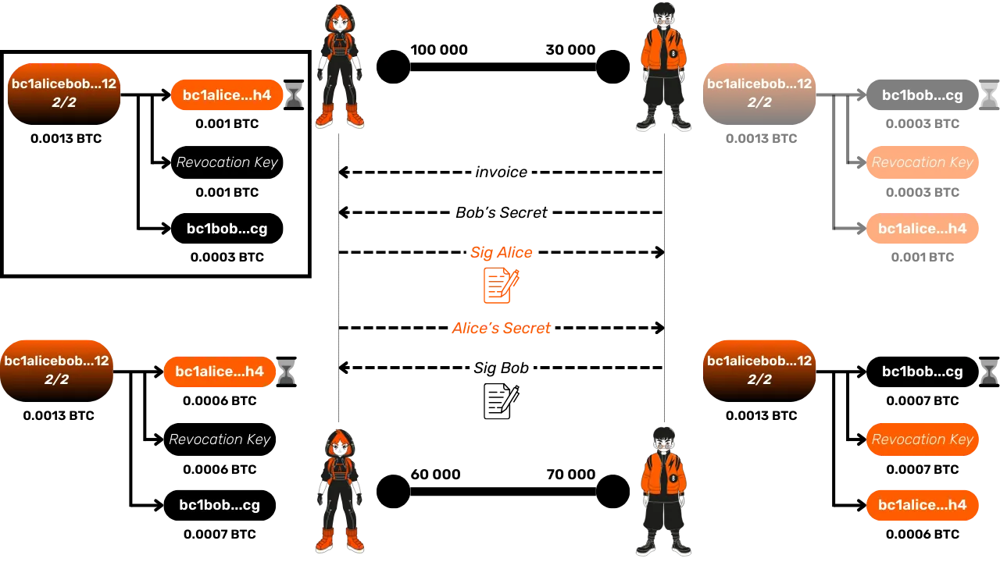
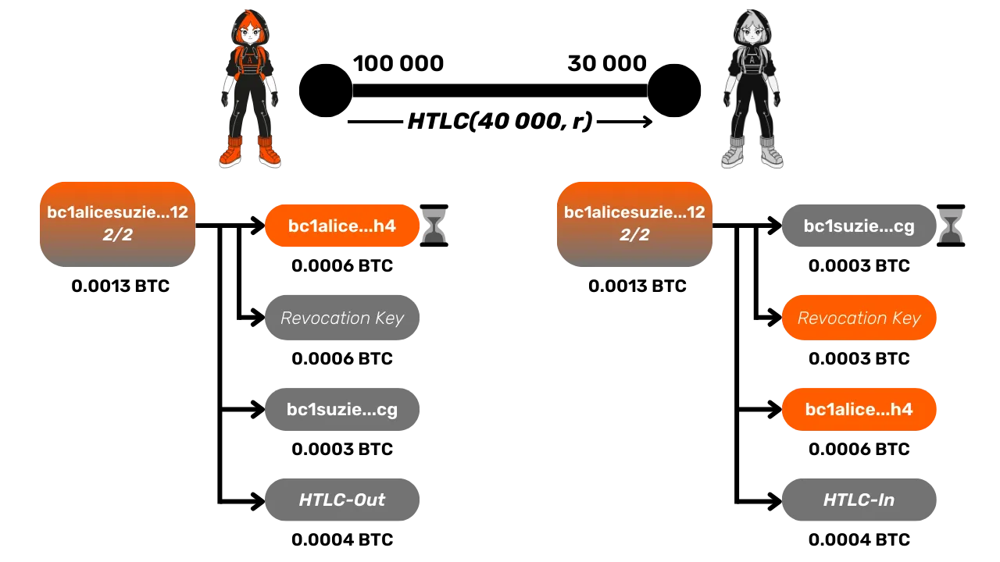

# Bitcoinのセカンドレイヤーへの旅

Bitcoin取引の未来に不可欠なシステムであるLightning Networkの中心へと飛び込みましょう。LNP201は、Lightningの技術的な仕組みについての理論的なコースです。このセカンドレイヤーネットワークの基礎とメカニズムを明らかにし、Bitcoinの支払いを迅速、経済的かつスケーラブルにするために設計されました。

支払いチャネルのネットワークを通じて、Lightningは各取引をBitcoinブロックチェーンに記録することなく、迅速かつ安全な取引を可能にします。各章を通じて、チャネルの開設、管理、閉鎖の仕組み、支払いが信頼の必要性を最小限に抑えつつ中間ノードを介して安全にルーティングされる方法、流動性の管理方法を学びます。コミットメントトランザクション、HTLC、リボケーションキー、罰則メカニズム、オニオンルーティング、請求書についても発見します。

Bitcoin初心者でも、より経験豊富なユーザーでも、このコースはLightning Networkを理解し、使用するための貴重な情報を提供します。最初の部分でBitcoinの基本的な機能についていくつかカバーしますが、LNP201に深く潜る前にサトシの発明の基本をマスターすることが不可欠です。

発見をお楽しみください！

+++

# 基礎

<partId>32647d62-102b-509f-a3ba-ad1d6a4345f1</partId>

## Lightning Networkの理解

<chapterId>df6230ae-ff35-56ea-8651-8e65580730a8</chapterId>


Lightning Networkの技術的な機能を説明することを目的としたLNP201コースへようこそ。

Lightning Networkは、Bitcoinプロトコルの上に構築された支払いチャネルのネットワークであり、迅速かつ低コストの取引を可能にすることを目指しています。参加者間で支払いチャネルを作成することができ、その中で取引はほぼ瞬時に、最小限の手数料で行うことができ、ブロックチェーン上で個々の取引を記録する必要がありません。したがって、Lightning NetworkはBitcoinのスケーラビリティを改善し、低価値の支払いに適用可能にすることを目指しています。

「ネットワーク」という側面を探る前に、Lightning上の**支払いチャネル**の概念、その機能、および特性を理解することが重要です。これがこの最初の章の主題です。

### 支払いチャネルの概念

支払いチャネルは、**アリス**と**ボブ**という二人の当事者がLightning Network上で資金を交換することを可能にします。各当事者はノードを持ち、円で象徴され、彼らの間のチャネルは線分で表されます。


例えば、アリスはチャネルの彼女の側に100,000サトシを持ち、ボブは30,000を持っており、合計130,000サトシが**チャネル容量**を構成します。

**しかし、サトシとは何ですか？**

**サトシ**（または"sat"）はBitcoin上の勘定単位です。ユーロのセントのように、サトシは単にBitcoinの一部です。一サトシは**0.00000001 Bitcoin**、つまりBitcoinの1億分の1に等しいです。Bitcoinの価値が上昇するにつれて、サトシを使用することがますます実用的になります。

### チャネル内の資金の割り当て

支払いチャネルに戻りましょう。ここでの重要な概念は、「**チャネルの側面**」です。各参加者はチャネルの自分の側に資金を持っています：アリスは100,000サトシ、ボブは30,000サトシです。これまで見てきたように、これらの資金の合計はチャネルの総容量を表し、それは開設時に設定される数値です。


ライトニングトランザクションの例を見てみましょう。アリスがボブに40,000サトシを送りたい場合、彼女は十分な資金（100,000サトシ）を持っているため、これは可能です。この取引の後、アリスの側には60,000サトシ、ボブの側には70,000サトシが残ります。


**チャネル容量**は130,000サトシで一定です。変わるのは資金の割り当てです。このシステムでは、所有する以上の資金を送ることはできません。例えば、ボブがアリスに80,000サトシを送り返したい場合、彼はそれができません。なぜなら、彼は70,000サトシしか持っていないからです。

資金の割り当てを想像するもう一つの方法は、チャネル内の資金がどこにあるかを示す**スライダー**を考えることです。初めに、アリスには100,000サトシ、ボブには30,000サトシがあるため、スライダーは論理的にアリスの側にあります。40,000サトシの取引の後、スライダーはボブの側に少し移動し、彼は今70,000サトシを持っています。


この表現は、チャネル内の資金のバランスを想像するのに役立つかもしれません。

### 支払いチャネルの基本ルール

覚えておくべき最初の点は、**チャネル容量**は固定されていることです。これはある種、パイプの直径のようなものです：それは一度にチャネルを通して送ることができる資金の最大量を決定します。
例を挙げてみましょう：アリスが彼女の側に130,000サトシを持っている場合、彼女は一回の取引で最大130,000サトシをボブに送ることができます。しかし、その後ボブはこれらの資金をアリスに部分的にでも全額でも送り返すことができます。

理解することが重要なのは、チャネルの固定容量が単一の取引の最大量を制限するが、可能な取引の総数やチャネル内で交換される資金の全体的な量を制限するわけではないということです。

**この章から何を持ち帰るべきか？**

- チャネルの容量は固定されており、単一の取引で送ることができる最大量を決定します。
- チャネル内の資金は二人の参加者の間で分配され、それぞれが自分の側に持つ資金のみを相手に送ることができます。
- したがって、ライトニングネットワークは、チャネルの容量によって課された制限を尊重しつつ、資金の迅速かつ効率的な交換を可能にします。

これでライトニングネットワークの基礎を築いた第1章の終わりです。これからの章では、チャネルの開設方法を見ていき、ここで議論した概念をさらに深く掘り下げていきます。

## Bitcoin、アドレス、UTXO、およびトランザクション

<chapterId>0cfb7e6b-96f0-508b-9210-90bc1e28649d</chapterId>


この章は少し特別です。なぜなら、直接Lightningに捧げられるわけではなく、Bitcoinについて扱うからです。実際、Lightning NetworkはBitcoinの上に構築されたレイヤーです。したがって、後続の章でLightningの機能を適切に理解するためには、Bitcoinのいくつかの基本的な概念を理解することが不可欠です。この章では、Bitcoinの受信アドレス、UTXO、およびBitcoinトランザクションの機能についての基礎を見直します。

### Bitcoinアドレス、秘密鍵、公開鍵

Bitcoinアドレスは、**公開鍵**から派生した一連の文字であり、公開鍵は**秘密鍵**から計算されます。ご存知の通り、BitcoinアドレスはBitcoinをロックするために使用され、これは私たちのウォレットでそれらを受け取ることと同等です。

秘密鍵は**決して共有してはならない**秘密の要素であり、一方、公開鍵とアドレスはセキュリティリスクなしに共有できます（その開示はあなたのプライバシーに対するリスクのみを表します）。ここに、このトレーニングを通じて採用する一般的な表現があります：

- **秘密鍵**は**縦**に表されます。
- **公開鍵**は**横**に表されます。
- それらの色は、それらを所有している人を示します（アリスはオレンジ、ボブは黒...）。

### Bitcoinトランザクション：資金の送信とスクリプト

Bitcoinでは、トランザクションは一つのアドレスから別のアドレスへの資金の送信を含みます。アリスがボブに0.002 Bitcoinを送る例を考えてみましょう。アリスは彼女のアドレスに関連付けられた秘密鍵を使用してトランザクションに**署名**し、これにより彼女が実際にこれらの資金を使うことができることを証明します。しかし、このトランザクションの背後で実際に何が起こっているのでしょうか？Bitcoinアドレス上の資金は**スクリプト**によってロックされています。これは、資金を使うために特定の条件を課すミニプログラムのようなものです。

最も一般的なスクリプトは、アドレスに関連付けられた秘密鍵での署名を要求します。アリスが彼女の秘密鍵でトランザクションに署名すると、資金をブロックする**スクリプトを解除**し、それらは転送されることができます。資金の転送には、今回は**ボブの**秘密鍵の署名が必要になる新しいスクリプトをこれらの資金に追加することが含まれます。


### UTXO：未使用のトランザクション出力

Bitcoinでは、実際に交換されるのは直接的にはBitcoinではなく、**UTXO** (_Unspent Transaction Outputs_、未使用のトランザクション出力)です。

UTXOは任意の価値を持つことができるBitcoinの一部であり、例えば、**2,000 bitcoins**、**8 bitcoins**、または**8,000 sats**などです。各UTXOはスクリプトによってロックされており、それを使うためには、通常は特定の受信アドレスに対応する秘密鍵での署名など、スクリプトの条件を満たす必要があります。

UTXOは分割することができません。それらを使って表されるBitcoinの量を使うたびに、それは全体として行われなければなりません。これは銀行券と少し似ています：もし10ユーロの紙幣を持っていて、パン屋に5ユーロを支払う必要がある場合、紙幣を半分に切ることはできません。10ユーロの紙幣を彼に渡し、彼は5ユーロのお釣りをあなたに返さなければなりません。これはBitcoin上のUTXOにとってまったく同じ原理です！例えば、アリスが彼女の秘密鍵でスクリプトを解除するとき、彼女はUTXO全体を解除します。彼女がこのUTXOによって表される資金の一部だけをボブに送りたい場合、彼女はそれをいくつかの小さなものに「分割」することができます。その後、彼女は0.0015 BTCをボブに送り、残りの0.0005 BTCを**変更アドレス**に送ります。

ここに2つの出力を持つトランザクションの例があります：

- Bobのための0.0015 BTCのUTXOは、Bobの秘密鍵の署名を要求するスクリプトによってロックされています。
- Aliceのための0.0005 BTCのUTXOは、彼女自身の署名を要求するスクリプトによってロックされています。


### マルチシグネチャアドレス

単一の公開鍵から生成されるシンプルなアドレスに加えて、複数の公開鍵から**マルチシグネチャアドレス**を作成することが可能です。ライトニングネットワークにとって特に興味深いケースは、2つの公開鍵から生成される**2/2マルチシグネチャアドレス**です：


この2/2マルチシグネチャアドレスでロックされた資金を使うには、公開鍵に関連付けられた2つの秘密鍵で署名する必要があります。


このタイプのアドレスは、ビットコインブロックチェーン上でのライトニングネットワークの支払いチャネルの表現です。

**この章から何を学ぶべきか？**

- **ビットコインアドレス**は公開鍵から派生し、その公開鍵は秘密鍵から派生します。
- ビットコイン上の資金は**スクリプト**によってロックされ、これらの資金を使うには、通常、対応する秘密鍵で署名を提供することを含むスクリプトを満たす必要があります。
- **UTXOs**はスクリプトによってロックされたビットコインの一部であり、ビットコイン上の各トランザクションはUTXOをアンロックし、それに対して一つ以上の新しいものを作成することから成ります。
- **2/2マルチシグネチャアドレス**は資金を使うために2つの秘密鍵の署名が必要です。これら特定のアドレスは、支払いチャネルを作成するためにライトニングの文脈で使用されます。

このビットコインに関する章では、今後に向けていくつかの基本的な概念を見直しました。次の章では、ライトニングネットワーク上でのチャネルの開設がどのように機能するかを具体的に探ります。

# チャネルの開設と閉鎖

<partId>900b5b6b-ccd0-5b2f-9424-4b191d0e935d</partId>

## チャネル開設

<chapterId>96243eb0-f6b5-5b68-af1f-fffa0cc16bfe</chapterId>


この章では、ライトニングネットワーク上で支払いチャネルを開く方法と、この操作と基盤となるビットコインシステムとの関連について、より詳しく見ていきます。

### ライトニングチャネル

第一章で見たように、ライトニング上の**支払いチャネル**は、二つの参加者（私たちの例では**アリス**と**ボブ**）間で資金を交換するための「パイプ」と比較することができます。このチャネルの容量は、両側の利用可能な資金の合計に相当します。私たちの例では、アリスが**100,000サトシ**を持ち、ボブが**30,000サトシ**を持っており、**合計容量**は**130,000サトシ**です。


### 情報交換のレベル

ライトニングネットワーク上での異なる交換レベルを明確に区別することが重要です：

- **ピアツーピア通信（ライトニングプロトコル）**：これらは、ライトニングノードが互いに通信するために送信するメッセージです。私たちはこれらのメッセージを図に点線の黒線で表します。
- **支払いチャネル（ライトニングプロトコル）**：これらは、ライトニング上で資金を交換するためのパスです。私たちはこれらを図に実線の黒線で表します。
- **ビットコイントランザクション（ビットコインプロトコル）**：これらはオンチェーンで行われるトランザクションです。私たちはこれらを図にオレンジ色の線で表します。


ライトニングノードがチャネルを開かずにP2Pプロトコルを介して通信できることは注目に値しますが、資金を交換するにはチャネルが必要です。

### ライトニングチャネルを開く手順

1. **メッセージ交換**: アリスはボブとチャネルを開きたいと思っています。彼女はチャネルに預けたい金額（130,000サトシ）と自分の公開鍵を含むメッセージを彼に送ります。ボブは自分の公開鍵を共有することで応答します。


2. **マルチシグネチャアドレスの作成**: これら二つの公開鍵を使って、アリスは**2/2マルチシグネチャアドレス**を作成します。これは、後にこのアドレスに預けられる資金が使われるには、アリスとボブの両方の署名が必要であることを意味します。


3. **預金トランザクション**: アリスはこのマルチシグネチャアドレスに資金を預けるためのビットコイントランザクションを準備します。例えば、彼女はこのマルチシグネチャアドレスに**130,000サトシ**を送ることを決めるかもしれません。このトランザクションは**構築されますが、まだブロックチェーンには公開されていません**。


4. **引き出しトランザクション**: 預金トランザクションを公開する前に、アリスはボブとの問題が発生した場合に自分の資金を回収できるように引き出しトランザクションを構築します。実際に、アリスが預金トランザクションを公開すると、彼女のサトシはアリスとボブの両方の署名が必要な2/2マルチシグネチャアドレスにロックされます。アリスは、引き出しトランザクションを構築することで、自分の資金を回収できるようにこの損失リスクから自身を守ります。


5. **ボブの署名**: アリスは預金トランザクションを証拠としてボブに送り、引き出しトランザクションに署名するように求めます。ボブの署名が引き出しトランザクションに得られると、アリスは自分の署名だけでマルチシグネチャを解除できるため、いつでも自分の資金を回収できることが保証されます。


6. **預金トランザクションの公開**: ボブの署名が得られたら、アリスはビットコインブロックチェーン上に預金トランザクションを公開し、これにより二人のユーザー間で正式にライトニングチャネルが開かれます。


### チャネルが開かれるのはいつですか？

預金トランザクションがビットコインブロックに含まれ、一定の確認の深さ（続くブロックの数）に達した時に、チャネルは開かれたとみなされます。

**この章から覚えておくべきことは何ですか？**

- チャネルを開くことは、二者間での**メッセージの交換**（金額と公開鍵の交換）から始まります。
- チャネルは、**2/2マルチシグネチャアドレス**を作成し、ビットコイントランザクションを介して資金を預けることによって形成されます。
- チャネルを開く人は、預金トランザクションを公開する前に、他方の署名がされた引き出しトランザクションを通じて、自分の資金を**回収できる**ことを確実にします。

次の章では、チャネル内でのライトニングトランザクションの技術的な仕組みを探ります。

## コミットメントトランザクション

<chapterId>7d3fd135-129d-5c5a-b306-d5f2f1e63340</chapterId>


この章では、チャネルの一方から他方へ資金が移動する際、ライトニングネットワーク内のチャネルでのトランザクションの技術的な機能について学びます。

### チャネルライフサイクルのおさらい

以前に見たように、LightningチャネルはBitcoinトランザクションを介して**開設**されます。チャネルはいつでも、同じくBitcoinトランザクションを介して**閉鎖**することができます。これら二つの瞬間の間に、Bitcoinブロックチェーンを介さずに、チャネル内で無限に近い数のトランザクションを実行することができます。チャネル内のトランザクションがどのように行われるか見てみましょう。


### チャネルの初期状態

チャネルを開設する際、Aliceはマルチシグネチャアドレスに**130,000サトシ**を預けました。したがって、初期状態では、すべての資金がAliceの側にあります。チャネルを開設する前に、AliceはBobに**引き出しトランザクション**に署名させました。これにより、彼女がチャネルを閉じたい場合に資金を回収できるようになります。


### 未公開トランザクション：コミットメントトランザクション

Aliceがチャネル内でBobに資金を送るトランザクションを行うと、資金の分配の変更を反映する新しいBitcoinトランザクションが作成されます。このトランザクションは**コミットメントトランザクション**と呼ばれ、ブロックチェーンには公開されませんが、Lightningトランザクションの後のチャネルの新しい状態を表します。

例として、AliceがBobに30,000サトシを送る場合を見てみましょう：

- **初期状態**：Aliceは130,000サトシを持っています。
- **トランザクション後**：Aliceは100,000サトシ、Bobは30,000サトシを持っています。
  この転送を確認するために、AliceとBobは新しい**未公開のBitcoinトランザクション**を作成します。これは、マルチシグネチャアドレスから**Aliceに100,000サトシ**、**Bobに30,000サトシ**を送るものです。両方の当事者は、同じデータ（金額とアドレス）を使用して独立してこのトランザクションを構築します。構築されたら、それぞれがトランザクションに署名し、署名を相手と交換します。これにより、いずれかの当事者が必要に応じていつでもトランザクションを公開し、メインのBitcoinブロックチェーン上でチャネルの自分のシェアを回収できるようになります。
  

### 転送プロセス：インボイス

Bobが資金を受け取りたい場合、彼はAliceに30,000サトシの**_インボイス_**を送ります。Aliceはその後、チャネル内で転送を開始することにより、このインボイスを支払います。これまでに見てきたように、このプロセスは新しい**コミットメントトランザクション**の作成と署名に依存しています。

各コミットメントトランザクションは、転送後のチャネル内の資金の新しい分配を表します。この例では、トランザクション後、Bobは30,000サトシを、Aliceは100,000サトシを持っています。二人の参加者のどちらかがこのコミットメントトランザクションをブロックチェーンに公開した場合、それはチャネルの閉鎖を意味し、最後の分配に従って資金が分配されます。


### 二回目のトランザクション後の新しい状態

別の例を見てみましょう：AliceがBobに30,000サトシを送った後、Bobは**10,000サトシをAliceに返送**することに決めました。これにより、チャネルの新しい状態が作成されます。新しい**コミットメントトランザクション**は、この更新された分配を表します：

- **Alice**は現在**110,000サトシ**を持っています。
- **Bob**は**20,000サトシ**を持っています。


再び、このトランザクションはブロックチェーンには公開されませんが、チャネルが閉じられる場合にはいつでも公開することができます。

要約すると、Lightningチャネル内で資金が転送される場合：

- アリスとボブは、資金の新しい分配を反映する新しい**コミットメントトランザクション**を作成します。このBitcoinトランザクションは両方の当事者によって**署名されますが**、チャネルが開いている限りBitcoinブロックチェーンには**公開されません**。
- コミットメントトランザクションは、各参加者が最後に署名されたトランザクションを公開することにより、いつでもBitcoinブロックチェーン上で自分の資金を回収できることを保証します。

しかし、このシステムには潜在的な欠陥があります。これについては次の章で取り上げます。他方の当事者による不正行為を防ぐために、各参加者が自分自身を保護する方法を見ていきます。

## 取り消しキー

<chapterId>f2f61e5b-badb-5947-9a81-7aa530b44e59</chapterId>

この章では、チャネル内のルールを守ることを保証し、不正行為に対する保護メカニズムを議論することにより、Lightning Network上でのトランザクションの仕組みについてさらに深く掘り下げます。

### リマインダー：コミットメントトランザクション

以前に見たように、Lightning上のトランザクションは公開されていない**コミットメントトランザクション**に依存しています。これらのトランザクションは、チャネル内の資金の現在の分配を反映しています。新しいLightningトランザクションが行われると、新しいコミットメントトランザクションが作成され、両方の当事者によって署名され、チャネルの新しい状態を反映します。

簡単な例を見てみましょう：

- **初期状態**：アリスは**100,000サトシ**を持っており、ボブは**30,000サトシ**を持っています。
- アリスがボブに**40,000サトシ**を送るトランザクションの後、新しいコミットメントトランザクションは以下のように資金を分配します：
  - アリス：**60,000サトシ**
  - ボブ：**70,000サトシ**


いつでも、両方の当事者は**最新のコミットメントトランザクション**を公開してチャネルを閉じ、自分の資金を回収することができます。

### 欠陥：古いトランザクションを公開することによる不正行為

一方の当事者が古いコミットメントトランザクションを公開することによって**不正行為**を行う可能性がある問題が生じます。例えば、アリスが現実には**60,000サトシ**しか持っていないにもかかわらず、彼女が**100,000サトシ**を持っていた古いコミットメントトランザクションを公開することができます。これにより、彼女はボブから**40,000サトシ**を盗むことができます。


さらに悪いことに、アリスはチャネルが開かれる前の、彼女が**130,000サトシ**を持っていた最初の引き出しトランザクションを公開することができ、これによりチャネルの資金全体を盗むことができます。


### 解決策：取り消しキーとタイムロック

アリスによるこの種の不正行為を防ぐために、Lightning Networkではコミットメントトランザクションに**セキュリティメカニズム**が追加されます：

1. **タイムロック**：各コミットメントトランザクションにはアリスの資金に対するタイムロックが含まれます。タイムロックは、トランザクションがブロックに追加されるために満たされなければならない時間条件を設定するスマートコントラクトの原始的なものです。これは、アリスがコミットメントトランザクションのいずれかを公開した場合、特定のブロック数が経過するまで彼女は自分の資金を回収できないことを意味します。このタイムロックは、コミットメントトランザクションの確認から適用され始めます。その期間は一般的にチャネルのサイズに比例しますが、手動で設定することもできます。
2. **取り消しキー**：また、ボブが**取り消しキー**を持っている場合、アリスの資金は直ちにボブによって使われることもあります。このキーは、アリスが持つ秘密とボブが持つ秘密から成ります。注意すべきは、この秘密は各コミットメントトランザクションごとに異なるということです。
   これら2つの組み合わせたメカニズムのおかげで、BobはAliceが不正を試みるのを検出し、取り消しキーを使って自分の出力を回収することで彼女を罰する時間があります。Bobにとっては、チャネルの全資金を回収することを意味します。新しいコミットメントトランザクションは、現在このようになります：
   

このメカニズムの機能を詳しく見ていきましょう。

### トランザクション更新プロセス

AliceとBobが新しいLightningトランザクションでチャネルの状態を更新するとき、彼らは事前にそれぞれの前のコミットメントトランザクション（古くなり、どちらかが不正を試みる可能性があるもの）の**秘密**を交換します。これは、チャネルの新しい状態では：

- AliceとBobは、Lightningトランザクション後の資金の現在の分配を表す新しいコミットメントトランザクションを持っています。
- それぞれが相手の前のトランザクションの秘密を持っており、これにより、どちらかが古い状態のトランザクションをBitcoinノードのメンプールに公開して不正を試みる場合にのみ、取り消しキーを使用できます。実際、相手を罰するには、両方の秘密と相手のコミットメントトランザクション（署名された入力を含む）を持っている必要があります。このトランザクションがなければ、取り消しキーだけでは役に立ちません。このトランザクションを取得する唯一の方法は、メンプール（確認待ちのトランザクション）から、またはタイムロック中にブロックチェーン上の確認済みトランザクションから回収することです。これは、相手が意図的にもしくはそうでなくても不正を試みていることを証明します。

このプロセスを理解するために例を見てみましょう：

1. **初期状態**：Aliceは**100,000サトシ**を持っており、Bobは**30,000サトシ**を持っています。


2. Bobは、彼らのLightningチャネルを通じてAliceから40,000サトシを受け取りたいと考えています。これを行うために：
   - 彼は、彼の前のコミットメントトランザクションの取り消しキーの秘密とともに、彼女に請求書を送ります。
   - 応答として、AliceはBobの新しいコミットメントトランザクションに対する彼女の署名と、彼女の前のトランザクションの取り消しキーの秘密を提供します。
   - 最後に、BobはAliceの新しいコミットメントトランザクションに対する彼の署名を送ります。
   - これらの交換により、Aliceはチャネルを介してLightning上で**40,000サトシ**をBobに送ることができ、新しいコミットメントトランザクションは現在この新しい資金の分配を反映しています。


3. もしAliceがまだ**100,000サトシ**を所有している古いコミットメントトランザクションを公開しようとした場合、Bobは取り消しキーを取得しているので、このキーを使用して直ちに資金を回収することができますが、Aliceはタイムロックによってブロックされます。



この場合、Bobが不正を試みる経済的な利益はありませんが、もし彼がそうする場合でも、Aliceは同じ保証を提供する対称的な保護の恩恵を受けます。

**この章から何を持ち帰るべきか？**

Lightning Network上の**コミットメントトランザクション**には、不正のリスクとその誘因を減らすセキュリティメカニズムが含まれています。新しいコミットメントトランザクションに署名する前に、AliceとBobはそれぞれの前のコミットメントトランザクションの**秘密**を交換します。もしAliceが古いコミットメントトランザクションを公開しようとした場合、Bobは**取り消しキー**を使用してAliceができる前に（彼女はタイムロックによってブロックされているため）全ての資金を回収することができ、これにより彼女が不正を試みたことに対して罰されます。

このセキュリティシステムは、参加者がLightning Networkのルールに従うことを保証し、古いコミットメントトランザクションを公開して利益を得ることができないようにします。
このトレーニングのこの時点で、Lightningチャネルの開設方法と、これらのチャネル内のトランザクションの仕組みを理解しています。次の章では、チャネルを閉じてメインブロックチェーン上でビットコインを回収するさまざまな方法を探ります。

## チャネルのクローズ

<chapterId>29a72223-2249-5400-96f0-3756b1629bc2</chapterId>


この章では、Lightning Network上で**チャネルを閉じる**方法について議論します。これは、チャネルを開くときと同様に、Bitcoinトランザクションを通じて行われます。チャネル内のトランザクションの仕組みを見た後、チャネルを閉じてBitcoinブロックチェーン上で資金を回収する方法を見ていきます。

### チャネルライフサイクルのおさらい

**チャネルのライフサイクル**は、Bitcoinトランザクションを介しての**開設**から始まり、その後、Lightning内でトランザクションが行われ、最終的に、当事者が資金を回収したいときに、2番目のBitcoinトランザクションを通じてチャネルが**閉じられます**。Lightning上で行われた中間トランザクションは、公開されていない**コミットメントトランザクション**によって表されます。


### チャネルクローズの3つのタイプ

このチャネルを閉じる主な方法は3つあり、それぞれ**善、悪、醜**と呼ぶことができます（Andreas Antonopoulosの*Mastering the Lightning Network*に触発されて）：

1. **善**: **協力的クローズ**、AliceとBobがチャネルを閉じることに同意する場合。
2. **悪**: **強制クローズ**、一方の当事者が他方の同意なしに正直にチャネルを閉じることを決定する場合。
3. **醜**: **不正行為によるクローズ**、一方の当事者が古いコミットメントトランザクション（実際かつ公正な資金分配を反映する最後のもの以外の任意のもの）を公開して資金を盗もうと試みる場合。

例を挙げましょう：

- Aliceは**100,000サトシ**を所有し、Bobは**30,000サトシ**を所有しています。
- この分配は、チャネルクローズの場合に公開される可能性があるが、公開されていない**2つのコミットメントトランザクション**（ユーザーごとに1つ）に反映されています。


### 善：協力的クローズ

**協力的クローズ**では、AliceとBobはチャネルを閉じることに同意します。以下のように進行します：

1. AliceはLightning通信プロトコルを介してBobにチャネルを閉じる提案を送ります。
2. Bobが同意し、両当事者はチャネルでこれ以上のトランザクションを行いません。


3. AliceとBobは一緒に**クロージングトランザクション**の手数料を交渉します。これらの手数料は、通常、クローズ時のBitcoin手数料市場に基づいて計算されます。重要なのは、**チャネルを開いた人**（この例ではAlice）が常にクロージング手数料を支払うということです。
4. 彼らは新しい**クロージングトランザクション**を構築します。このトランザクションはコミットメントトランザクションに似ていますが、両当事者が協力しており、不正行為のリスクがないため、タイムロックや撤回メカニズムはありません。したがって、この協力的クロージングトランザクションはコミットメントトランザクションとは異なります。
   たとえば、アリスが**100,000サトシ**を所有し、ボブが**30,000サトシ**を所有している場合、クロージングトランザクションはタイムロック制約なしで**100,000サトシ**をアリスのアドレスに、**30,000サトシ**をボブのアドレスに送信します。このトランザクションが両方の当事者によって署名されると、アリスによって公開されます。トランザクションがビットコインブロックチェーン上で確認されると、ライトニングチャネルは正式に閉鎖されます。
   

**協力的クロージャ**は、速く（タイムロックなし）かつトランザクション手数料が現在のビットコイン市場の状況に応じて調整されるため、クロージングの好ましい方法です。これにより、トランザクションがメンプールでブロックされるリスクを伴う手数料不足や、参加者に不必要な財務的損失をもたらす過剰支払いを避けることができます。

### 悪い例：強制クロージャ

アリスのノードがボブに協力的クロージャを求めるメッセージを送ったが、彼が応答しない場合（例えば、インターネットの接続障害や技術的な問題が原因で）、アリスは**最後に署名されたコミットメントトランザクション**を公開することによって**強制クロージャ**を進めることができます。
この場合、アリスは単に最後のコミットメントトランザクションを公開します。これは、最後のライトニングトランザクションが行われた時点でのチャネルの状態と資金の正しい分配を反映しています。


このトランザクションにはアリスの資金に対する**タイムロック**が含まれており、クロージャを遅くします。


また、コミットメントトランザクションの手数料は、クロージャの時点で不適切である可能性があります。これは、トランザクションが作成された時、時には数ヶ月前に設定されたためです。一般的に、ライトニングクライアントは将来の問題を避けるために手数料を過大評価しますが、これにより手数料が過剰になったり、逆に低すぎたりすることがあります。

要約すると、**強制クロージャ**は相手がもはや応答しない場合の最後の手段です。協力的クロージャよりも遅く、経済的ではありません。したがって、可能な限り避けるべきです。

### 不正行為：チート

最後に、一方の当事者が自分が所有すべきよりも多くの資金を持っていた古いコミットメントトランザクションを公開しようとする場合、**チート**によるクロージャが発生します。例えば、アリスが現在実際に所有しているのは**100,000サトシ**であるにもかかわらず、彼女が**120,000サトシ**を所有していた古いトランザクションを公開するかもしれません。


ボブは、アリスが古いトランザクションを公開しないように、ビットコインブロックチェーンとそのメンプールを監視します。ボブがチートを試みを検出した場合、**撤回キー**を使用してアリスの資金を回収し、チャネルの全資金を取り上げることで彼女を罰することができます。アリスの出力がタイムロックによってブロックされている間、ボブは彼が所有するアドレスに全額を回収するために、彼の側にタイムロックなしでそれを使う時間があります。


明らかに、ボブがアリスの出力に課されたタイムロックの時間内に行動しない場合、チートは成功する可能性があります。この場合、アリスの出力は解除され、彼女が制御するアドレスに新しい出力を作成するためにそれを消費することが許可されます。

**この章から何を学ぶべきか？**

チャネルを閉じる3つの方法があります：

1. **協力的クロージャ**：両方の当事者がチャネルを閉じることに同意し、カスタマイズされたクロージングトランザクションを公開する、速くて費用が少ない方法。
2. **強制クロージャ**：コミットメントトランザクションを公開することに依存し、潜在的に不適切な手数料とタイムロックがあり、クロージャを遅くするため、望ましくない方法。
3. **不正行為**: もし当事者の一方が古い取引を公開して資金を盗もうと試みた場合、もう一方は取消しキーを使用してこの不正行為を罰することができます。
   これからの章では、ライトニングネットワークをより広い視点から探求し、そのネットワークがどのように機能するかに焦点を当てます。

# 流動性ネットワーク

<partId>a873f1cb-751f-5f4a-9ed7-25092bfdef11</partId>

## ライトニングネットワーク

<chapterId>45a7252c-fa4f-554b-b8bb-47449532918e</chapterId>


この章では、支払いチャネルで直接繋がっていない受取人にも、ライトニングネットワーク上での支払いがどのように届けられるかを探ります。ライトニングは、実際には**支払いチャネルのネットワーク**であり、他の参加者のチャネルを通じて遠く離れたノードに資金を送ることを可能にします。ネットワークを通じて支払いがどのようにルーティングされるか、流動性がチャネル間でどのように移動するか、取引手数料がどのように計算されるかを発見します。

### 支払いチャネルのネットワーク

ライトニングネットワーク上では、取引は二つのノード間の資金の移動に相当します。前の章で見たように、ライトニング取引を行うためには、誰かとチャネルを開く必要があります。このチャネルは、チェーン上の残高を回収するために閉じる前に、ほぼ無限の数のオフチェーン取引を可能にします。しかし、この方法の欠点は、資金を受け取るか送るためには、他の人と直接チャネルを必要とすることであり、これは各チャネルに対して開設取引と閉鎖取引を意味します。もし私がこの人と多くの支払いを計画している場合、チャネルを開いて閉じることはコスト効果があります。逆に、少数のライトニング取引のみを行う必要がある場合、直接チャネルを開くことは有利ではなく、限られた数のオフチェーン取引のために2つのオンチェーン取引が私にコストをかけることになります。例えば、戻る予定のない商店でライトニングで支払いたい場合などがこれに該当します。

この問題を解決するために、ライトニングネットワークは、他の人と直接チャネルを持たない取引を、複数のチャネルと中間ノードを通じてルーティングすることを可能にします。

例えば、想像してみてください:

- **アリス**（オレンジ色）は、自分の側に**100,000サトシ**、**スージー**（灰色）の側に**30,000サトシ**を持つスージーとのチャネルを持っています。
- **スージー**は、自分が**250,000サトシ**を所有し、ボブがサトシを持っていないチャネルで**ボブ**と繋がっています。


アリスが彼と直接チャネルを開かずにボブに資金を送りたい場合、彼女はスージーを通じて行う必要があり、各チャネルはそれぞれの側の流動性を調整する必要があります。**送られたサトシはそれぞれのチャネル内に留まります**; 実際には「チャネルを越えて」移動するわけではありませんが、各チャネル内の内部流動性の調整を通じて転送が行われます。

アリスがボブに**50,000サトシ**を送りたいとします:

1. **アリス**は共通のチャネルで50,000サトシを**スージー**に送ります。
2. **スージー**はこの転送を複製し、自分のチャネルで50,000サトシを**ボブ**に送ります。


したがって、支払いは各チャネルでの流動性の移動を通じてBobにルーティングされます。操作の終わりに、Aliceは50,000サトシを持っています。彼女は最初に100,000を持っていたので、実際に50,000サトシを転送しました。Bobは、彼の側では、追加の50,000サトシを持っています。中間ノードであるSuzieにとって、この操作は中立です：最初、彼女はAliceとのチャネルで30,000サトシ、Bobとのチャネルで250,000サトシ、合計280,000サトシを持っていました。操作後、彼女はAliceとのチャネルで80,000サトシ、Bobとのチャネルで200,000サトシを持っており、これは開始時と同じ合計です。
この転送は、転送の方向にある**利用可能な流動性**によって制限されます。

### ルートと流動性の限界の計算

別のネットワークの理論的な例を見てみましょう：

- Aliceの側（オレンジ色）での彼女と**Suzie**（灰色）とのチャネルでの**130,000サトシ**。
- **Suzie**の側での**90,000サトシ**と**Carol**の側での**200,000サトシ**（ピンク色）。
- **Carol**の側での**150,000サトシ**と**Bob**の側での**100,000サトシ**。


この構成でAliceがBobに送ることができる最大額は、**SuzieからCarolへのチャネル**で利用可能な最小の流動性によって制限されるため、**90,000サトシ**です。逆の方向（BobからAliceへ）では、支払いは不可能です。なぜなら、**Suzie**の側のAliceとのチャネルにはサトシが含まれていないため、この方向での転送に使用できる**ルートはありません**。
Aliceはチャネルを通じてBobに**40,000サトシ**を送ります：

1. AliceはSuzieとのチャネルに40,000サトシを転送します。
2. Suzieは共有チャネルでCarolに40,000サトシを転送します。
3. 最後にCarolはBobに40,000サトシを転送します。


各チャネルで**送られたサトシ**はチャネル内に**残ります**ので、CarolがBobに送ったサトシはAliceがSuzieに送ったものと同じではありません。転送は各チャネル内の流動性を調整することによってのみ行われます。さらに、チャネルの総容量は変わりません。


前の例と同様に、取引後、送信元ノード（Alice）は40,000サトシ少なくなります。中間ノード（SuzieとCarol）は同じ総額を保持し、彼らにとって操作は中立です。最後に、宛先ノード（Bob）は追加の40,000サトシを受け取ります。

したがって、中間ノードの役割はLightning Networkの機能において非常に重要です。彼らは支払いのための複数のパスを提供することによって転送を容易にします。これらのノードが流動性を提供し、支払いのルーティングに参加することを奨励するために、**ルーティング手数料**が彼らに支払われます。

### ルーティング手数料

中間ノードは、彼らのチャネルを通じて支払いを許可するために手数料を適用します。これらの手数料は、**各ノードが各チャネルに設定する**ものです。手数料は2つの要素から構成されます：

1. "**ベース手数料**": チャネルごとに固定された金額で、デフォルトではしばしば**1サト**ですが、カスタマイズ可能です。
2. "**可変手数料**": 転送された金額の一定割合で、**百万分の一(ppm)**で計算されます。デフォルトでは**1 ppm**（転送されたサトシの百万分の1サトシ）ですが、調整することも可能です。
   手数料は転送の方向によっても異なります。例えば、AliceからSuzieへの転送ではAliceの手数料が適用されます。逆に、SuzieからAliceへの転送ではSuzieの手数料が使用されます。

例えば、AliceとSuzieの間のチャネルでは以下のようになります:

- **Alice**: 基本手数料は1サトシ、可変手数料は1 ppmです。
- **Suzie**: 基本手数料は0.5サトシ、可変手数料は10 ppmです。


手数料の仕組みをより理解するために、前と同じLightning Networkを見てみましょうが、今回は以下のルーティング手数料で:

- チャネル **Alice - Suzie**: Aliceのための基本手数料は1サトシ、1 ppmです。
- チャネル **Suzie - Carol**: Suzieのための基本手数料は0サトシ、200 ppmです。
- **Carol - Bob** チャネル: Suzie 2のための基本手数料は1サトシ、1 ppmです。
  

**40,000サトシ**をBobに支払うためには、Aliceは少し多く送る必要があります。なぜなら、各中継ノードが手数料を差し引くからです:

- **Carol**はBobとのチャネルで1.04サトシを差し引きます:
  $$ f*{\text{Carol-Bob}} = \text{基本手数料} + \left(\frac{\text{ppm} \times \text{金額}}{10^6}\right) $$
  $$ f*{\text{Carol-Bob}} = 1 + \frac{1 \times 40000}{10^6} = 1 + 0.04 = 1.04 \text{ サトシ} $$

- **Suzie**はCarolとのチャネルで8サトシを手数料として差し引きます:
  $$ f*{\text{Suzie-Carol}} = \text{基本手数料} + \left(\frac{\text{ppm} \times \text{金額}}{10^6}\right) $$
  $$ f*{\text{Suzie-Carol}} = 0 + \frac{200 \times 40001.04}{10^6} = 0 + 8.0002 \approx 8 \text{ サトシ} $$

したがって、この支払いパスでの合計手数料は**9.04サトシ**です。従って、AliceはBobが正確に**40,000サトシ**を受け取るために**40,009.04サトシ**を送る必要があります。


したがって、流動性は更新されます:


### オニオンルーティング

送信者から受信者への支払いをルーティングするために、Lightning Networkは"**オニオンルーティング**"と呼ばれる方法を使用します。クラシックなデータのルーティングが、各ルーターがその目的地に基づいてデータの方向を決定するのとは異なり、オニオンルーティングは異なる方法で動作します:

- **送信ノードが全ルートを計算します**: 例えば、Aliceは彼女の支払いがSuzieとCarolを経由してBobに到達する必要があると判断します。
- **各中継ノードは、直接隣接するノードのみを知っています**: スージーは、アリスから資金を受け取り、それをキャロルに転送しなければならないことだけを知っています。しかし、スージーはアリスがソースノードなのか中継ノードなのか、またキャロルが受信ノードなのか単なる別の中継ノードなのかを知りません。この原則はキャロルやパス上の他のすべてのノードにも適用されます。オニオンルーティングは、送信者と最終受信者の身元を隠すことで、取引の機密性を保持します。オニオンルーティングで送信ノードが受信者への完全なルートを計算できるようにするためには、そのトポロジーを知り、可能なルートを決定するために**ネットワークグラフ**を維持する必要があります。
  **この章から何を学ぶべきか？**

1. Lightning上では、支払いは中継チャネルを介して間接的に接続されたノード間でルーティングできます。これらの中継ノードは流動性のリレーを容易にします。
2. 中継ノードは、固定料金と変動料金からなるサービスの手数料を受け取ります。
3. オニオンルーティングにより、送信ノードは中継ノードがソースや最終目的地を知らなくても完全なルートを計算できます。

この章では、Lightning Network上での支払いルーティングについて探求しました。しかし、中継ノードが次の目的地に転送せずに着信支払いを受け入れ、取引を傍受することを防ぐのは何かという疑問が生じます。これは、次の章で学ぶHTLCの正確な役割です。

## HTLC – ハッシュ化されたタイムロック契約

<chapterId>4369b85a-1365-55d8-99e1-509088210116</chapterId>


この章では、**HTLC** (_Hashed Time-Locked Contracts_、ハッシュ化されたタイムロック契約)のおかげで、中継ノードを信頼する必要なく、Lightningが支払いを中継ノードを通して行う方法を発見します。これらのスマートコントラクトは、各中継ノードが最終受信者に支払いを転送する場合に限り、そのチャネルから資金を受け取ることを保証し、そうでなければ支払いは検証されません。

支払いルーティングにおける問題は、中継ノードおよび中継ノード間での必要な信頼です。これを説明するために、3つのノードと2つのチャネルを持つ簡略化されたLightningネットワークの例に戻りましょう：

- アリスはスージーとチャネルを持っています。
- スージーはボブとチャネルを持っています。

アリスはボブに40,000サトシを送りたいが、彼と直接チャネルを持っておらず、新たに開設することも望んでいません。彼女はルートを探し、スージーのノードを経由することに決めました。


アリスが単純に40,000サトシをスージーに送り、スージーがこの金額をボブに転送することを期待する場合、スージーは資金を自分で保持し、ボブに何も送信しない可能性があります。


この状況を避けるために、LightningではHTLC（ハッシュ化されたタイムロック契約）を使用し、中継ノードへの支払いを条件付きにします。つまり、スージーはアリスの資金にアクセスし、それをボブに転送するために特定の条件を満たさなければなりません。

### HTLCの仕組み

HTLCは、2つの原則に基づく特別な契約です：

- **アクセス条件**: 受信者は支払いを解除するために秘密を明かさなければなりません。
- **有効期限**: 支払いが定義された期間内に完全に完了しない場合、それはキャンセルされ、資金は送信者に戻ります。

アリス、スージー、ボブの例でこのプロセスがどのように機能するかを見てみましょう：


**秘密の生成**: Bobはランダムな秘密を生成し、それを*s*（プレイメージ）として記録し、ハッシュ関数*h*を用いてそのハッシュを*r*として計算します。以下の式が成り立ちます：

$$
r = h(s)
$$

ハッシュ関数を使用することで、*h(s)*のみから*s*を見つけ出すことは不可能になりますが、*s*が提供されれば、それが*h(s)*に対応していることを簡単に検証できます。


**支払いリクエストの送信**: BobはAliceに支払いを求める**請求書**を送ります。この請求書には特にハッシュ*r*が含まれます。


**条件付き支払いの送信**: AliceはSuzieに40,000サトシのHTLCを送ります。Suzieがこれらの資金を受け取る条件は、次の方程式を満たす秘密*s'*をAliceに提供することです：

$$
h(s') = r
$$


**HTLCの最終受取人への転送**: Suzieは、Aliceからの40,000サトシを得るために、同じ条件を持つBobに対して同様の40,000サトシのHTLCを転送しなければなりません。つまり、次の方程式を満たす秘密*s'*をSuzieに提供しなければなりません：

$$
h(s') = r
$$


**秘密*s*による検証**: BobはHTLCで約束された40,000サトシを受け取るために*s*をSuzieに提供します。この秘密を使って、SuzieはAliceのHTLCを解除し、Aliceから40,000サトシを得ることができます。そして、支払いは正しくBobにルーティングされます。


このプロセスは、SuzieがBobに支払いを行い、その秘密*s*を得てAliceのHTLCを解除することなくAliceの資金を保持することを防ぎます。ルートに複数の中間ノードが含まれている場合でも、操作は同じままです。それは単に、各中間ノードに対してSuzieのステップを繰り返すことになります。各ノードはHTLCの条件によって保護されており、受取人による最後のHTLCの解除が自動的に他のすべてのHTLCのカスケード解除を引き起こします。

### 問題が発生した場合のHTLCの有効期限と管理

支払いプロセス中に、中間ノードの1つまたは受取人ノードが応答しなくなると、特にインターネットや電力の停止の場合、HTLCを解除するために必要な秘密が伝達されないため、支払いを完了することができません。Alice、Suzie、Bobの例で言えば、この問題は、例えばBobがSuzieに秘密*s*を伝達しない場合に発生します。この場合、パス上のすべてのHTLCがブロックされ、それらが保証する資金も同様にブロックされます。


これを避けるために、Lightning上のHTLCには有効期限があり、特定の時間後に完了していない場合にHTLCを削除することができます。有効期限は特定の順序に従っており、まず受取人に最も近いHTLCから始まり、次に取引の発行者に向かって徐々に移動します。私たちの例で、Bobが決してSuzieに秘密*s*を与えない場合、これは最初にSuzieのHTLCがBobに対して期限切れになる原因となります。


その後、AliceからSuzieへのHTLCが期限切れになります。


支払いの有効期限が逆転した場合、AliceはSuzieが潜在的な不正から自身を守る前に、自分の支払いを回収することができます。実際に、Bobが自分のHTLCを請求しに戻ってきたときにAliceが既に自分のものを取り除いていた場合、Suzieは不利な立場に置かれます。このHTLCの有効期限のカスケード順序は、中間ノードが不公平な損失を被ることがないように保証します。

### コミットメントトランザクションにおけるHTLCの表現

コミットメントトランザクションは、HTLCがLightning上で課す条件を、HTLCの寿命中に強制的なチャネルクローズが発生した場合にBitcoinに転送できるように、HTLCを表現します。リマインダーとして、コミットメントトランザクションは2人のユーザー間のチャネルの現在の状態を表し、問題が発生した場合に一方的な強制クローズを可能にします。チャネルの新しい状態ごとに、2つのコミットメントトランザクションが作成されます：各当事者向けに1つずつです。Alice、Suzie、Bobの例に戻りますが、HTLCが作成されたときにAliceとSuzieの間のチャネルレベルで何が起こるかをもっと詳しく見てみましょう。


AliceがBobとの間で40,000 satsの支払いを開始する前に、AliceはSuzieとのチャネルで100,000 satsを持っており、Suzieは30,000を持っています。彼らのコミットメントトランザクションは以下の通りです：


AliceはちょうどBobの請求書を受け取りましたが、これには特に*r*、秘密のハッシュが含まれています。彼女はこれにより、Suzieとの間に40,000サトシのHTLCを構築することができます。このHTLCは、資金が外向きであるためAliceの側の最新のコミットメントトランザクションに"**_HTLC Out_**"としてのアウトプットで表され、資金が入ってくるためSuzieの側に"**_HTLC In_**"として表されます。



これらのアウトプットは、HTLCに関連付けられたまったく同じ条件を共有しています：

- Suzieが秘密*s*を提供できる場合、彼女はこのアウトプットを直ちにアンロックし、自分がコントロールするアドレスに転送することができます。
- Suzieが秘密*s*を持っていない場合、彼女はこのアウトプットをアンロックできず、Aliceはタイムロックの経過後にそれをアンロックして、自分がコントロールするアドレスに送ることができます。タイムロックは、Suzieが*s*を入手した場合に反応する期間を彼女に与えます。

これらの条件は、チャネルがクローズされた場合（つまり、コミットメントトランザクションがオンチェーンに公開された場合）にのみ適用され、HTLCがLightning上でまだアクティブであり、AliceとBobの間の支払いがまだ最終化されておらず、HTLCがまだ期限切れになっていないことを意味します。これらの条件のおかげで、Suzieは*s*を提供することによって彼女に負っている40,000サトシのHTLCを回収することができます。そうでなければ、Aliceはタイムロックの期限切れ後に資金を回収します。なぜなら、Suzieが*s*を知らない場合、彼女が40,000サトシをBobに転送していないことを意味し、したがって、Aliceの資金は彼女に負っているわけではないからです。

さらに、複数のHTLCが保留中の状態でチャネルがクローズされた場合、保留中のHTLCがある限り、それだけ多くの追加のアウトプットが存在します。
チャネルがクローズされない場合、Lightning支払いの期限切れまたは成功後、新しいコミットメントトランザクションが作成され、チャネルの新しい、今は安定した状態、つまり保留中のHTLCがない状態を反映します。したがって、HTLCに関連するアウトプットはコミットメントトランザクションから削除することができます。


最終的に、HTLCがアクティブな状態で協力的なチャネルクローズが行われる場合、AliceとSuzieは新しい支払いの受け入れを停止し、進行中のHTLCの解決または期限切れを待ちます。これにより、HTLCに関連する出力を含まない軽量なクロージングトランザクションを公開できるため、手数料を削減し、可能なタイムロックの待ち時間を避けることができます。
**この章から何を学ぶべきか？**

HTLCは、複数のノードを介してLightning支払いをルーティングすることを可能にし、それらを信頼する必要がありません。覚えておくべき主要なポイントは以下の通りです：

1. HTLCは、秘密（プリイメージ）と有効期限を通じて支払いのセキュリティを保証します。
2. HTLCの解決または期限切れは特定の順序に従います：それから目的地からソースへ、各ノードを保護するためです。
3. HTLCが解決されていない限り、または期限が切れていない限り、最新のコミットメントトランザクションの出力として維持されます。

次の章では、Lightningトランザクションを発行するノードが、支払いを受取人ノードに届けるためのルートをどのように見つけて選択するかを探ります。

## あなたの道を見つける

<chapterId>7e2ae959-c2a1-512e-b5d6-8fd962e819da</chapterId>


前の章では、他のノードのチャネルを使用して支払いをルーティングし、チャネルを介して直接接続されていないノードに到達する方法を見ました。また、中間ノードを信頼せずに転送のセキュリティを確保する方法についても議論しました。この章では、ターゲットノードに到達するための最適なルートを見つけることに焦点を当てます。

### Lightningにおけるルーティングの問題

見てきたように、Lightningでは、支払いを送信するノードが受取人への完全なルートを計算する必要があります。なぜなら、オニオンルーティングシステムを使用しているからです。中間ノードは、起点や最終目的地を知りません。彼らは、支払いがどこから来たのか、次にどのノードに転送する必要があるのかだけを知っています。これは、送信ノードが、開設、クローズ、および状態更新を考慮に入れて、ネットワークの既存のLightningノードとそれぞれの間のチャネルを含む動的なローカルトポロジーを維持する必要があることを意味します。


このLightning Networkのトポロジーでさえも、送信ノードにとってアクセス不可能なルーティングに必要な情報があります。それは、任意の瞬間にチャネル内の流動性の正確な分布です。実際、各チャネルは**総容量**のみを表示しますが、資金の内部分布は参加している2つのノードのみが知っています。これは、支払いの成功が選択されたルート上の最低流動性よりもその額が少ないかどうかに大きく依存するため、効率的なルーティングに課題をもたらします。しかし、流動性は送信ノードにはすべて見えません。


### ネットワークマップの更新

ノードがネットワークマップを最新の状態に保つために、"**_gossip_**"と呼ばれるアルゴリズムを通じて定期的にメッセージを交換します。これは、ネットワーク内のすべてのノードに情報を流行病のように広めるために使用される分散アルゴリズムであり、数回の通信サイクルでチャネルのグローバル状態の交換と同期を可能にします。各ノードは情報をランダムまたはそうでない方法で選択された1つ以上の隣人に伝播し、これらは順番に他の隣人に情報を伝播し、グローバルに同期された状態が達成されるまで続けます。

Lightningノード間で交換される2つの主要なメッセージは以下の通りです：

- "**チャネルアナウンスメント**": 新しいチャネルの開設を示すメッセージ。
  **チャネル更新**: チャネルの状態に関する更新メッセージ、特に手数料の進化について（ただし、流動性の分配については除く）。Lightningノードはまた、チャネルのクローズトランザクションを検出するためにBitcoinブロックチェーンを監視します。クローズされたチャネルは、それ以上支払いのルーティングに使用できないため、マップから削除されます。

### 支払いのルーティング

7つのノードがある小さなLightning Networkの例を考えてみましょう：Alice、Bob、1、2、3、4、および5。AliceがBobに支払いを送りたいが、中間ノードを経由する必要があると想像してください。


これらのチャネルでの資金の実際の分配は以下の通りです：

- **Aliceと1の間のチャネル**: Alice側に250,000 sats、1側に80,000 sats（総容量330,000 sats）。
- **1と2の間のチャネル**: 1側に300,000 sats、2側に200,000 sats（総容量500,000 sats）。
- **2と3の間のチャネル**: 2側に50,000 sats、3側に60,000 sats（総容量110,000 sats）。
- **2と5の間のチャネル**: 2側に90,000 sats、5側に160,000 sats（総容量250,000 sats）。
- **2と4の間のチャネル**: 2側に180,000 sats、4側に110,000 sats（総容量290,000 sats）。
- **4と5の間のチャネル**: 4側に200,000 sats、5側に10,000 sats（総容量210,000 sats）。
- **3とBobの間のチャネル**: 3側に50,000 sats、Bob側に250,000 sats（総容量300,000 sats）。
- **5とBobの間のチャネル**: 5側に260,000 sats、Bob側に100,000 sats（総容量360,000 sats）。


AliceからBobへの100,000 satsの支払いを行うには、各チャネルで利用可能な流動性によってルーティングオプションが制限されます。既知の流動性分布に基づいて、Aliceにとっての最適なルートは、シーケンス `Alice → 1 → 2 → 4 → 5 → Bob` になるかもしれません：


しかし、Aliceは各チャネルでの資金の正確な分配を知らないため、次の基準を考慮して最適なルートを確率的に推定する必要があります：

- **成功の確率**: 総容量が大きいチャネルは、十分な流動性を含む可能性が高いです。例えば、ノード2とノード3の間のチャネルは総容量が110,000 satsなので、ノード2の側に100,000 sats以上が見つかる可能性は低いですが、不可能ではありません。
- **トランザクション手数料**: 最適なルートを選択する際、送信ノードは各中間ノードによって適用される手数料も考慮し、総ルーティングコストを最小限に抑えようとします。
- **HTLCの有効期限**: 支払いがブロックされるのを避けるため、HTLCの有効期限も考慮するパラメータです。
- **中継ノードの数**: 最終的に、送信ノードは失敗のリスクを減らし、Lightning取引手数料を限定するために可能な限り少ないノードを持つルートを見つけようとします。
  これらの基準を分析することで、送信ノードは最も可能性の高いルートをテストし、それらを最適化しようと試みることができます。例えば、Aliceは最良のルートを以下のようにランク付けすることができます：

1. `Alice → 1 → 2 → 5 → Bob`、なぜなら、これは最も短く最大容量を持つルートだからです。
2. `Alice → 1 → 2 → 4 → 5 → Bob`、このルートは良い容量を提供しますが、最初のルートよりも長いです。
3. `Alice → 1 → 2 → 3 → Bob`、このルートは非常に限られた容量を持つチャネル `2 → 3` を含んでいますが、潜在的に使用可能です。

### 支払い実行

Aliceは最初のルート（`Alice → 1 → 2 → 5 → Bob`）をテストすることに決めました。したがって、彼女はノード1に100,000 satsのHTLCを送ります。このノードはノード2との十分な流動性を確認し、伝送を続けます。ノード2はノード1からHTLCを受け取りますが、ノード5とのチャネルで100,000 satsの支払いをルーティングするのに十分な流動性がないことに気づきます。それから、エラーメッセージをノード1に送り返し、ノード1はそれをAliceに伝えます。このルートは失敗しました。


次に、Aliceは2番目のルート（`Alice → 1 → 2 → 4 → 5 → Bob`）を使用して支払いをルーティングしようとします。彼女はノード1に100,000 satsのHTLCを送り、ノード1はそれをノード2、次にノード4、ノード5、最終的にBobに伝えます。今回は流動性が十分で、ルートは機能しています。各ノードはBobが提供したプリイメージ（秘密 _s_）を使用して自身のHTLCをカスケードで解除し、AliceのBobへの支払いが成功裏に完了します。


ルートの検索は次のように行われます：送信ノードは最適なルートを特定し始め、機能するルートが見つかるまで順番に支払いを試みます。

Bobが**請求書**に情報を提供してルーティングを容易にすることができることに注意する価値があります。例えば、彼は十分な流動性を持つ近くのチャネルを示したり、プライベートチャネルの存在を明らかにすることができます。これらの指示により、Aliceは成功の可能性が低いルートを避け、最初にBobが推奨するパスを試みることができます。

**この章から何を学ぶべきか？**

1. ノードはアナウンスを通じて、そしてBitcoinブロックチェーン上のチャネルクロージャを監視することによって、ネットワークトポロジーのマップを維持します。
2. 支払いのための最適なルートの検索は確率的であり、多くの基準に依存します。
3. Bobは**請求書**に指示を提供して、Aliceのルーティングをガイドし、彼女が可能性の低いルートをテストするのを避けることができます。

次の章では、Lightning Networkで使用されるいくつかの他のツールに加えて、請求書の機能について具体的に学びます。

# Lightning Networkのツール

<partId>74d6c334-ec5d-55d9-8598-f05694703bf6</partId>

## 請求書、LNURL、およびKeysend

<chapterId>e34c7ecd-2327-52e3-b61e-c837d9e5e8b0</chapterId>

この章では、Lightning **請求書**、つまり受信ノードから送信ノードへ送られる支払い請求の操作について、より詳しく見ていきます。目標は、Lightning上での支払いと受け取り方を理解することです。また、従来の請求書に代わる2つの代替手段、LNURLとKeysendについても議論します。


### Lightning 請求書の構造

HTLCに関する章で説明されているように、各支払いは受信者による**請求書**の生成から始まります。この請求書は、支払いを開始するために支払人（QRコードまたはコピー＆ペーストによって）に伝達されます。請求書は主に2つの部分から構成されます：

1. **人間が読める部分**：このセクションには、ユーザーエクスペリエンスを向上させるために明確に表示されるメタデータが含まれます。
2. **ペイロード**：このセクションには、支払いを処理するための機械が読む情報が含まれます。

請求書の典型的な構造は、「Lightning」を意味する識別子`ln`で始まり、次にBitcoinを意味する`bc`、その後に請求書の金額が続きます。セパレータ`1`は、人間が読める部分とデータ（ペイロード）部分を区別します。

以下の請求書を例に取りましょう：

```invoice
lnbc100u1p0x7x7dpp5l7r9y50wrzz0lwnsqgxdks50lxtwkl0mhd9lslr4rcgdtt2n6lssp5l3pkhdx0cmc9gfsqvw5xjhph84my2frzjqxqyz5vq9qsp5k4mkzv5jd8u5n89d2yc50x7ptkl0zprx0dfjh3km7g0x98g70hsqq7sqqqgqqyqqqqlgqqvnv2k5ehwnylq3rhpd9g2y0sq9ujyxsqqypjqqyqqqqqqqqqqqsqqqqq9qsq3vql5f6e45xztgj7y6xw6ghrcz3vmh8msrz8myvhsarxg42ce9yyn53lgnryx0m6qqld8fql
```

既に2つの部分に分けることができます。まず、人間が読める部分：

```invoice
lnbc100u
```

次に、ペイロードを意図した部分：

```invoice

p0x7x7dpp5l7r9y50wrzz0lwnsqgxdks50lxtwkl0mhd9lslr4rcgdtt2n6lssp5l3pkhdx0cmc9gfsqvw5xjhph84my2frzjqxqyz5vq9qsp5k4mkzv5jd8u5n89d2yc50x7ptkl0zprx0dfjh3km7g0x98g70hsqq7sqqqgqqyqqqqlgqqvnv2k5ehwnylq3rhpd9g2y0sq9ujyxsqqypjqqyqqqqqqqqqqqsqqqqq9qsq3vql5f6e45xztgj7y6xw6ghrcz3vmh8msrz8myvhsarxg42ce9yyn53lgnryx0m6qqld8fql
```

二つの部分は `1` によって分けられています。この区切り文字は、特別な文字の代わりに選ばれ、全体の請求書をダブルクリックで簡単にコピー＆ペーストできるようにするためです。
最初の部分では、以下のことがわかります：

- `ln` は、それがLightningトランザクションであることを示しています。
- `bc` は、LightningネットワークがBitcoinブロックチェーン上にあること（テストネットやLitecoin上ではないこと）を示しています。
- `100u` は、請求書の金額を**マイクロサトシ**（`u` は「マイクロ」を意味する）で表しており、ここでは10,000サトシに相当します。

支払い金額を指定するために、ビットコインのサブユニットで表現されます。ここで使用される単位は以下の通りです：

- **ミリビットコイン（`m` で示される）：** 1ビットコインの千分の一を表します。

  $$
  1 \, \text{mBTC} = 10^{-3} \, \text{BTC} = 10^5 \, \text{サトシ}
  $$

- **マイクロビットコイン（`u` で示される）：** 「ビット」とも呼ばれ、1ビットコインの百万分の一を表します。

  $$
  1 \, \mu\text{BTC} = 10^{-6} \, \text{BTC} = 100 \, \text{サトシ}
  $$

- **ナノビットコイン（`n` で示される）：** 1ビットコインの十億分の一を表します。

  $$
  1 \, \text{nBTC} = 10^{-9} \, \text{BTC} = 0.1 \, \text{サトシ}
  $$

- **ピコビットコイン（`p` で示される）：** 1ビットコインの一兆分の一を表します。
  $$
  1 \, \text{pBTC} = 10^{-12} \, \text{BTC} = 0.0001 \, \text{サトシ}
  $$

### 請求書のペイロード

請求書のペイロードには、支払い処理に必要ないくつかの情報が含まれています：

- **タイムスタンプ：** 請求書の作成時刻を、Unix Timestamp（1970年1月1日から経過した秒数）で表現したもの。
- **秘密のハッシュ化：** HTLCのセクションで見たように、受信ノードは送信ノードにプリイメージのハッシュを提供する必要があります。これはHTLCでトランザクションを保護するために使用されます。これを「_r_」と呼びました。
- **支払い秘密：** 受信者によって生成される別の秘密で、今回は送信ノードに伝達されます。これはオニオンルーティングで中間ノードが次のノードが最終受信者かどうかを推測するのを防ぐために使用されます。これにより、ルート上の最後の中間ノードに対して受信者の機密性がある程度維持されます。
- **受信者の公開キー：** 支払うべき人の識別子を支払い人に示します。
- **有効期限：** 請求書が支払われるべき最大時間（デフォルトでは1時間）。
- **ルーティングヒント：** 送信者が支払いルートを最適化するのを助けるために受信者が提供する追加情報。
- **署名：** すべての情報を認証することで請求書の完全性を保証します。

その後、請求書はBitcoin SegWitアドレスと同じ形式である**bech32**でエンコードされます（`bc1`で始まる形式）。

### LNURL引き出し

伝統的な取引、例えば店舗での購入では、支払うべき合計金額に対して請求書が生成されます。請求書が提示されると（QRコードまたは文字列の形で）、顧客はそれをスキャンして取引を完了することができます。その後の支払いは、前のセクションで学んだ伝統的なプロセスに従います。しかし、このプロセスは、請求書を介して受信者が送信者に情報を送る必要があるため、ユーザーエクスペリエンスにとって非常に煩雑なことがあります。

特定の状況、例えばオンラインサービスからビットコインを引き出す場合には、伝統的なプロセスは非常に煩雑です。このような場合、**LNURL**引き出しソリューションは、受取人のウォレットが自動的に請求書を作成するQRコードを表示することで、このプロセスを簡素化します。その後、サービスが請求書を支払い、ユーザーは即時引き出しを見るだけです。


LNURLは、Lightningノードとクライアント、およびサードパーティアプリケーション間の相互作用を簡素化するために設計された一連の機能を指定する通信プロトコルです。私たちが見てきたように、LNURL引き出しは他の機能の中の一例に過ぎません。
このプロトコルはHTTPに基づいており、支払いリクエスト、引き出しリクエスト、またはユーザーエクスペリエンスを向上させるその他の機能など、さまざまな操作のリンクを作成することを可能にします。各LNURLは、lnurlプレフィックスを持つbech32エンコードされたURLであり、スキャンされると、Lightningウォレット上で一連の自動アクションをトリガーします。
例えば、LNURL-withdraw（LUD-03）機能は、QRコードをスキャンすることでサービスから資金を引き出すことを可能にし、手動で請求書を生成する必要がありません。同様に、LNURL-auth（LUD-04）は、パスワードの代わりに自分のLightningウォレット上のプライベートキーを使用してオンラインサービスにログインすることを可能にします。

### 請求書なしでLightning支払いを送る：Keysend

もう一つ興味深いケースは、事前に請求書を受け取っていない状態で資金を転送すること、これは"**Keysend**"として知られています。このプロトコルは、受信者のみがアクセスできる暗号化された支払いデータにプリイメージを追加することにより、資金を送信することを可能にします。このプリイメージにより、受信者はHTLCを解除し、事前に請求書を生成していなくても資金を回収することができます。

簡単に言うと、このプロトコルでは、HTLCで使用される秘密を受信者ではなく送信者が生成します。実際には、これにより送信者は事前に受信者と交流することなく支払いを行うことができます。


**この章から何を持ち帰るべきか？**

1. **Lightning Invoice**は、人間が読める部分と機械データ部分からなる支払いリクエストです。
2. 請求書は**bech32**でエンコードされ、コピーを容易にするための`1`セパレータと、支払いを処理するために必要なすべての情報を含むデータ部分があります。
3. Lightning上での他の支払いプロセスには、引き出しを容易にする**LNURL-Withdraw**や、請求書なしでの直接転送を可能にする**Keysend**などがあります。

次の章では、ノードオペレーターがチャネル内の流動性をどのように管理し、常にブロックされずに支払いを送受信できるようにするかについて見ていきます。

## あなたの流動性を管理する

<chapterId>cc76d0c4-d958-57f5-84bf-177e21393f48</chapterId>


この章では、Lightning Network上で流動性を効果的に管理する戦略を探ります。流動性管理は、ユーザーのタイプとコンテキストによって異なります。主な原則と既存の技術を見て、この管理を最適化する方法をよりよく理解しましょう。

### 流動性ニーズ

Lightning上には、特定の流動性ニーズを持つ3つの主要なユーザープロファイルがあります：

1. **支払い人（The Payer）**：これは支払いを行う人です。他のユーザーに資金を転送できるように、外向きの流動性が必要です。例えば、これは消費者である可能性があります。
2. **販売者（または受取人、The Seller or Payee）**：これは支払いを受け取る人です。自分のノードに支払いを受け入れるために、内向きの流動性が必要です。例えば、これはビジネスやオンラインストアである可能性があります。
3. **ルーター（The Router）**：支払いのルーティングを専門とする中間ノードで、できるだけ多くの支払いをルートし、手数料を稼ぐために、各チャネルでの流動性を最適化する必要があります。

これらのプロファイルは明らかに固定されているわけではありません。ユーザーは取引に応じて支払い人と受取人の間で切り替えることができます。例えば、Bobが彼の雇用主からLightning上で給料を受け取り、内向きの流動性が必要な「販売者」の立場になることがあります。その後、彼が給料を使って食料を購入したい場合、彼は「支払い人」となり、その後は外向きの流動性を持つ必要があります。

より理解を深めるために、3つのノードから成るシンプルなネットワークの例を見てみましょう：購入者（Alice）、ルーター（Suzie）、販売者（Bob）。


購入者が販売者に30,000サトシを送信したいと想像してみてください。その支払いがルーターのノードを通る場合、各当事者は支払いの方向に最小限の流動性を持っている必要があります：

- 支払い人は、ルーターとのチャネルで自分の側に少なくとも30,000サトシを持っている必要があります。
- 販売者は、30,000サトシが反対側にあるチャネルを持っている必要があります。
- ルーターは、支払い人の側のチャネルで30,000サトシを持ち、また、販売者とのチャネルで自分の側に30,000サトシを持っている必要があります。


### 流動性管理戦略

支払い人は、外向きの流動性を保証するために、チャネルの自分の側に十分な流動性を維持する必要があります。これは比較的単純で、新しいLightningチャネルを開くことでこの流動性を持つことができます。実際、マルチシグのオンチェーンにロックされた初期資金は、Lightningチャネルの開始時に完全に支払い人の側にあります。十分な資金でチャネルが開かれる限り、支払い能力は確保されます。外向きの流動性が枯渇した場合、新しいチャネルを開くだけで十分です。
一方、販売者にとっては、タスクがより複雑です。支払いを受け取るためには、チャネルの反対側に流動性を持つ必要があります。したがって、チャネルを開くだけでは不十分で、自分自身が支払いを受け取る前に流動性を反対側に移動させるために、このチャネルで支払いを行う必要があります。特定のLightningユーザープロファイル、例えば商人の場合、ノードが送信するものと受け取るものの間には、ビジネスの目標が主に利益を生み出すためにより多くを収集することであるため、明らかな不均衡があります。幸いなことに、特定の内向きの流動性ニーズを持つこれらのユーザーには、いくつかの解決策が存在します：

- **チャネルを引き寄せる**：商人は、自分のノードに期待される入金の量による利点を享受します。これを考慮して、取引手数料から収入を得ることを求めるルーティングノードを引き付け、彼らの支払いをルートして関連する手数料を収集することを期待して、彼らに向けてチャネルを開くことを試みることができます。
- **流動性の移動**: 売り手はチャネルを開いて、架空の支払いを別のノードに行うことで資金の一部を反対側に移動させることもできます。この操作をどのように実行するかは次の部分で見ていきます。
- **三角開設**: チャネルを協力して開きたいノード向けのプラットフォームが存在し、それぞれが即時の流入と流出の流動性から恩恵を受けることができます。例えば、[LightningNetwork+](https://lightningnetwork.plus/)はこのサービスを提供しています。Alice、Bob、そしてSuzieが10万satsでチャネルを開きたい場合、AliceがBobに向けて、BobがSuzieに向けて、そしてSuzieがAliceに向けてチャネルを開くことで合意できます。この方法では、それぞれが10万satsの流出流動性と10万satsの流入流動性を持ちながら、10万satsだけをロックアップしています。


- **チャネルの購入**: Lightningチャネルをレンタルするサービスも存在し、流入流動性を得ることができます。例えば、Aliceは支払いを受け取るために自分のノードに向けて100万satoshiのチャネルを購入できます。[Bitrefill Thor](https://www.bitrefill.com/thor-lightning-network-channels/)や[Lightning Labs Pool](https://lightning.engineering/pool/)がこれに該当します。


最後に、支払いの処理数と収集される手数料を最大化することを目標とするルーターは、以下を行う必要があります:

- 戦略的なノードと十分に資金提供されたチャネルを開く。
- ネットワークのニーズに応じてチャネル内の資金の分配を定期的に調整する。

### Loop Outサービス

[Loop Out](https://lightning.engineering/loop/)サービスは、Lightning Labsが提供しており、チャネルの反対側に流動性を移動させつつ、Bitcoinブロックチェーン上で資金を回収することができます。例えば、AliceがLightning経由で100万satoshiをループノードに送信し、その後、その資金がオンチェーンのビットコインとして彼女に返されます。これにより、彼女のチャネルは両側に100万satoshiを持ち、支払いを受け取る能力を最適化します。


したがって、このサービスは、オンチェーンで自分のビットコインを回収しながら、流入流動性を可能にし、Lightningでの支払いを受け入れるために必要な現金の固定化を限定するのに役立ちます。

**この章から何を持ち帰るべきか？**

- Lightning上で支払いを送るには、チャネル内のあなたの側に十分な流動性が必要です。この送信能力を増やすには、単に新しいチャネルを開くだけです。
- 支払いを受け取るには、チャネル内の反対側に流動性が必要です。この受信能力を増やすことはより複雑で、他の人にあなたに向けてチャネルを開いてもらうか、流動性を反対側に移動させるために（架空のまたは実際の）支払いを行う必要があります。
- チャネルの使用方法によっては、望ましい場所に流動性を維持することがさらに困難になる場合があります。そのため、チャネルを望むようにバランスを取るためのツールやサービスが存在します。

次の章では、このトレーニングの最も重要な概念を見直すことを提案します。

# より深く掘り下げる

<partId>6bbf107d-a224-5916-9f0c-2b4d30dd0b17</partId>

## トレーニングの結論

<chapterId>a65a571c-561b-5e1c-87bf-494644653c22</chapterId>


この最終章では、LNP201トレーニングの終了を迎え、共に学んだ重要な概念を振り返ることを提案します。
このトレーニングの目的は、Lightning Networkに関する包括的かつ技術的な理解を提供することでした。私たちは、Lightning NetworkがBitcoinブロックチェーンに依存してオフチェーン取引を実行する方法、そして特に他のノードを信頼する必要がないというBitcoinの基本的な特性を保持していることを発見しました。

### 支払いチャネル

初期の章では、2つの当事者が支払いチャネルを開設することで、Bitcoinブロックチェーンの外で取引を行う方法を探りました。以下がカバーされたステップです：

1. **チャネルオープニング**：チャネルの作成は、資金を2/2マルチシグネチャアドレスにロックするBitcoinトランザクションを通じて行われます。この預金は、ブロックチェーン上のLightningチャネルを表します。

 2. **チャネル内の取引**：このチャネルでは、ブロックチェーンに公開することなく、多数の取引を行うことが可能です。各Lightning取引は、コミットメントトランザクションに反映されるチャネルの新しい状態を作成します。


3. **セキュリティとクロージング**：参加者は、資金を保護し、不正行為を防ぐために、リボケーションキーを交換することでチャネルの新しい状態にコミットします。両当事者は、Bitcoinブロックチェーン上で新しいトランザクションを作成することにより、協力的にチャネルを閉じることができます。または、最後の手段として強制クロージャを通じて行うことができます。この後者のオプションは、時間がかかり、時には手数料の評価が不十分であるため効率が低いですが、資金の回収を可能にします。不正行為があった場合、被害者はブロックチェーン上のチャネルから全ての資金を回収することで、不正行為者を罰することができます。


### チャネルのネットワーク

孤立したチャネルの研究を終えた後、私たちはチャネルのネットワークに対する分析を拡張しました：

- **ルーティング**：2つの当事者が直接チャネルで接続されていない場合、ネットワークは中間ノードを通じてのルーティングを可能にします。支払いは、あるノードから別のノードへと転送されます。


- **HTLCs**：中間ノードを通じて転送される支払いは、"_Hash Time-Locked Contracts_" (HTLC)によって保護され、支払いがエンドツーエンドで完了するまで資金がロックされます。


- **オニオンルーティング**：支払いの機密性を保証するために、オニオンルーティングは中間ノードに最終目的地をマスクします。送信ノードはしたがって、チャネルの流動性に関する完全な情報がないため、支払いをルーティングするために連続した試行を通じて全ルートを計算する必要があります。


### 流動性管理

支払いのスムーズな流れを保証するために、Lightning上での流動性管理が課題であることがわかりました。支払いを送ることは比較的簡単です：チャネルを開設するだけです。しかし、支払いを受け取るには、自分のチャネルの反対側に流動性が必要です。以下は、議論されたいくつかの戦略です：

- **チャネルの誘引**：他のノードに自分に向かってチャネルを開設するよう促すことで、ユーザーは受信流動性を得ます。

- **流動性の移動**：他のチャネルに支払いを送ることで、流動性は反対側に移動します。


- **LoopやPoolのようなサービスの利用**：これらのサービスは、反対側に流動性を持つチャネルを再バランスするか購入することを可能にします。
  
- **共同オープニング**：三角開設を行い、受信流動性を持つために接続するためのプラットフォームも利用可能です。


# まとめ

<partId>b8715c1c-7ae2-49b7-94c7-35bf85346ad3</partId>

## レビュー & 評価

<chapterId>38814c99-eb7b-5772-af49-4386ee2ce9b0</chapterId>
<isCourseReview>true</isCourseReview>

## 最終試験

<chapterId>7ed33400-aef7-5f3e-bfb1-7867e445d708</chapterId>
<isCourseExam>true</isCourseExam>

## まとめ

<chapterId>afc0d72b-4fbc-5893-90b2-e27fb519ad02</chapterId>
おめでとうございます！🎉

LNP 201トレーニング - Lightning Networkの入門を修了しました！

これは簡単なトピックではありませんので、自分を誇りに思ってください。

ビットコインのウサギの穴をここまで深く探る人は少ないです。

Lightning Networkの技術的な仕組みについての、この素晴らしい無料コースを提供してくれた**Fanis Michalakis**に大きな感謝を。

[Twitter](https://x.com/FanisMichalakis)、[彼のブログ](https://fanismichalakis.fr/)、または[LN Markets](https://lnmarkets.com/)での彼の仕事を通じてフォローしてください。

Lightning Networkをマスターした今、Satoshi Nakamotoの発明の他の側面への理解を深めるため、Plan ₿ Networkの他の無料コースもぜひ探索してください：

#### ビットコインウォレットの仕組みを理解する

https://planb.network/courses/cyp201

#### ビットコインの起源の歴史を発見する

https://planb.network/courses/his201

#### BTCペイメントサーバーを設定する

https://planb.network/courses/btc305

#### ビットコインのプライバシー原則を習得する

https://planb.network/courses/btc204

#### マイニングの基礎を発見する

https://planb.network/courses/min201

#### ビットコインコミュニティの作り方を学ぶ

https://planb.network/courses/btc302

