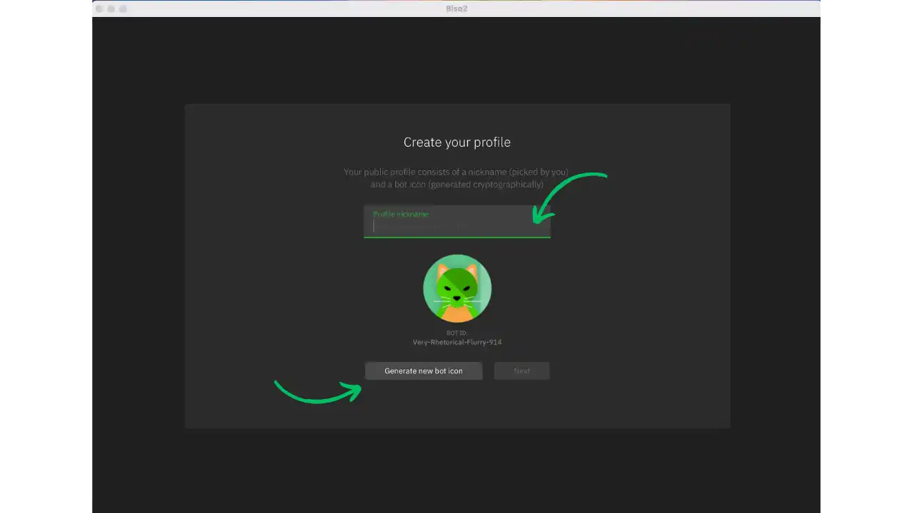
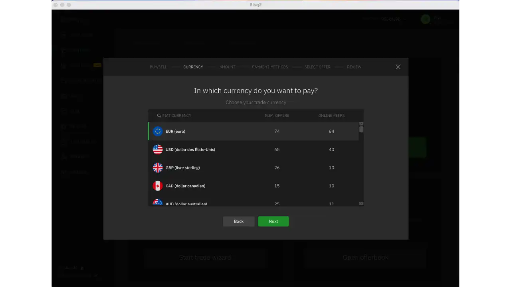
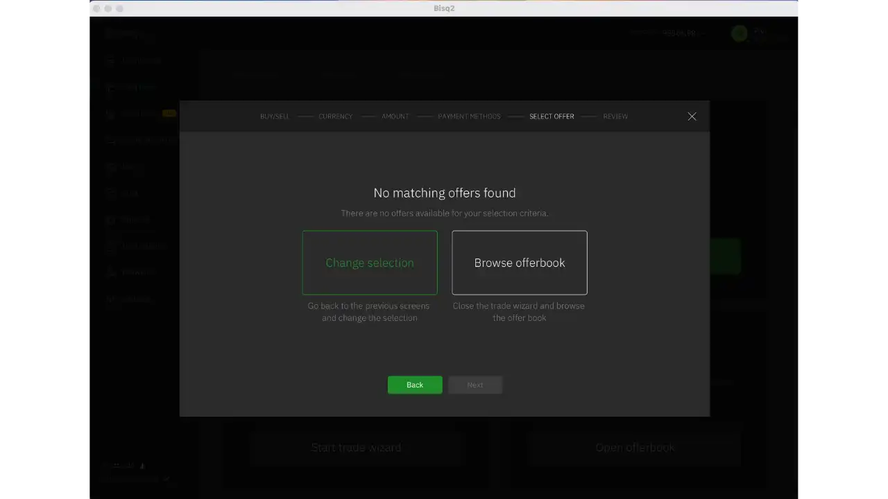
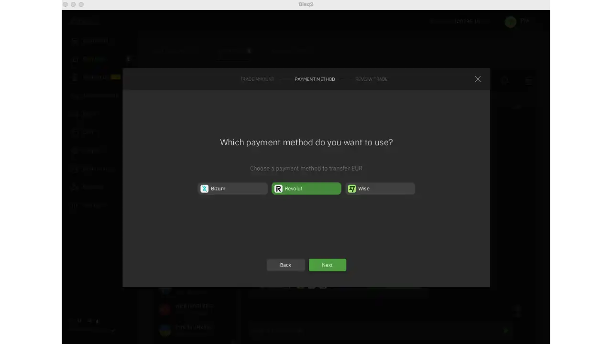
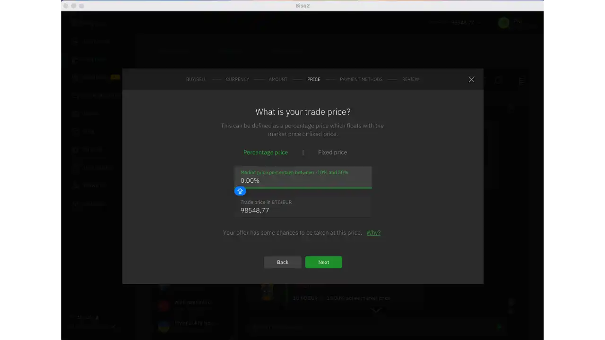

## Introdução

As trocas peer-to-peer (P2P) sem KYC são essenciais para preservar a confidencialidade e a autonomia financeira dos utilizadores. Permitem transacções diretas entre indivíduos sem necessidade de verificação de identidade, o que é crucial para quem valoriza a privacidade. Para uma compreensão mais aprofundada dos conceitos teóricos, consulte o curso BTC204:

https://planb.network/courses/65c138b0-4161-4958-bbe3-c12916bc959c
### O que é o Bisq 2?

Bisq 2 é a nova versão da popular bolsa descentralizada Bisq, lançada em 2024. Ao contrário da sua antecessora, a Bisq 2 foi desenvolvida para suportar múltiplos protocolos de troca, oferecendo aos utilizadores uma maior flexibilidade.

**Principais caraterísticas novas:**

- Suporte para várias redes de privacidade (Tor, I2P)
- Identidades múltiplas para maior confidencialidade
- API REST para bots de negociação
- Suporte para vários tipos de carteiras
- Sistema de funções com depósito obrigatório no BSQ

Este guia centra-se exclusivamente no "Bisq Easy", o único protocolo atualmente disponível. O Bisq Easy foi concebido especificamente para novos utilizadores de Bitcoin. Este protocolo permite aos utilizadores comprar e vender Bitcoins contra moedas fiduciárias numa plataforma descentralizada peer-to-peer. As transacções são limitadas ao equivalente a 600 USD (com um mínimo de 6 USD) e a segurança da troca depende da reputação dos vendedores de BTC. A Bisq Easy não tem taxas de transação ou requisitos de depósito de segurança. Espera-se que a Bisq Easy substitua a Bisq 1 nas transacções em numerário inferiores a 600 USD (ou equivalente).

**Principais caraterísticas

- Aplicação de ambiente de trabalho multiplataforma
- Vários protocolos de intercâmbio disponíveis
- Rede P2P descentralizada
- Foco na confidencialidade (sem KYC, utilização do Tor)
- Sem custódia (mantém o controlo dos seus fundos)
- Código aberto (AGPL)

### Diferenças com Bisq 1

**Para os compradores

- Não é necessário depósito de segurança
- Sem taxas de negociação
- Sem taxas de exploração mineira
- Segurança baseada na reputação do fornecedor
- Limites de negociação mais baixos (equivalente a 600 USD)

**Para os vendedores

- Não é necessário depósito de segurança
- Construir uma reputação
- Possibilidade de queimar BSQ ou criar ligações BSQ
- Prémio de venda potencialmente mais elevado (10-15% acima do mercado)

**Nota importante:** Uma vez que o protocolo Bisq Multisig tenha sido implementado no Bisq 2, a versão antiga do Bisq pode ser eliminada. No entanto, o Bisq 1 continuará a ser utilizado como uma ferramenta de gestão para o Bisq CAD e para as trocas BSQ-BTC.

### Processo de intercâmbio

- O criador da oferta define os termos da troca
- Uma vez acordados os termos (método de pagamento e preço), a troca começa
- O vendedor envia os seus dados bancários para o comprador e o comprador envia o seu endereço Bitcoin para o vendedor
- O comprador efectua o pagamento em numerário e notifica o vendedor
- Uma vez recebido o pagamento, o vendedor envia os bitcoins para o endereço do comprador
- A troca fica concluída quando o comprador recebe os bitcoins

### Regras importantes

- Antes da troca de dados de pagamento, a troca pode ser cancelada sem justificação
- Após a troca de informações, o não cumprimento das obrigações pode resultar no banimento
- No caso de transferências bancárias, **nunca utilizar os termos "Bisq" ou "Bitcoin "** no motivo do pagamento (isto pode levar ao congelamento dos fundos ou mesmo ao bloqueio da conta bancária do destinatário ou do ordenante)
- Os comerciantes devem iniciar sessão pelo menos uma vez por dia para acompanhar o processo
- Em caso de problema, os comerciantes podem recorrer aos serviços de um mediador

## Instalação e configuração

### 1. Descarregar e verificar o Bisq 2

- Aceder a [bisq.network](https://bisq.network/downloads/)
- Descarregue a versão do Bisq 2 correspondente ao seu sistema operativo (desloque-se para baixo na página)
- Verificar a autenticidade do ficheiro descarregado (fortemente recomendado). Para obter um guia detalhado sobre a verificação de assinaturas, consulte o seguinte tutorial:

https://planb.network/tutorials/others/general/integrity-authenticity-21d0420a-be02-4663-94a3-8d487f23becc
### 2. Instalação de acordo com o seu sistema

Siga os passos de instalação adequados ao seu sistema operativo. Se tiver alguma dificuldade durante a instalação, pode consultar o guia detalhado no [wiki oficial do Bisq] (https://bisq.wiki/Downloading_and_installing).

### 3. Primeiro arranque

- Iniciar o Bisq 2 e aceitar os termos de utilização

- Criar um novo perfil escolhendo um nome e um avatar

- O utilizador é então conduzido ao painel de controlo principal da aplicação, onde pode lançar o Bisq Easy para comprar ou vender os seus primeiros bitcoins

### 4. Configurar métodos de pagamento

- Aceder à secção das contas de pagamento a partir do menu principal

- Adicionar um novo método de pagamento preenchendo as informações necessárias

A pré-configuração dos métodos de pagamento é opcional, mas recomendada para poupar tempo durante a negociação. Também pode configurar os seus métodos de pagamento diretamente durante uma negociação, contactando o seu parceiro de troca.

### 5. Segurança da conta

**Cópia de segurança dos dados:**

Ao contrário do Bisq 1, o Bisq 2 não integra atualmente uma carteira Bitcoin: as transacções são, portanto, efectuadas através das suas próprias carteiras externas. No entanto, recomendamos que faças regularmente cópias de segurança da tua pasta de dados do Bisq 2. Para localizar a tua pasta de dados, consulta a [wiki oficial do Bisq] (https://bisq.wiki/Backing_up_application_data#Back_up_the_entire_Bisq_data_directory).

**Gestão da identidade:**

O Bisq 2 permite-lhe criar várias identidades. Cada identidade pode ser utilizada para diferentes tipos de transacções. As suas identidades são guardadas na pasta de dados.

## Comprar e vender Bitcoins

### Como comprar Bitcoins

**Opção 1: Tirar partido de uma oferta existente

- No ecrã principal, selecione "Bisq Easy", o separador "Getting started" e, em seguida, clique em "Start trade wizard"

- Escolha "Comprar Bitcoin" e selecione a sua moeda

- Configurar os seus métodos de pagamento preferidos (SEPA, Revolut, etc.)

- Nesta altura, ou tem uma lista de ofertas que correspondem aos seus critérios anteriores, ou tem de ir ao "Livro de ofertas"

- No segundo caso, pode visualizar e filtrar as ofertas utilizando os botões no canto superior direito da interface

- Depois de ter escolhido a sua oferta, só tem de escolher o seu método de pagamento e, em seguida, validar o resumo da transação

**Opção 2: Criar a sua própria oferta

- Selecionar "Bisq Easy" e depois "Offerbook"
- Escolha o seu par de negociação (por exemplo, BTC/EUR)
- Clique em "Criar oferta
- Siga o assistente de criação de ofertas: Definir o montante (fixo ou intervalo)

- Selecionar os métodos de pagamento aceites

  - Verificar o resumo e publicar a oferta

Uma vez iniciada a troca :

- Envie o seu endereço Bitcoin ou a fatura Lightning ao vendedor

- Receber os dados bancários do vendedor

- Efetuar o pagamento (sem mencionar "Bisq" ou "Bitcoin")
- Notificar o vendedor do seu pagamento

- Aguardar a chegada dos bitcoins

### Como vender Bitcoins?

O processo de venda no Bisq 2 segue uma lógica semelhante à da compra, com os mesmos passos principais, mas na ordem inversa. Podes criar a tua própria oferta de venda ou responder a uma oferta de compra existente. Segue-se uma descrição das várias opções e fases do processo:

**Opção 1: Criar uma oferta de venda

- Selecionar "Bisq Easy" e depois "Offerbook"
- Clique em "Criar oferta" e escolha "Vender Bitcoin"
- Configure a sua oferta :
 - Selecionar a moeda (EUR, USD, etc.)
 - Escolha os métodos de pagamento aceites
 - Definir o montante (entre 6 e 600 USD)
 - Definir o seu preço (fixo ou % do mercado)
- Verificar os pormenores e publicar a oferta

**Opção 2: Aceitar uma oferta existente

- Procurar ofertas no separador "Livro de ofertas
- Filtrar por moeda e método de pagamento
- Selecione uma oferta que lhe convenha
- Verificar os pormenores e aceitar a oferta

**Processo de venda

Uma vez iniciada a troca :

   - Enviar os seus dados bancários ao comprador
   - Aguardar o endereço Bitcoin do comprador
   - Verificar se o endereço é válido

Após a notificação do pagamento :

   - Verificar se o pagamento foi recebido na sua conta
   - Confirmar a correspondência entre o montante e os dados
   - Enviar bitcoins para o endereço fornecido
   - Marcar a transação como concluída

Finalização :

   - Aguardar a confirmação do comprador
   - Deixar comentários sobre a transação
   - Construir a sua reputação para vendas futuras

**Nota importante:** Como vendedor, deve estar particularmente atento ao risco de estornos. Dê preferência a métodos de pagamento seguros e verifique sempre se o pagamento foi recebido antes de enviar bitcoins.

## Boas práticas e segurança

### Conselhos de segurança

**Para os compradores

- Comece com pequenas quantidades
- Verificar a reputação dos vendedores (pontuação mínima de 30.000)
- Utilizar apenas os métodos de pagamento sugeridos
- Verificar se o vendedor está ativo antes de enviar o pagamento
- Utilize apenas os dados bancários fornecidos no chat de troca de mensagens
- Nunca comunicar fora da plataforma Bisq 2
- Conservar o comprovativo de pagamento
- Nunca enviar informações sensíveis

**Para os vendedores

- Cuidado com as novas contas
- Evitar métodos de pagamento sensíveis a estornos (PayPal, Venmo)
- Verificar se os dados da conta correspondem aos do comprador
- Limitar a comunicação ao chat Bisq 2
- Abrir uma mediação em caso de dúvida

### Criação de reputação (para vendedores)

Para melhorar a sua reputação como vendedor no Bisq, efectue transacções regulares e mantenha uma comunicação profissional com os compradores. Responda rapidamente aos pedidos dos compradores para garantir uma experiência positiva. Também pode criar um vínculo BSQ para mostrar o seu compromisso com a plataforma. Estas acções irão criar confiança e atrair mais compradores.

### Resolução de litígios

- Contactar o seu interlocutor através do chat
- Se necessário, abrir um litígio
- Fornecer todas as provas solicitadas
- Seguir as instruções do mediador

### Política de privacidade :

- Não é necessário qualquer registo ou verificação centralizada da identidade
- Todas as ligações passam pela rede Tor (e em breve pela I2P)
- Nenhum servidor central para armazenar dados
- Os detalhes da transação só podem ser lidos pelas partes envolvidas

### Proteção contra a censura :

- Rede P2P totalmente distribuída
- Utilizar a rede Tor (e em breve a I2P) para resistir à censura
- Projeto de fonte aberta gerido por uma DAO, sem entidade jurídica centralizada

## Vantagens e desvantagens

### Vantagens de Bisq 2

- Máxima confidencialidade**: Sem KYC, utilização do Tor
- Descentralização**: Sem servidor central
- Segurança**: Código de fonte aberta, sem custódia
- Interface intuitiva**: mais simples do que o Bisq 1
- Flexibilidade**: Múltiplos protocolos de intercâmbio

### Desvantagens do Bisq 2

- Liquidez limitada** (de momento) :
 - Novo protocolo em fase de arranque
 - Poucas ofertas de venda disponíveis
 - Tempos de espera potencialmente longos para encontrar um comprador
- Limites de transação**: Máximo de 600 USD por transação (com Bisq easy)
- Apenas para computador**: Sem aplicação móvel

## Protocolos futuros

Embora o Bisq Easy seja atualmente o único protocolo disponível, estão a ser desenvolvidos vários outros protocolos para o Bisq 2 :

- Bisq Lightning**: Protocolo de troca baseado num sistema de garantia que utiliza criptografia de computação multipartidária na rede Lightning.
- Bisq MuSig**: Migração do protocolo principal do Bisq 1 para o Bisq 2, utilizando um multisig 2 em 2 com depósitos de segurança.
- Swaps de BSQ**: Swaps atómicos instantâneos entre BSQ e BTC.
- Liquid Swaps**: Troca de activos na rede Liquid (USDT, BTC-L) através de swaps atómicos.
- Swaps Monero**: Trocas atómicas entre Bitcoin e Monero.
- Liquid MuSig**: Versão do protocolo multisig que utiliza L-BTC para reduzir os custos e aumentar a confidencialidade.
- Swaps submarinos**: Trocas entre Bitcoin na rede Lightning e Bitcoin on-chain.
- Stablecoin Swaps**: Trocas atómicas entre stablecoins de Bitcoin e USD.
- Opções Multisig**: Criação de opções de compra e venda P2P com bloqueio de BTC numa transação multisig on-chain.
- Contratos Abertos Multisig**: Permite a criação de contratos condicionais personalizados usando um sistema multisig 2 em 3 com arbitragem.

Estes protocolos estão atualmente em desenvolvimento e serão progressivamente integrados no Bisq 2, oferecendo maior flexibilidade aos utilizadores de acordo com as suas necessidades específicas.

## Recursos úteis

- Sítio Web oficial: [bisq.network](https://bisq.network)
- Documentação: [Bisq Wiki](https://bisq.wiki)
- Apoio: [Fórum Bisq](https://bisq.community)
- Código fonte : [GitHub](https://github.com/bisq-network)