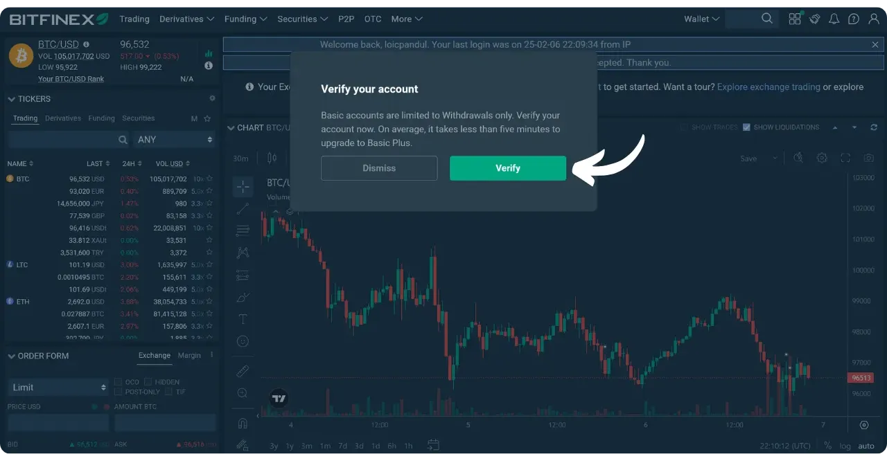
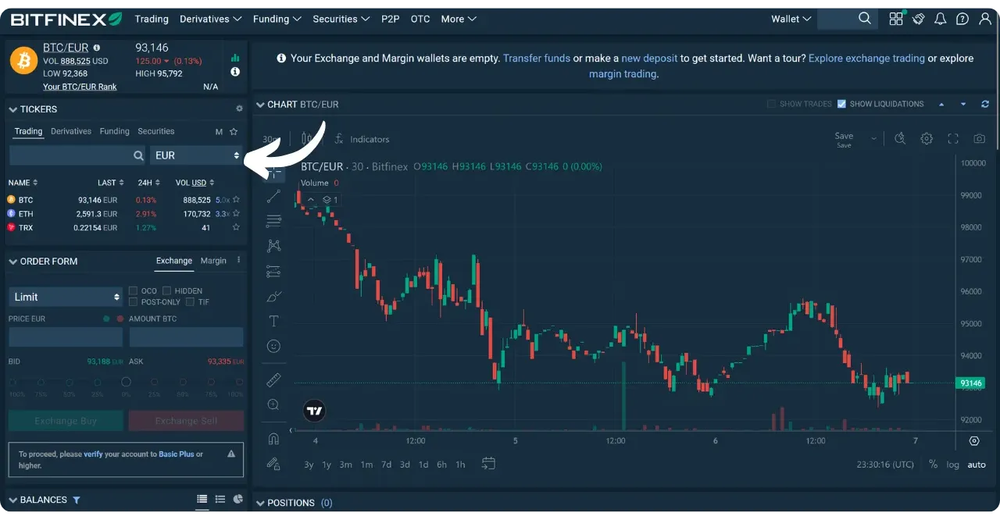

Didirikan pada tahun 2012, Bitfinex adalah salah satu platform pertukaran bitcoin dan altcoin pertama. Awalnya berfokus pada pertukaran bitcoin P2P, platform ini dengan cepat memperluas layanannya untuk memasukkan perdagangan margin, pembiayaan P2P, perdagangan derivatif, dan pasar OTC ("*over-the-counter*") untuk transaksi volume tinggi.

Saat ini, Bitfinex adalah platform yang lengkap, memungkinkan pembelian bitcoin yang sederhana dan penggunaan fungsi perdagangan tingkat lanjut (perdagangan tradisional, derivatif, OTC, peminjaman, dll.) dengan alat manajemen risiko. Ini tersedia dalam versi web, dan untuk transaksi sederhana, aplikasi seluler yang mudah digunakan juga tersedia.

Dalam tutorial ini, kita akan membahas proses pembuatan akun bisnis di Bitfinex, membeli dan menjual bitcoin, mengelola transaksi untuk tujuan akuntansi, serta menyetor dan menarik euro dan bitcoin. Tujuannya adalah untuk memberi Anda pengetahuan dasar, apakah Anda berencana untuk mengintegrasikan bitcoin ke dalam arus kas Anda atau menerima bitcoin sebagai alat pembayaran.

Jika Anda tertarik dengan topik mengintegrasikan bitcoin ke dalam bisnis Anda, saya juga merekomendasikan untuk mempelajari kursus pelatihan teori lengkap kami tentang topik ini:

https://planb.network/courses/a804c4b6-9ff5-4a29-a530-7d2f5d04bb7a
## 1 - Membuat akun Bitfinex

Kunjungi [situs web resmi Bitfinex] (https://www.bitfinex.com/). Di halaman beranda, cari dan klik opsi "*Daftar*" untuk mulai membuat akun Anda. Pada awalnya, Anda akan membuat akun standar untuk perorangan, opsi "*Corporate*" akan dipilih nanti selama proses verifikasi.

Lengkapi informasi yang diperlukan: masukkan alamat email bisnis dan negara tempat tinggal perusahaan Anda. Pilih nama pengguna dan kata sandi yang aman, lalu klik "*Daftar*" untuk mengonfirmasi pendaftaran.

Untuk tips menggunakan dan melindungi kata sandi yang kuat dan unik, lihat juga tutorial ini:

https://planb.network/tutorials/others/general/bitwarden-0532f569-fb00-4fad-acba-2fcb1bf05de9
Sekarang kita akan mengonfigurasi 2FA untuk mengamankan akun. Gunakan aplikasi otentikasi pada ponsel cerdas Anda, seperti Google Authenticator atau Authy misalnya. Anda akan menemukan tutorial tentang alat ini di sini:

https://planb.network/tutorials/others/general/authy-a76ab26b-71b0-473c-aa7c-c49153705eb7
Pindai kode QR dengan aplikasi Anda dan masukkan 6 digit yang disediakan.

Pendaftaran telah selesai.

Periksa kotak surat Anda dan klik tautan yang dikirim oleh Bitfinex untuk mengonfirmasi pendaftaran Anda.

Akun Anda sekarang sudah dibuat. Klik "*Masuk*" untuk mengakses platform.

## 2 - Verifikasi akun perusahaan

Bitfinex menerapkan proses verifikasi (KYC) yang sesuai dengan peraturan yang berlaku saat ini. Dalam mode "Basic", tidak mungkin untuk melakukan deposit, sehingga sangat penting untuk mendapatkan setidaknya tingkat verifikasi "Intermediate", atau bahkan "Full" jika perlu.

Setelah akun Anda dibuat, sebuah jendela pop-up akan muncul dan meminta Anda untuk memverifikasi akun Anda. Klik "*Verifikasi*".

Jika jendela ini tidak muncul, buka profil Anda di bagian kanan atas antarmuka, lalu klik "*Verifikasi*".

Di bawah "*Jenis Akun*", pilih "*Perusahaan*". Dalam kasus saya, saya meningkatkan ke "*Menengah*", jadi saya memilih "*Upgrade ke Menengah*".

Selesaikan langkah-langkah dengan memberikan :

- Informasi perusahaan (nama perusahaan, detail kontak, sektor bisnis, dll.) ;
- Dokumen hukum (anggaran dasar, kutipan Kbis, daftar direktur dan pemegang saham);
- Informasi KYC untuk setiap pemilik manfaat atau direktur (dokumen identitas, bukti alamat, dll.).

Setelah aplikasi Anda selesai dan dikirimkan, mungkin diperlukan beberapa hari bagi platform untuk memvalidasinya untuk verifikasi bisnis. Selama periode ini, deposit akan diblokir sementara.

## 3 - Pengenalan cepat ke antarmuka Bitfinex

Setelah masuk, Anda akan melihat bilah navigasi di bagian atas antarmuka dengan: "*Trading*", "*Derivatif*", "*Pendanaan*", "*OTC*", "*P2P*", "*Dompet*", dll. Bitfinex menawarkan berbagai fungsi, termasuk:

- Perdagangan**: pasar "*klasik*" tempat Anda bisa melakukan order untuk membeli dan menjual mata uang kripto (termasuk bitcoin);
- OTC**: Layanan Over-The-Counter untuk memperdagangkan volume besar secara langsung dengan pemain lain, di luar buku pesanan publik;
- Pendanaan**: Area yang didedikasikan untuk pinjaman dan pendanaan margin;
- Derivatif**: Bagian untuk produk derivatif (futures, dll.), ditujukan untuk trader berpengalaman;
- P2P**: Memungkinkan Anda membeli atau menjual kripto dari pengguna lain secara peer-to-peer.

Untuk penggunaan standar (membeli/menjual bitcoin, deposit/penarikan, dan manajemen kas), Anda akan menggunakan tab "*Trading*", serta bagian "*Wallet*", "*Deposit*", dan "*Penarikan*".

Keuntungan lain dari formula Korporat adalah kemampuan untuk membuat sub-akun. Ini berarti Anda bisa memberikan akses ke sub-akun ini kepada beberapa pengguna, masing-masing dengan hak khusus (hanya-baca, trading, hanya deposit, dll.).

## 4 - Penyetoran dan penarikan euro (fiat)

Untuk menyetor euro ke akun Perusahaan Bitfinex Anda, akses submenu "*Deposit*" yang terletak di menu "*Wallet*" di bagian atas antarmuka.

Pilih "*Transfer Bank*" atau "*Kartu Kredit/Debit*" untuk melakukan deposit dalam euro (atau mata uang fiat lainnya).

Pilih mata uang fiat yang akan dikirim, misalnya euro. Jika Anda hanya menggunakan fungsi dasar "*Trading*", klik "*Exchange*". Tunjukkan juga jumlah yang ingin Anda setorkan dan negara bank akun bisnis Anda.

Lakukan transfer dari rekening bank bisnis Anda ke rekening bank yang ditunjukkan oleh Bitfinex.

Untuk menarik dana, prosedurnya serupa: buka sub-menu "*Penarikan*".

Klik "*Transfer bank*".

Pilih mata uang fiat yang ingin Anda tarik, akun yang akan didebit di Bitfinex ("*Exchange*" jika Anda hanya menggunakan fitur dasar) dan jumlah yang akan ditarik.

Bitfinex mungkin memerlukan validasi rekening bank Anda sebelum menerima transfer, untuk alasan kepatuhan.

Setelah prosedur dimulai, Bitfinex akan mentransfer dana ke rekening bank Anda.

## 5 - Menyetor dan menarik bitcoin

Untuk menyetor bitcoin di Bitfinex, akses submenu "*Deposit*".

Klik "*Cryptocurrency*".

Pilih "*BTC*". Alamat penerima akan muncul. Salin alamat ini dan gunakan dari dompet penyimpanan mandiri atau platform lain untuk mengirim BTC Anda.

Untuk menarik bitcoin, buka submenu "*Penarikan*".

Klik "*Cryptocurrency*".

Pilih "*BTC*". Pilih akun Bitfinex yang akan didebit untuk penarikan Anda ("*Exchange*" untuk fitur dasar). Masukkan jumlah dan alamat tujuan bitcoin. Pastikan untuk memeriksa alamat penarikan untuk mencegah kesalahan.

Setelah konfirmasi, bitcoin Anda akan ditransfer. Harap diperhatikan bahwa biaya dan penundaan dapat bervariasi tergantung pada kepadatan mempool.

Bitfinex juga menawarkan opsi setoran dan penarikan melalui Lightning Network, memungkinkan transaksi yang lebih cepat dan lebih murah.

Jika Anda tertarik dengan Lightning Network, kami juga memiliki kursus pelatihan lengkap untuk membantu Anda memahami cara kerjanya:

https://planb.network/courses/34bd43ef-6683-4a5c-b239-7cb1e40a4aeb
## 6 - Membeli dan menjual bitcoin di Bitfinex

Bitfinex menawarkan berbagai mode perdagangan. Untuk kemudahan penggunaan, pilihlah pasar spot klasik, yang juga dikenal sebagai "*Trading*" atau "*Exchange*". Di sini, Anda dapat menempatkan pesanan beli atau jual pada harga pasar, atau menetapkan harga batas.

Di menu atas, klik "*Trading*".

Pilih pasangan "*BTC/EUR*" jika Anda ingin membeli atau menjual BTC dengan euro, misalnya.

Antarmuka menampilkan grafik harga di bagian tengah, buku pesanan di bagian bawah, dan modul entri pesanan di sebelah kiri. Pada bagian entri order, Anda bisa memilih antara order "*Pasar*" (dieksekusi langsung pada harga terbaik yang tersedia) atau order "*Batas*" (Anda yang menentukan harga). Tentukan jumlah BTC yang akan dibeli atau dijual, atau pilih persentase dari saldo Anda. Kemudian klik "*Beli*" untuk membeli atau "*Jual*" untuk menjual.

Anda bisa melihat riwayat order yang telah dieksekusi di bagian bawah antarmuka.

## 7 - Ekspor riwayat transaksi dan akuntansi

Untuk tujuan akuntansi, Anda harus mengekspor rincian transaksi Anda (pembelian, penjualan, setoran, penarikan). Bitfinex menawarkan alat pelaporan yang komprehensif. Klik pada ikon profil Anda di kanan atas antarmuka, lalu pada menu "*Laporan*".

Di sebelah kiri, Anda bisa memilih jenis data yang akan diekspor. Contohnya, memilih "*Trades*" akan memberikan Anda akses ke semua trade Anda.

Tentukan periode yang diinginkan di kotak "*Tanggal*" dan, jika perlu, batasi pencarian Anda pada satu atau beberapa pasangan tertentu melalui kolom "*Simbol*".

Untuk mengekspor data ini, klik tombol "*Export*".

Periksa parameternya, lalu konfirmasikan ekspor.

Laporan akan dikirim melalui email ke alamat yang terkait dengan akun Bitfinex Anda, dalam bentuk file CSV.

Setelah file diekspor, Anda dapat mengintegrasikannya ke dalam perangkat lunak akuntansi Anda atau mengirimkannya ke akuntan yang Anda sewa.

## 9 - Kasus penggunaan untuk perusahaan

Tergantung pada tujuan dan struktur perusahaan Anda, penggunaan Bitfinex dapat bervariasi.

### Membeli bitcoin dengan uang tunai

**Tujuan:** Mendiversifikasi arus kas perusahaan dengan berinvestasi dalam bitcoin.

**Langkah-langkah yang harus diikuti:**

- Setor euro di Bitfinex dari rekening bank perusahaan;
- Gunakan euro ini untuk membeli bitcoin;
- Simpan bitcoin di platform atau tarik kembali untuk mengamankannya dalam penitipan mandiri;
- Riwayat transaksi ekspor sesuai kebutuhan.

### Menerima bitcoin sebagai alat pembayaran

**Tujuan:** Menawarkan kepada perusahaan Anda kemungkinan untuk menerima bitcoin sebagai alat pembayaran untuk produk atau layanan Anda.

**Langkah-langkah yang harus diikuti:**

- Mengintegrasikan sistem pembayaran bitcoin. Untuk bisnis kecil, perangkat lunak dompet sederhana mungkin sudah cukup, atau Anda bisa memilih solusi khusus seperti Swiss Bitcoin Pay atau BTCPay Server untuk mengintegrasikan bitcoin sebagai opsi pembayaran di situs web Anda atau di tempat penjualan;
- Transfer pembayaran yang diterima dalam bentuk bitcoin ke akun Bitfinex Anda;
- Tergantung pada strategi keuangan Anda, jual bitcoin yang Anda terima untuk mendapatkan euro, simpan untuk mendapatkan potensi apresiasi di masa depan, atau pilih kombinasi keduanya;
- Simpan bitcoin di platform atau tarik untuk disimpan sendiri. Anda juga bisa menarik euro ke rekening bank Anda;
- Riwayat transaksi ekspor sesuai kebutuhan.

Untuk melihat topik ini secara lebih mendalam, saya merekomendasikan kursus pelatihan komprehensif tentang mengintegrasikan bitcoin ke dalam bisnis, yang mencakup secara rinci menambah arus kas, menerima pembayaran bitcoin, dan akuntansi:

https://planb.network/courses/a804c4b6-9ff5-4a29-a530-7d2f5d04bb7a