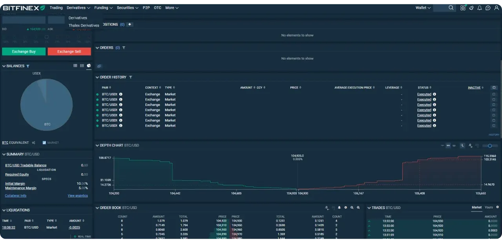
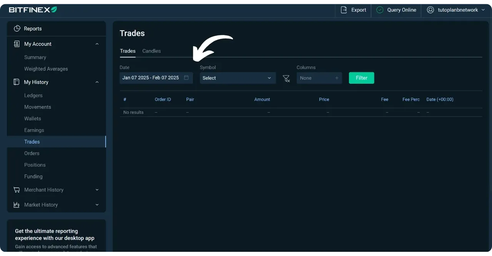
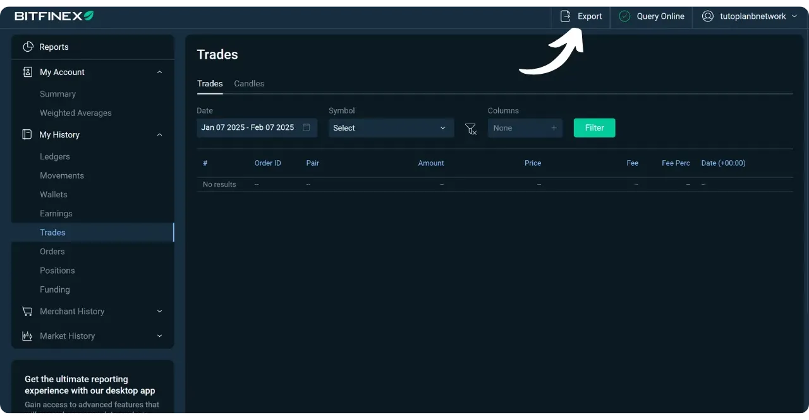

Fundada em 2012, a Bitfinex é uma das primeiras plataformas de troca de bitcoin e altcoin. Inicialmente centrada em trocas P2P de bitcoin, a plataforma rapidamente expandiu os seus serviços para incluir negociação de margens, financiamento P2P, negociação de derivados e um mercado OTC ("*over-the-counter*") para transacções de elevado volume.

Atualmente, a Bitfinex é uma plataforma completa, que permite tanto a compra simples de bitcoins como a utilização de funcionalidades de negociação avançadas (negociação tradicional, derivados, OTC, empréstimos, etc.) com ferramentas de gestão de risco. Está disponível numa versão web e, para transacções simples, está também disponível uma aplicação móvel fácil de utilizar.

Neste tutorial, abordaremos o processo de criação de uma conta comercial na Bitfinex, a compra e venda de bitcoins, a gestão de transacções para fins contabilísticos e o depósito e levantamento de euros e bitcoins. O objetivo é fornecer-lhe os conhecimentos básicos, quer pretenda integrar o bitcoin no seu fluxo de caixa ou aceitar o bitcoin como meio de pagamento.

Se estiver interessado em integrar a bitcoin na sua empresa, recomendo-lhe também que descubra a nossa formação teórica completa sobre o assunto:

https://planb.network/courses/a804c4b6-9ff5-4a29-a530-7d2f5d04bb7a
## 1 - Criar uma conta Bitfinex

Aceda ao [sítio Web oficial da Bitfinex] (https://www.bitfinex.com/). Na página inicial, encontre e clique na opção "*Sign Up*" para começar a criar a sua conta. Em primeiro lugar, criará uma conta padrão como para indivíduos, a opção "*Corporate*" será selecionada mais tarde durante o processo de verificação.

Preencha as informações necessárias: introduza o seu endereço de correio eletrónico profissional e o país de residência da sua empresa. Escolha um nome de utilizador e uma palavra-passe seguros e, em seguida, clique em "*Inscrever-se*" para confirmar o registo.

Para obter dicas sobre como utilizar e proteger palavras-passe fortes e únicas, consulte também este tutorial :

https://planb.network/tutorials/others/general/bitwarden-0532f569-fb00-4fad-acba-2fcb1bf05de9
Vamos agora configurar o 2FA para proteger a conta. Utilize uma aplicação de autenticação no seu smartphone, como o Google Authenticator ou o Authy, por exemplo. Encontrará um tutorial sobre esta ferramenta aqui :

https://planb.network/tutorials/others/general/authy-a76ab26b-71b0-473c-aa7c-c49153705eb7
Digitalize o código QR com a sua aplicação e introduza os 6 dígitos fornecidos.

O registo foi concluído.

Verifique a sua caixa de correio e clique na ligação enviada pela Bitfinex para confirmar o seu registo.

A sua conta está agora criada. Clique em "*Log in*" para aceder à plataforma.

## 2 - Verificação da conta da empresa

A Bitfinex aplica um processo de verificação (KYC) que está em conformidade com a regulamentação atual. No modo "Basic", é impossível efetuar depósitos, sendo indispensável obter pelo menos o nível de verificação "Intermediate", ou mesmo "Full" se necessário.

Depois de a sua conta ter sido criada, uma janela pop-up deverá sugerir que verifique a sua conta. Clique em "*Verificar*".

Se esta janela não aparecer, aceda ao seu perfil no canto superior direito da interface e clique em "*Verificação*".

Em "*Account Type*" (Tipo de conta), selecione "*Corporate*" (Empresa). No meu caso, estou a atualizar para "*Intermediate*", pelo que selecciono "*Upgrade to Intermediate*".

Completar as etapas fornecendo :

- Informações sobre a empresa (nome da empresa, dados de contacto, sector de atividade, etc.) ;
- Documentos jurídicos (estatutos da sociedade, extrato Kbis, lista de diretores e acionistas);
- Informações KYC para cada beneficiário efetivo ou diretor (documentos de identidade, comprovativo de morada, etc.).

Uma vez preenchida e submetida a sua candidatura, pode demorar vários dias até que a plataforma a valide para verificação da atividade. Durante este período, os depósitos serão temporariamente bloqueados.

## 3 - Introdução rápida à interface Bitfinex

Depois de iniciar sessão, verá uma barra de navegação na parte superior da interface com: "*Trading*", "*Derivativos*", "*Funding*", "*OTC*", "*P2P*", "*Wallet*", etc. A Bitfinex oferece uma vasta gama de funcionalidades, incluindo :

- Negociação**: mercado "*clássico*" onde pode colocar ordens de compra e venda de criptomoedas (incluindo bitcoin) ;
- OTC**: Serviço de balcão para negociar grandes volumes diretamente com outro interveniente, fora dos livros de ordens públicas;
- Financiamento**: Área dedicada à concessão de empréstimos e ao financiamento de margens;
- Derivados**: Secção de produtos derivados (futuros, etc.), destinada a operadores experientes;
- P2P**: Permite-lhe comprar ou vender criptos a outros utilizadores numa base peer-to-peer.

Para uma utilização normal (compra/venda de bitcoins, depósitos/levantamentos e gestão de dinheiro), utilizará principalmente o separador "*Trading*", bem como as secções "*Wallet*", "*Deposit*" e "*Withdraw*".

Outra vantagem da fórmula Corporate é a possibilidade de criar subcontas. Isto significa que pode dar a vários utilizadores acesso a estas subcontas, cada um com direitos específicos (apenas leitura, negociação, apenas depósito, etc.).

## 4 - Depósito e levantamento de euros (fiat)

Para depositar euros na sua conta Bitfinex Corporate, aceda ao submenu "*Deposit*" situado no menu "*Wallet*" na parte superior da interface.

Selecione "*Transferência bancária*" ou "*Cartão de crédito/débito*" para efetuar um depósito em euros (ou qualquer outra moeda fiduciária).

Escolha a moeda fiduciária a enviar, por exemplo, o euro. Se estiver a utilizar apenas as funções básicas "*Trading*", clique em "*Exchange*". Indique também o montante que pretende depositar e o país do banco da sua conta profissional.

Faça uma transferência da sua conta bancária comercial para a conta bancária indicada pela Bitfinex.

Para levantar fundos, o procedimento é semelhante: aceda ao submenu "*Retirar*".

Clique em "*Transferência bancária*".

Selecione a moeda fiduciária que pretende levantar, a conta a debitar na Bitfinex ("*Exchange*" se apenas utilizar as funcionalidades básicas) e o montante a levantar.

A Bitfinex pode exigir a validação da sua conta bancária antes de aceitar a transferência, por razões de conformidade.

Assim que o procedimento for iniciado, a Bitfinex transferirá os fundos para a sua conta bancária.

## 5 - Depositar e levantar bitcoins

Para depositar bitcoin na Bitfinex, aceda ao submenu "*Deposit*".

Clique em "*Cryptocurrency*".

Selecione "*BTC*". Aparecerá um endereço de receção. Copie este endereço e utilize-o a partir da sua carteira de autocustódia ou de outra plataforma para enviar o seu BTC.

Para levantar bitcoin, aceda ao submenu "*Withdraw*".

Clique em "*Cryptocurrency*".

Selecione "*BTC*". Escolha a conta Bitfinex a ser debitada para o seu levantamento ("*Exchange*" para as funcionalidades básicas). Introduza o montante e o endereço de destino dos bitcoins. Não te esqueças de verificar o endereço de levantamento para evitar erros.

Após a sua confirmação, os seus bitcoins serão transferidos. Tenha em atenção que as taxas e os atrasos podem variar consoante o congestionamento do mempool.

A Bitfinex também oferece opções de depósito e levantamento através da Lightning Network, permitindo transacções mais rápidas e baratas.

Se estiver interessado na Lightning Network, também temos um curso de formação completo para o ajudar a compreender o seu funcionamento:

https://planb.network/courses/34bd43ef-6683-4a5c-b239-7cb1e40a4aeb
## 6 - Comprar e vender bitcoins na Bitfinex

A Bitfinex oferece vários modos de negociação. Para facilitar o uso, opte pelo clássico mercado à vista, também conhecido como "*Trading*" ou "*Exchange*". Aqui, pode colocar ordens de compra ou venda ao preço de mercado, ou definir um preço limite.

No menu superior, clique em "*Trading*".

Selecione o par "*BTC/EUR*" se quiser comprar ou vender BTC em troca de euros, por exemplo.

A interface apresenta um gráfico de preços no centro, o livro de ordens na parte inferior e o módulo de entrada de ordens à esquerda. Na secção de entrada de ordens, pode escolher entre uma ordem "*Mercado*" (executada imediatamente ao melhor preço disponível) ou uma ordem "*Limite*" (o preço é definido por si). Indique a quantidade de BTC a comprar ou a vender, ou selecione uma percentagem do seu saldo. Em seguida, clique em "*Comprar*" para comprar ou em "*Vender*" para vender.

Pode ver o histórico das suas ordens executadas na parte inferior da interface.

## 7 - Exportação do histórico de transacções e contabilidade

Para fins contabilísticos, terá de exportar detalhes das suas transacções (compras, vendas, depósitos, levantamentos). A Bitfinex oferece uma ferramenta de relatórios abrangente. Clique no ícone do seu perfil no canto superior direito da interface e depois no menu "*Relatórios*".

À esquerda, pode selecionar o tipo de dados a exportar. Por exemplo, ao selecionar "*Negócios*", terá acesso a todos os seus negócios.

Defina o período pretendido na caixa "*Data*" e, se necessário, restrinja a sua pesquisa a um ou mais pares específicos através do campo "*Símbolo*".

Para exportar estes dados, clique no botão "*Exportar*".

Verificar os parâmetros e, em seguida, confirmar a exportação.

O relatório será enviado por e-mail para o endereço associado à sua conta Bitfinex, como um ficheiro CSV.

Uma vez exportado o ficheiro, pode integrá-lo no seu software de contabilidade ou enviá-lo ao seu contabilista.

## 9 - Casos de utilização para a empresa

Dependendo dos objectivos e da estrutura da sua empresa, a utilização da Bitfinex pode variar.

### Comprar bitcoins por dinheiro

**Objetivo:** Diversificar o fluxo de caixa da empresa investindo em bitcoin.

**Passos a seguir:**

- Depositar euros na Bitfinex a partir da conta bancária da empresa;
- Utilize estes euros para comprar bitcoin;
- Mantenha os bitcoins na plataforma ou retire-os para os proteger em autocustódia;
- Exportar históricos de transacções conforme necessário.

### Aceitar bitcoin como meio de pagamento

**Objetivo:** Oferecer à sua empresa a possibilidade de aceitar bitcoin como meio de pagamento dos seus produtos ou serviços.

**Passos a seguir:**

- Integrar um sistema de pagamento em bitcoin. Para as pequenas empresas, um simples software de carteira pode ser suficiente, ou pode optar por soluções especializadas como o Swiss Bitcoin Pay ou o BTCPay Server para integrar a bitcoin como opção de pagamento no seu sítio Web ou no ponto de venda;
- Transferir pagamentos recebidos em bitcoins para a sua conta Bitfinex;
- Dependendo da sua estratégia financeira, venda os bitcoins recebidos por euros, guarde-os para potencial valorização futura, ou opte por uma combinação de ambos;
- Guardar bitcoins na plataforma ou retirá-los para auto-custódia. Também pode levantar euros para a sua conta bancária;
- Exportar históricos de transacções conforme necessário.

Para uma análise mais aprofundada deste tópico, recomendo este curso de formação abrangente sobre a integração da bitcoin nas empresas, que aborda em pormenor a adição ao fluxo de caixa, a aceitação de pagamentos em bitcoin e a contabilidade:

https://planb.network/courses/a804c4b6-9ff5-4a29-a530-7d2f5d04bb7a