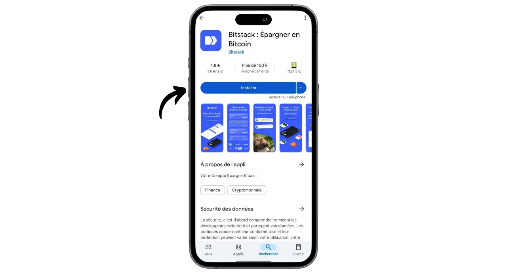
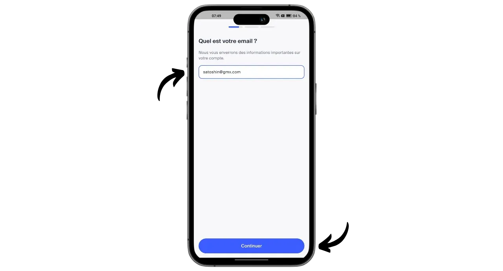
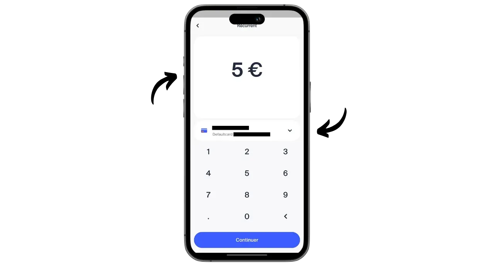
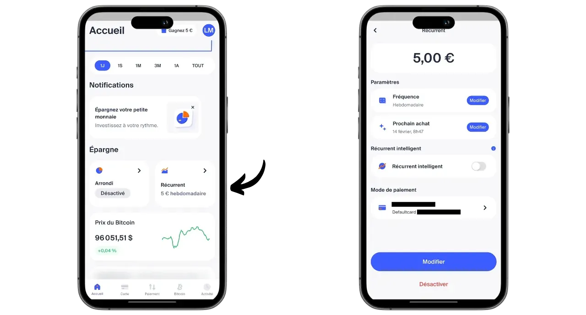

Bitstack is a French bitcoin investment platform, regulated PSAN by the AMF. It offers an app available on Android and iOS for easy buying and selling of bitcoin.

What sets Bitstack apart is its automatic rounding system, which synchronizes the user's bank account to convert the difference between the amount debited during daily spending and the next higher euro, directly into bitcoins. This method facilitates the application of *Dollar Cost Averaging* (DCA), enabling a gradual, painless accumulation of satoshis. In addition to this original feature, the platform also offers a classic DCA system with automatic investments, as well as spot buying and selling.

Bitstack's transaction fees vary according to the volume traded over the last 30 days:

- Less than €250: 1.49
- 250 € - 5 000 € : 0,99 %
- 5 000 € - 10 000 € : 0,89 %
- 10 000 € - 50 000 € : 0,79 %
- 50 000 € - 250 000 € : 0,69 %
- 250 000 € - 500 000 € : 0,59 %
- More than €500,000: 0.49

All other operations on the platform are free of charge, including bitcoin withdrawals (with a minimum withdrawal set at 100,000 sats). So, unlike other exchange platforms, withdrawing, say, 0.01 BTC from the app to transfer it to self-custody would not generate any service or mining fees, allowing you to actually receive 0.01 BTC on your receiving address.

## Download application

To download the Bitstack application, go to your application store:

- [Download from Google Play Store](https://play.google.com/store/apps/details?id=com.bitstack.app&hl=fr)
- [Download on App Store](https://apps.apple.com/fr/app/bitstack-%C3%A9pargner-en-bitcoin/id1608783388)

## Create an account

When you first open the application, click on the "*Register*" button.

Enter your phone number and click on "*Continue*". Then enter the code you received by SMS.

Please enter your email address.

Choose a strong password to secure access to your account, then click on "*Continue*".

For secure password management on a daily basis, the use of a password manager is highly recommended. On Plan ₿ Network, you'll find several tutorials on the best existing solutions, such as Bitwarden :

https://planb.network/tutorials/others/general/bitwarden-0532f569-fb00-4fad-acba-2fcb1bf05de9
You will then be asked to verify your identity (KYC). In accordance with French regulations, you will be asked to provide your personal details and proof of identity. Fill in the boxes with your surname, first name and date of birth.

Enter your address and answer the additional questions.

Proceed to identity verification.

After that, you'll have access to all the application's features.

## Application settings

In Settings, you can customize a number of options. To access them, click on your initials at the top right of the interface.

Start with the "*Security*" section, where you can activate biometric authentication to avoid having to enter your password manually every time you log on.

In "*Preferences*", you can customize various settings such as the fiat currency displayed, the bitcoin unit (BTC or sats), or your notification preferences.

Then go to "*General*" in the settings and click on "*Payment methods*".

Here you can register credit cards for bitcoin purchases.

To use the automatic rounding feature, you need to synchronize a bank account. Click on "*Synchronized accounts*", then on "*Synchronize a bank account*".

Choose your bank and follow the instructions in your browser. Once connected, your bank account will be visible in this section.

## Buying bitcoin

As mentioned in the introduction, Bitstack offers 3 methods for investing in Bitcoin:

- Immediate purchase of a specific cash amount;
- Recurring Purchase Configuration (RPC) ;
- The use of automatic rounding on expenses.

### Buying with cash

To make a one-off purchase of bitcoins at the market price, simply click on "*Buy*".

Enter the desired amount, select your payment method, and press "*Continue*". Check your purchase order before confirming by clicking on "*Buy*".

Your transaction is now confirmed.

### Setting up a DCA

Dollar Cost Averaging* (DCA) is an attractive investment strategy for accumulating bitcoin while reducing the risks associated with its volatility. By regularly purchasing a fixed amount, regardless of price, you can smooth out your acquisition cost and avoid impulsive decision-making. The DCA helps reduce behavioral biases such as the fear of missing an opportunity or panic in the event of a price drop, and thus enables you to manage your bitcoin savings in a serene and disciplined way.

To set up a recurring purchase (DCA) on Bitstack, go to the "*Savings*" section of the home page and select "*Recurring*". Then press "*Continue*".

Define the recurring purchase amount and payment method.

Select the start date and frequency of your DCA, with options ranging from hourly to monthly. Confirm by clicking on "*Schedule*".

Your DCA is now active. You can view or modify it from the home page by selecting "*Recurring*" again.

### Enable automatic rounding of expenses

As previously explained, Bitstack offers an original automatic rounding feature for expenses. This allows you to round up your daily purchases to the nearest euro (or more, depending on the setting chosen) and invest the difference in sats. For example, a purchase of €1.10 will result in an automatic investment of €0.90 in BTC by Bitstack, which detects and aggregates these transactions every week.

This feature allows you to invest with a kind of DCA established on your personal expenses, in an almost imperceptible way, in order to gradually build up savings in bitcoins.

To activate it, you must first synchronize a bank account, as described at the beginning of this section. Then, on the Bitstack application, click on "*Arrondi*" in the "*Savings*" section.

Choose a multiplier for rounding. For example, with a multiplier x2, a purchase of €1.10 will save you €1.80 in bitcoins: `0.9 * 2 = 1.8`.

Select your bank account and click on "*Continue*". Then choose a payment method for the rounding purchase.

Your automatic rounding option is now active. You can view or modify it in the "*Rounding*" section.

## Withdraw from bitcoin

Once you've bought your first satoshis on Bitstack, you can withdraw them from the platform and keep them in self-custody. To do so, click on the "*Send*" icon, then on "*Send Bitcoin*".

Choose the amount you wish to withdraw and click on "*Send*". Then select "*Bitcoin address*".

Enter a blank recipient address from your wallet. Be careful, because if you make a mistake, the transaction will be irreversible.

Determine the transaction priority. For a no-fee withdrawal, choose "*Standard*" priority. Check your withdrawal details and confirm.

If you're not familiar with how a self-custody portfolio works, we offer tutorials on most of the solutions available [on Plan ₿ Network in the "*Wallet*" section](https://planb.network/tutorials/wallet).

## Selling bitcoin

To sell bitcoins with the Bitstack application, press the "*Sell*" button.

Enter the amount of bitcoins you wish to sell and click on "*Continue*". Then select the bank account to which you wish to credit the funds.

Check the details of your sell order and confirm it.

You can view details of all your transactions in the "*Activity*" section.

