Bitstack è una piattaforma di investimento in bitcoin francese, regolamentata PSAN dall'AMF. Offre un'applicazione disponibile su Android e iOS per acquistare e vendere facilmente bitcoin.

Ciò che distingue Bitstack è il suo sistema di arrotondamento automatico, che sincronizza il conto bancario dell'utente per convertire la differenza tra l'importo addebitato durante la spesa giornaliera e l'euro immediatamente superiore, direttamente in bitcoin. Questo metodo facilita l'applicazione del *Dollar Cost Averaging* (DCA), consentendo un accumulo graduale e indolore di satoshis. Oltre a questa funzione originale, la piattaforma offre anche un sistema classico di DCA con investimenti automatici, nonché acquisti e vendite a pronti.

Le commissioni di transazione di Bitstack variano in base al volume scambiato negli ultimi 30 giorni:

- Meno di 250 euro: 1,49
- 250 € - 5 000 € : 0,99 %
- 5 000 € - 10 000 € : 0,89 %
- 10 000 € - 50 000 € : 0,79 %
- 50 000 € - 250 000 € : 0,69 %
- 250 000 € - 500 000 € : 0,59 %
- Più di 500.000 euro: 0,49

Tutte le altre operazioni sulla piattaforma sono gratuite, compresi i prelievi di bitcoin (con un prelievo minimo fissato a 100.000 sats). Quindi, a differenza di altre piattaforme di scambio, il prelievo di, ad esempio, 0,01 BTC dall'app per trasferirlo in autodeposito non genererebbe alcuna commissione di servizio o di mining, consentendo di ricevere effettivamente 0,01 BTC sul proprio indirizzo di ricezione.

## Scarica l'applicazione

Per scaricare l'applicazione Bitstack, andate nel vostro negozio di applicazioni:

- [Scarica da Google Play Store](https://play.google.com/store/apps/details?id=com.bitstack.app&hl=fr)
- [Scarica su App Store](https://apps.apple.com/fr/app/bitstack-%C3%A9pargner-en-bitcoin/id1608783388)

## Creare un account

Quando si apre l'applicazione, fare clic sul pulsante "*Registrati*".

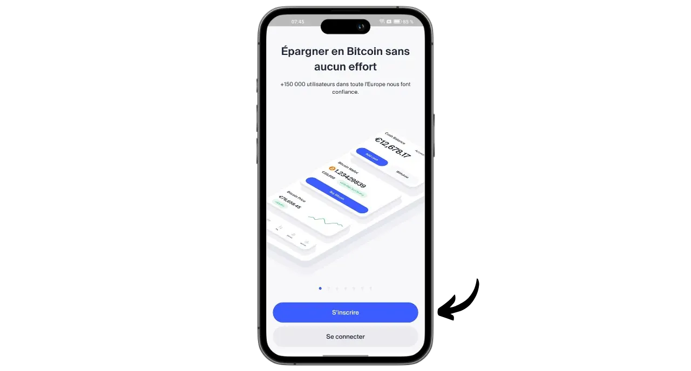

Immettere il numero di telefono e fare clic su "*Continua*". Inserire quindi il codice ricevuto via SMS.

Inserire l'indirizzo e-mail.

Scegliete una password forte per proteggere l'accesso al vostro account, quindi fate clic su "*Continua*".

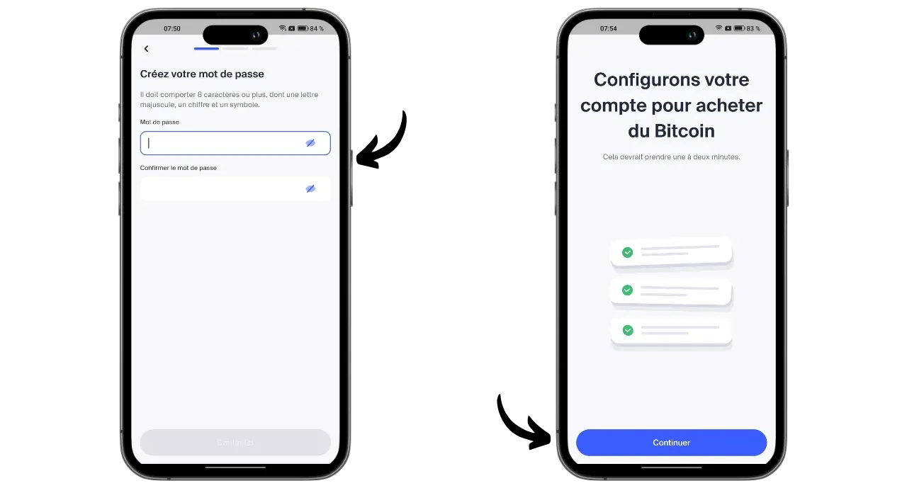

Per una gestione sicura delle password su base quotidiana, l'uso di un password manager è altamente raccomandato. Su Plan ₿ Network, troverete diversi tutorial sulle migliori soluzioni esistenti, come Bitwarden :

https://planb.network/tutorials/others/general/bitwarden-0532f569-fb00-4fad-acba-2fcb1bf05de9
Vi verrà quindi chiesto di verificare la vostra identità (KYC). In conformità alla normativa francese, vi verrà chiesto di fornire i vostri dati personali e un documento di identità. Compilate le caselle con il vostro cognome, nome e data di nascita.

Inserite il vostro indirizzo e rispondete alle domande aggiuntive.

Procedere alla verifica dell'identità.

Dopodiché, avrete accesso a tutte le funzioni dell'applicazione.

## Impostazioni dell'applicazione

In Impostazioni è possibile personalizzare una serie di opzioni. Per accedervi, fare clic sulle proprie iniziali in alto a destra dell'interfaccia.

Iniziate dalla sezione "*Sicurezza*", dove potete attivare l'autenticazione biometrica per evitare di dover inserire manualmente la password a ogni accesso.

In "*Preferenze*" è possibile personalizzare varie impostazioni, come la valuta fiat visualizzata, l'unità bitcoin (BTC o sats) o le preferenze di notifica.

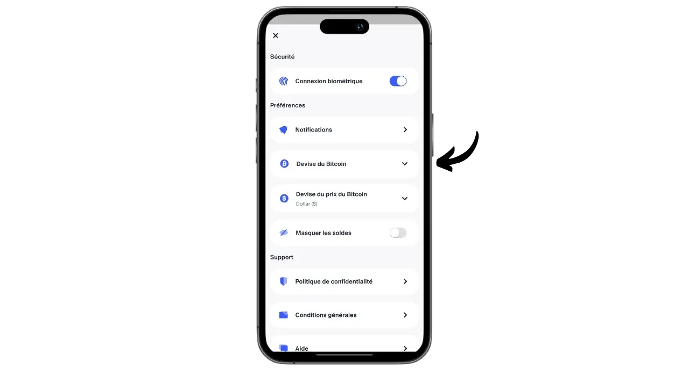

Andate quindi su "*Generali*" nelle impostazioni e cliccate su "*Metodi di pagamento*".

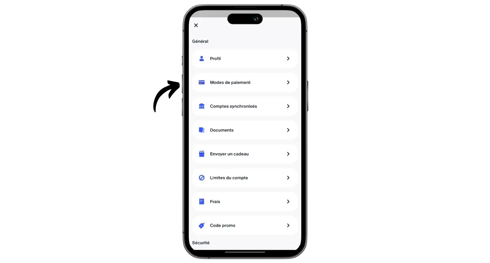

Qui è possibile registrare le carte di credito per gli acquisti in bitcoin.

Per utilizzare la funzione di arrotondamento automatico, è necessario sincronizzare un conto bancario. Cliccare su "*Conti sincronizzati*", quindi su "*Sincronizzazione di un conto bancario*".

Scegliete la vostra banca e seguite le istruzioni del browser. Una volta collegato, il vostro conto bancario sarà visibile in questa sezione.

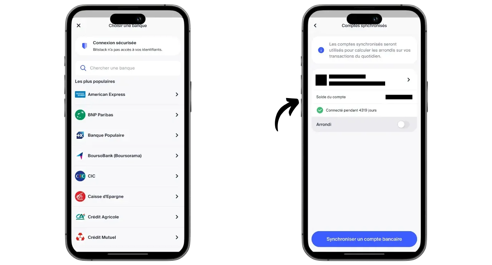

## Acquistare bitcoin

Come accennato nell'introduzione, Bitstack offre 3 metodi per investire in Bitcoin:

- Acquisto immediato di un importo specifico in contanti;
- Configurazione acquisti ricorrenti (RPC) ;
- L'uso dell'arrotondamento automatico delle spese.

### Acquisto in contanti

Per effettuare un acquisto una tantum di bitcoin al prezzo di mercato, è sufficiente cliccare su "*Acquista*".

Inserire l'importo desiderato, selezionare il metodo di pagamento e premere "*Continua*". Controllare l'ordine di acquisto prima di confermare cliccando su "*Acquista*".

La transazione è ora confermata.

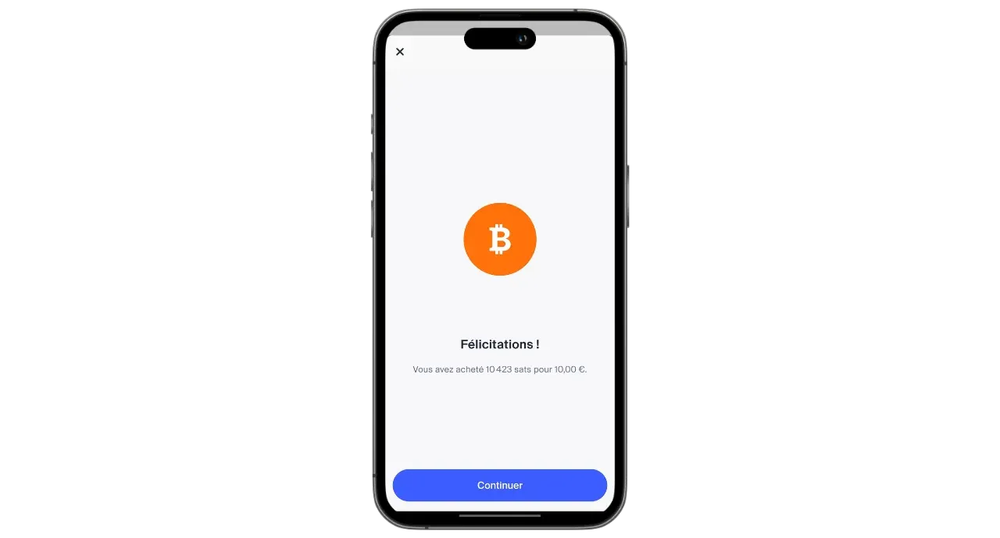

### Impostazione di un DCA

Il Dollar Cost Averaging* (DCA) è una strategia di investimento interessante per accumulare bitcoin riducendo i rischi associati alla sua volatilità. Acquistando regolarmente una quantità fissa, a prescindere dal prezzo, è possibile ammortizzare il costo di acquisizione ed evitare decisioni impulsive. La DCA aiuta a ridurre i pregiudizi comportamentali, come la paura di perdere un'opportunità o il panico in caso di calo dei prezzi, e consente quindi di gestire i propri risparmi in bitcoin in modo sereno e disciplinato.

Per impostare un acquisto ricorrente (DCA) su Bitstack, andate nella sezione "*Risparmio*" della home page e selezionate "*Ricorrenti*". Quindi premere "*Continua*".

Definire l'importo dell'acquisto ricorrente e il metodo di pagamento.

Selezionare la data di inizio e la frequenza del DCA, con opzioni che vanno dall'ora al mese. Confermare cliccando su "*Schedule*".

Il vostro DCA è ora attivo. È possibile visualizzarlo o modificarlo dalla pagina iniziale selezionando nuovamente "*Recurring*".

### Abilitazione dell'arrotondamento automatico delle spese

Come già spiegato, Bitstack offre un'originale funzione di arrotondamento automatico delle spese. Questa permette di arrotondare i propri acquisti giornalieri all'euro (o più, a seconda dell'impostazione scelta) e di investire la differenza in BTC. Ad esempio, un acquisto di 1,10 euro si tradurrà in un investimento automatico di 0,90 euro in BTC da parte di Bitstack, che rileva e aggrega queste transazioni ogni settimana.

Questa funzione consente di investire con una sorta di DCA stabilito sulle spese personali, in modo quasi impercettibile, per accumulare gradualmente risparmi in bitcoin.

Per attivarlo, è necessario prima sincronizzare un conto bancario, come descritto all'inizio di questa sezione. Quindi, nell'applicazione Bitstack, cliccare su "*Arrondi*" nella sezione "*Risparmio*".

Scegliere un moltiplicatore per l'arrotondamento. Ad esempio, con un moltiplicatore x2, un acquisto di 1,10 euro vi farà risparmiare 1,80 euro in bitcoin: `0,9 * 2 = 1,8`.

Selezionate il vostro conto bancario e cliccate su "*Continua*". Scegliete quindi un metodo di pagamento per l'acquisto dell'arrotondamento.

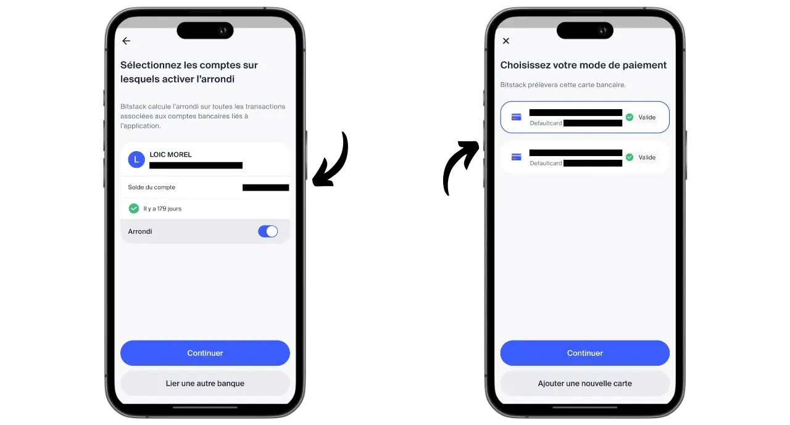

L'opzione di arrotondamento automatico è ora attiva. È possibile visualizzarla o modificarla nella sezione "*Arrotondamento*".

## Prelievo da bitcoin

Una volta acquistati i primi satoshi su Bitstack, è possibile ritirarli dalla piattaforma e tenerli in autodeposito. Per farlo, cliccate sull'icona "*Invio*", quindi su "*Invio di Bitcoin*".

Scegliete l'importo che desiderate prelevare e cliccate su "*Invio*". Quindi selezionare "*Indirizzo Bitcoin*".

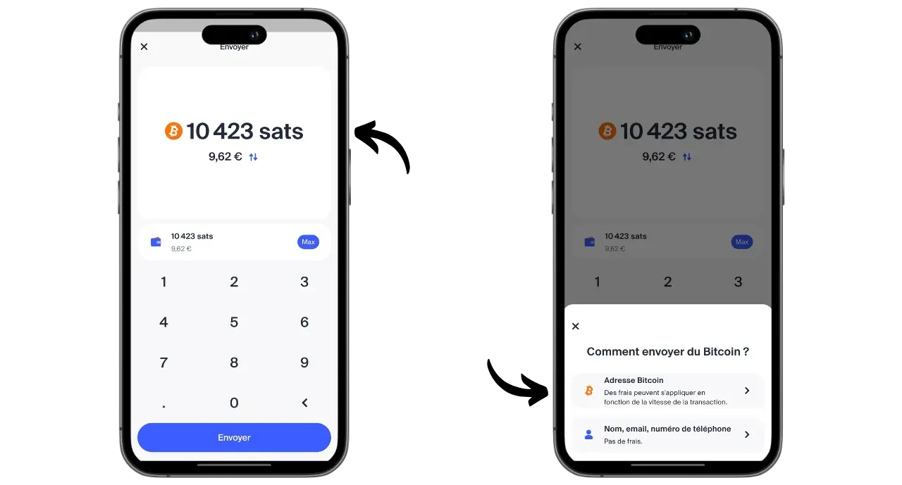

Inserite un indirizzo di destinatario vuoto dal vostro portafoglio. Fate attenzione, perché in caso di errore la transazione sarà irreversibile.

Determinare la priorità della transazione. Per un prelievo senza commissioni, scegliere la priorità "*Standard*". Controllare i dettagli del prelievo e confermare.

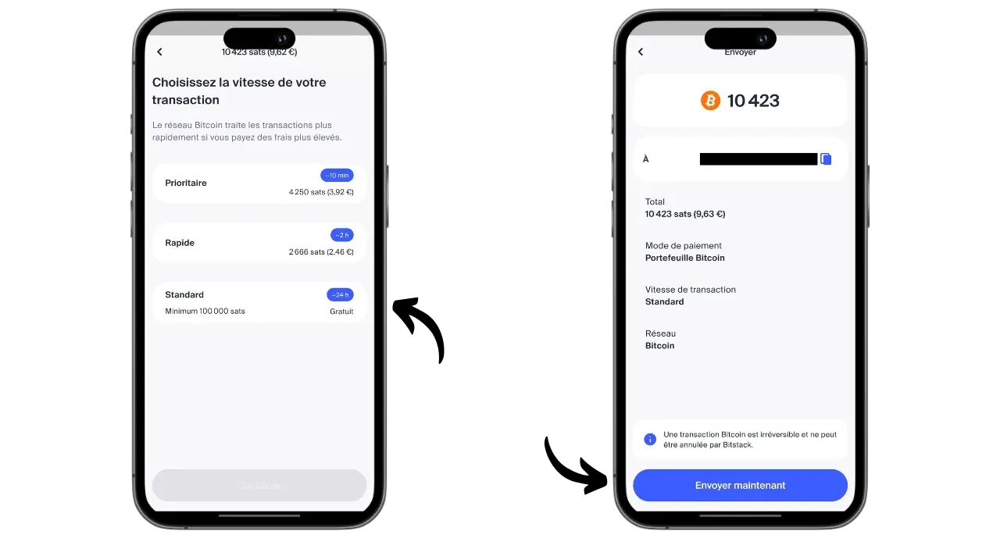

Se non avete familiarità con il funzionamento di un portafoglio di autocustodia, offriamo tutorial sulla maggior parte delle soluzioni disponibili [sulla Rete Plan ₿ nella sezione "*Portafoglio*"](https://planb.network/tutorials/wallet).

## Vendere bitcoin

Per vendere bitcoin con l'applicazione Bitstack, premere il pulsante "*Vendere*".

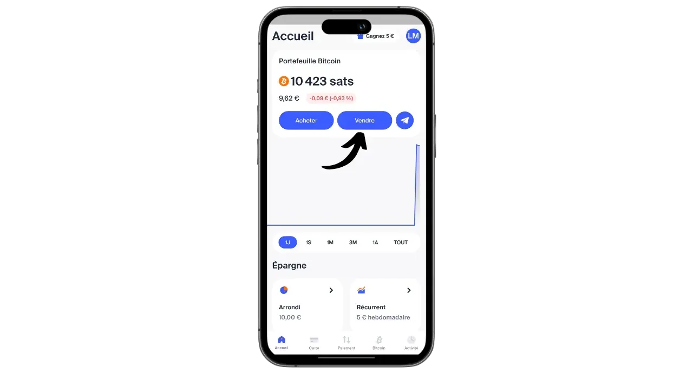

Inserite la quantità di bitcoin che desiderate vendere e cliccate su "*Continua*". Selezionare quindi il conto bancario su cui si desidera accreditare i fondi.

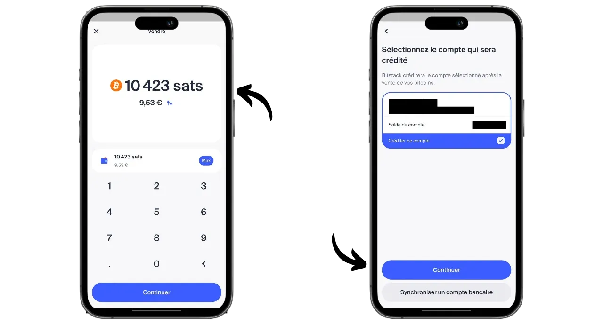

Controllare i dettagli dell'ordine di vendita e confermarlo.

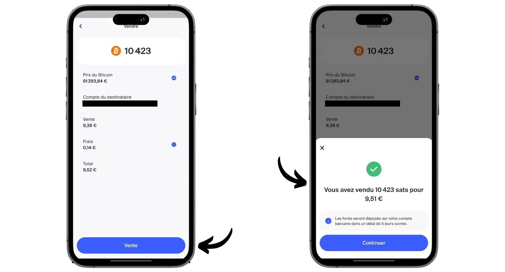

È possibile visualizzare i dettagli di tutte le transazioni nella sezione "*Attività*".

