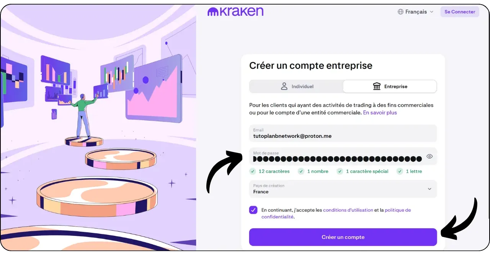
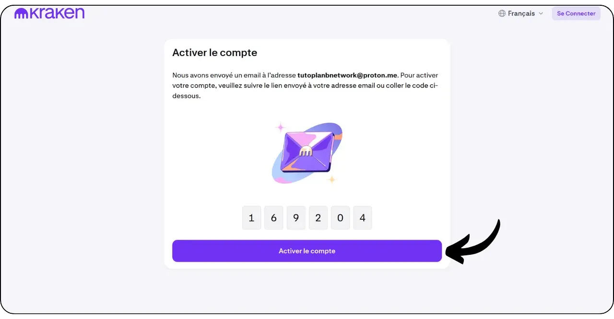
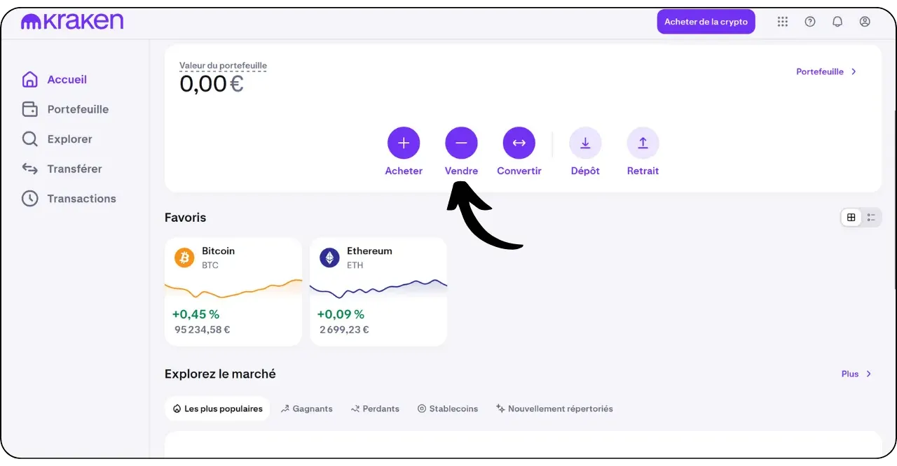
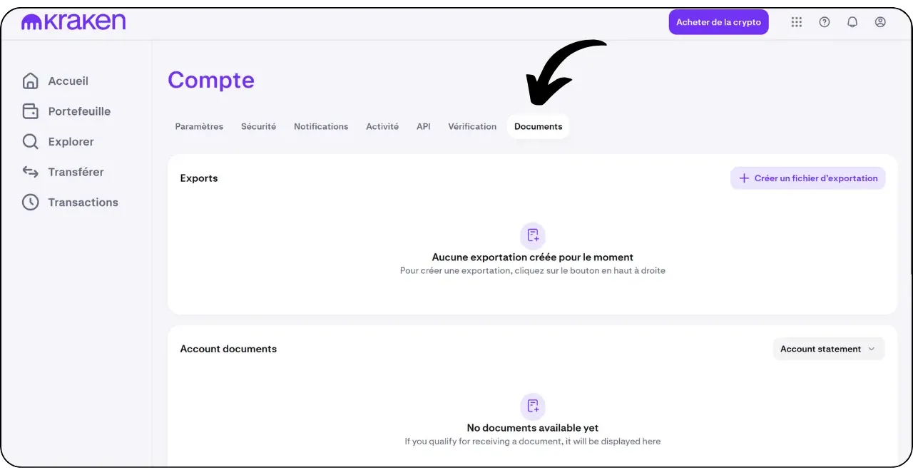

Kraken è una delle piattaforme di scambio di criptovalute più conosciute al mondo. Offre una moltitudine di servizi su misura per le aziende che desiderano integrare il bitcoin nella loro gestione finanziaria.

In questo tutorial, affronteremo il processo di creazione di un conto commerciale Kraken, l'acquisto e la vendita di bitcoin, la gestione delle transazioni a fini contabili, il deposito e il prelievo di euro e bitcoin. L'obiettivo è quello di fornirvi le conoscenze di base, sia che stiate pensando di integrare il bitcoin nel vostro flusso di cassa, sia che stiate accettando il bitcoin come mezzo di pagamento.

Se siete interessati all'integrazione del bitcoin nella vostra attività, vi consiglio di scoprire anche il nostro corso di formazione teorico completo sull'argomento:

https://planb.network/courses/a804c4b6-9ff5-4a29-a530-7d2f5d04bb7a
## 1 - Creare un conto aziendale Kraken

Il primo passo per utilizzare Kraken per la gestione delle finanze aziendali è, ovviamente, la creazione di un account. In questo caso, non creeremo un account per i singoli, ma un account aziendale, che non solo garantisce la conformità alle normative, ma offre anche funzioni appositamente studiate, come le esportazioni contabili.

Andate sul sito ufficiale [kraken.com] (https://www.kraken.com/) e cliccate sul pulsante "*Iscriviti*".

Nella pagina di registrazione, scegliere la scheda "*Business*" tra le opzioni dell'account per specificare la creazione di un account aziendale.

Inserite il vostro indirizzo e-mail professionale e selezionate una password sicura. Una volta inserite queste informazioni, cliccare su "*Crea un account*" per completare la registrazione.

Una volta fornite le informazioni, Kraken invierà un'e-mail di attivazione.

Aprite questa e-mail e cliccate su "*Activate Account*" o inserite il codice a 6 cifre fornito per attivare il vostro account.

## 2 - Verifica del conto aziendale

Dopo aver creato il vostro conto, dovrete completare il processo di verifica KYC (*Know Your Customer*) per i conti aziendali. Questa fase consente a Kraken di verificare la legittimità della vostra azienda e la conformità alle normative finanziarie.

Fare clic sul pulsante "*Continua*".

Inserite le informazioni richieste sulla vostra azienda.

Dovrete inoltre caricare diversi documenti relativi alla vostra azienda.

Una volta completate tutte le sezioni e inviati i documenti necessari, cliccare su "*Invio*" per inviare la richiesta di verifica. L'elaborazione della richiesta può richiedere fino a due settimane. Per accelerare il processo, assicuratevi di fornire tutti i documenti richiesti fin dall'inizio.

## 3 - Sicurezza del conto

Una volta verificato il vostro conto, accederete alla piattaforma dove vi verranno proposte due interfacce:

- Kraken**: Un'interfaccia semplificata che offre funzionalità essenziali.
- Kraken Pro**: Un'interfaccia avanzata con funzioni aggiuntive, soprattutto per il trading.

Se il vostro obiettivo è esclusivamente quello di acquistare e vendere bitcoin, optate per l'interfaccia semplificata. Avrete sempre la possibilità di passare all'interfaccia avanzata in un secondo momento, se necessario.

Innanzitutto, è molto importante proteggere il proprio account per evitare accessi non autorizzati. Oltre alla password forte stabilita al momento della registrazione, implementeremo la doppia autenticazione. Ciò significa che ogni volta che si accede al proprio account Kraken, sarà necessaria non solo la password, ma anche un secondo fattore di autenticazione, che può essere una chiave fisica o un codice generato da un'applicazione di autenticazione.

Andate sull'icona del vostro account e cliccate su "*Sicurezza*".

Nelle opzioni 2FA, è possibile scegliere di utilizzare una chiave di sicurezza fisica come secondo fattore.

Per ulteriori informazioni su come utilizzare questo tipo di dispositivo, consultare il nostro tutorial dedicato:

https://planb.network/tutorials/others/general/security-key-61438267-74db-4f1a-87e4-97c8e673533e
L'altra opzione consiste nell'utilizzare un'applicazione di autenticazione come Google Authenticator o Authy. Queste applicazioni generano un codice dinamico di 6 cifre da inserire a ogni accesso.

Per attivare questo metodo, scansionate il codice QR con l'applicazione di vostra scelta sul vostro smartphone, quindi inserite il codice a 6 cifre generato.

Per ulteriori informazioni sulle applicazioni di autenticazione, è possibile consultare questo tutorial:

https://planb.network/tutorials/others/general/authy-a76ab26b-71b0-473c-aa7c-c49153705eb7
Al di sotto, si ha anche accesso alle impostazioni avanzate, compresa la possibilità di impostare diverse 2FA. Kraken offre una delega di sicurezza avanzata tramite 2FA. Questa funzione consente di creare diversi livelli 2FA per varie azioni, come il login, la convalida degli ordini e il prelievo di fondi. In questo modo è possibile, ad esempio, dare a un contabile l'accesso a determinate funzionalità senza consentirgli di prelevare fondi. Ecco le opzioni:

- La **master key** funge da meccanismo di recupero, da utilizzare se non è possibile accedere al metodo 2FA abituale;
- Il **2FA for financing** richiede un'ulteriore autenticazione per tutte le transazioni di prelievo o per la creazione di un indirizzo di deposito, rafforzando così la sicurezza dei vostri fondi;
- Il **2FA per il trading** impone un 2FA per ogni transazione effettuata sul conto.

Queste opzioni avanzate consentono di definire diversi livelli di autorizzazione all'interno dell'organizzazione.

## 4 - Deposito e prelievo di valuta fiat

Una volta che il vostro conto è stato verificato e protetto, potete depositare fondi in euro (o nella vostra valuta locale). Potete anche effettuare prelievi in base alle vostre esigenze aziendali.

Per depositare euro, accedere alla sezione "*Transfer*".

Selezionate "*Euro*" nella casella "*Asset*" e confermate per ottenere i dati necessari per effettuare il pagamento dal vostro conto bancario aziendale. Potete anche scegliere di pagare con carta di credito.

Per prelevare euro dal vostro conto Kraken, seguite la stessa procedura ma utilizzate la scheda "*Prelievo*".

## 5 - Deposito e prelievo di bitcoin

Per depositare bitcoin sul vostro conto Kraken, tornate alla sezione "*Transfer*". Nella casella "*Asset*", selezionate "*BTC*" e confermate per ricevere l'indirizzo a cui inviare i bitcoin dal vostro portafoglio di autodeposito.

Per prelevare bitcoin dal proprio conto Kraken a un portafoglio di autodeposito, fare clic sulla scheda "*Prelievo*".

Inserite l'indirizzo del vostro portafoglio, quindi confermate l'operazione utilizzando il vostro 2FA.

## 6 - Comprare e vendere bitcoin

Kraken offre diverse interfacce di trading, ciascuna progettata per soddisfare esigenze specifiche. Per una gestione professionale e avanzata, si consiglia Kraken Pro. Per le transazioni più semplici, l'interfaccia predefinita di Kraken è sufficiente. Per cambiare interfaccia, fare clic sui piccoli punti in alto a destra dello schermo:

Nell'interfaccia predefinita, per acquistare bitcoin è sufficiente fare clic su "*Acquista*" nella pagina iniziale.

Inserire l'importo che si desidera acquistare e confermare l'operazione. Se per questa azione è configurato un 2FA, inserire il codice a 6 cifre fornito dall'applicazione di autenticazione.

Per vendere bitcoin, cliccare su "*Vendere*".

Inserire l'importo da vendere e convalidare la transazione.

Potete anche scambiare i vostri bitcoin con altre criptovalute, come le stablecoin, per ridurre la vostra esposizione alle fluttuazioni dei bitcoin. Per farlo, cliccate su "*Convertire*".

Selezionare l'importo, scegliere la criptovaluta che si desidera ottenere e confermare la transazione.

Per queste transazioni è possibile scegliere tra diversi tipi di ordine: *Mercato*, *Limite* o *Stop-Loss*:

- Mercato* : Consente l'acquisto immediato al prezzo di mercato corrente;
- Limite*: Consente di specificare un prezzo di acquisto e l'ordine verrà eseguito solo se il prezzo di mercato raggiunge tale importo;
- Stop-Loss* : Vende automaticamente quando il prezzo raggiunge una certa soglia.

## 7 - Gestione delle transazioni e contabilità

Come azienda, probabilmente avrete bisogno di esportare i dettagli delle vostre transazioni su Kraken a fini contabili. Kraken offre strumenti per facilitare l'esportazione della cronologia delle transazioni e fornisce una visione dettagliata del vostro portafoglio.

Per una visione semplificata della cronologia delle transazioni, accedere al menu "*Transazioni*".

Per esportazioni più dettagliate a fini contabili, accedere alle impostazioni della scheda "*Documenti*".

Fare clic su "*Crea file di esportazione*" e selezionare il tipo di esportazione desiderato. In questo esempio, esporterò la cronologia delle transazioni.

Potete quindi specificare tutti i dettagli necessari per la vostra situazione:

- Informazioni da includere nell'esportazione ;
- Date da considerare ;
- Coppie di scambio da includere;
- Formato di esportazione del file (PDF o CSV).

## 8 - Casi d'uso per l'azienda

A seconda degli obiettivi e della struttura dell'azienda, l'uso di Kraken può variare.

### Acquistare bitcoin in cambio di contanti

**Obiettivo: diversificare il flusso di cassa dell'azienda investendo in bitcoin.

**Passi da seguire:**

- Depositare euro su Kraken dal conto bancario dell'azienda;
- Utilizzate questi euro per acquistare bitcoin;
- Conservate i bitcoin sulla piattaforma o ritirateli per metterli al sicuro in autocustodia;
- Esportare le cronologie delle transazioni come richiesto.

### Accettare bitcoin come mezzo di pagamento

**Obiettivo:** Offrire alla vostra azienda la possibilità di accettare bitcoin come mezzo di pagamento per i vostri prodotti o servizi.

**Passi da seguire:**

- Integrare un sistema di pagamento in bitcoin. Per le piccole imprese può essere sufficiente un semplice software di portafoglio, oppure si può optare per soluzioni specializzate come Swiss Bitcoin Pay o BTCPay Server per integrare il bitcoin come opzione di pagamento sul proprio sito web o nel punto vendita;
- Trasferire i pagamenti ricevuti in bitcoin sul proprio conto Kraken;
- A seconda della vostra strategia finanziaria, potete vendere i bitcoin ricevuti in euro, conservarli per un potenziale apprezzamento futuro o optare per una combinazione di entrambi;
- Conservare i bitcoin sulla piattaforma o ritirarli per l'autodeposito. È anche possibile prelevare euro sul proprio conto bancario;
- Esportare le cronologie delle transazioni come richiesto.

Per uno sguardo più approfondito su questo argomento, vi consiglio questo corso di formazione completo sull'integrazione di bitcoin nelle aziende, che tratta in dettaglio l'aggiunta al flusso di cassa, l'accettazione di pagamenti in bitcoin e la contabilità:

https://planb.network/courses/a804c4b6-9ff5-4a29-a530-7d2f5d04bb7a