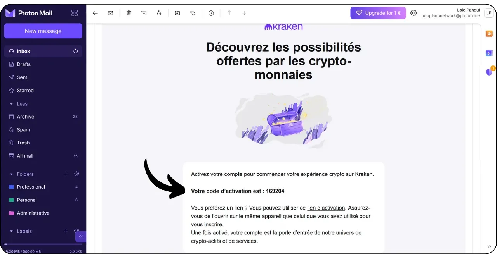
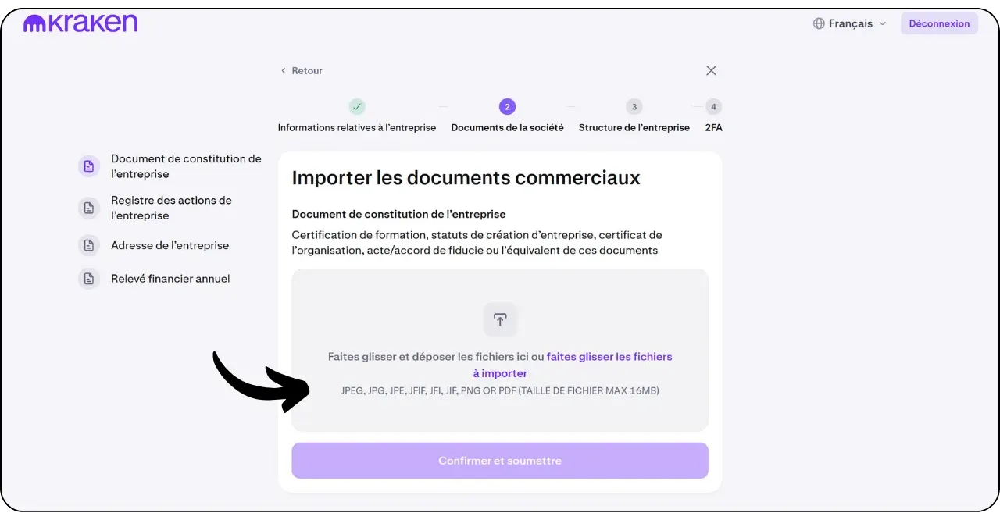

Kraken is one of the world's best-known cryptocurrency exchange platforms. It offers a multitude of services tailored to companies wishing to integrate bitcoin into their financial management.

In this tutorial, we'll cover the process of creating a Kraken business account, buying and selling bitcoins, managing transactions for accounting purposes, and depositing and withdrawing euros and bitcoins. The aim is to provide you with the basic knowledge, whether you're considering integrating bitcoin into your cash flow or accepting bitcoin as a means of payment.

If you're interested in the subject of integrating bitcoin into your business, I'd also recommend discovering our complete theoretical training course on the subject:

https://planb.network/courses/a804c4b6-9ff5-4a29-a530-7d2f5d04bb7a
## 1 - Creating a Kraken corporate account

The first step in using Kraken to manage your company's finances is, of course, to create an account. Here, we're not going to create an account for individuals, but a corporate account, which not only ensures regulatory compliance, but also offers specially tailored features such as accounting exports.

Go to the official website [kraken.com](https://www.kraken.com/) and click on the "*Sign Up*" button.

On the registration page, choose the "*Business*" tab from the account options to specify the creation of a business account.

Enter your professional e-mail address and select a secure password. Once this information has been entered, click on "*Create an account*" to complete registration.

Once you have provided your information, Kraken will send you an activation e-mail.

Open this e-mail and click on "*Activate Account*" or enter the 6-digit code provided to activate your account.

## 2 - Company account verification

After creating your account, you'll need to complete the KYC (*Know Your Customer*) verification process for corporate accounts. This step allows Kraken to verify your company's legitimacy and compliance with financial regulations.

Click on the "*Continue*" button.

Please enter the required information about your company.

You'll also need to upload several documents relating to your company.

Once you have completed all the sections and sent the necessary documents, click on "*Submit*" to send your verification request. Your request may take up to two weeks to process. To speed up the process, make sure you provide all the required documents at the outset.

## 3 - Account security

Once your account has been verified, you will access the platform where you will be offered two interfaces:

- Kraken**: A simplified interface offering essential functionality.
- Kraken Pro**: An advanced interface with additional features, especially for trading.

If your aim is solely to buy and sell bitcoin, opt for the simplified interface. You'll always have the option of switching to the advanced interface later if necessary.

First and foremost, it's very important to secure your account to prevent unauthorized access. In addition to the strong password established at registration, we will be implementing double authentication. This means that each time you log on to your Kraken account, you'll need not only your password, but also a second authentication factor, which can be a physical key or a code generated by an authentication application.

Go to your account icon and click on "*Security*".

In the 2FA options, you can choose to use a physical security key as a second factor.

For more information on how to use this type of device, see our dedicated tutorial :

https://planb.network/tutorials/others/general/security-key-61438267-74db-4f1a-87e4-97c8e673533e
The other option is to use an authentication application such as Google Authenticator or Authy. These applications generate a dynamic 6-digit code that you'll need to enter each time you log on.

To activate this method, scan the QR code with the application of your choice on your smartphone, then enter the 6-digit code generated.

For more information on authentication applications, you can also consult this tutorial :

https://planb.network/tutorials/others/general/authy-a76ab26b-71b0-473c-aa7c-c49153705eb7
Underneath, you also have access to advanced settings, including the ability to set several different 2FAs. Kraken offers advanced security delegation via 2FA. This feature allows you to create different 2FA levels for various actions, such as login, order validation and fund withdrawal. This makes it possible, for example, to give an accountant access to certain functionalities without allowing him or her to withdraw funds. Here are the options:

- The **master key** acts as a recovery mechanism, to be used if you cannot access your usual 2FA method to log in;
- The **2FA for financing** requires additional authentication for all withdrawal transactions or when creating a deposit address, thus strengthening the security of your funds;
- The **2FA for trading** imposes a 2FA for each transaction carried out on the account.

These advanced options allow you to define different levels of authorization within your organization.

## 4 - Deposit and withdrawal of fiat currency

Once your account has been verified and secured, you can deposit funds in euros (or in your local currency). You can also make withdrawals according to your business needs.

To deposit euros, go to the "*Transfer*" section.

Select "*Euro*" in the "*Asset*" box and confirm to obtain the details needed to make a payment from your business bank account. You can also choose to pay by credit card.

To withdraw euros from your Kraken account, follow the same process but use the "*Withdraw*" tab.

## 5 - Depositing and withdrawing bitcoins

To deposit bitcoins into your Kraken account, go back to the "*Transfer*" section. In the "*Asset*" box, select "*BTC*" then confirm to receive the address to which you must send the bitcoins from your self-custody wallet.

To withdraw bitcoins from your Kraken account to a self-custody wallet, click on the "*Withdraw*" tab.

Enter your wallet address, then confirm the operation using your 2FA.

## 6 - Buying and selling bitcoins

Kraken offers different trading interfaces, each designed to meet specific needs. For professional, advanced management, Kraken Pro is recommended. For simpler transactions, Kraken's default interface will suffice. To change interface, click on the small dots at the top right of the screen:

On the default interface, to buy bitcoin, start by clicking on "*Buy*" on the home page.

Enter the amount you wish to purchase and confirm the operation. If a 2FA is configured for this action, enter the 6-digit code provided by your authentication application.

To sell bitcoin, click on "*Sell*".

Enter the amount to be sold and validate the transaction.

You can also exchange your bitcoins for other cryptocurrencies, such as stablecoins, to reduce your exposure to bitcoin fluctuations. To do so, click on "*Convert*".

Select the amount, choose the cryptocurrency you wish to obtain, then confirm the transaction.

For these transactions, you can choose between different order types: *Market*, *Limit*, or *Stop-Loss* :

- Market* : Allows immediate purchase at current market price;
- Limit*: Allows you to specify a purchase price, and the order will only be executed if the market price reaches this amount;
- Stop-Loss* : Automatically sells when the price reaches a certain threshold.

## 7 - Transaction management and accounting

As a business, you'll probably need to export details of your Kraken transactions for accounting purposes. Kraken offers tools to facilitate the export of transaction histories and provides a detailed view of your portfolio.

For a simplified view of your transaction history, go to the "*Transactions*" menu.

For more detailed exports for accounting purposes, go to the settings under the "*Documents*" tab.

Click on "*Create export file*" and select the type of export you want. For this example, I'm going to export the transaction history.

You can then specify all the details necessary for your situation:

- Information to be included in the export ;
- Dates to consider ;
- Exchange pairs to include;
- File export format (PDF or CSV).

## 8 - Use cases for the company

Depending on your company's objectives and structure, the use of Kraken may vary.

### Buying bitcoins for cash

**Objective:** Diversify the company's cash flow by investing in bitcoin.

**Steps to follow:**

- Deposit euros on Kraken from the company's bank account;
- Use these euros to buy bitcoin;
- Keep bitcoins on the platform or withdraw them to secure them in self-custody ;
- Export transaction histories as required.

### Accepting bitcoin as a means of payment

**Objective:** Offer your company the possibility of accepting bitcoin as a means of payment for your products or services.

**Steps to follow:**

- Integrate a bitcoin payment system. For small businesses, simple wallet software may suffice, or you can opt for specialized solutions like Swiss Bitcoin Pay or BTCPay Server to integrate bitcoin as a payment option on your website or at the point of sale;
- Transfer payments received in bitcoins to your Kraken account;
- Depending on your financial strategy, sell the bitcoins received for euros, keep them for potential future appreciation, or opt for a combination of both;
- Keep bitcoins on the platform or withdraw them for self-custody. You can also withdraw euros to your bank account;
- Export transaction histories as required.

For a more in-depth look at this topic, I recommend this comprehensive training course on integrating bitcoin into businesses, which covers in detail adding to cash flow, accepting bitcoin payments, and accounting :

https://planb.network/courses/a804c4b6-9ff5-4a29-a530-7d2f5d04bb7a