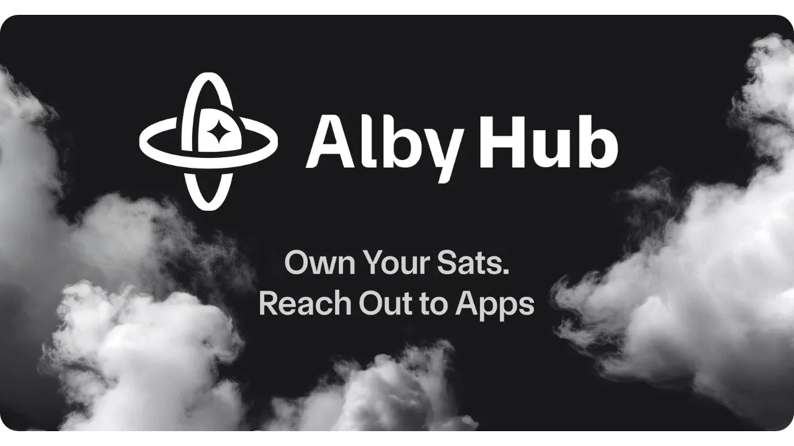
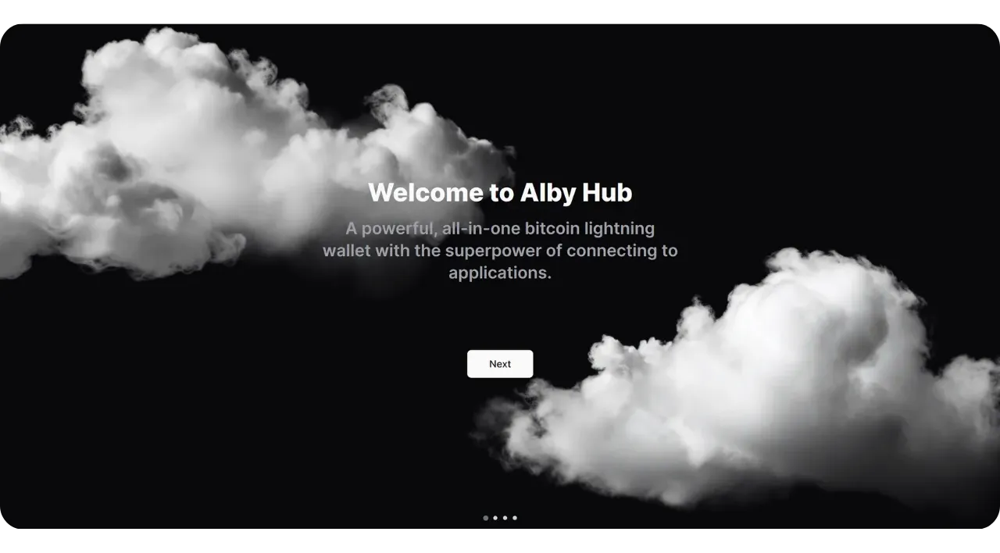
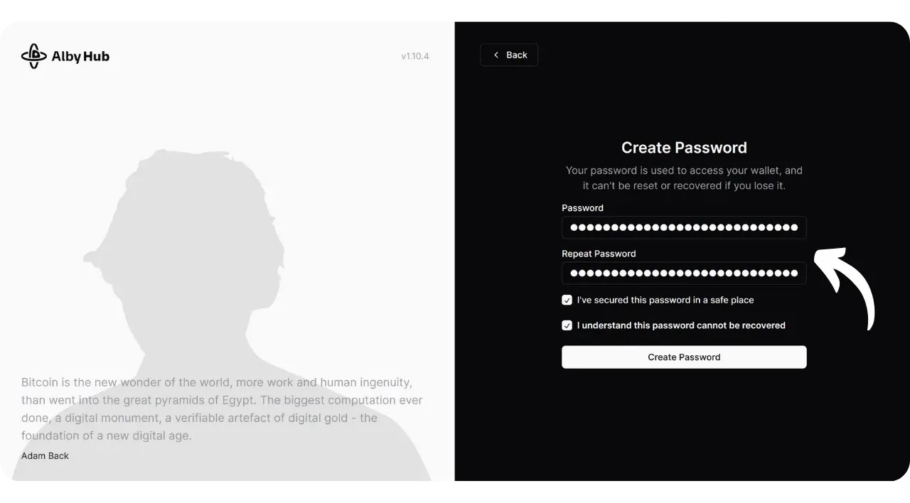
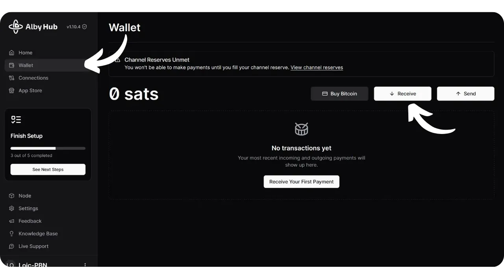
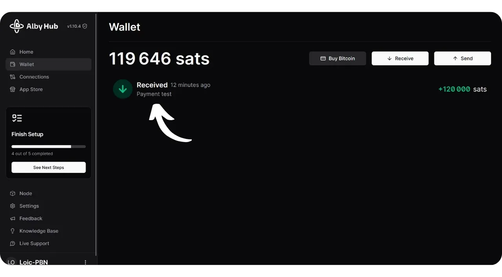
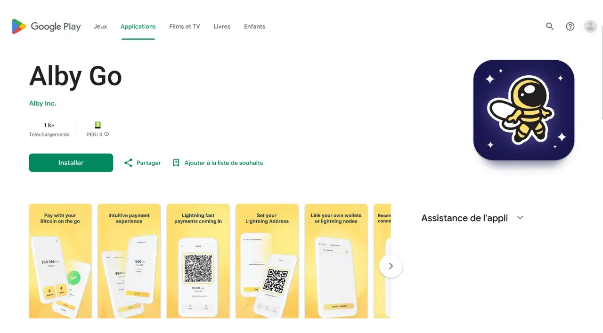

Alby Hub es el último software de Alby, la empresa detrás de la popular extensión web Lightning. Alby Hub es una interfaz fácil de usar para gestionar nodos Lightning.

En este tutorial, veremos diferentes formas de utilizar Alby Hub para gestionar tu propio nodo Lightning, y cómo conectarlo a Alby Go, la aplicación móvil de Alby. Esto te permitirá gastar tus sats en movimiento mientras eres autónomo en la gestión de tu nodo.

## ¿Qué es Alby Hub?

En 2024, Alby marcó un cambio estratégico. Durante años, han ofrecido una variedad de herramientas asociadas con Bitcoin y la red Lightning, incluida la icónica extensión Alby, que permite operar un monedero Lightning, de custodia o no. Sin embargo, en 2025, planean interrumpir su servicio de monedero de custodia compartida y centrarse exclusivamente en soluciones de autocustodia. Alby Hub está llamada a ser la nueva herramienta estrella del ecosistema Alby. Este software permite a los usuarios gestionar fácilmente su propio nodo Lightning, conservando la propiedad de sus claves (autocustodia).

Alby Hub es una herramienta muy adaptable. Puede satisfacer las necesidades tanto de principiantes como de usuarios avanzados. Los novatos lo utilizarán para manejar fácilmente un nodo Lightning real por su cuenta, sin tener que lidiar con la complejidad subyacente. Para los usuarios más experimentados, Alby Hub se puede utilizar como una interfaz completa para la gestión avanzada de un nodo Lightning existente.

En función de sus necesidades, Alby Hub está disponible en 4 configuraciones:

- Alby Hub Nube :**

Ideal para principiantes, esta primera opción es la opción en la nube de Alby. Le permite desplegar un nodo Lightning directamente en un servidor gestionado por Alby, accesible a través de su interfaz Alby Hub. Aunque Alby gestiona el servidor, usted conserva la soberanía sobre sus fondos, ya que sus claves se cifran mediante una contraseña que sólo usted conoce. Sin embargo, tus claves deben permanecer descifradas en la RAM para que el nodo funcione, lo que teóricamente las expone a riesgos si alguien accede físicamente al servidor. Es un compromiso interesante para principiantes, pero es importante ser consciente de los riesgos.

La mayor ventaja de esta opción es que dispones de un nodo Lightning en funcionamiento 24/7, sin tener que gestionar tú mismo el alojamiento. Además, las copias de seguridad de tu nodo Lightning están simplificadas y automatizadas, en comparación con las opciones autoalojadas, en las que tienes que gestionar tú mismo las copias de seguridad de los canales.

Alby ofrece este servicio por 21.000 sats al mes (tarifa de diciembre de 2024, sujeta a cambios, [consulte sus precios](https://albyhub.com/#pricing)). La tarifa se deduce automáticamente de su nodo a través de una factura Lightning emitida por Alby. Esto se hace a través de una conexión NWC que configura su nodo para pagar automáticamente las facturas de Alby relacionadas con su suscripción.

- Alby Hub con un nodo existente :**

Si ya dispone de un nodo alojado, por ejemplo en Umbrel o Start9, Alby Hub puede utilizarse como interfaz de gestión avanzada, del mismo modo que ThunderHub o RTL.

- Alby Hub local :**

También es posible instalar Alby Hub y su nodo directamente en su PC, aunque esta opción es menos práctica, ya que su PC debe permanecer activo en todo momento para acceder remotamente al nodo Lightning. Sin embargo, esta alternativa puede ser adecuada para sus necesidades específicas.

- Alby Hub en un servidor personal :**

Para usuarios avanzados, Alby Hub puede ser desplegado en un servidor personal con un simple comando. Esta opción no está cubierta en este tutorial, pero puedes encontrar instrucciones dedicadas [en el GitHub de Alby](https://github.com/getAlby/hub?tab=readme-ov-file#docker).

Este tutorial se centra principalmente en la interfaz, que será la misma independientemente de la opción elegida. También veremos cómo desplegar Alby Hub con la opción de pago en la nube, y luego con la opción node-in-box (Umbrel o Start9).

Para la instalación local en su PC, [descargue e instale el software según su sistema operativo](https://github.com/getAlby/hub/releases), luego siga las mismas instrucciones en la interfaz.

## Crear una cuenta Alby

El primer paso es crear una cuenta Alby. Aunque no es imprescindible para utilizar Alby Hub, te permite aprovechar al máximo las opciones disponibles, incluida la posibilidad de obtener una dirección Lightning.

Visita [el sitio web oficial de Alby](https://getalby.com/) y haz clic en el botón "*Crear cuenta*".

Introduzca un apodo y una dirección de correo electrónico y haga clic en "*Inscribirse*". Esta dirección de correo electrónico se utilizará para iniciar sesión en su cuenta más adelante.

Introduzca el código de verificación que ha recibido por correo electrónico.

Una vez conectado a su cuenta en línea, haga clic en el botón "*Continuar*".

Vuelva a hacer clic en "*Continuar*".

## La opción de alojamiento en la nube

Entonces tendrás que elegir entre la opción self-hosted, en la que alojas un nodo Lightning en tu propio hardware, o la opción de pago utilizando la nube de Alby. Empezaré explicando cómo proceder con la opción Cloud (ten en cuenta que se trata de una opción de pago, consulta los detalles en la sección anterior).

Haga clic en "*Actualizar*".

Confirme haciendo clic en "*Suscribirse ahora*".

Haz clic en "*Lanzar Alby Hub*".

Espere unos instantes mientras se crea su nodo.

Y eso es todo, tu Alby Hub está ahora configurado. En la próxima sección, te mostraré cómo instalar Alby Hub en un nodo existente. Si no lo necesitas, puedes saltar a la siguiente sección para configurar tu nodo.

## La opción del autoalojamiento

Si prefiere utilizar Alby Hub como interfaz para su nodo Lightning existente, tiene varias opciones: instalarlo en un servidor, localmente en su ordenador o a través de un node-in-box (Umbrel o Start9). El uso de Alby Hub en estas configuraciones es gratuito. Vamos a centrarnos en la opción node-in-box, ya que considero que la opción de servidor, sin acceso físico, presenta riesgos similares a la versión en la nube, y la instalación local en un PC suele ser inadecuada.

Para configurar esto en Umbrel (los pasos para Start9 son idénticos), primero debe tener un nodo LND ya configurado.

Accede a tu interfaz Umbrel y ve a la tienda de aplicaciones.

Busca la aplicación "*Alby Hub*".

Instálalo en tu nodo.

Tu interfaz Alby Hub ya está lista. Puedes seguir el resto del tutorial como si estuvieras usando la interfaz en la nube, pero sin las opciones de la versión de pago. Además, a diferencia de la versión en la nube, tus claves se almacenan localmente en tu nodo, no en los servidores de Alby.

## Lanzamiento de Alby Hub

Haga clic en el botón "*Iniciar*".

Alby Hub te pedirá que elijas una contraseña. Esta contraseña es muy importante, ya que se utilizará para cifrar tu monedero. En la versión de pago en la nube, tus claves se almacenan en el servidor de Alby, cifradas con esta contraseña que solo tú conoces, luego se descifran y se almacenan solo en la memoria RAM para firmar transacciones cuando sea necesario.

Por lo tanto, es esencial elegir una contraseña segura. Cualquiera con esta contraseña podría potencialmente acceder a tu nodo. Asegúrate también de hacer una o más copias de seguridad físicas de esta contraseña en un trozo de papel, o mejor aún, en un trozo de metal para mayor seguridad. **Si pierdes esta contraseña, será imposible recuperar el acceso a tus bitcoins**, ya que Alby no tiene forma de restablecerla. La pérdida de esta contraseña significa la pérdida de tus bitcoins.

Una vez que haya elegido y guardado cuidadosamente su contraseña, haga clic en "*Crear contraseña*".

Ahora tienes acceso a tu nodo Lightning.

Lo primero que debes hacer es guardar tu frase de recuperación, de la que se derivan tus claves. Esta frase te permite recuperar el acceso a tu monedero onchain y, con el último estado de tus canales, a tus sats en Lightning. Para ello, haz clic en "*Configuración*".

A continuación, ve a la pestaña "*Backup*". Introduce tu contraseña para acceder a ella.

Así tendrá acceso a su frase de recuperación de 12 palabras. Haz una o varias copias de seguridad físicas de esta frase en papel o metal y guárdalas en un lugar seguro.

Cuando hayas guardado la frase, marca la casilla para confirmar que la has guardado y haz clic en "*Continuar*".

## ¿Cómo puedo recuperar el acceso a mis bitcoins?

Antes de enviar fondos a su nodo, es importante entender cómo recuperarlos en caso de problema, así como qué información se necesita para esta recuperación. El proceso varía en función de la naturaleza de los fondos a recuperar y del modo de alojamiento de tu nodo.

Para los usuarios de la nube de pago, la recuperación completa de sus bitcoins requiere tres elementos esenciales:

- Tu frase de recuperación;
- Su contraseña (la utilizada para su nodo) ;
- Acceso a su cuenta Alby, para recuperar el último estado de sus canales Lightning.

La ausencia de cualquiera de estos 3 datos imposibilitaría la recuperación íntegra de tus bitcoins.

Para los que alojan su propio nodo, el proceso de recuperación es idéntico al de cualquier nodo Lightning. Necesitarás :

- Tu frase de recuperación;
- El estado más reciente de tus canales Lightning. Para asegurar esta información, Umbrel ofrece [una opción](https://github.com/getumbrel/umbrel/blob/2b266036f62a1594aa60a8a3be30cfb8656e755f/scripts/backup/README.md) para cifrarla y guardarla de forma dinámica y anónima a través de Tor.

## Compre su primer canal Lightning

Ahora puede seguir las instrucciones proporcionadas por Alby Hub. Haz clic en el botón para abrir tu primer canal de entrada de dinero.

Selecciona "*Canal abierto*". Si no tienes intención de convertirte en un nodo de enrutamiento y no lo necesitas específicamente, te recomiendo que optes por los canales privados.

Alby Hub generará una factura para que la pagues. Este pago cubre las tasas de transacción necesarias para abrir tu canal, así como las tasas de servicio del LSP (*Lightning Service Provider*) que abrirá un canal a tu nodo, permitiéndote recibir pagos inmediatamente.

Una vez pagada la factura y confirmada la transacción, se establece su primer canal Lightning.

En la pestaña "*Nodo*", puedes ver que ahora tienes efectivo entrante, lo que te permite recibir pagos a través de Lightning.

Para recibir el pago, haga clic en la pestaña "*Billetera*" y luego en "*Recibir*".

Introduzca un importe y añada una descripción si es necesario, después haga clic en "*Crear factura*".

He recibido mi primer pago de 120.000 sats.

Si vuelves a la pestaña "*Monedero*", podrás consultar el saldo de tu monedero. Tenga en cuenta que Alby Hub reserva automáticamente 354 sats cuando realiza su primer pago. Por cada canal Lightning que abra a partir de entonces, Alby Hub apartará automáticamente una reserva equivalente al 1% de la capacidad del canal. Esta reserva es una medida de seguridad que permite a tu nodo recuperar los fondos del canal en caso de intento de fraude por parte de tu par. Por eso, aunque he enviado 120.000 sats, en mi saldo sólo aparecen 119.646 sats.

## Depósito de bitcoins onchain

Si quieres disponer de efectivo saliente para realizar pagos, también puedes abrir un canal tú mismo. Para ello, necesitarás bitcoins onchain en tu monedero.

En la pestaña "*Nodo*", haga clic en "*Depósito*".

Envía bitcoins a la dirección mostrada. Esta dirección se deriva de su frase de recuperación previamente guardada.

He enviado 72.000 sats. Ahora son visibles en "*Saldo de Ahorros*", que incluye todos los fondos que poseo onchain, y no en Lightning.

## Abrir un canal Lightning

Ahora que dispones de fondos onchain, puedes abrir un nuevo canal Lightning. Es aconsejable abrir varios canales, con cantidades suficientes para asegurarte de que siempre puedes realizar pagos sin restricciones. La mayoría de los LSPs (*Lightning Service Providers*) requieren un mínimo de 150.000 sats para abrir un canal contigo.

En la pestaña "*Nodo*", haz clic en "*Abrir canal*".

Selecciona el tamaño de tu canal. Te recomiendo que no abras canales demasiado pequeños, teniendo en cuenta que se trata de un nodo Lightning y que la máquina que aloja tus claves no ofrece el mismo nivel de seguridad que un monedero hardware. Así que ten cuidado con las cantidades que decides bloquear.

En el menú "*Opciones avanzadas*", puede elegir con qué LSP abrir su canal o introducir manualmente otro nodo Lightning.

A continuación, haz clic en "*Abrir canal*".

Espere a que se confirme su canal en la cadena.

Tu nuevo canal aparecerá ahora en la pestaña "*Nodo*".

## Conectar una aplicación de gastos

Ahora que tienes un nodo Lightning en funcionamiento, puedes utilizarlo para recibir y gastar sats a diario. Aunque la interfaz web de Alby Hub es práctica para gestionar tu nodo, no es ideal para realizar transacciones rápidas sobre la marcha. Para ello, vamos a utilizar una aplicación de monedero Lightning instalada en nuestro smartphone.

En este tutorial, te recomiendo que optes por Alby Go, que es muy fácil de usar, pero también puedes utilizar otras aplicaciones compatibles como Zeus.

Para instalar Alby Go, ve a la tienda de aplicaciones de tu dispositivo:

- [Para Android](https://play.google.com/store/apps/details?id=com.getalby.mobile);
- [Para Apple](https://apps.apple.com/us/app/alby-go/id6471335774).

Los usuarios de Android también pueden instalar la aplicación a través del archivo `.apk` [disponible en el GitHub de Alby](https://github.com/getAlby/go/releases).

Cuando se inicie la aplicación, haga clic en "*Conectar Cartera*".

En tu Alby Hub, en la pestaña "*Conexiones*", haz clic en "*Añadir conexión*".

Nombra esta conexión para identificarla fácilmente en tu Hub, y selecciona los permisos que deseas conceder a la aplicación. En mi caso, elijo "*Acceso total*" para tener acceso completo a los fondos de mi nodo Lightning desde mi smartphone, pero también puedes limitar el acceso mediante un presupuesto máximo, seleccionar las funciones permitidas o establecer una fecha de caducidad para estos permisos. Una vez configurado, haz clic en "*Siguiente*".

Alby Hub generará entonces un secreto para establecer la conexión.

Vuelve a la aplicación Alby Go, escanea el código QR o pega el secreto.

Haga clic en "Finalizar*".

Ahora tiene acceso remoto a su nodo Lightning desde su smartphone, lo que facilita el gasto y la recepción de saturaciones en movimiento todos los días.

Si es necesario, puede gestionar los permisos para esta conexión directamente en Alby Hub haciendo clic sobre ella.

Para recibir saturaciones, basta con hacer clic en "*Recibir*".

Modifique el importe y la descripción de la factura haciendo clic en "*Factura*".

Cargar la factura para recibir la saturación.

Para enviar saturaciones, haz clic en "*Enviar*".

Escanee la factura que desea pagar.

A continuación, haga clic en "*Pagar*".

Su transacción está confirmada.

Haciendo clic en la flecha pequeña, puede acceder a su historial de transacciones.

Estas transacciones también son visibles en su Alby Hub.

## Personaliza tu dirección Lightning

Alby le ofrece la opción de una dirección Lightning. Esto te permite recibir pagos en tu nodo sin tener que generar manualmente una factura cada vez. Por defecto, Alby te asigna una dirección Lightning, pero puedes personalizarla. Inicie sesión en su cuenta en línea de Alby, haga clic en su nombre en la esquina superior derecha y, a continuación, seleccione "*Configuración*".

Navegue hasta el menú "*Dirección del rayo*".

Modifique su dirección y confirme haciendo clic en "*Actualizar su dirección de rayos*".

Ten en cuenta que una vez cambiada tu dirección, ya no te pertenece. Así que asegúrate de no volver a enviar saturaciones a esa dirección.

Y eso es todo, ahora ya sabes cómo usar Lightning con tu propio nodo usando la herramienta Alby Hub. Si te ha resultado útil este tutorial, te agradecería mucho que pusieras un pulgar verde abajo. No dudes en compartir este artículo en tus redes sociales. ¡Muchas gracias!

Para comprender en detalle todos los mecanismos de Lightning que hemos manipulado en este tutorial, le aconsejo encarecidamente que descubra nuestra formación gratuita sobre el tema :

https://planb.network/courses/34bd43ef-6683-4a5c-b239-7cb1e40a4aeb