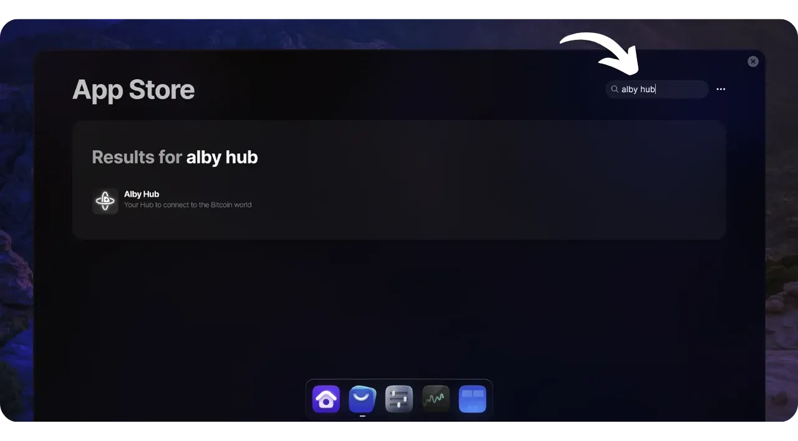
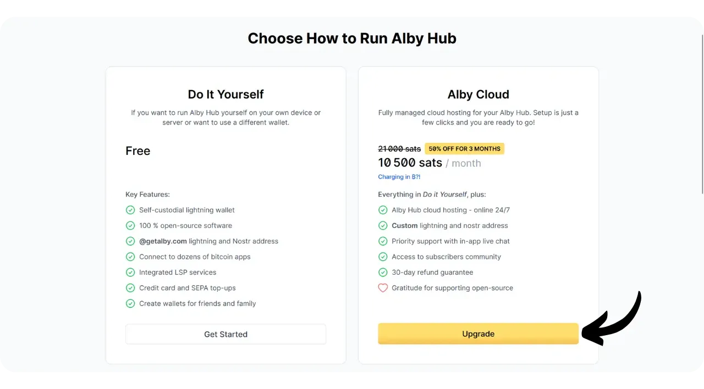
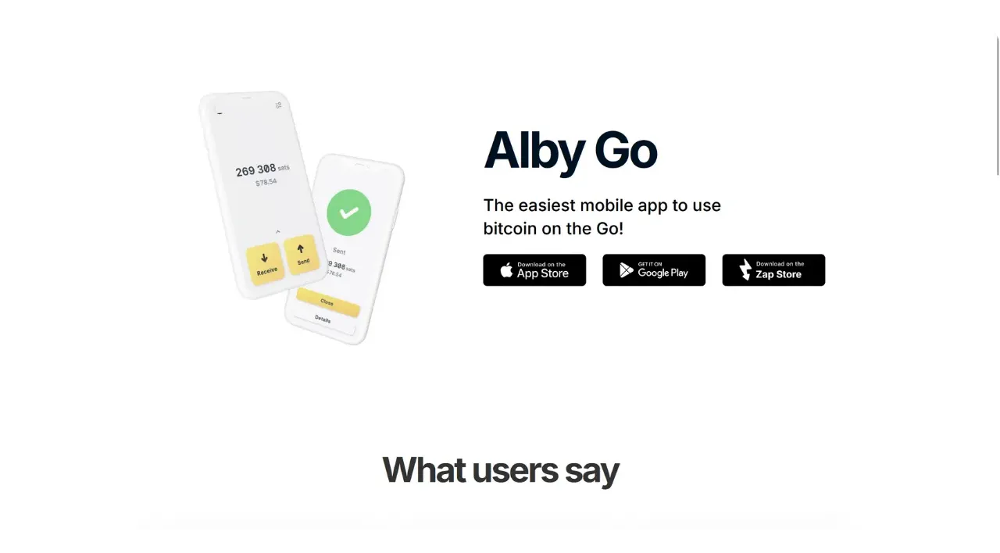
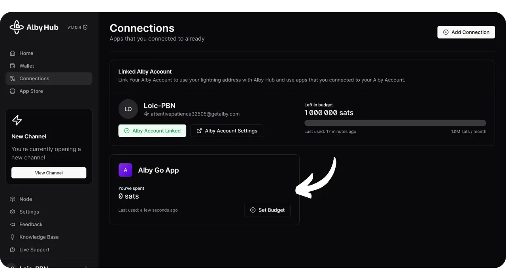
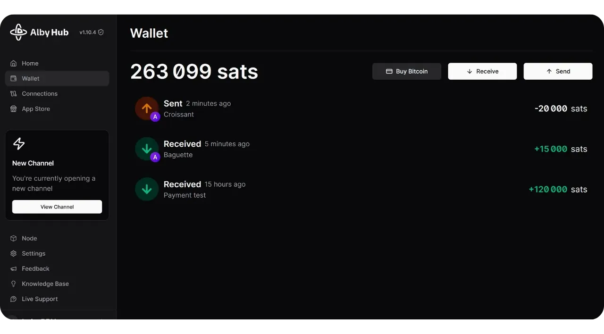

Alby Hub er den nyeste programvaren fra Alby, selskapet bak den populære Lightning-nettutvidelsen. Alby Hub er et brukervennlig grensesnitt for administrasjon av Lightning-noder.

I denne veiledningen skal vi se på ulike måter å bruke Alby Hub til å administrere din egen Lightning-node, og hvordan du kobler den til Alby Go, Albys mobilapp. Slik kan du bruke satsene dine mens du er på farten, samtidig som du kan administrere noden din på egen hånd.

## Hva er Alby Hub?

I 2024 markerte Alby et strategisk skifte. I årevis har de tilbudt en rekke verktøy knyttet til Bitcoin og Lightning Network, inkludert den ikoniske Alby-utvidelsen, som lar deg drive en Lightning-lommebok, med eller uten depot. I 2025 planlegger de imidlertid å avvikle sin delte depotlommebokstjeneste og fokusere utelukkende på selvforvaringsløsninger. Alby Hub er satt til å være det nye flaggskipverktøyet i Alby-økosystemet. Denne programvaren gjør det enkelt for brukerne å administrere sin egen Lightning-node, samtidig som de beholder eierskapet til nøklene sine (self-custody).

Alby Hub er et svært tilpasningsdyktig verktøy. Det kan dekke behovene til både nybegynnere og avanserte brukere. Nybegynnere kan enkelt bruke det til å drifte en ekte Lightning-node på egen hånd, uten å måtte forholde seg til den underliggende kompleksiteten. For mer erfarne brukere kan Alby Hub brukes som et komplett grensesnitt for avansert administrasjon av en eksisterende Lightning-node.

Avhengig av dine behov er Alby Hub tilgjengelig i fire konfigurasjoner:

- Alby Hub Cloud :**

Dette første alternativet er ideelt for nybegynnere, og er Alby Cloud-alternativet. Det lar deg distribuere en Lightning-node direkte på en Alby-administrert server, som er tilgjengelig via ditt Alby Hub-grensesnitt. Selv om Alby administrerer serveren, beholder du råderetten over midlene dine, ettersom nøklene dine krypteres med et passord som bare du kjenner til. Nøklene dine må imidlertid forbli dekryptert i RAM-minnet for at noden skal fungere, noe som teoretisk sett utsetter dem for risiko hvis noen får fysisk tilgang til serveren. Det er et interessant kompromiss for nybegynnere, men det er viktig å være klar over risikoen.

Den største fordelen med dette alternativet er at du får en Lightning-node som er oppe og går 24/7, uten at du trenger å administrere hostingen selv. I tillegg er sikkerhetskopieringen av Lightning-noden forenklet og automatisert, sammenlignet med alternativer med egen hosting, der du selv må administrere sikkerhetskopieringen av kanalene.

Alby tilbyr denne tjenesten for 21 000 satser per måned (pris for desember 2024, med forbehold om endringer, [sjekk prisene deres] (https://albyhub.com/#pricing)). Avgiften trekkes automatisk fra noden din via en lynfaktura utstedt av Alby. Dette gjøres via en NWC-tilkobling som konfigurerer noden din til å automatisk betale Alby-fakturaer knyttet til abonnementet ditt.

- Alby Hub med en eksisterende node :**

Hvis du allerede har en node hosted, for eksempel på Umbrel eller Start9, kan Alby Hub brukes som et avansert administrasjonsgrensesnitt, på samme måte som ThunderHub eller RTL.

- Alby Hub lokal :**

Det er også mulig å installere Alby Hub og noden direkte på PC-en, selv om dette alternativet er mindre praktisk, ettersom PC-en må være aktiv hele tiden for å få fjerntilgang til Lightning-noden. Dette alternativet kan imidlertid være egnet for dine spesifikke behov.

- Alby Hub på en personlig server :**

For avanserte brukere kan Alby Hub distribueres på en personlig server med en enkel kommando. Dette alternativet er ikke dekket i denne veiledningen, men du kan finne dedikerte instruksjoner [på Albys GitHub] (https://github.com/getAlby/hub?tab=readme-ov-file#docker).

Denne veiledningen fokuserer hovedsakelig på grensesnittet, som vil være det samme uansett hvilket alternativ du velger. Vi ser også på hvordan du distribuerer Alby Hub med det betalte skyalternativet, og deretter med node-in-box-alternativet (Umbrel eller Start9).

For lokal installasjon på PC-en din, [last ned og installer programvaren i henhold til operativsystemet] (https://github.com/getAlby/hub/releases), og følg deretter de samme instruksjonene på grensesnittet.

## Opprett en Alby-konto

Det første trinnet er å opprette en Alby-konto. Selv om dette ikke er avgjørende for å kunne bruke Alby Hub, gir det deg muligheten til å dra full nytte av de tilgjengelige alternativene, inkludert muligheten til å få en Lightning-adresse.

Gå til [det offisielle Alby-nettstedet] (https://getalby.com/) og klikk på "*Opprett konto*"-knappen.

Skriv inn et kallenavn og en e-postadresse, og klikk deretter på "*Sign up*". Denne e-postadressen vil bli brukt til å logge inn på kontoen din senere.

Skriv inn bekreftelseskoden du har mottatt på e-post.

Når du er logget inn på nettkontoen din, klikker du på knappen "*Fortsett*".

Klikk på "*Fortsett*" igjen.

## Alternativet med skyhosting

Deretter må du velge mellom et alternativ der du selv er vert for en Lightning-node på din egen maskinvare, eller det betalte alternativet der du bruker Albys sky. Jeg begynner med å forklare hvordan du går frem med skyalternativet (merk at dette er et betalingsalternativ, se detaljer i forrige avsnitt).

Klikk på "*Oppgrader*".

Bekreft ved å klikke på "*Subscribe Now*".

Klikk på "*Launch Alby Hub*".

Vent et øyeblikk mens noden opprettes.

Og det var det, Alby Hub er nå konfigurert. I neste avsnitt skal jeg vise deg hvordan du installerer Alby Hub på en eksisterende node. Hvis du ikke trenger det, kan du hoppe videre til neste avsnitt for å konfigurere noden.

## Alternativet for selvhosting

Hvis du foretrekker å bruke Alby Hub som et grensesnitt for din eksisterende Lightning-node, har du flere alternativer: du kan installere den på en server, lokalt på datamaskinen eller via en node-in-box (Umbrel eller Start9). Det er gratis å bruke Alby Hub i disse konfigurasjonene. Vi kommer til å konsentrere oss om node-in-box-alternativet, ettersom jeg mener at serveralternativet, uten fysisk tilgang, innebærer samme risiko som skyversjonen, og lokal installasjon på en PC ofte er uegnet.

For å konfigurere dette på Umbrel (trinnene for Start9 er identiske) må du først ha en LND-node som allerede er konfigurert.

Logg inn på Umbrel-grensesnittet ditt og gå til applikasjonsbutikken.

Se etter applikasjonen "*Alby Hub*".

Installer den på noden din.

Alby Hub-grensesnittet ditt er nå klart. Du kan følge resten av veiledningen som om du brukte skygrensesnittet, men uten alternativene i betalingsversjonen. I motsetning til skyversjonen lagres dessuten nøklene dine lokalt på noden din, ikke på Albys servere.

## Lansering av Alby Hub

Klikk på knappen "*Get Started*".

Alby Hub vil deretter be deg om å velge et passord. Dette passordet er svært viktig, ettersom det vil bli brukt til å kryptere lommeboken din. I den betalte skyversjonen lagres nøklene dine på Alby-serveren, krypteres med dette passordet som bare du kjenner, dekrypteres og lagres kun i RAM for å signere transaksjoner når det er nødvendig.

Det er derfor viktig å velge et sterkt passord. Hvem som helst med dette passordet kan potensielt få tilgang til noden din. Sørg for at du også tar en eller flere fysiske sikkerhetskopier av dette passordet på et stykke papir, eller enda bedre, på et stykke metall for ekstra sikkerhet. **Hvis du mister dette passordet, vil det være umulig å få tilgang til bitcoinsene dine igjen**, ettersom Alby ikke har noen mulighet til å tilbakestille det. Tap av dette passordet betyr tap av bitcoinsene dine.

Når du har valgt og lagret passordet ditt, klikker du på "*Opprett passord*".

Du har nå tilgang til Lightning-noden din.

Det første du må gjøre er å lagre gjenopprettingsfrasen din, som nøklene dine er utledet fra. Med denne frasen kan du gjenopprette tilgangen til lommeboken din på kjeden og, med den nyeste tilstanden til kanalene dine, satsene dine på Lightning. For å gjøre dette, klikk på "*Settings*".

Gå deretter til "*Backup*"-fanen. Skriv inn passordet ditt for å få tilgang til det.

Du vil da ha tilgang til din 12-ords gjenopprettingsfrase. Lag en eller flere fysiske sikkerhetskopier av denne frasen på papir eller metall, og oppbevar den på et trygt sted.

Når du har lagret frasen, merker du av i boksen for å bekrefte at du har lagret den, og klikker på "*Fortsett*".

## Hvordan kan jeg få tilgang til bitcoinsene mine?

Før du sender penger til noden din, er det viktig å forstå hvordan du kan gjenopprette dem hvis det skulle oppstå et problem, og hvilken informasjon som kreves for denne gjenopprettingen. Prosessen varierer avhengig av hva slags midler som skal gjenopprettes, og hvordan noden din er hostet.

For betalende skybrukere krever fullstendig gjenoppretting av bitcoins tre viktige elementer:

- Gjenopprettingsfrasen din;
- Passordet ditt (det som brukes for noden din) ;
- Tilgang til Alby-kontoen din for å hente den nyeste statusen for Lightning-kanalene dine.

Hvis noen av disse tre opplysningene mangler, vil det være umulig å få tilbake bitcoinsene dine i sin helhet.

For de som hoster sin egen node, er gjenopprettingsprosessen identisk med den for en hvilken som helst Lightning-node. Du trenger :

- Gjenopprettingsfrasen din;
- Den siste statusen til Lightning-kanalene dine. For å sikre denne informasjonen tilbyr Umbrel [et alternativ] (https://github.com/getumbrel/umbrel/blob/2b266036f62a1594aa60a8a3be30cfb8656e755f/scripts/backup/README.md) for å kryptere den og lagre den dynamisk og anonymt via Tor.

## Kjøp din første Lightning-kanal

Du kan nå følge instruksjonene fra Alby Hub. Klikk på knappen for å åpne din første kanal for innkommende kontanter.

Velg "*Åpen kanal*". Hvis du ikke har tenkt å bli en rutingsnode og ikke har et spesifikt behov for det, anbefaler jeg at du velger private kanaler.

Alby Hub vil generere en faktura som du må betale. Denne betalingen dekker transaksjonsgebyrene som trengs for å åpne kanalen din, samt serviceavgiftene til LSP (*Lightning Service Provider*) som vil åpne en kanal til noden din, slik at du kan motta betalinger umiddelbart.

Når fakturaen er betalt og transaksjonen er bekreftet, er den første Lightning-kanalen din etablert.

I "*Node*"-fanen kan du se at du nå har innkommende kontanter, slik at du kan motta betalinger via Lightning.

For å motta betaling klikker du på fanen "*Wallet*" og deretter på "*Receive*".

Angi et beløp og legg til en beskrivelse om nødvendig, og klikk deretter på "*Opprett faktura*".

Jeg fikk min første utbetaling på 120 000 sats.

Ved å gå tilbake til "*Wallet*"-fanen kan du sjekke saldoen i lommeboken. Merk at Alby Hub automatisk setter av 354 sats når du foretar din første betaling. For hver lynkanal du deretter åpner, vil Alby Hub automatisk sette av en reserve som tilsvarer 1 % av kanalens kapasitet. Denne reserven er et sikkerhetstiltak som gjør det mulig for noden din å gjenopprette kanalens midler i tilfelle forsøk på svindel fra din motpart. Det er derfor, selv om jeg har sendt 120 000 sats, bare 119 646 sats vises på saldoen min.

## Innskudd av bitcoins på kjeden

Hvis du vil ha utgående kontanter for å utføre betalinger, kan du også åpne en kanal selv. For å gjøre dette trenger du bitcoins i kjeden i lommeboken din.

Fra fanen "*Node*" klikker du på "*Deposit*".

Send bitcoins til adressen som vises. Denne adressen er avledet fra den tidligere lagrede gjenopprettingsfrasen din.

Jeg sendte 72 000 sats. De er nå synlige i "*Savings Balance*", som inkluderer alle midlene jeg eier på kjeden, og ikke på Lightning.

## Åpne en Lightning-kanal

Nå som du har midler i kjeden, kan du åpne en ny Lightning-kanal. Det anbefales å åpne flere kanaler, med tilstrekkelige beløp for å sikre at du alltid kan utføre betalinger uten begrensninger. De fleste LSP-er (*Lightning Service Providers*) krever minst 150 000 sats for å åpne en kanal med deg.

I fanen "*Node*" klikker du på "*Open Channel*".

Velg størrelsen på kanalen din. Jeg anbefaler at du ikke åpner kanaler som er for små, med tanke på at dette er en Lightning-node, og at maskinen som er vert for nøklene dine ikke tilbyr samme sikkerhetsnivå som en maskinvarelommebok. Så vær forsiktig med hvor mye du velger å blokkere.

I menyen "*Advanced Options*" kan du velge hvilken LSP du vil åpne kanalen med, eller du kan manuelt angi en annen Lightning-node.

Klikk deretter på "*Åpne kanal*".

Vent mens kanalen din blir bekreftet i kjeden.

Den nye kanalen din vil nå vises i "*Node*"-fanen.

## Koble til en utgiftsapplikasjon

Nå som du har en fungerende Lightning-node, kan du bruke den til å motta og bruke sats på daglig basis. Selv om Alby Hubs webgrensesnitt er praktisk for å administrere noden din, er det ikke ideelt for å gjøre raske transaksjoner på farten. Til dette skal vi bruke en Lightning-lommebok-app installert på smarttelefonen vår.

I denne veiledningen anbefaler jeg at du velger Alby Go, som er veldig enkelt å bruke, men du kan også bruke andre kompatible programmer, for eksempel Zeus.

Gå til applikasjonsbutikken på enheten din for å installere Alby Go:

- [For Android] (https://play.google.com/store/apps/details?id=com.getalby.mobile);
- [For Apple] (https://apps.apple.com/us/app/alby-go/id6471335774).

Android-brukere kan også installere appen via `.apk`-filen [tilgjengelig på Albys GitHub] (https://github.com/getAlby/go/releases).

Når applikasjonen startes, klikker du på "*Connect Wallet*".

I Alby Hub, under fanen "*Connections*", klikker du på "*Add Connection*".

Gi denne tilkoblingen et navn som gjør det enkelt å identifisere den i huben, og velg hvilke tillatelser du ønsker å gi applikasjonen. I mitt tilfelle velger jeg "*Full tilgang*" for å ha full tilgang til Lightning-nodens midler fra smarttelefonen min, men du kan også begrense tilgangen med et maksimalt budsjett, velge hvilke funksjoner som er tillatt, eller angi en utløpsdato for disse tillatelsene. Når du har konfigurert, klikker du på "*Neste*".

Alby Hub genererer deretter en hemmelighet for å opprette forbindelsen.

Gå tilbake til Alby Go-applikasjonen, skann QR-koden eller lim inn hemmeligheten.

Klikk på "Fullfør*".

Du har nå ekstern tilgang til Lightning-noden fra smarttelefonen din, noe som gjør det enkelt å bruke og motta satellitter mens du er på farten hver dag.

Hvis det er nødvendig, kan du administrere tillatelsene for denne tilkoblingen direkte i Alby Hub ved å klikke på den.

For å motta sats klikker du ganske enkelt på "*Mottak*".

Endre fakturabeløp og beskrivelse ved å klikke på "*Faktura*".

Belast fakturaen for å motta sats.

For å sende sats klikker du på "*Send*".

Skann fakturaen du ønsker å betale.

Klikk deretter på "*Betale*".

Transaksjonen din er bekreftet.

Ved å klikke på den lille pilen får du tilgang til transaksjonshistorikken din.

Disse transaksjonene er også synlige på Alby Hub.

## Tilpass Lightning-adressen din

Alby tilbyr deg muligheten til en Lightning-adresse. Dette gjør at du kan motta betalinger på noden din uten å måtte generere en faktura manuelt hver gang. Som standard tildeler Alby deg en Lightning-adresse, men du kan tilpasse den. Logg inn på Alby-kontoen din, klikk på navnet ditt øverst i høyre hjørne, og velg deretter "*Innstillinger*".

Gå til menyen "*Lightning Address*".

Endre adressen din, og bekreft deretter ved å klikke på "*Oppdater lynadressen din*".

Vær oppmerksom på at når adressen din har blitt endret, tilhører den ikke lenger deg. Så sørg for at du aldri sender sats til den igjen.

Nå vet du hvordan du bruker Lightning med din egen node ved hjelp av Alby Hub-verktøyet. Hvis du synes denne veiledningen var nyttig, vil jeg være veldig takknemlig hvis du setter en grønn tommel nedenfor. Del gjerne denne artikkelen på dine sosiale nettverk. Tusen takk skal du ha!

For å forstå i detalj alle Lightning-mekanismene som vi har manipulert i denne opplæringen, anbefaler jeg deg på det sterkeste å oppdage vår gratis opplæring om emnet :

https://planb.network/courses/34bd43ef-6683-4a5c-b239-7cb1e40a4aeb