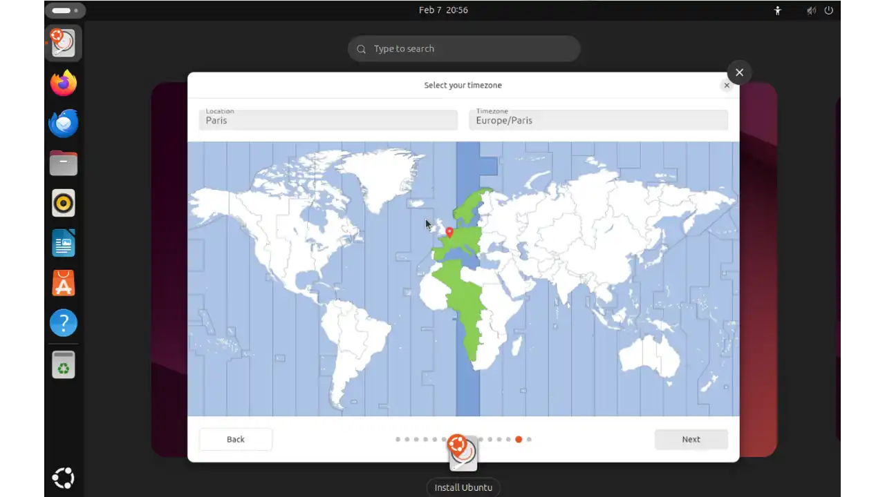

## 导言

操作系统（OS）是管理计算机所有资源的主要软件。选择像 Ubuntu 这样的替代性操作系统，可以在安全性、成本和隐私方面带来许多优势。

### 为什么选择 Ubuntu？


- 增强的安全性** ：Linux 发行版以其安全性和稳健性而闻名
- 零成本**：Ubuntu 和大多数 Linux 发行版都是免费的
- 大型社区**：用户社区随时准备通过论坛和教程提供帮助
- 尊重隐私**：开源系统，提高透明度
- 简单**：用户界面友好，易于使用
- 丰富的生态系统** ：广泛的开源软件目录
- 定期支持**：来自 Canonical 的安全更新

## 安装和配置

### 1.先决条件

**所需设备：**


- 至少 12 GB 的 USB 密钥
- 至少有 25 GB 可用空间的电脑

### 2.下载


- 请访问 [ubuntu.com/download](https://ubuntu.com/download)
- 选择稳定版本（建议使用 LTS）
- 下载 ISO 映像


### 3.创建可启动 USB 密钥

您可以使用多种工具，如 Balena Etcher ：


- 下载并安装 [Balena Etcher](https://etcher.balena.io/)。


- 打开 Balena Etcher，然后选择 Ubuntu ISO 映像
- 选择 USB 密钥作为目标媒体
- 点击 "Flash"，等待进程结束


### 4.安装和保护 Ubuntu

**4.1 从 USB 记忆棒启动**（法语）


- 关闭计算机
- 插入 USB 密钥（内含 Ubuntu）
- 打开电脑。在最新的 PC 上，系统应能自动识别 USB 启动密钥。如果不是这种情况，请按住 BIOS/UEFI 访问键（通常是 F2、F12 或 Delete，视品牌而定）重新启动电脑。
 - 在 BIOS/UEFI 菜单中选择 USB 密钥作为启动设备
 - 保存并重新启动

**4.2 启动安装** （法语）

**启动屏幕**

从 USB 密钥启动时，你会看到这个屏幕，它允许你启动 Ubuntu。


**语言选择

选择您喜欢的安装和系统语言。


**无障碍选项

必要时配置无障碍选项（屏幕阅读器、高对比度等）。


**键盘配置

选择键盘布局。可使用测试栏检查按键是否与您的配置相符。


**网络连接**

连接 WLAN 或有线网络，以便在安装过程中下载更新。


**安装类型

选择 "试用 Ubuntu"（测试而不安装）或 "安装 Ubuntu"。


**安装方法

选择交互式安装。


**应用选择

可选择默认安装或更多应用程序。


**第三方应用程序

决定是否安装额外的驱动程序和专有软件。


**分区类型

您有两个主要选择：


- "擦除磁盘并安装 Ubuntu"：将整个磁盘用于 Ubuntu
- "手动安装：创建 Windows 双启动或自定义分区


**创建用户账户

设置 Ubuntu 账户的用户名和密码。


**时区

选择您所在的地理区域以设置系统时间。



**安装摘要**

在开始最终安装之前，请检查您的所有选择。点击 "安装 "后，安装过程就开始了。


**4.3 安装后升级 Ubuntu**（法语）

更新系统是新安装后的重要步骤。您有两种选择：

**选项 1：通过图形用户界面**


- 在应用程序菜单中搜索 "软件和更新
- 应用程序将自动检查可用的更新
- 按照屏幕上的说明安装更新

**选项 2：通过终端


- 打开终端（Ctrl + Alt + T）
- 键入以下命令检查可用更新：

```bash
sudo apt update
```


- 按提示输入密码
- 要安装更新，请键入 ：

```bash
sudo apt upgrade
```


- 输入 "Y "确认安装，然后回车

### 5.探索基本任务

**5.1 浏览互联网

默认情况下，火狐浏览器通常位于启动栏中。

启动火狐浏览器并开始浏览。

其他浏览器（Chrome、Brave 等）可通过软件管理器或 .deb 包安装。

**5.2 文字处理

Ubuntu 预装了 LibreOffice 套件（用于文字处理的 Writer）。

要打开它：活动 > 搜索 "LibreOffice Writer"，或者点击栏中出现的图标。

您可以创建、编辑和保存各种格式的文档（包括 .docx）。

**5.3 安装应用程序

软件管理器（名为 "Ubuntu 软件"）：用于搜索和安装应用程序的图形界面。

在终端中，使用命令 ：

```bash
sudo apt install nom-du-paquet
```

例如

```bash
sudo apt install vlc
```

### 6.结论和其他资源

现在你已经准备好每天使用 Ubuntu 了：确保系统安全、浏览网页、办公、安装软件并保持操作系统最新！

为了进一步保障您数字生活的安全，我们建议您使用我们的加密信息服务，它能完美地保护您的隐私，并与您的 Ubuntu 安装相得益彰：

https://planb.network/tutorials/others/proton-mail