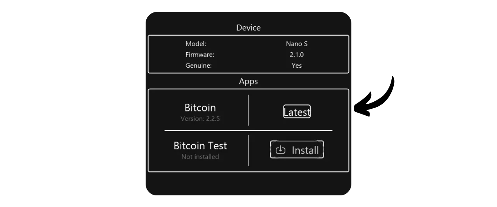

Ledgerを使用している場合、少なくともデバイスの初期設定のために、Ledger Liveソフトウェアを経由して、その真正性を確認し、ビットコインアプリケーションをインストールする必要があることにお気づきだろう。しかし、この設定の後、多くのビットコイナーはLedger LiveよりもSparrowやLianaのような専用のビットコインウォレット管理ソフトウェアを使用することを好む。Ledgerは最新のビットコイン機能を素早く取り入れた優れたハードウェアウォレットを製造しているが、そのソフトウェアは必ずしもビットコイナーの特定のニーズに適応していない。実際、Ledger Liveにはアルトコイン用に設計された多くの機能が含まれているが、ビットコイン・ウォレット管理に特化したオプションは限られている。しかし、SparrowとLianaの問題は（今のところ）、Ledgerにビットコインアプリケーションをインストールできないことだ。

Ledgerの初期設定中にLedger Liveを使用する必要性を回避するには、Baccaツール（または「Ledgerインストーラー」）を使用することができます。このソフトウェアを使用すると、ビットコインアプリケーションのインストールと更新、Ledgerの真正性の確認、さらにはデバイスのファームウェアの更新を行うことができます。Baccaは、Chaincode LabsのBitcoin Core開発者であり、[Revault and Liana](https://wizardsardine.com/)の共同設立者であり、PythcoinerであるAntoine Poinsot (Darosior)によって作成された。

このチュートリアルでは、Ledger LiveソフトウェアがなくてもLedgerデバイスを楽しめるように、このツールの使い方をご紹介します。すべてのデバイスで動作します：Nano S Classic、Nano S Plus、Nano X、Flex、Stax。

---
*このツールはかなり新しく、開発者はまだ**テスト段階**であることを明記しています。実際のビットコイン・ウォレットをホストすることを意図したデバイスではありませんが、そうすることは可能です。この点に関して、私はこのツールの開発者の推奨に従うことを推奨します。それは[彼らのGitHubリポジトリのREADMEに](https://github.com/darosior/ledger_installer).*と明記されています。

---
## 前提条件

あなたのコンピューターでBaccaを使うには、2つのツールが必要です：


- Git ；
- サビだ。

すでにインストールしてある場合は、このステップはスキップできる。

**リナックス

Linuxディストリビューションでは、Gitは通常プリインストールされています。Gitがシステムにインストールされているかどうかを確認するには、ターミナルで次のコマンドを入力します：

```bash
git --version
```

あなたのシステムにGitがインストールされていない場合、Debian .NETにインストールするコマンドは以下の通りです：

```bash
sudo apt install git
```

最後に、Rust開発環境をインストールするには、：

```bash
curl --proto '=https' --tlsv1.2 -sSf https://sh.rustup.rs | sh
```

**ウィンドウズ

Gitをインストールするには、[プロジェクトの公式ウェブサイト](https://git-scm.com/)にアクセスしてください。ソフトウェアをダウンロードし、インストール手順に従ってください。


Rustを[公式サイト](https://www.rust-lang.org/tools/install)からインストールする場合も同じように進める。


**MacOS:**

Gitがまだシステムにインストールされていない場合は、ターミナルを開き、以下のコマンドを実行してインストールしてください：

```bash
git --version
```

Gitがシステムにインストールされていない場合、Gitを含むXcodeをインストールするウィンドウが開きます。画面の指示に従ってインストールを進めてください。

Rustをインストールするには、以下のコマンドを実行する：

```bash
curl --proto '=https' --tlsv1.2 -sSf https://sh.rustup.rs | sh
```

## バッカ・インストール

ターミナルを開き、ソフトウェアを保存したいフォルダに移動し、以下のコマンドを実行する：

```bash
git clone https://github.com/darosior/ledger_installer.git
```

ソフトウェア・ディレクトリに移動する：

```bash
cd ledger_installer
```

それからCargoを使ってプロジェクトをコンパイルし、Bacca GUIを実行する：

```bash
cargo run -p ledger_manager_gui
```

これでソフトウェアのインターフェイスにアクセスできるようになりました。


## 元帳の設定

始める前に、Ledgerが新しい場合は、PINコードを設定し、リカバリーフレーズを保存していることを確認してください。これらの初期ステップにはLedger Liveは必要ありません。USBケーブルでLedgerを接続し、電源を入れるだけです。この2つのステップの進め方がわからない場合は、お使いのモデルに特化したチュートリアルの冒頭を参照してください：

https://planb.network/tutorials/wallet/hardware/ledger-c6fc7d82-91e7-4c74-bad7-cbff7fea7a88

https://planb.network/tutorials/wallet/hardware/ledger-nano-s-plus-75043cb3-2e8e-43e8-862d-ca243b8215a4

https://planb.network/tutorials/wallet/hardware/ledger-flex-3728773e-74d4-4177-b39f-bd923700c76a

## バッカの使用

Ledger をコンピューターに接続し、設定した PIN コードを使用してロックを解除します。Bacca が自動的に Ledger を検出します。


Ledgerの真正性を確認するには、「*Check*」ボタンをクリックします。続行するには、Ledgerデバイスで接続を承認する必要があります。


Baccaは、あなたのLedgerが本物かどうかをお知らせします。本物でない場合は、デバイスが侵害されているか、偽造品であることを示しています。この場合、ただちに使用を中止してください。


アプリケーション*」メニューでは、Ledger にすでにインストールされているアプリケーションのリストを参照できます。


ビットコインアプリケーションをインストールするには、「*インストール*」をクリックし、Ledgerへのインストールを承認します。


アプリケーションはうまくインストールされている。


ビットコインアプリケーションの最新バージョンがインストールされていない場合、Baccaは「*最新*」表示の代わりに「*更新*」ボタンを表示します。このボタンをクリックするだけで、アプリケーションを更新することができます。



これでLedgerが最新バージョンのビットコインアプリケーションで正しく設定され、Ledger Liveを介さずにSparrowやLianaなどの管理ソフトウェアでウォレットをインポートして使用する準備が整いました！

このチュートリアルが役に立ったと思ったら、下に緑の親指を残してくれるとありがたい。この記事をソーシャルネットワークでシェアしてください。ありがとうございました！

また、GnuPGのチュートリアルでは、ソフトウェアをインストールする前に、そのソフトウェアの完全性と真正性をチェックする方法について説明していますので、こちらもご覧になることをお勧めします。これは、特にLianaやSparrowのようなポートフォリオ管理ソフトウェアをインストールする際に重要な習慣です：

https://planb.network/tutorials/others/general/integrity-authenticity-21d0420a-be02-4663-94a3-8d487f23becc
