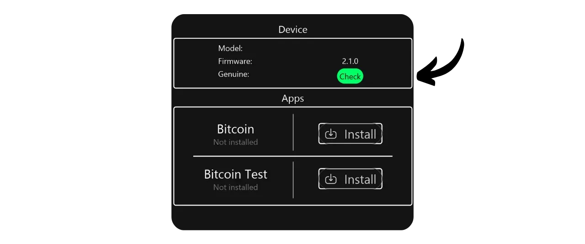
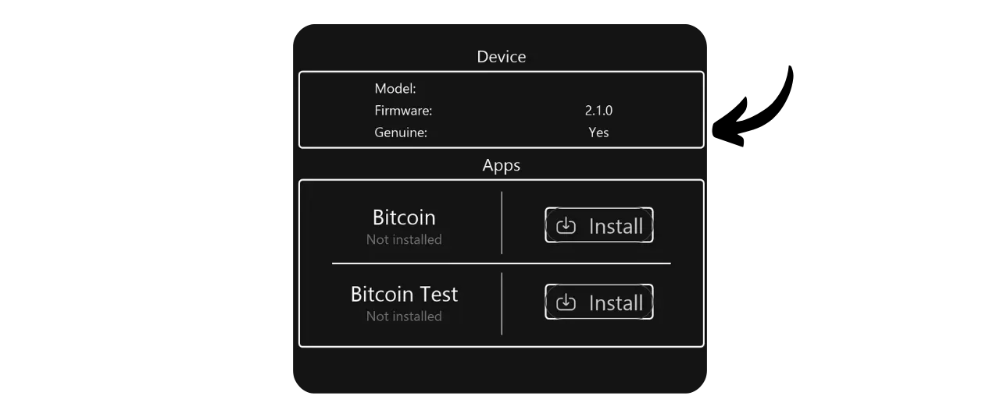

Hvis du bruker en Ledger, har du sannsynligvis oppdaget at du må gå gjennom Ledger Live-programvaren, i det minste for den første konfigurasjonen av enheten, for å sjekke ektheten og installere Bitcoin-applikasjonen på den. Etter denne konfigurasjonen foretrekker imidlertid mange bitcoinere å bruke spesialisert programvare for administrasjon av Bitcoin-lommebøker, som Sparrow eller Liana, i stedet for Ledger Live. Selv om Ledger produserer utmerkede maskinvarelommebøker som raskt inkluderer de nyeste Bitcoin-funksjonene, er ikke programvaren deres nødvendigvis tilpasset de spesifikke behovene til bitcoinere. Ledger Live inkluderer mange funksjoner designet for altcoins, mens alternativene dedikert til Bitcoin-lommebokadministrasjon er begrenset. Men problemet med Sparrow og Liana (for øyeblikket) er at de ikke lar deg installere Bitcoin-applikasjonen på Ledger.

For å omgå behovet for å bruke Ledger Live under den første konfigurasjonen av din Ledger, kan du bruke Bacca-verktøyet (eller "Ledger Installer"). Denne programvaren lar deg installere og oppdatere Bitcoin-applikasjonen, verifisere ektheten til din Ledger, og til og med senere oppdatere enhetens fastvare. Bacca ble opprettet av Antoine Poinsot (Darosior), Bitcoin Core-utvikler ved Chaincode Labs, medgrunnlegger [av Revault og Liana] (https://wizardsardine.com/) og Pythcoiner.

I denne veiledningen viser jeg deg hvordan du bruker dette verktøyet, slik at du kan klare deg uten Ledger Live-programvaren for godt, og likevel ha glede av Ledger-enheter. Det fungerer på alle enheter: Nano S Classic, Nano S Plus, Nano X, Flex og Stax.

---
*Vær oppmerksom på at dette verktøyet er ganske nytt, og utviklerne presiserer at det fortsatt er **i testfasen**. De anbefaler å bruke det kun til testformål, og ikke for en enhet som er ment å være vert for en ekte Bitcoin-lommebok, selv om det er mulig å gjøre det. I denne forbindelse anbefaler jeg at du følger anbefalingene fra utviklerne av dette verktøyet, som er spesifisert [på README i GitHub-depotet] (https://github.com/darosior/ledger_installer).*

---
## Forutsetninger

På datamaskinen din trenger du to verktøy for å bruke Bacca:


- Git ;
- Rust.

Hvis du allerede har installert dem, kan du hoppe over dette trinnet.

**Linux:**

På en Linux-distribusjon er Git vanligvis forhåndsinstallert. For å sjekke om Git er installert på systemet ditt, kan du skrive inn følgende kommando i terminalen :

```bash
git --version
```

Hvis du ikke har Git installert på systemet ditt, kan du installere det på en Debian :

```bash
sudo apt install git
```

Til slutt, for å installere Rust-utviklingsmiljøet ditt, bruker du kommandoen :

```bash
curl --proto '=https' --tlsv1.2 -sSf https://sh.rustup.rs | sh
```

**Windows:**

For å installere Git, gå til [prosjektets offisielle nettsted] (https://git-scm.com/). Last ned programvaren og følg installasjonsinstruksjonene.


Fortsett på samme måte for å installere Rust fra [det offisielle nettstedet] (https://www.rust-lang.org/tools/install).


**MacOS:**

Hvis Git ikke allerede er installert på systemet ditt, åpner du en terminal og kjører følgende kommando for å installere det:

```bash
git --version
```

Hvis Git ikke er installert på systemet ditt, åpnes et vindu som tilbyr deg å installere Xcode, som inkluderer Git. Følg instruksjonene på skjermen for å fortsette med installasjonen.

Kjør følgende kommando for å installere Rust:

```bash
curl --proto '=https' --tlsv1.2 -sSf https://sh.rustup.rs | sh
```

## Bacca-installasjon

Åpne en terminal, gå til mappen der du vil lagre programvaren, og kjør deretter følgende kommando:

```bash
git clone https://github.com/darosior/ledger_installer.git
```

Naviger til programvarekatalogen:

```bash
cd ledger_installer
```

Bruk deretter Cargo til å kompilere prosjektet og kjøre Bacca GUI:

```bash
cargo run -p ledger_manager_gui
```

Du har nå tilgang til programvaregrensesnittet.


## Konfigurere hovedboken

Hvis du har en ny Ledger, må du sørge for at du har satt opp PIN-koden og lagret gjenopprettingsfrasen før du starter. Du trenger ikke Ledger Live for disse innledende trinnene. Du trenger bare å koble til Ledger via USB-kabelen for å gi den strøm. Hvis du ikke er sikker på hvordan du går frem med disse to trinnene, kan du se begynnelsen av veiledningen som er spesifikk for din modell:

https://planb.network/tutorials/wallet/hardware/ledger-c6fc7d82-91e7-4c74-bad7-cbff7fea7a88

https://planb.network/tutorials/wallet/hardware/ledger-nano-s-plus-75043cb3-2e8e-43e8-862d-ca243b8215a4

https://planb.network/tutorials/wallet/hardware/ledger-flex-3728773e-74d4-4177-b39f-bd923700c76a

## Bruk av Bacca

Koble Ledger til datamaskinen, og lås den opp ved hjelp av PIN-koden du har angitt. Bacca bør automatisk oppdage Ledger.


For å bekrefte at din Ledger er autentisk, klikker du på "*Sjekk*"-knappen. Du må godkjenne tilkoblingen på Ledger-enheten din for å fortsette.



Bacca vil deretter informere deg om Ledger er ekte. Hvis den ikke er det, indikerer dette enten at enheten har blitt kompromittert, eller at den er forfalsket. I så fall må du slutte å bruke den umiddelbart.



I menyen "*Apps*" kan du se listen over programmer som allerede er installert på din Ledger.


For å installere Bitcoin-applikasjonen klikker du på "*Install*" og godkjenner deretter installasjonen på din Ledger.


Applikasjonen er godt installert.


Hvis du ikke har den nyeste versjonen av Bitcoin-applikasjonen installert, vil Bacca vise en "*Update*"-knapp i stedet for "*Latest*"-indikasjonen. Bare klikk på denne knappen for å oppdatere applikasjonen.


Nå som Ledger er riktig konfigurert med den nyeste versjonen av Bitcoin-applikasjonen, er du klar til å importere og bruke lommeboken din på administrasjonsprogramvare som Sparrow eller Liana, uten å måtte gå gjennom Ledger Live!

Hvis du fant denne opplæringen nyttig, ville jeg være takknemlig hvis du legger igjen en grønn tommel nedenfor. Del gjerne denne artikkelen på dine sosiale nettverk. Tusen takk skal du ha!

Jeg anbefaler også at du tar en titt på denne veiledningen om GnuPG, som forklarer hvordan du sjekker integriteten og autentisiteten til programvaren din før du installerer den. Dette er en viktig praksis, spesielt når du installerer programvare for porteføljeforvaltning som Liana eller Sparrow :

https://planb.network/tutorials/others/general/integrity-authenticity-21d0420a-be02-4663-94a3-8d487f23becc
