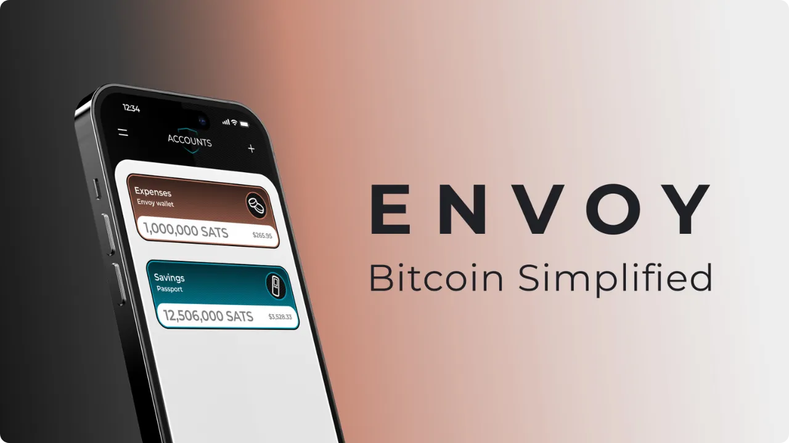

Envoy è un'applicazione per la gestione dei portafogli Bitcoin sviluppata da Foundation. È stata progettata appositamente per essere utilizzata con il portafoglio hardware Passport.

Il Passport "*Batch 2*" che presentiamo in questo tutorial con l'applicazione Envoy è il successore della "*Founder's Edition*". È caratterizzato da un design premium, uno schermo a colori ad alta definizione e una tastiera fisica ergonomica. Funziona in modalità "*Air-Gap*", assicurando che le chiavi private del portafoglio rimangano totalmente isolate, con scambi possibili tramite scheda MicroSD o codici QR. Il dispositivo include una batteria rimovibile da 1200 mAh.

Per quanto riguarda la connettività, il Passport è dotato di una porta MicroSD, una porta USB-C per la ricarica e una fotocamera posteriore per la scansione dei codici QR.

In termini di sicurezza, il Passport incorpora un elemento sicuro e il codice sorgente del dispositivo è interamente open-source. Offre tutte le caratteristiche che ci si aspetta da un buon portafoglio hardware Bitcoin. Si noti che il Passport non supporta ancora miniscript, ma questa funzione è prevista per il secondo trimestre del 2025.

Al prezzo di 199 dollari, il Passport si posiziona come portafoglio hardware di fascia alta, in concorrenza con Coldcard Q, Jade Plus, Tezor Safe 5 e i modelli top di gamma di Ledger.

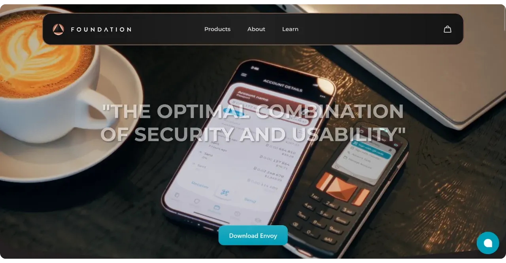

Per gestire il vostro portafoglio sicuro su un Passport, avete diverse opzioni. Questo portafoglio hardware è compatibile con la maggior parte dei software di gestione dei portafogli presenti sul mercato, tra cui Sparrow Wallet, Specter Desktop, Nunchuk, Keeper e altri.

In questo tutorial, rivolto ai principianti e agli utenti intermedi, scopriremo come utilizzare l'applicazione Envoy con il Passport. È il modo più semplice per ottenere il massimo dal vostro portafoglio hardware.

Se siete utenti avanzati e volete esplorare funzioni più complesse, vi consiglio di dare un'occhiata a quest'altro tutorial in cui configuriamo Passport con Sparrow Wallet:

https://planb.network/tutorials/wallet/hardware/passport-74e53858-3fa2-43f9-b866-573297546236
## Unboxing del Passaporto

Quando si riceve il Passport, assicurarsi che la scatola e il sigillo sul cartone siano intatti per confermare che la confezione non è stata aperta. Al momento della configurazione, verrà inoltre effettuata una verifica software dell'autenticità e dell'integrità del dispositivo.

Il contenuto della scatola comprende :

- Passaporto;
- Un pezzo di cartone per scrivere la frase mnemonica;
- Un cavo USB-C per la ricarica;
- Scheda MicroSD ;
- Due adattatori da MicroSD a Lightning o USB-C ;
- Adesivi.

Sul dispositivo è presente :

- Una tastiera (1) ;
- Porta USB-C (2);
- Un pulsante di cancellazione (3);
- Un pulsante di ritorno (4) ;
- Un pulsante di conferma (5);
- Cuscinetto direzionale (6);
- Pulsante di accensione/spegnimento (7);
- Un indicatore di stato (8);
- Porta MicroSD (9) ;
- Un pulsante per cambiare modalità aA1 (10) ;
- Una fotocamera posteriore.

## Scarica l'applicazione Envoy

Andate nel vostro app store per scaricare Envoy :

- Sul [Google Play Store](https://play.google.com/store/apps/details?id=com.foundationdevices.envoy);
- Su [App Store](https://apps.apple.com/us/app/envoy-by-foundation/id1584811818);
- Su [F-Cold](https://foundation.xyz/fdroid/).

È anche possibile scaricare il file APK direttamente [dal repository GitHub della Fondazione](https://github.com/Foundation-Devices/envoy/releases).

Una volta aperta l'applicazione, selezionare "*Gestione del passaporto*".

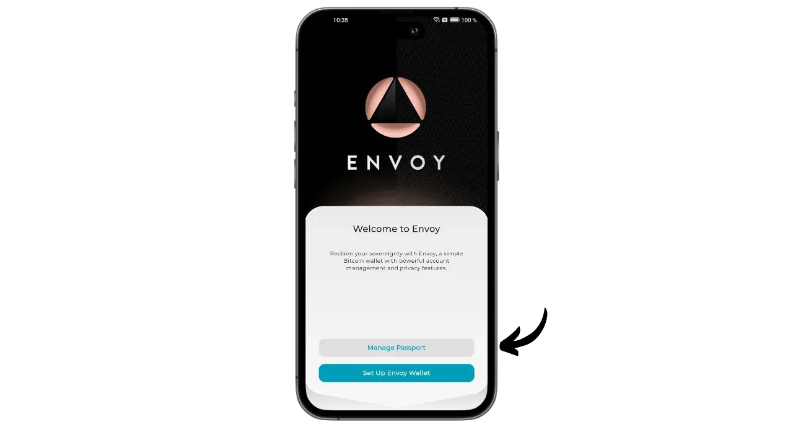

Scegliere se attivare la connessione Tor per rafforzare la riservatezza, quindi premere "*Continua*".

Scegliere "*Collega un Passport esistente*" se il Passport è già configurato, oppure "*Configura un nuovo Passport*" se si sta inizializzando il portafoglio hardware per la prima volta.

Accettare le condizioni di utilizzo.

Verrà quindi richiesto di verificare l'autenticità del passaporto. Cliccare su "*Avanti*".

## Passaporto di partenza

Premere il pulsante di accensione/spegnimento sul lato dell'unità per avviarla.

Premere il pulsante di conferma per accedere al menu successivo.

In questa esercitazione, utilizzeremo Envoy per gestire il portafoglio protetto da Passport. Selezionare "*App Envoy*".

Fare clic su "*Continua su Envoy*".

Il passo successivo è il controllo del dispositivo. Questa operazione conferma l'autenticità del Passaporto e garantisce che non sia stato manomesso durante il trasporto. Vi verrà chiesto di scansionare un codice QR.

Scansionare i codici QR dinamici visualizzati nell'applicazione con il Passaporto. Al termine della scansione, fare clic su "*Avanti*".

Quindi utilizzare il telefono per scansionare il codice QR visualizzato sul Passaporto.

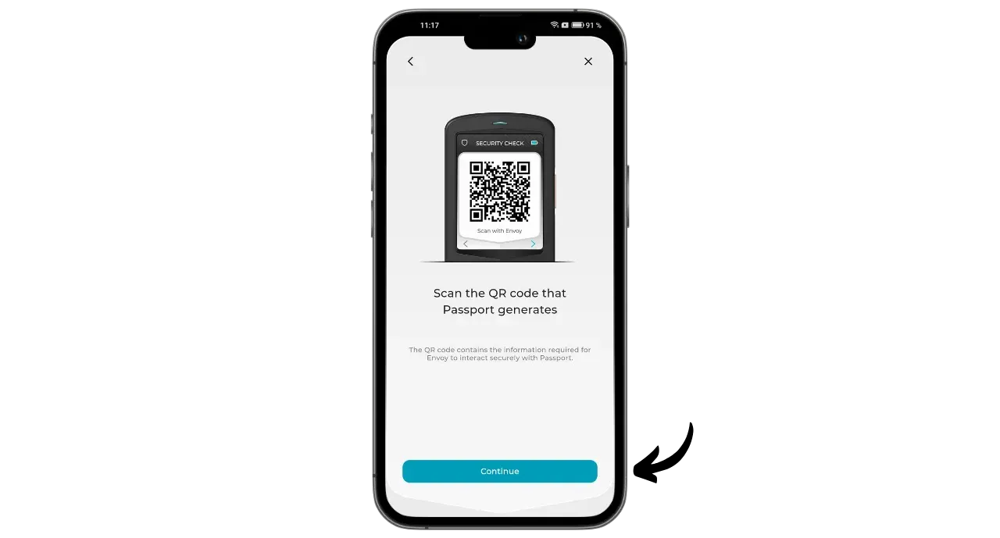

Se appare il messaggio "*Il tuo passaporto è sicuro*", si conferma che il portafoglio hardware è autentico. Ora è possibile utilizzarlo per proteggere un portafoglio Bitcoin.

Confermare il risultato del test sul Passaporto.

## Impostazione del codice PIN

Segue la fase del codice PIN. Il codice PIN sblocca il Passaporto. Pertanto, protegge dall'accesso fisico non autorizzato. Il codice PIN non partecipa alla creazione delle chiavi crittografiche del portafoglio. Quindi, anche senza accesso al codice PIN, il possesso della frase mnemonica di 12 o 24 parole vi permetterà di riavere accesso ai vostri bitcoin.

Si consiglia di scegliere un codice PIN il più possibile casuale. Inoltre, assicuratevi di salvare questo codice in un luogo separato da quello in cui è memorizzato il vostro Passport (ad esempio, in un gestore di password).

È possibile scegliere un codice PIN tra 6 e 12 cifre. Vi consiglio di farlo il più lungo possibile.

Utilizzare la tastiera per inserire i numeri PIN. Al termine, fare clic sul pulsante di conferma.

Confermare il PIN una seconda volta.

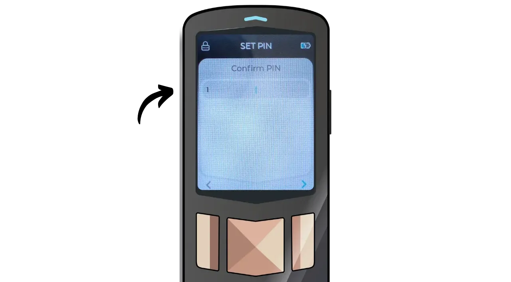

Il codice PIN è stato registrato.

## Aggiornamento del firmware del Passport

Il portafoglio hardware suggerisce di aggiornare il firmware. Vi consiglio di aggiornarlo immediatamente per beneficiare dei miglioramenti e delle correzioni apportate dalle ultime versioni. Per continuare, fare clic sul pulsante di conferma a destra.

Il Passport è pronto a ricevere il nuovo firmware tramite una scheda MicroSD.

### Senza applicazione Envoy

A tal fine, utilizzare la scheda MicroSD inclusa nella confezione del Passport (o un'altra) e inserirla nel computer. Scaricare l'ultima versione del firmware da [il sito di documentazione della Fondazione](https://docs.foundation.xyz/firmware-updates/passport/) o [il loro repository GitHub](https://github.com/Foundation-Devices/passport2/releases).

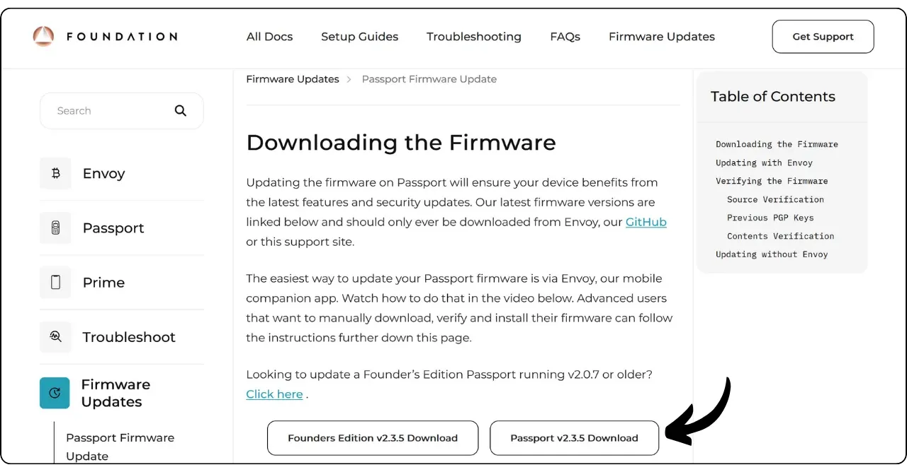

Prima di installarlo sul dispositivo, consigliamo vivamente di verificare l'autenticità e l'integrità del firmware scaricato. Se avete bisogno di aiuto, consultate questo tutorial:

https://planb.network/tutorials/others/general/integrity-authenticity-21d0420a-be02-4663-94a3-8d487f23becc
### Con l'applicazione Envoy

L'altra opzione, più semplice, consiste nell'utilizzare direttamente l'applicazione Envoy. Fare clic su "*Scaricare il firmware*".

Utilizzare l'adattatore fornito con il Passport per collegare la scheda MicroSD al telefono.

Selezionare la scheda MicroSD in Esplora file per salvare il firmware.

Il firmware è stato salvato. Rimuovere la MicroSD dallo smartphone e inserirla nel Passport.

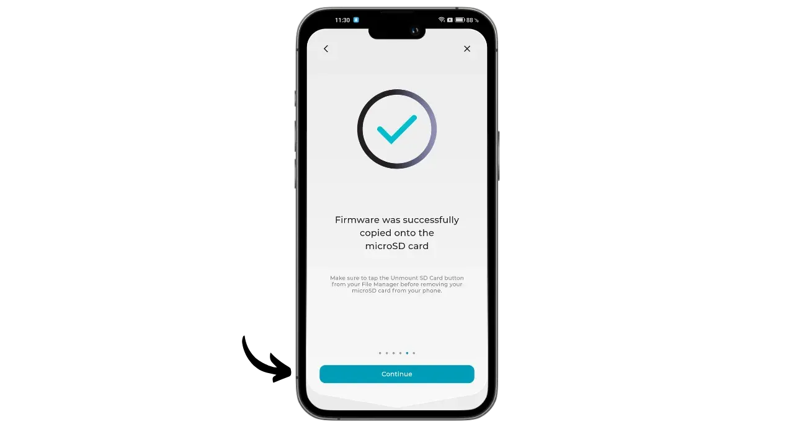

Si aprirà il file explorer di Passport. Selezionare il file `vN.N.N-passport.bin`.

Fare clic su "*Selezione*".

Confermare quindi l'installazione del firmware.

Attendere il completamento dell'aggiornamento.

Una volta completato l'aggiornamento, inserire il codice PIN per sbloccare il dispositivo e continuare la configurazione.

## Creare un nuovo portafoglio Bitcoin

Ora è il momento di creare un nuovo portafoglio Bitcoin. Fare clic sul pulsante di conferma.

Per creare un nuovo portafoglio, cliccare su "*Crea nuovo seme*".

È possibile scegliere tra una frase mnemonica di 12 o 24 parole. La sicurezza offerta da entrambe le opzioni è simile, quindi potete optare per quella più facile da salvare, cioè 12 parole.

Fare clic su "*Continua*".

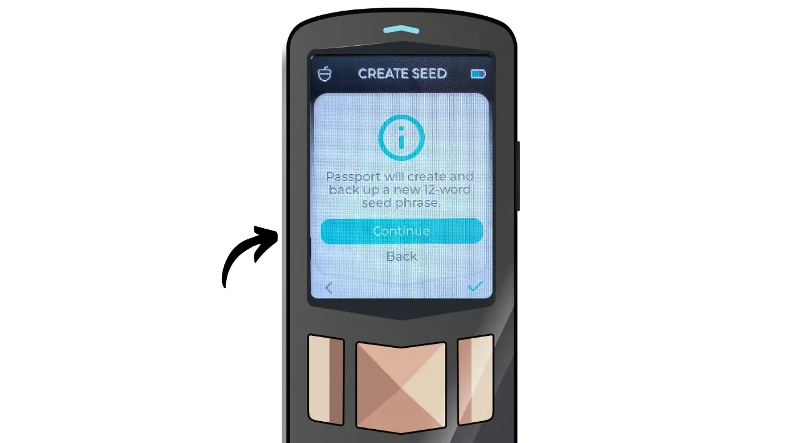

Il Passport genererà ora il "*Codice di backup*". Si tratta di una serie di numeri che possono essere utilizzati per decriptare un backup del portafoglio memorizzato su una MicroSD. Questo sistema di backup, specifico per i dispositivi Foundation, costituisce un ulteriore backup della vostra frase mnemonica, ma non è compatibile con altri software Bitcoin.

Se decidete di utilizzare questo "*Codice di backup*", assicuratevi di conservarlo in una posizione diversa dalla MicroSD contenente il backup crittografato del vostro portafoglio. Potete tuttavia scegliere di non utilizzare questo sistema se ritenete che un buon backup della vostra frase mnemonica sia sufficiente.

Inserire il "*Codice di backup*" per confermare il corretto salvataggio.

Se è stata inserita una MicroSD, il backup crittografato del portafoglio è stato salvato lì.

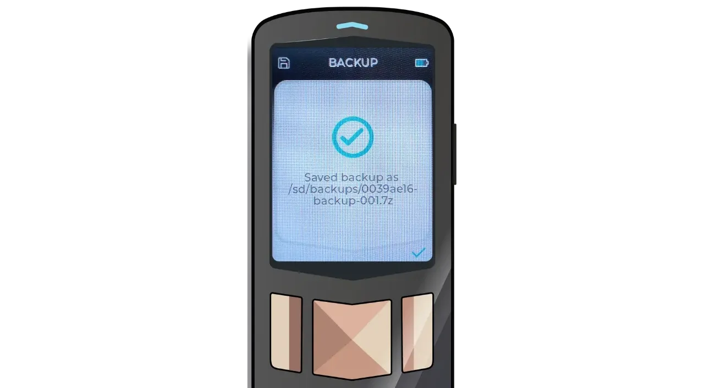

Sul passaporto viene visualizzata la frase mnemonica di 12 parole. Questa frase mnemonica vi dà accesso completo e illimitato a tutti i vostri bitcoin. Chiunque sia in possesso di questa frase può rubare i vostri fondi, anche senza accedere fisicamente al vostro Passaporto.

La frase di 12 parole ripristina l'accesso ai bitcoin in caso di perdita, furto o rottura del Passaporto. È quindi molto importante salvarlo con cura e conservarlo in un luogo sicuro.

Potete scriverlo sul cartoncino fornito nella scatola, oppure, per maggiore sicurezza, vi consiglio di inciderlo su una base in acciaio inossidabile per proteggerlo da incendi, allagamenti o crolli.

Cliccate sul pulsante di conferma per visualizzare la vostra frase mnemonica.

Per ulteriori informazioni sul modo corretto di salvare e gestire la frase mnemonica, vi consiglio di seguire quest'altro tutorial, soprattutto se siete principianti:

https://planb.network/tutorials/wallet/backup/backup-mnemonic-22c0ddfa-fb9f-4e3a-96f9-46e2a7954270
naturalmente, non dovete mai condividere queste parole su Internet, come sto facendo io in questa esercitazione. Questo portfolio di esempio sarà utilizzato solo su Testnet e sarà cancellato alla fine del tutorial.**_

Eseguite un backup fisico di questa frase.

Il Passport è stato configurato con successo. Fare clic sul pulsante di conferma per continuare.

## Impostazione del portafoglio su Envoy

In questa guida vi mostrerò come utilizzare il Passport con l'applicazione Envoy. Tuttavia, questo portafoglio hardware è compatibile anche con Sparrow Wallet, Keeper, BlueWallet, Nunchuk, Specter e molti altri...

Utilizzare l'applicazione Envoy per scansionare il codice QR visualizzato sul passaporto.

Le chiavi pubbliche sono ora importate nell'applicazione. Cliccate su "*Validate receive address*".

Utilizzare il passaporto per scansionare l'indirizzo visualizzato su Envoy.

Il passaporto confermerà se il portafoglio importato su Envoy è valido. Confermarlo nella domanda.

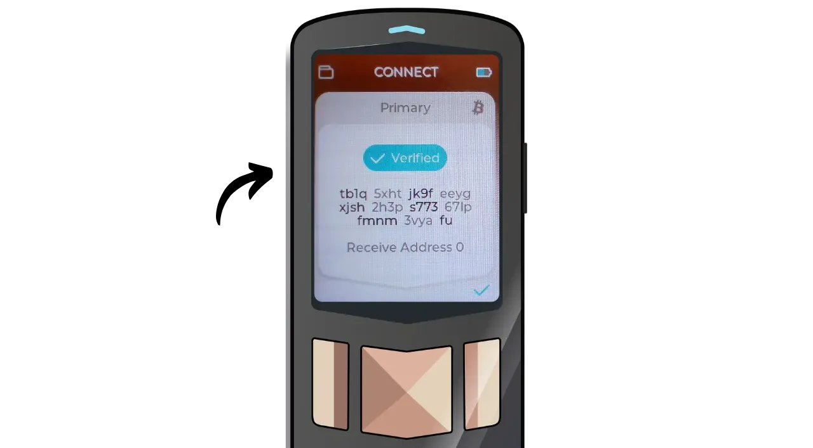

Ora è possibile accedere alle informazioni pubbliche del proprio portafoglio su Envoy, ma per spendere bitcoin è necessario utilizzare il Passport.

## Scoprire i menu del Passaporto

L'interfaccia del Passport presenta tre menu principali:

- "*Account*";
- "*Più*";
- "*Impostazioni*".

Per spostarsi tra questi menu, utilizzare le frecce sinistra e destra del pad direzionale.

### *Menu "Conto*

Nel menu "*Account*" si trovano le funzioni principali del portafoglio Bitcoin. È possibile firmare una transazione tramite la fotocamera o la porta MicroSD.

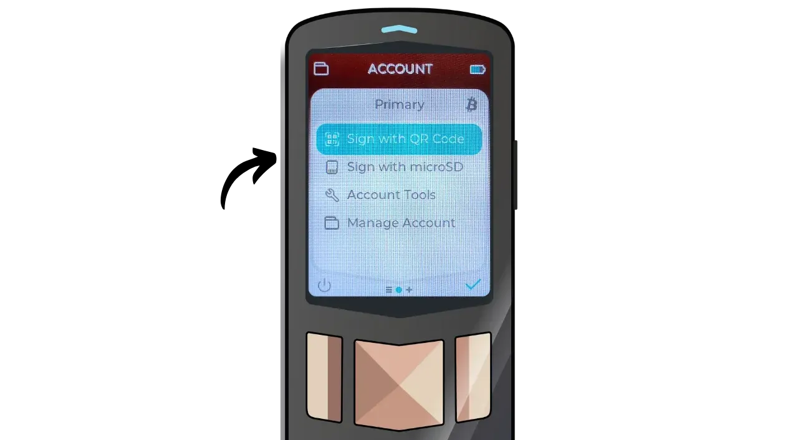

Il sottomenu "*Strumenti account*" offre opzioni quali la verifica di un indirizzo, la firma di un messaggio o la consultazione degli indirizzi in portafoglio.

Nel sottomenu "*Gestione del conto*" è possibile collegare il proprio portafoglio Bitcoin a un software di gestione del portafoglio (di cui parleremo nei prossimi passi di questo tutorial), oppure visualizzare e rinominare il proprio conto.

### Menu "Altro

Nel menu "*Più*" è possibile creare un nuovo account nel proprio portafoglio, collegato alla stessa frase mnemonica.

È inoltre possibile inserire una passphrase BIP39 o utilizzare un seed temporaneo.

### Menu "Impostazioni

Nel menu "*Impostazioni*" si trovano tutte le impostazioni del portafoglio e del dispositivo.

Il sottomenu "*Dispositivo*" offre opzioni per personalizzare la luminosità dello schermo, impostare il ritardo prima del blocco automatico, modificare il codice PIN o rinominare il dispositivo.

Il sottomenu "*Backup*" consente di esportare il backup criptato del portafoglio, di verificare la validità di un backup esistente o di ricercare nuovamente il "*Codice di backup*".

Il sottomenu "*Firmware*" consente di aggiornare il firmware del Passport. Si consiglia di eseguire regolarmente questi aggiornamenti per usufruire delle correzioni e delle funzioni più recenti.

Il sottomenu "*Bitcoin*" consente di cambiare l'unità di misura visualizzata (BTC o satoshis), di gestire un eventuale portafoglio Multisig o di passare alla modalità "*Testnet*".

In "*Avanzate*", è possibile visualizzare le parole della frase mnemonica, eseguire azioni sulla MicroSD inserita, ripristinare le impostazioni di fabbrica del Passport o eseguire un controllo di autenticità, come eseguito in precedenza.

È possibile attivare "*Parole di sicurezza*", una funzione che aggiunge un livello di sicurezza visualizzando due parole specifiche quando si sblocca il dispositivo dopo aver inserito le prime quattro cifre del codice PIN. Queste parole, da salvare durante la configurazione, garantiscono che il Passport non sia stato sostituito o manomesso. In caso di discrepanze successive, si consiglia di non utilizzare il dispositivo. Si consiglia di attivare questa opzione per evitare la maggior parte dei rischi di compromissione fisica del dispositivo.

Infine, il sottomenu "*Estensioni*" consente di attivare funzioni specifiche per determinati usi dell'apparecchio, come il protocollo coinjoin di Whirlpool.

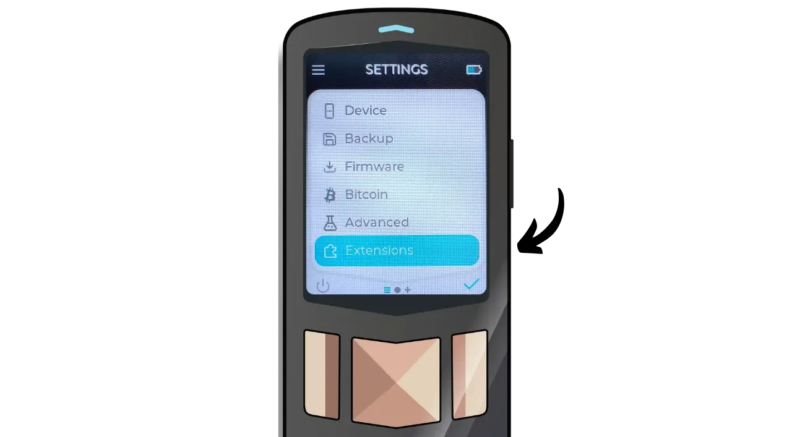

## Ricevere bitcoin

Ora che il Passport è stato configurato, siete pronti a ricevere le prime sature sul vostro nuovo portafoglio Bitcoin. Per farlo, su Envoy, cliccate sul vostro conto "*Primario 0*".

Fare clic sul pulsante "*Ricevi*".

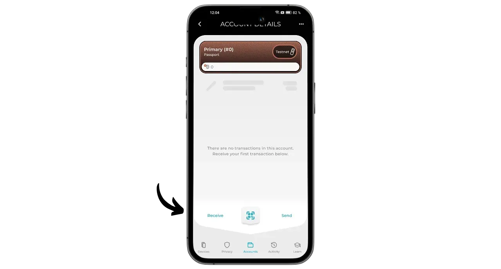

L'applicazione Envoy visualizza il primo indirizzo vuoto disponibile nel portafoglio. Prima di utilizzarlo, controlliamo l'indirizzo sulla schermata di Passport per assicurarci che appartenga davvero al nostro portafoglio Bitcoin. Nel menu "*Account*" di Passport, selezionare "*Strumenti account*".

Fare clic su "*Verifica indirizzo*", quindi scansionare il codice QR visualizzato su Envoy.

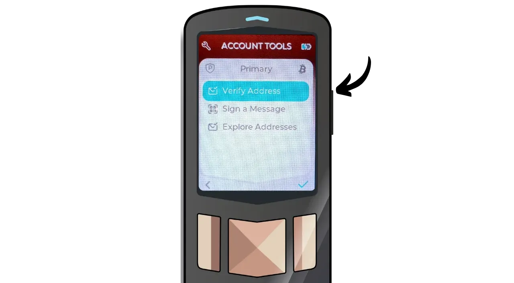

Assicuratevi che l'indirizzo visualizzato sul Passaporto corrisponda esattamente a quello visualizzato su Sparrow e che appaia la dicitura "*Verificato*".

Ora è possibile utilizzarlo per ricevere bitcoin. Quando la transazione viene trasmessa sulla rete, appare su Envoy. Aspettate di aver ricevuto un numero sufficiente di conferme per considerare la transazione definitiva.

## Inviare bitcoin

Ora che avete qualche saturazione nel vostro portafoglio, potete anche inviarne qualcuna. Per farlo, cliccate sul pulsante "*Invio*".

Inserite l'indirizzo del destinatario, incollandolo direttamente o scansionando il codice QR con la fotocamera dello smartphone.

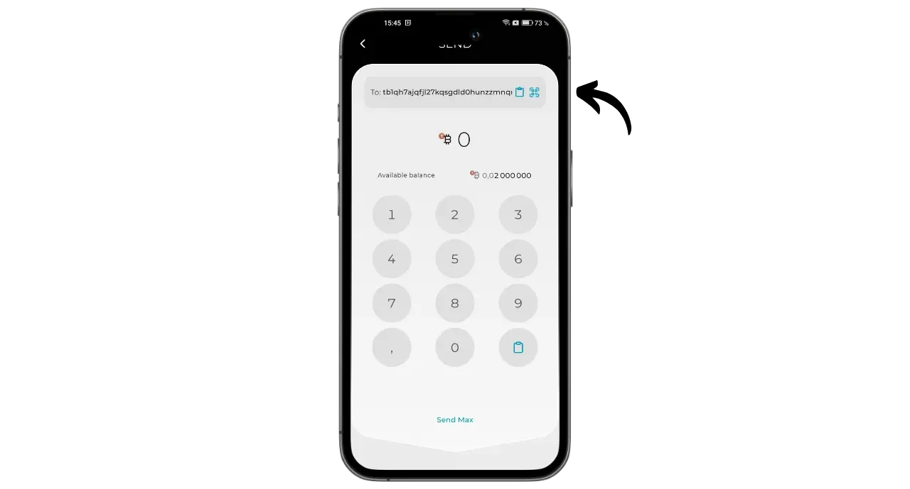

Determinare l'importo che si desidera inviare, quindi fare clic su "*Conferma*".

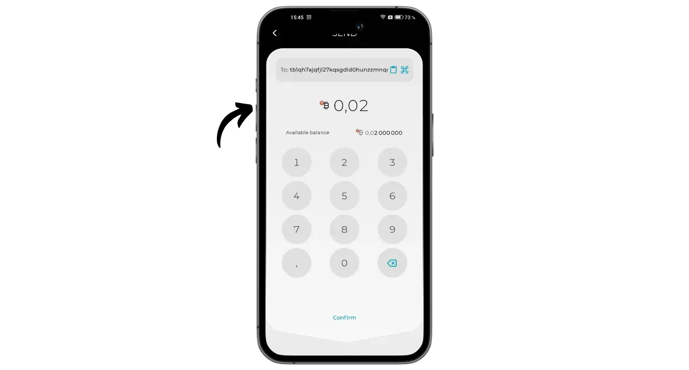

Selezionare la tariffa della transazione in base all'attuale situazione di mercato, quindi controllare le informazioni sulla transazione. Se tutto è corretto, fare clic su "*Firma con il passaporto*".

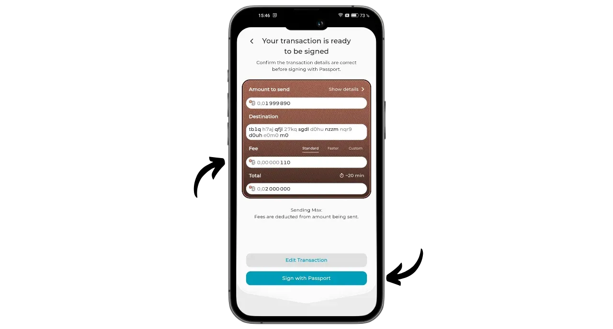

Aggiungete un'etichetta alla vostra transazione per avere una chiara traccia del suo scopo.

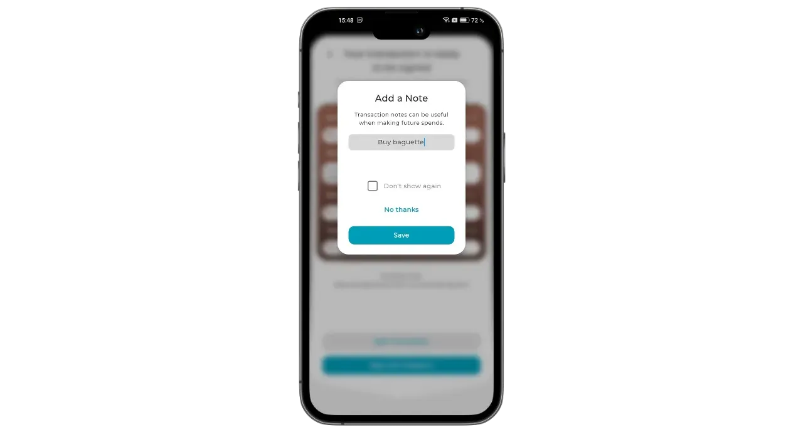

Envoy visualizza quindi una PSBT (*Transazione Bitcoin parzialmente firmata*). L'applicazione ha creato la transazione, ma mancano ancora le firme per sbloccare i bitcoin utilizzati nell'input. Queste firme possono essere eseguite solo da Passport, che ospita il seme e dà accesso alle chiavi private necessarie per firmare la transazione.

Sul Passport, accedere al menu "*Account*" e fare clic su "*Firma con codice QR*".

Scansionare il PSBT (*Transazione Bitcoin parzialmente firmata*) visualizzato su Envoy.

Confermare che l'indirizzo del destinatario e l'importo inviato siano corretti, quindi premere il pulsante di conferma.

Controllare l'indirizzo di scambio. Nel mio esempio non c'è, in quanto la transazione include una sola uscita.

Assicuratevi che la tariffa sia quella che avete scelto.

Se tutte le informazioni sono corrette, fare clic sul pulsante di conferma per firmare la transazione.

Il Passaporto mostra la transazione firmata sotto forma di codice QR.

Nell'applicazione Envoy, fare clic sull'icona del codice QR, quindi eseguire la scansione del PSBT visualizzato sullo schermo del Passaporto.

Controllare un'ultima volta i dettagli della transazione. Se tutto è corretto, premere "*Invia transazione*" per trasmetterla alla rete Bitcoin.

La transazione è ora in attesa di conferma. Potete seguirne lo stato direttamente dal vostro conto.

Congratulazioni, ora sapete come configurare e utilizzare Passport con l'applicazione Envoy. Se questa esercitazione vi è stata utile, vi sarei grato se lasciaste un pollice verde qui sotto. Sentitevi liberi di condividere questo articolo sui vostri social network. Grazie per la condivisione!

Per ulteriori informazioni, consultare il nostro tutorial sul software Liana:

https://planb.network/tutorials/wallet/desktop/liana-306ef457-700c-4fdd-b07a-8fb7a8a29f04