Envoy er et program for administrasjon av Bitcoin-lommebøker utviklet av Foundation. Den er spesialdesignet for bruk med Passport-maskinvarelommeboken.

Passport "*Batch 2*", som vi presenterer i denne veiledningen med Envoy-applikasjonen, er etterfølgeren til "*Founder's Edition*". Den har et førsteklasses design, HD-fargeskjerm og ergonomisk, fysisk tastatur. Den fungerer i "*Air-Gap*"-modus, noe som sikrer at lommebokens private nøkler forblir helt isolerte, og at utveksling er mulig via et MicroSD-kort eller QR-koder. Enheten har et avtakbart batteri på 1200 mAh.

Når det gjelder tilkoblingsmuligheter, er Passport utstyrt med en MicroSD-port, en USB-C-port for lading og et kamera på baksiden for skanning av QR-koder.

Når det gjelder sikkerhet, har Passport et sikkert element, og enhetens kildekode er helt åpen kildekode. Den tilbyr alle funksjonene som forventes av en god Bitcoin-maskinvarelommebok. Merk at Passport ennå ikke støtter miniscript, men denne funksjonen er planlagt for andre kvartal 2025.

Med en pris på 199 dollar er Passport posisjonert som en avansert maskinvarelommebok, og konkurrerer med Coldcard Q, Jade Plus, Tezor Safe 5 og Ledgers toppmodeller.

Du har flere alternativer for å administrere den sikre lommeboken din på en Passport. Denne maskinvarelommeboken er kompatibel med de fleste programvarene for lommebokadministrasjon på markedet, blant annet Sparrow Wallet, Specter Desktop, Nunchuk og Keeper.

I denne veiledningen, som er rettet mot nybegynnere og viderekomne brukere, skal vi se hvordan du bruker Envoy-applikasjonen med Passport. Det er den enkleste måten å få mest mulig ut av maskinvarelommeboken din på.

Hvis du er en avansert bruker og ønsker å utforske mer komplekse funksjoner, anbefaler jeg at du tar en titt på denne andre opplæringen der vi konfigurerer Passport med Sparrow Wallet :

https://planb.network/tutorials/wallet/hardware/passport-74e53858-3fa2-43f9-b866-573297546236
## Utpakking av passet

Når du mottar passet ditt, må du kontrollere at esken og forseglingen på kartongen er intakt for å bekrefte at pakken ikke har blitt åpnet. En programvareverifisering av enhetens autentisitet og integritet vil også bli utført når den settes opp.

Esken inneholder blant annet :

- Pass;
- Et stykke papp til å skrive ned huskesetningen din;
- En USB-C-kabel for lading ;
- MicroSD-kort ;
- To MicroSD til Lightning- eller USB-C-adaptere ;
- Klistremerker.

På enheten finner du :

- Et tastatur (1) ;
- USB-C-port (2);
- En sletteknapp (3);
- En returknapp (4) ;
- En bekreftelsesknapp (5);
- Retningsplate (6);
- På/av-knapp (7);
- En statusindikator (8);
- MicroSD-port (9) ;
- En knapp for å endre modus aA1 (10) ;
- Et kamera på baksiden.

## Last ned Envoy-applikasjonen

Gå til appbutikken din for å laste ned Envoy :

- På [Google Play Store] (https://play.google.com/store/apps/details?id=com.foundationdevices.envoy);
- På [App Store] (https://apps.apple.com/us/app/envoy-by-foundation/id1584811818);
- På [F-Cold] (https://foundation.xyz/fdroid/).

Du kan også laste ned APK-filen direkte [fra Foundations GitHub-depot] (https://github.com/Foundation-Devices/envoy/releases).

Når applikasjonen er åpen, velger du "*Administrer pass*".

Velg om du vil aktivere Tor-forbindelsen for å styrke konfidensialiteten, og trykk deretter på "*Fortsett*".

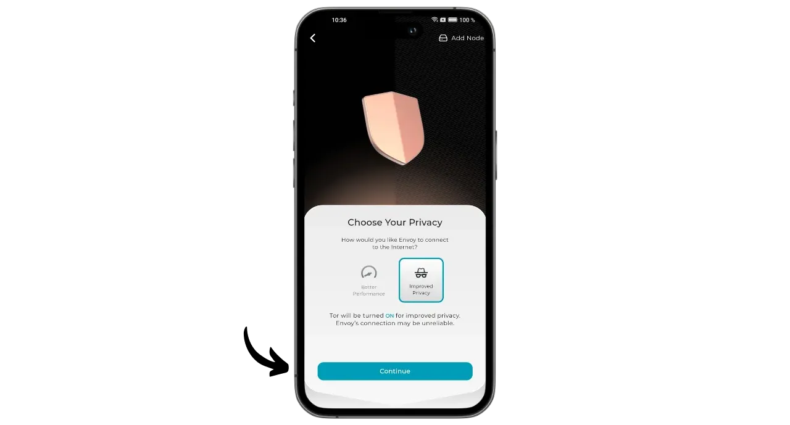

Velg "*Koble til et eksisterende pass*" hvis passet ditt allerede er konfigurert, eller "*Sett opp et nytt pass*" hvis du initialiserer maskinvarelommeboken din for første gang.

Godta vilkårene for bruk.

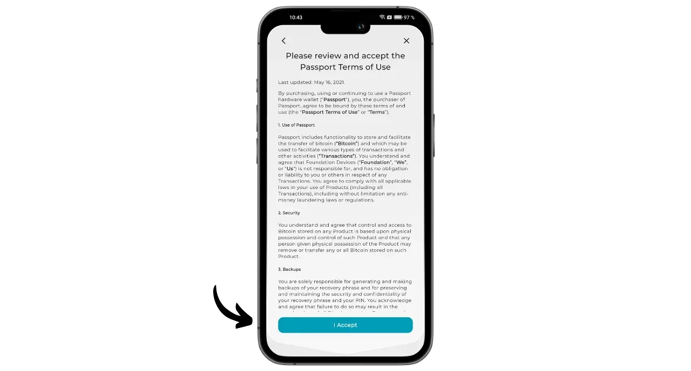

Du blir deretter bedt om å bekrefte passets ekthet. Klikk på "*Neste*".

## Starter pass

Trykk på av/på-knappen på siden av enheten for å starte den.

Trykk på bekreftelsesknappen for å gå til neste meny.

I denne veiledningen bruker vi Envoy til å administrere den passsikrede lommeboken. Velg "*Envoy App*".

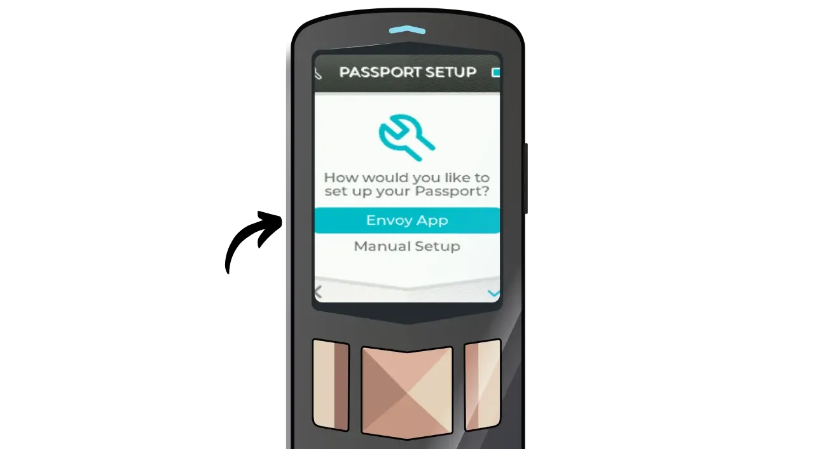

Klikk på "*Fortsett på Envoy*".

Neste trinn er å kontrollere enheten din. Dette bekrefter passets ekthet og sikrer at det ikke har blitt tuklet med under transporten. Du blir bedt om å skanne en QR-kode.

Skann de dynamiske QR-kodene som vises i applikasjonen med passet ditt. Når skanningen er fullført, klikker du på "*Neste*".

Bruk deretter telefonen til å skanne QR-koden som vises på passet ditt.

Hvis meldingen "*Your Passport is secure*" vises, bekrefter dette at maskinvarelommeboken din er ekte. Du kan nå bruke den til å sikre en Bitcoin-lommebok.

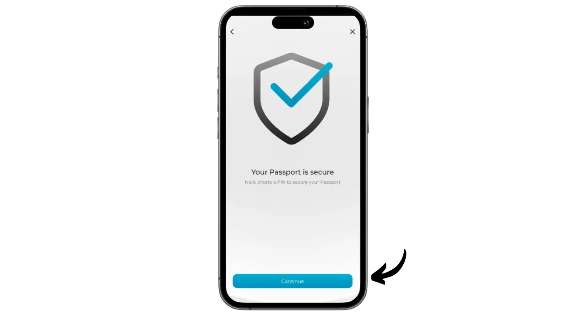

Bekreft testresultatet i passet ditt.

## Stille inn PIN-koden

Deretter kommer trinnet med PIN-koden. PIN-koden låser opp passet ditt. Den gir derfor beskyttelse mot uautorisert fysisk tilgang. PIN-koden er ikke involvert i utledningen av lommebokens kryptografiske nøkler. Så selv uten tilgang til PIN-koden kan du få tilgang til bitcoinsene dine hvis du er i besittelse av den mnemoniske frasen på 12 eller 24 ord.

Vi anbefaler at du velger en PIN-kode som er så tilfeldig som mulig. Sørg også for å lagre denne koden på et annet sted enn der passet ditt er lagret (f.eks. i en passordbehandler).

Du kan velge en PIN-kode på mellom 6 og 12 siffer. Jeg anbefaler deg å gjøre den så lang som mulig.

Bruk tastaturet til å taste inn PIN-koden. Når du er ferdig, klikker du på bekreftelsesknappen.

Bekreft PIN-koden din en gang til.

PIN-koden din er registrert.

## Oppdater fastvaren til Passport

Maskinvarelommeboken din foreslår at du oppdaterer fastvaren. Jeg anbefaler at du oppdaterer umiddelbart for å dra nytte av forbedringene og korrigeringene som de nyeste versjonene medfører. Klikk på bekreftelsesknappen til høyre for å fortsette.

Passet ditt er klart til å motta den nye fastvaren via et MicroSD-kort.

### Uten Envoy-applikasjon

For å gjøre dette bruker du MicroSD-kortet som fulgte med Passport-esken (eller et annet), og setter det inn i datamaskinen. Last ned den nyeste fastvareversjonen fra [Foundation documentation site] (https://docs.foundation.xyz/firmware-updates/passport/) eller [their GitHub repository] (https://github.com/Foundation-Devices/passport2/releases).

Før du installerer den på enheten din, anbefaler vi deg på det sterkeste å sjekke ektheten og integriteten til den nedlastede fastvaren. Hvis du trenger hjelp med dette, kan du se denne veiledningen :

https://planb.network/tutorials/others/general/integrity-authenticity-21d0420a-be02-4663-94a3-8d487f23becc
### Med Envoy-applikasjonen

Det andre, enklere alternativet er å bruke Envoy-applikasjonen direkte. Klikk på "*Last ned fastvare*".

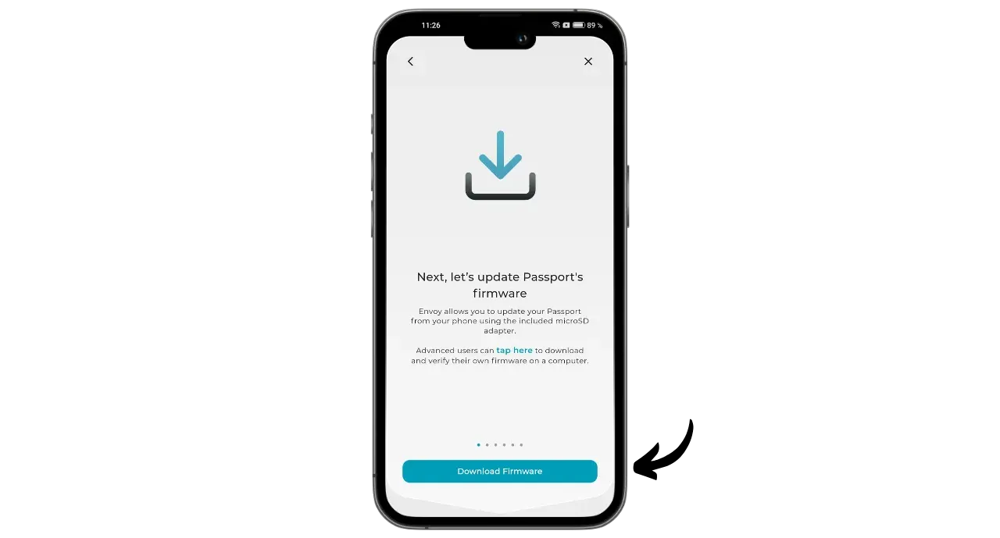

Bruk adapteren som fulgte med Passport, til å koble MicroSD-kortet til telefonen.

Velg MicroSD-kortet i filutforskeren for å lagre fastvaren.

Fastvaren er nå lagret. Ta ut MicroSD-kortet fra smarttelefonen, og sett det inn i Passport.

Passport-filutforskeren åpnes. Velg filen `vN.N.N-passport.bin`.

Klikk på "*Velg*".

Bekreft deretter installasjonen av fastvaren.

Vennligst vent til oppdateringen er fullført.

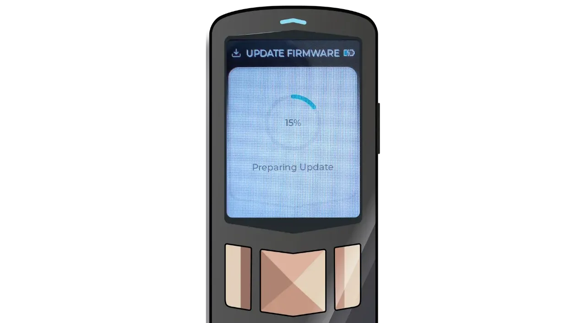

Når oppdateringen er fullført, skriver du inn PIN-koden for å låse opp enheten og fortsette konfigurasjonen.

## Opprett en ny Bitcoin-lommebok

Nå er det på tide å opprette en ny Bitcoin-lommebok. Klikk på bekreftelsesknappen.

For å opprette en ny portefølje klikker du på "*Opprett nytt frø*".

Du kan velge mellom en huskefrase på 12 eller 24 ord. Sikkerheten ved begge alternativene er lik, så du kan velge det som er enklest å lagre, dvs. 12 ord.

Klikk på "*Fortsett*".

Passet ditt vil nå generere din "*Backup Code*". Dette er en serie med tall som kan brukes til å dekryptere en sikkerhetskopi av lommeboken din som er lagret på et MicroSD-minne. Dette sikkerhetskopieringssystemet, som er spesifikt for Foundation-enheter, utgjør en ekstra sikkerhetskopi av minnefrasen din, men er ikke kompatibel med annen Bitcoin-programvare.

Hvis du velger å bruke denne "*Backup Code*", må du sørge for å oppbevare den på et annet sted enn MicroSD-kortet som inneholder den krypterte sikkerhetskopien av lommeboken din. Du kan imidlertid velge å ikke bruke dette systemet hvis du mener at en god sikkerhetskopi av minnefrasen din er tilstrekkelig.

Skriv inn "*Backup Code*" for å bekrefte at du har lagret den riktig.

Hvis du har satt inn et MicroSD-minne, er den krypterte sikkerhetskopien av porteføljen din lagret der.

Passet ditt vil vise den 12-ord lange minnefrasen din. Denne huskeregelen gir deg full, ubegrenset tilgang til alle bitcoinsene dine. Hvem som helst som er i besittelse av denne frasen kan stjele pengene dine, selv uten fysisk tilgang til passet ditt.

Frasen på 12 ord gjenoppretter tilgangen til bitcoinsene dine i tilfelle tap, tyveri eller ødeleggelse av passet ditt. Det er derfor svært viktig å lagre det nøye og oppbevare det på et sikkert sted.

Du kan skrive det på pappen som følger med i esken, eller for ekstra sikkerhet anbefaler jeg å gravere det på en sokkel i rustfritt stål for å beskytte det mot brann, oversvømmelse eller kollaps.

Klikk på bekreftelsesknappen for å se minnefrasen din.

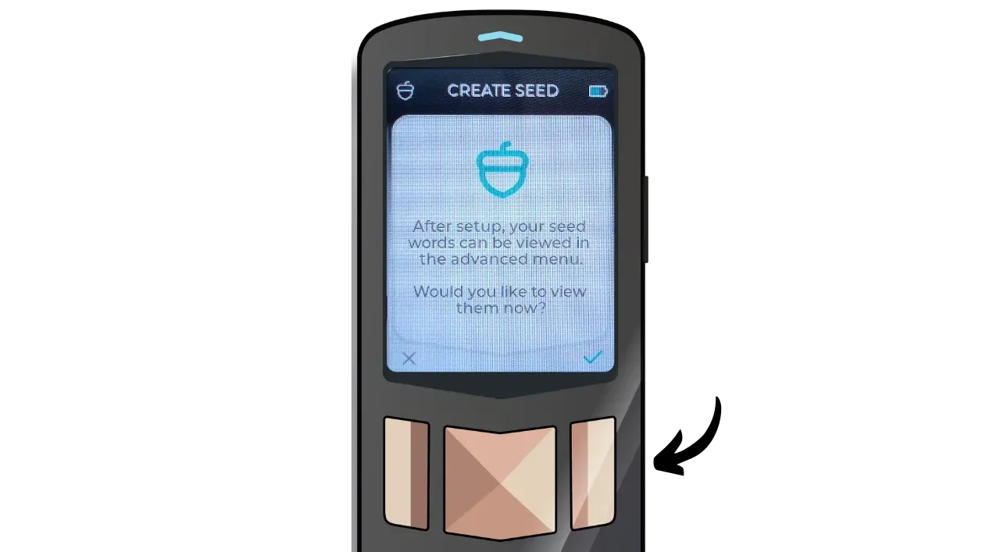

Hvis du vil ha mer informasjon om hvordan du lagrer og administrerer minnefrasen din, anbefaler jeg at du følger denne andre veiledningen, spesielt hvis du er nybegynner:

https://planb.network/tutorials/wallet/backup/backup-mnemonic-22c0ddfa-fb9f-4e3a-96f9-46e2a7954270
du må selvfølgelig aldri dele disse ordene på Internett, slik jeg gjør i denne opplæringen. Denne eksempelmappen vil kun bli brukt på Testnet, og vil bli slettet ved slutten av opplæringen

Lag en fysisk sikkerhetskopi av denne setningen.

Passet ditt er konfigurert. Klikk på bekreftelsesknappen for å fortsette.

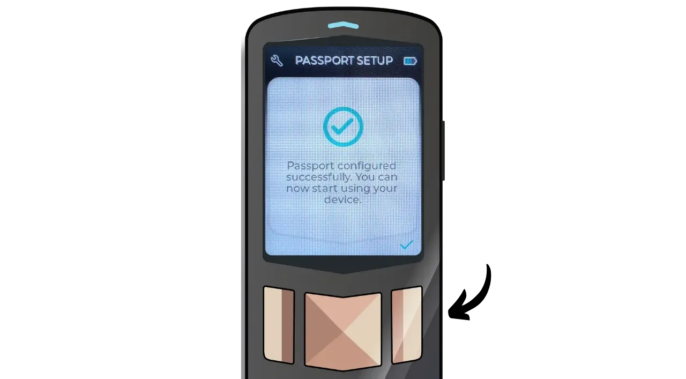

## Sette opp porteføljen på Envoy

I denne veiledningen viser jeg deg hvordan du bruker Passport med Envoy-applikasjonen. Denne maskinvarelommeboken er imidlertid også kompatibel med Sparrow Wallet, Keeper, BlueWallet, Nunchuk, Specter og mange andre...

Bruk Envoy-applikasjonen til å skanne QR-koden som vises på passet ditt.

De offentlige nøklene dine er nå importert til applikasjonen. Klikk på "*Valider mottaksadresse*".

Bruk passet ditt til å skanne adressen som vises på Envoy.

Passet ditt vil bekrefte om lommeboken som er importert på Envoy, er gyldig. Bekreft det i applikasjonen.

Du kan nå få tilgang til lommebokens offentlige informasjon på Envoy, men for å bruke bitcoins må du bruke passet ditt.

## Oppdag Passport-menyer

Passport-grensesnittet har tre hovedmenyer:

- "*Konto*";
- "*More*";
- "*Settings*".

Du navigerer mellom disse menyene ved hjelp av venstre- og høyrepilene på styreflaten.

### *Meny "Konto*

I menyen "*Account*" finner du hovedfunksjonene til Bitcoin-lommeboken din. Du kan signere en transaksjon enten via kameraet eller via MicroSD-porten.

Undermenyen "*Kontoverktøy*" tilbyr alternativer som å verifisere en adresse, signere en melding eller se adressene i porteføljen din.

I undermenyen "*Manage Account*" kan du koble Bitcoin-lommeboken din til en programvare for lommebokadministrasjon (som vi vil dekke i de neste trinnene i denne opplæringen), eller se og gi nytt navn til kontoen din.

### Menyen "Mer

I menyen "*More*" kan du opprette en ny konto i porteføljen din, knyttet til den samme huskeregelen.

Du kan også angi en BIP39-passordfrase eller bruke en midlertidig seed.

### Menyen "Innstillinger

I menyen "*Innstillinger*" finner du alle lommebok- og enhetsinnstillingene dine.

Undermenyen "*Device*" gir deg mulighet til å tilpasse lysstyrken på skjermen, stille inn forsinkelsen før automatisk låsing, endre PIN-koden eller gi enheten et nytt navn.

I undermenyen "*Backup*" kan du eksportere den krypterte sikkerhetskopien av porteføljen din, sjekke gyldigheten til en eksisterende sikkerhetskopi eller slå opp "*Backup Code*" på nytt.

Undermenyen "*Firmware*" er for oppdatering av fastvaren til Passport. Vi anbefaler at du utfører disse oppdateringene regelmessig for å dra nytte av de nyeste rettelsene og funksjonene.

I undermenyen "*Bitcoin*" kan du endre enheten som vises (BTC eller satoshis), administrere en eventuell Multisig-lommebok eller bytte til "*Testnet*"-modus.

I "*Avansert*" kan du se ordene i minnefrasen din, utføre handlinger på det innsatte MicroSD-kortet, tilbakestille passet til fabrikkinnstillingene eller utføre en autentisitetskontroll, slik du gjorde tidligere.

Du kan aktivere "*Security Words*", en funksjon som gir et ekstra sikkerhetslag ved å vise to spesifikke ord når du låser opp enheten etter å ha tastet inn de fire første sifrene i PIN-koden. Disse ordene, som lagres under konfigurasjonen, sikrer at Passport ikke har blitt byttet ut eller tuklet med. Hvis det skulle oppstå uoverensstemmelser på et senere tidspunkt, anbefaler vi at du ikke bruker enheten. Jeg anbefaler at du aktiverer dette alternativet for å forhindre de fleste risikoer for fysisk kompromittering av enheten.

Til slutt kan du i undermenyen "*Extensions*" aktivere funksjoner som er spesifikke for visse bruksområder for apparatet, for eksempel Whirlpool coinjoin-protokollen.

## Motta bitcoins

Nå som passet ditt er satt opp, er du klar til å motta de første satsene på din nye Bitcoin-lommebok. For å gjøre dette, klikker du på "*Primary 0*"-kontoen din på Envoy.

Klikk på knappen "*Mottak*".

Envoy-applikasjonen viser den første ledige, tomme adressen i lommeboken din. Før vi bruker den, la oss sjekke adressen på Passport-skjermen for å forsikre oss om at den virkelig tilhører Bitcoin-lommeboken vår. I menyen "*Account*" i Passport velger du "*Account Tools*".

Klikk på "*Verify Address*", og skann deretter QR-koden som vises på Envoy.

Kontroller at adressen som vises på passet, stemmer nøyaktig overens med den som vises på Sparrow, og at "*Verified*" vises.

Du kan nå bruke den til å motta bitcoins. Når transaksjonen sendes ut i nettverket, vil den vises på Envoy. Vent til du har mottatt nok bekreftelser til å anse transaksjonen som endelig.

## Send bitcoins

Nå som du har noen sats i lommeboken, kan du også sende noen. Det gjør du ved å klikke på "*Send*"-knappen.

Skriv inn mottakerens adresse, enten ved å lime den inn direkte eller ved å skanne QR-koden med kameraet på smarttelefonen.

Bestem beløpet du ønsker å sende, og klikk deretter på "*Bekreft*".

Velg transaksjonsgebyret i henhold til gjeldende markedssituasjon, og kontroller deretter transaksjonsinformasjonen. Hvis alt er riktig, klikker du på "*Signer med pass*".

Sett en etikett på transaksjonen for å holde oversikt over formålet med den.

Envoy viser deretter en PSBT (*Partially Signed Bitcoin Transaction*). Programmet har bygget transaksjonen, men mangler fortsatt signaturen(e) for å låse opp bitcoinsene som brukes i inndataene. Disse signaturene kan bare utføres av Passport, som er vert for ditt seed som gir tilgang til de private nøklene som trengs for å signere transaksjonen.

Gå til menyen "*Account*" i passet ditt, og klikk på "*Signer med QR-kode*".

Skann PSBT (*Partially Signed Bitcoin Transaction*) som vises på Envoy.

Bekreft at mottakeradressen og beløpet som sendes er riktig, og trykk deretter på bekreftelsesknappen.

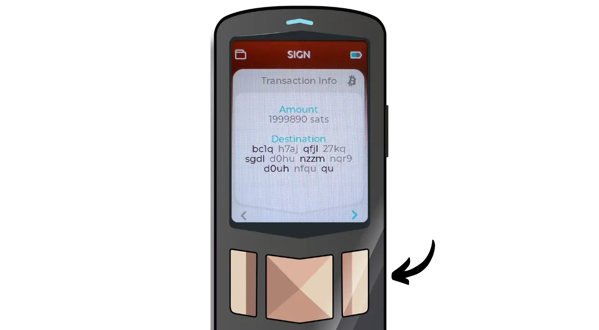

Sjekk utvekslingsadressen. I mitt eksempel er det ingen, siden transaksjonen inkluderer en enkelt utgang.

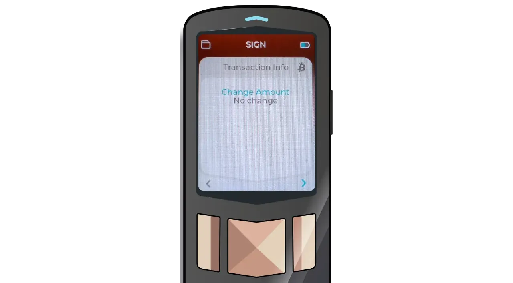

Forsikre deg om at avgiften er den du har valgt.

Hvis alle opplysningene er korrekte, klikker du på bekreftelsesknappen for å signere transaksjonen.

Passet ditt viser deg den signerte transaksjonen i form av en QR-kode.

I Envoy-applikasjonen klikker du på QR-kodeikonet og skanner deretter PSBT-koden som vises på passskjermen.

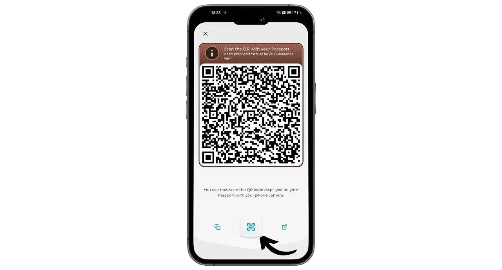

Sjekk transaksjonsdetaljene dine en siste gang. Hvis alt er riktig, trykker du på "*Send Transaction*" for å sende den ut på Bitcoin-nettverket.

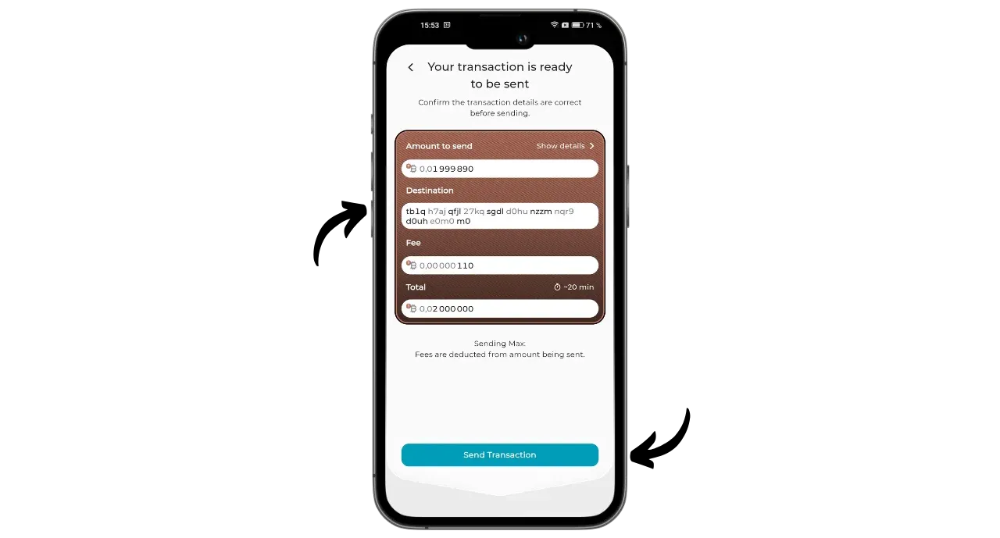

Transaksjonen din venter nå på bekreftelse. Du kan følge statusen direkte fra kontoen din.

Gratulerer, du vet nå hvordan du konfigurerer og bruker Passport med Envoy-applikasjonen. Hvis du synes denne veiledningen var nyttig, vil jeg være takknemlig hvis du legger igjen en grønn tommel nedenfor. Del gjerne denne artikkelen på dine sosiale nettverk. Takk for at du deler!

For mer informasjon, se vår veiledning om Liana-programvaren:

https://planb.network/tutorials/wallet/desktop/liana-306ef457-700c-4fdd-b07a-8fb7a8a29f04