Envoy 是基金会开发的比特币钱包管理应用程序。它专为与 Passport 硬件钱包配合使用而设计。

我们在本教程中介绍的带有 Envoy 应用程序的 Passport "*Batch 2*"是 "*创始人版*"的后续产品。它采用优质设计、高清彩屏和符合人体工程学的物理键盘。它以 "*Air-Gap*"模式运行，确保钱包私钥完全隔离，可通过 MicroSD 卡或二维码进行交换。该设备配有 1200 毫安时可拆卸电池。

在连接性方面，Passport 配备了一个 MicroSD 端口、一个用于充电的 USB-C 端口和一个用于扫描二维码的后置摄像头。

在安全性方面，Passport 加入了安全元素，设备的源代码完全开源。它具备优秀比特币硬件钱包所应具备的所有功能。需要注意的是，Passport 还不支持 miniscript，但该功能计划在 2025 年第二季度推出。

Passport 的售价为 199 美元，定位为高端硬件钱包，竞争对手包括 Coldcard Q、Jade Plus、Tezor Safe 5 和 Ledger 的顶级型号。

要在 Passport 上管理安全钱包，您有多种选择。这种硬件钱包与市场上大多数钱包管理软件兼容，包括 Sparrow Wallet、Specter Desktop、Nunchuk 和 Keeper 等。

本教程面向初级和中级用户，我们将介绍如何在 Passport 上使用 Envoy 应用程序。这是充分利用硬件钱包的最简单方法。

如果您是高级用户，并想了解更复杂的功能，我建议您查看本教程，在本教程中，我们使用 Sparrow Wallet 配置 Passport：

https://planb.network/tutorials/wallet/hardware/passport-74e53858-3fa2-43f9-b866-573297546236
## 护照开箱

当您收到 Passport 时，请确保包装盒和纸箱上的封条完好无损，以确认包装未被打开。在设置设备时，还将对设备的真实性和完整性进行软件验证。

盒内物品包括 ：

- 护照；
- 一张纸板，用来写下你的记忆短语；
- 用于充电的 USB-C 连接线；
- MicroSD 卡 ；
- 两个 MicroSD 转 Lightning 或 USB-C 适配器；
- 贴纸

在设备上，您可以找到 ：

- 键盘 (1) ；
- USB-C 端口 (2)；
- 删除按钮 (3)；
- 返回按钮 (4) ；
- 确认按钮 (5)；
- 方向垫 (6)；
- 开/关按钮 (7)；
- 状态指示灯 (8)；
- MicroSD 接口 (9) ；
- 用于切换模式 aA1 的按钮 (10) ；
- 后置摄像头

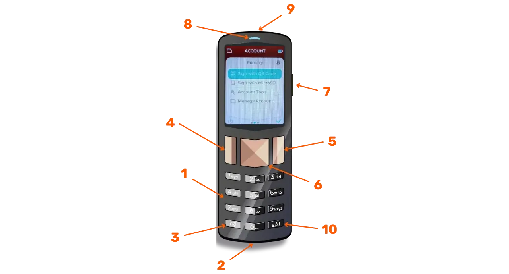

## 下载特使申请表

前往应用程序商店下载 Envoy ：

- 在 [Google Play 商店](https://play.google.com/store/apps/details?id=com.foundationdevices.envoy)；
- 在 [App Store](https://apps.apple.com/us/app/envoy-by-foundation/id1584811818) 上；
- 关于 [F-冷](https://foundation.xyz/fdroid/)。

您也可以直接[从基金会的 GitHub 代码库]下载 APK 文件(https://github.com/Foundation-Devices/envoy/releases)。

打开应用程序后，选择 "*管理护照*"。

选择是否要激活 Tor 连接以加强保密性，然后按 "*继续*"。

如果您的 Passport 已经配置，请选择 "*连接现有 Passport*"；如果您是首次初始化硬件钱包，请选择 "*设置新 Passport*"。

接受使用条款。

然后会要求您验证护照的真实性。点击 "*下一步*"。

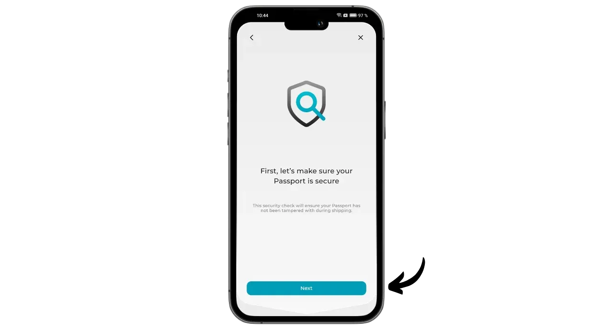

## 起始护照

按下设备侧面的开/关按钮启动设备。

按确认按钮进入下一个菜单。

在本教程中，我们将使用 Envoy 管理护照安全钱包。选择 "*Envoy App*"。

点击 "*继续特使*"。

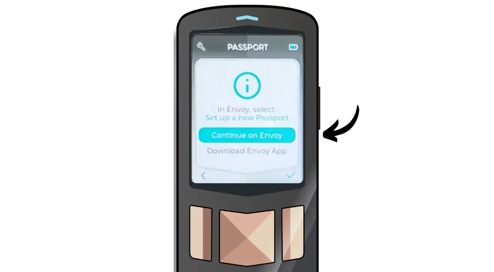

下一步是检查您的设备。这将确认护照的真实性，并确保护照在运输途中未被篡改。您需要扫描一个 QR 码。

用护照扫描应用程序中显示的动态 QR 码。扫描完成后，点击 "*下一步*"。

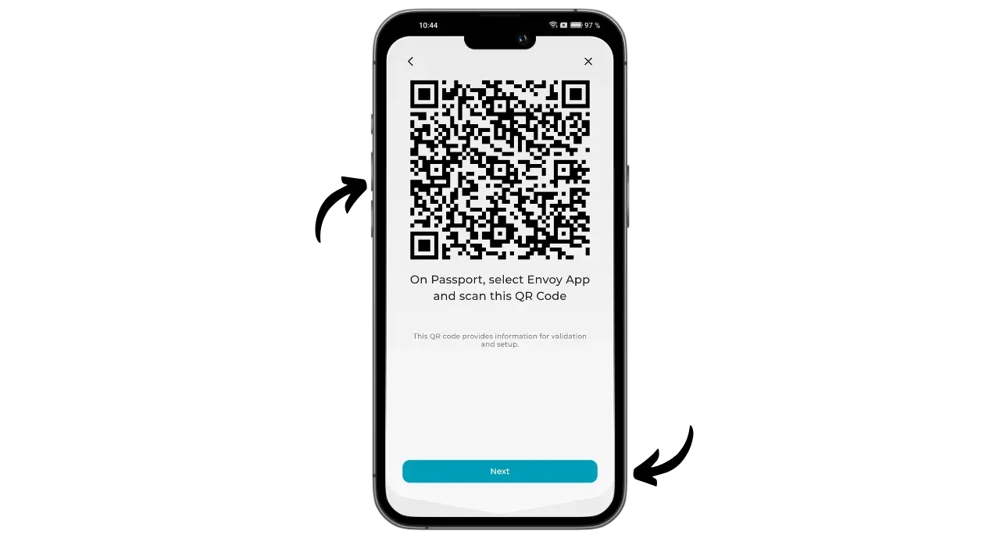

然后用手机扫描护照上显示的 QR 码。

如果出现 "*您的护照是安全的*"信息，这就证明您的硬件钱包是真实的。现在您就可以用它来保护比特币钱包了。

在护照上确认检测结果。

## 设置 PIN 码

接下来是 PIN 码步骤。PIN 码可以解锁您的护照。因此，它可以防止未经授权的物理访问。PIN 码不参与钱包加密密钥的生成。因此，即使无法获得 PIN 码，只要拥有 12 或 24 个字的记忆短语，就能重新获得比特币。

我们建议选择一个尽可能随机的 PIN 码。此外，请务必将该密码保存在与您的护照存储位置不同的地方（如密码管理器中）。

您可以选择 6 到 12 位数字的 PIN 码。我建议您尽量设置得长一些。

使用键盘输入密码。完成后，点击确认按钮。

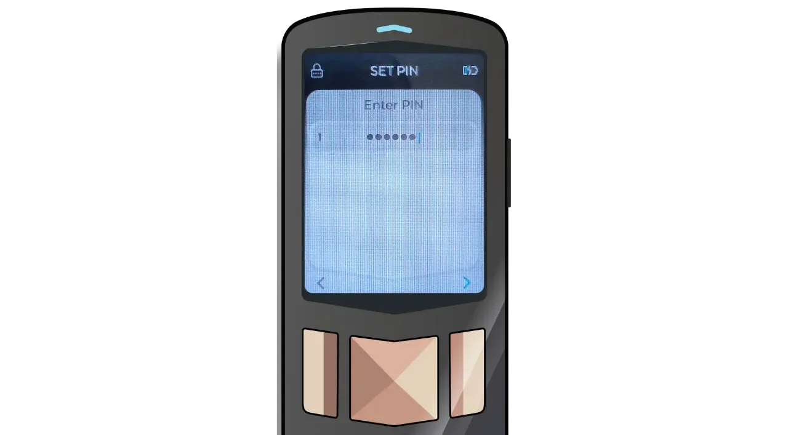

再次确认 PIN 码。

您的 PIN 码已注册。

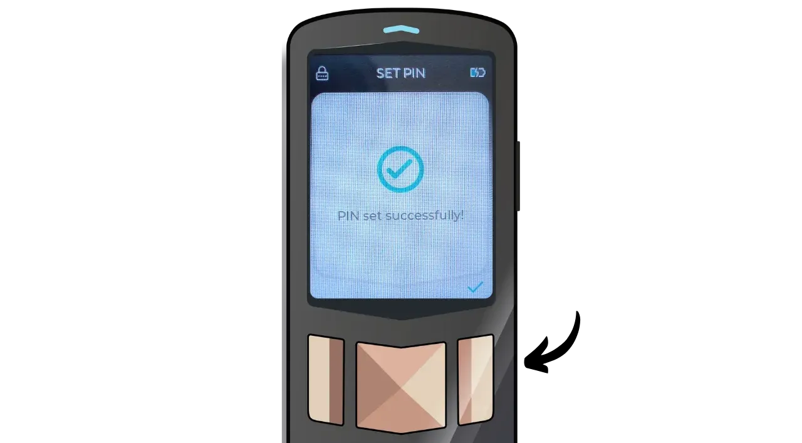

## 更新 Passport 固件

您的硬件钱包建议您更新固件。我建议您立即更新，以受益于最新版本带来的改进和修复。要继续，请单击右侧的确认按钮。

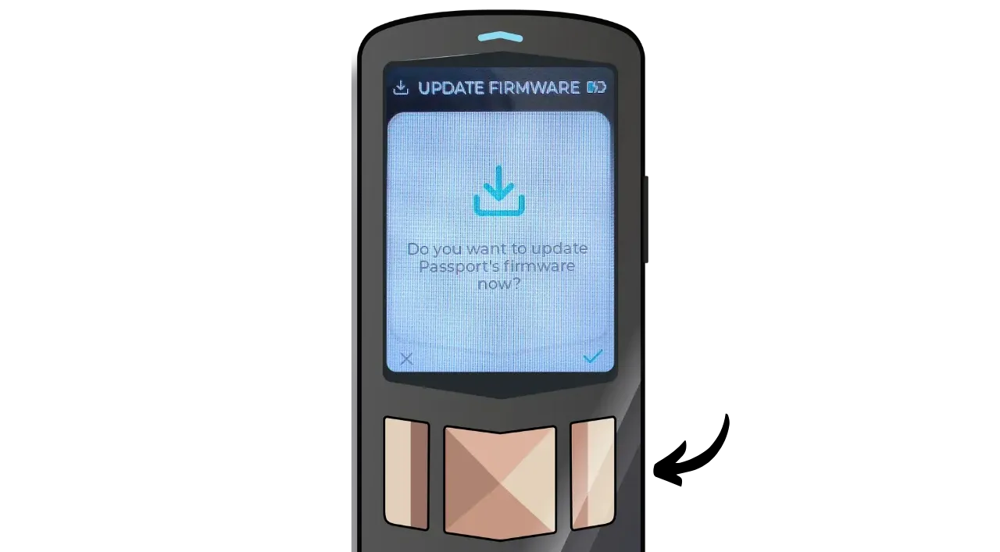

您的 Passport 已准备好通过 MicroSD 卡接收新固件。

### 未申请特使

为此，请使用 Passport 包装盒中的 MicroSD 卡（或其他卡），并将其插入电脑。从[基金会文档网站](https://docs.foundation.xyz/firmware-updates/passport/) 或[其 GitHub 存储库](https://github.com/Foundation-Devices/passport2/releases) 下载最新固件版本。

在您的设备上安装之前，我们强烈建议您检查下载固件的真实性和完整性。如果您需要帮助，请参阅本教程 ：

https://planb.network/tutorials/others/general/integrity-authenticity-21d0420a-be02-4663-94a3-8d487f23becc
### 使用特使应用程序

另一种更简单的方法是直接使用 Envoy 应用程序。点击 "*下载固件*"。

使用 Passport 随附的适配器将 MicroSD 卡连接到手机。

在文件资源管理器中选择 MicroSD 卡来保存固件。

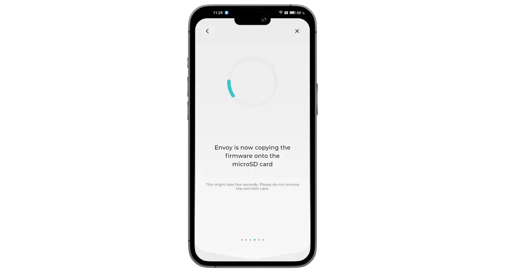

固件已保存。从智能手机中取出 MicroSD 并将其插入 Passport。

Passport 文件浏览器将打开。选择文件 `vN.N.N-passport.bin`。

点击 "*选择*"。

然后确认固件安装。

请等待更新完成。

更新完成后，输入 PIN 码解锁设备并继续配置。

## 创建一个新的比特币钱包

现在是时候创建一个新的比特币钱包了。点击确认按钮。

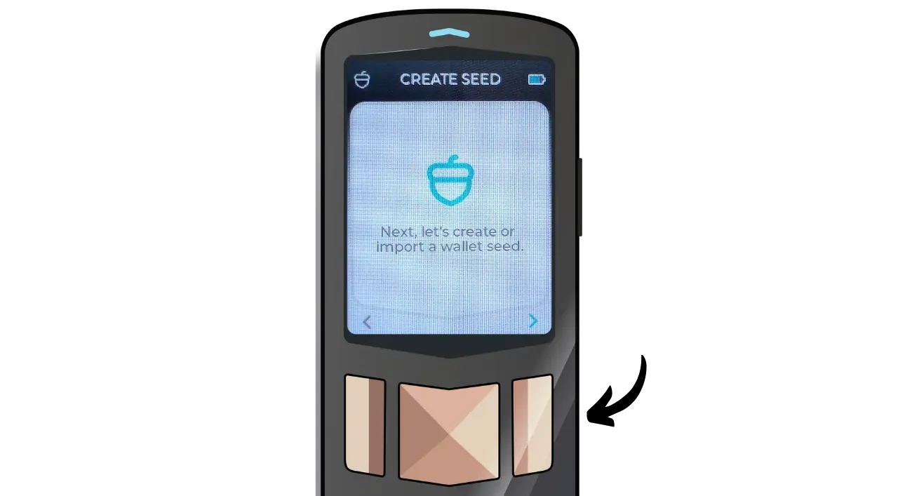

要创建新的投资组合，请点击 "*创建新种子*"。

您可以选择 12 个字或 24 个字的记忆短语。这两个选项提供的安全性相似，因此您可以选择最容易保存的选项，即 12 个单词。

点击 "*继续*"。

现在，您的 Passport 将生成您的 "*备份代码*"。这是一串数字，可用于解密存储在 MicroSD 上的钱包备份。该备份系统是基金会设备特有的，是您记忆短语的额外备份，但与其他比特币软件不兼容。

如果您决定使用此 "*备份代码*"，请务必将其保存在与包含钱包加密备份的 MicroSD 不同的位置。不过，如果您认为有一个好的记忆短语备份就足够了，也可以选择不使用该系统。

输入 "*备份代码*"，确认保存正确。

如果已插入 MicroSD，则已将投资组合的加密备份保存在其中。

您的 "护照 "将显示您的 12 字记忆短语。有了这个记忆短语，您就可以完全不受限制地使用您的所有比特币。任何拥有这个短语的人都可以盗取你的资金，即使没有你护照的物理访问权限。

如果您的护照丢失、被盗或破损，这 12 个字的短语可以恢复您对比特币的访问。因此，小心保存护照并将其存放在安全的地方非常重要。

您可以在包装盒内提供的纸板上书写，或者为了提高安全性，我建议您将其刻在不锈钢底座上，以防火灾、水灾或倒塌。

点击确认按钮，查看您的记忆短语。

有关保存和管理记忆短语的正确方法的更多信息，我强烈推荐大家阅读另一篇教程，尤其是初学者：

https://planb.network/tutorials/wallet/backup/backup-mnemonic-22c0ddfa-fb9f-4e3a-96f9-46e2a7954270
当然，你绝对不能在互联网上分享这些文字，就像我在本教程中所做的那样。本示例作品集将仅在 Testnet 上使用，并将在教程结束时删除。

对这句话进行物理备份。

您的护照已成功配置。点击确认按钮继续。

## 在 Envoy 上设置投资组合

在本教程中，我将向您展示如何将 Passport 与 Envoy 应用程序配合使用。不过，这款硬件钱包也兼容 Sparrow Wallet、Keeper、BlueWallet、Nunchuk、Specter 和许多其他...

使用 Envoy 应用程序扫描护照上显示的 QR 码。

您的公钥现已导入应用程序。点击 "*验证接收地址*"。

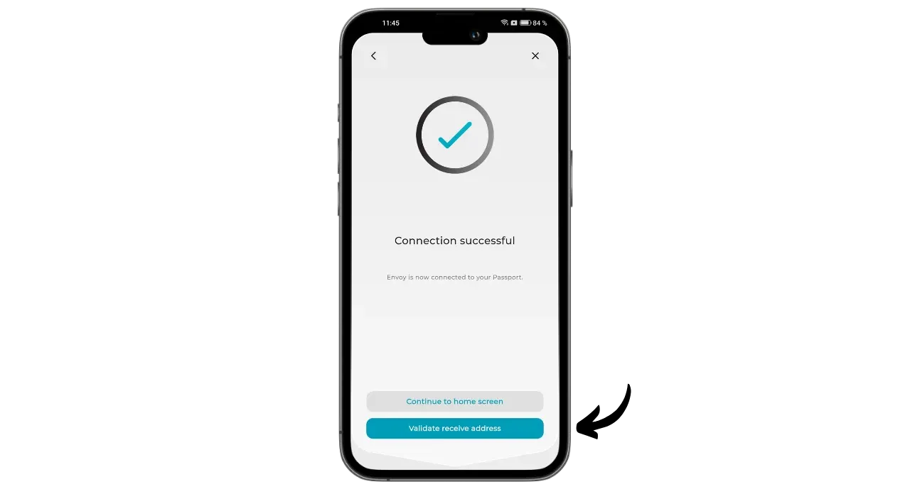

使用护照扫描 Envoy 上显示的地址。

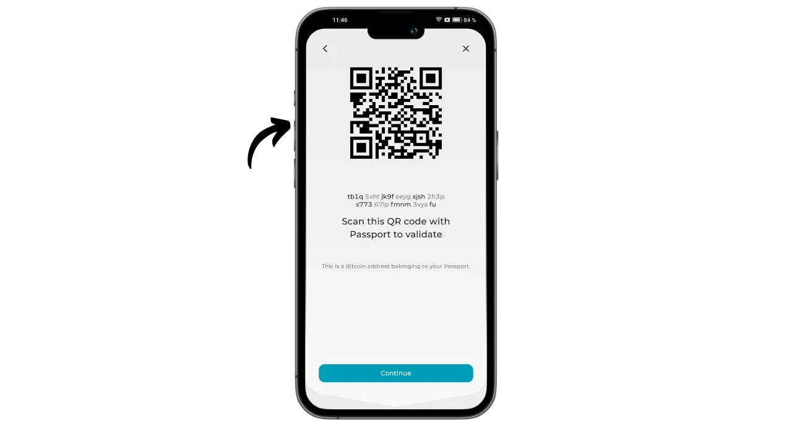

您的护照将确认在 Envoy 上导入的钱包是否有效。在申请中确认。

现在你可以在 Envoy 上访问钱包的公开信息，但要花比特币，你需要使用你的 Passport。

## 发现护照菜单

Passport 界面有三个主要菜单：

- "*账户*"；
- "*更多*"；
- "*设置*"。

要在这些菜单之间导航，请使用方向盘上的左右箭头。

### *账户*"菜单

在 "*账户*"菜单中，您可以找到比特币钱包的主要功能。您可以通过摄像头或 MicroSD 端口签署交易。

账户工具*"子菜单提供了各种选项，如验证地址、签署邮件或查询您的投资组合中的地址。

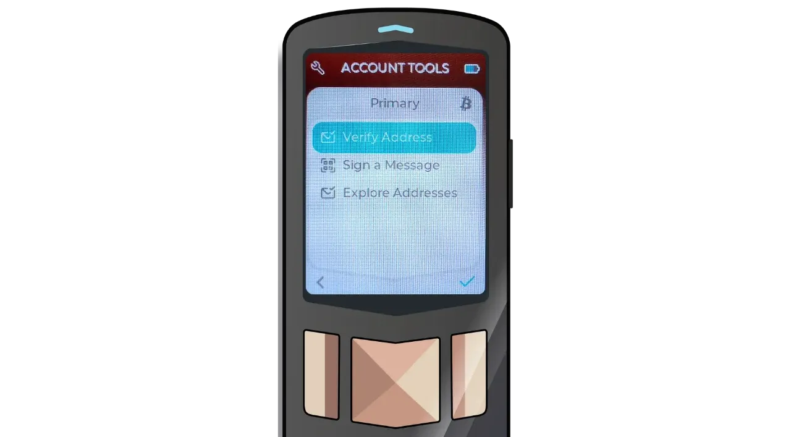

在 "*管理账户*"子菜单中，你可以将比特币钱包连接到钱包管理软件（我们将在本教程的下一步介绍），或者查看和重命名你的账户。

### 更多 "菜单

在 "*更多*"菜单中，您可以在您的投资组合中创建一个新账户，并与相同的记忆短语相连。

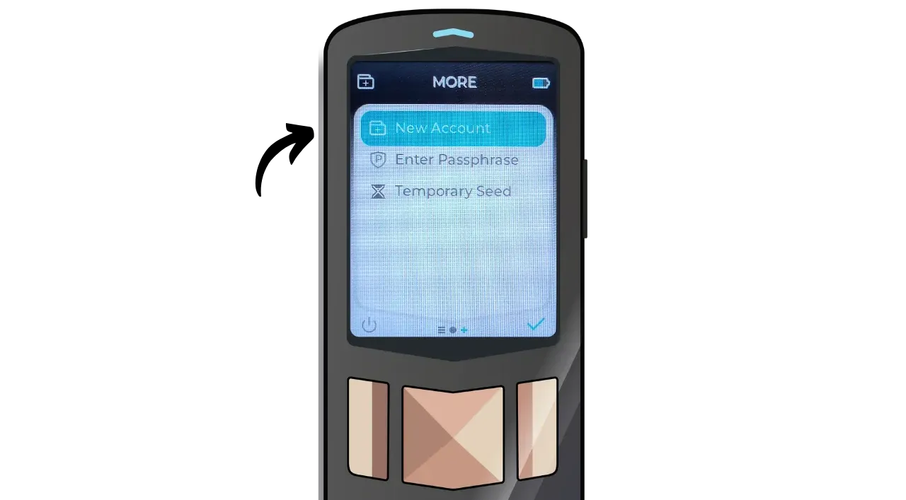

您也可以输入 BIP39 密码或使用临时种子。

### 设置 "菜单

在 "*设置*"菜单中，您可以找到钱包和设备的所有设置。

设备*"子菜单提供了自定义屏幕亮度、设置自动锁定前的延迟、更改 PIN 码或重命名设备等选项。

通过 "*备份*"子菜单，您可以导出加密的投资组合备份，检查现有备份的有效性，或再次查询 "*备份代码*"。

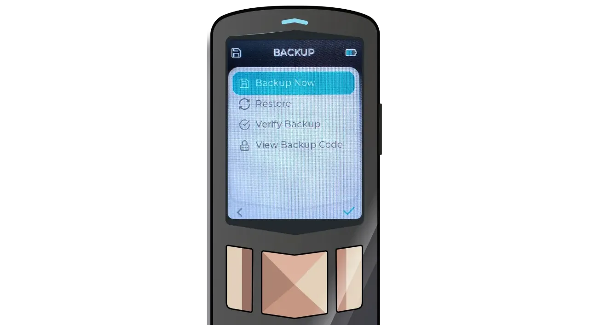

固件*"子菜单用于更新 Passport 的固件。我们建议您定期进行这些更新，以便从最新的修复和功能中获益。

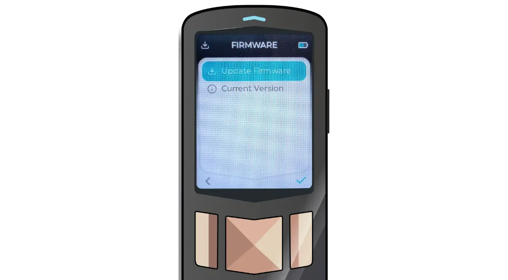

通过 "*Bitcoin*"子菜单，您可以更改显示的单位（BTC 或 satoshis），管理可能的 Multisig 钱包，或切换到 "*Testnet*"模式。

在 "*高级*"中，您可以查看记忆短语的单词，对插入的 MicroSD 执行操作，将 Passport 重置为出厂设置，或执行先前执行的真实性检查。

您可以激活 "*安全词*"，该功能可在输入 PIN 码的前四位数字后解锁设备时显示两个特定的词，从而增加一层安全性。这些文字将在配置时保存，以确保 Passport 未被更换或篡改。如果日后出现任何不一致的情况，我们建议您不要使用该设备。我建议您激活此选项，以防止设备受到物理破坏的大部分风险。

最后，"*扩展功能*"子菜单可让您激活设备特定用途的功能，如惠而浦硬币连接协议。

## 接收比特币

现在，你的 Passport 已经设置好了，你已经准备好在你的新比特币钱包上接收第一笔交易了。为此，请在 Envoy 上点击您的 "*Primary 0*"账户。

点击 "*接收*"按钮。

Envoy 应用程序会显示钱包中第一个可用的空白地址。在使用之前，我们先检查一下 Passport 屏幕上的地址，确保它确实属于我们的比特币钱包。在 Passport 的 "*账户*"菜单中选择 "*账户工具*"。

点击 "*验证地址*"，然后扫描 Envoy 上显示的二维码。

确保护照上显示的地址与 Sparrow 上显示的地址完全一致，并显示 "*已验证*"。

现在你可以用它来接收比特币。交易在网络上广播后，就会出现在 Envoy 上。等到收到足够多的确认信息后，交易才算完成。

## 发送比特币

现在您的钱包里已经有了一些 Sats，您也可以发送一些。为此，请点击 "*发送*"按钮。

输入收件人地址，可以直接粘贴，也可以用智能手机摄像头扫描二维码。

确定要发送的金额，然后点击 "*确认*"。

根据当前市场情况选择交易费用，然后检查交易信息。如果一切无误，请点击 "*使用护照*签名"。

在交易上添加标签，以便清楚记录交易目的。

然后，Envoy 就会显示一个 PSBT（*部分签名比特币交易*）。应用程序已经建立了交易，但还缺少签名来解锁输入中使用的比特币。这些签名只能由 Passport 执行，因为 Passport 承载着你的种子，可以访问签署交易所需的私钥。

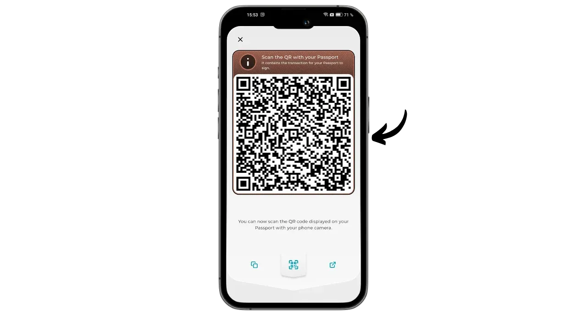

在护照上进入 "*账户*"菜单，点击 "*使用二维码*签名"。

扫描 Envoy 上显示的 PSBT（*部分签名比特币交易*）。

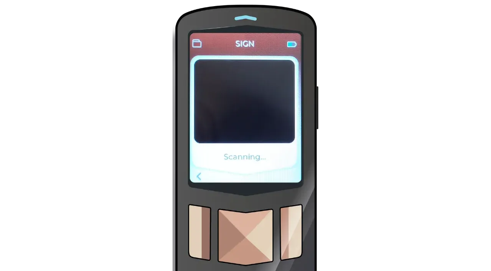

确认接收地址和发送金额无误，然后按确认按钮。

检查交换地址。在我的例子中，没有交换地址，因为交易只包含一个输出。

确保费用是您所选择的。

如果所有信息都正确无误，请单击确认按钮签署交易。

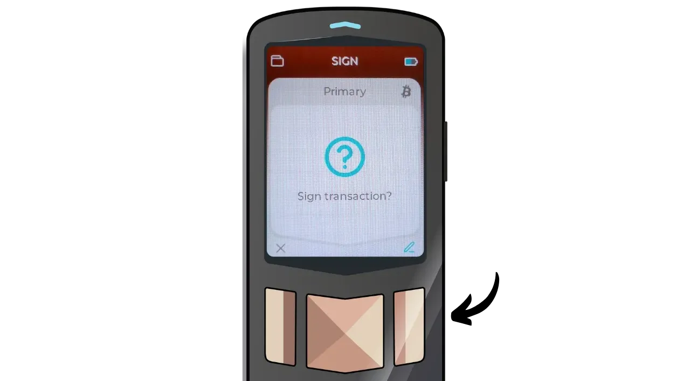

您的 "护照 "会以 QR 码的形式显示您已签署的交易。

在 "特使 "应用程序中，点击二维码图标，然后扫描 "护照 "屏幕上显示的 PSBT。

最后检查一次交易细节。如果一切无误，按 "*发送交易*"在比特币网络上广播。

您的交易正在等待确认。您可以直接从账户中查看交易状态。

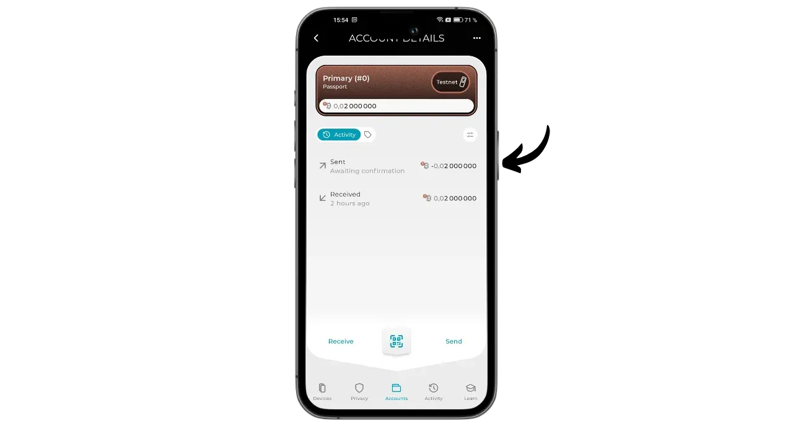

恭喜你，现在你已经知道如何在 Envoy 应用程序中设置和使用 Passport 了。如果您觉得本教程有用，请在下方留下绿色拇指，我将不胜感激。欢迎在您的社交网络上分享本文。感谢您的分享！

如需了解更多信息，请参阅我们的 Liana 软件教程：

https://planb.network/tutorials/wallet/desktop/liana-306ef457-700c-4fdd-b07a-8fb7a8a29f04