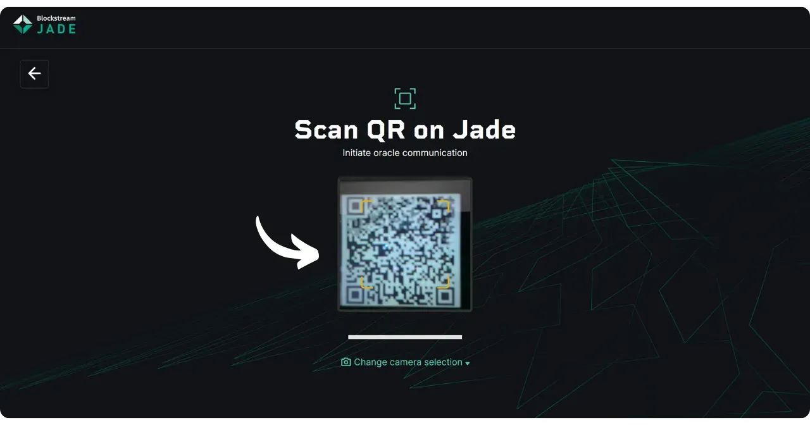
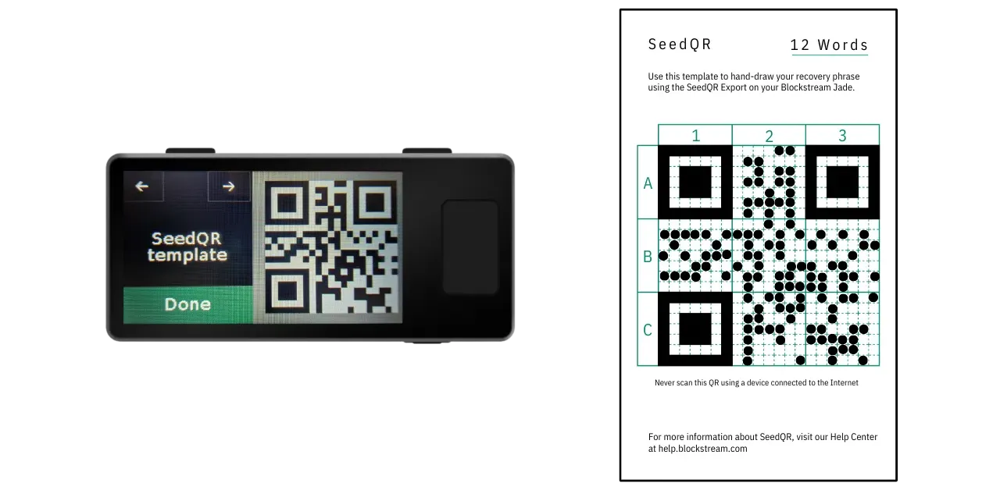
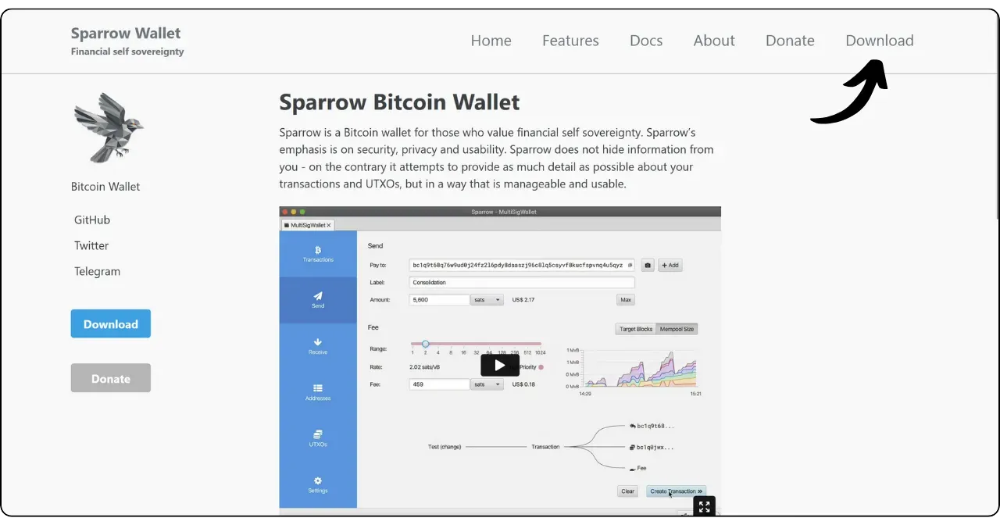
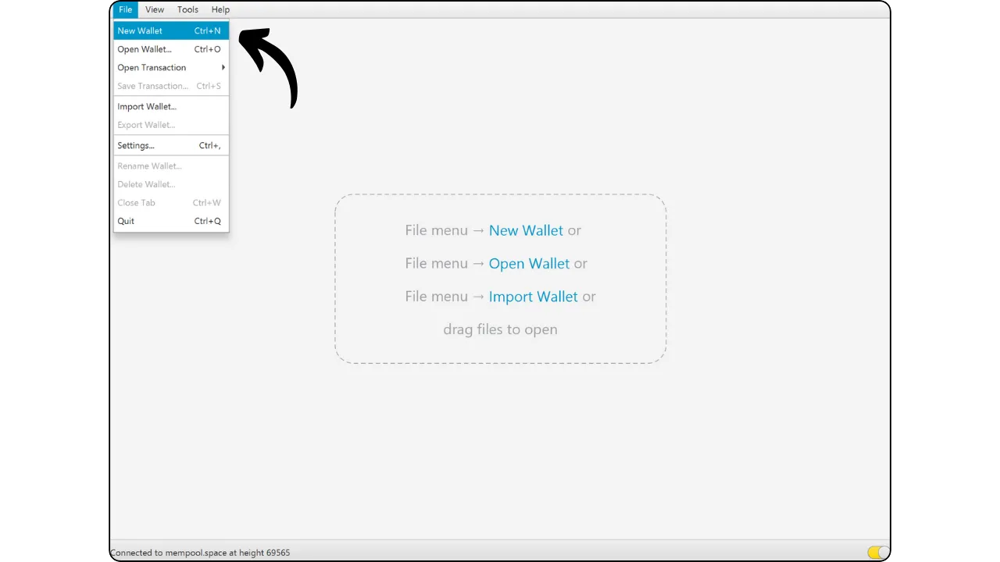
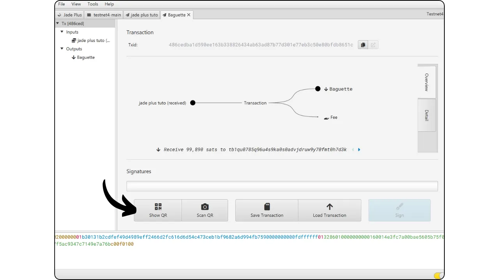

Jade Plus is a Bitcoin-only hardware wallet designed by Blockstream. It is the successor to the classic Jade, with software enhancements, more options and redesigned ergonomics for more intuitive use. This new version boasts a magnificent 1.9-inch LCD screen, with a wider color gamut than its predecessor. Buttons and menu navigation have also been optimized.

The Jade Plus can be used in a number of ways: via a USB-C wired connection, in "*Air-Gap*" mode with a micro SD card (adapter required), via Bluetooth or even by exchanging QR codes thanks to the integrated camera. This hardware wallet is battery-powered.

It is available from $149.99 in the basic black version, and the price can rise by up to $20 for the "*Genesis Grey*" or "*Lunar Silver*" versions. The Jade Plus is therefore an interesting choice, with advanced functionalities comparable to those of high-end hardware wallets such as Coldcard Q or Passport V2, but at a fairly low price, close to mid-range models.

Jade Plus is compatible with most portfolio management software. Here is a summary of compatibility at the time of writing (January 2025):

| Desktop | Mobile | USB | Bluetooth | QR | JadeLink | Management software

| ------------------- | ------- | ------ | --- | ----------- | --- | -------- |

| Blockstream Green | 🟢 | 🟢 | 🟢 (Mobile) | 🟢 | 🔴 |

| Liana | 🟢 | 🔴 | 🟢 | 🔴 | 🔴 |

| Sparrow | 🟢 | 🔴 | 🟢 | 🔴 | 🟢 | 🟢 |

| Nunchuk | 🟢 | 🟢 | 🔴 | 🔴 | 🟢 | 🟢 |

| Specter | 🟢 | 🔴 | 🔴 | 🟢 | 🟢 |

| BlueWallet | 🟢 | 🟢 | 🔴 | 🔴 | 🟢 | 🟢 |

| Electrum | 🟢 | 🔴 | 🟢 | 🔴 | 🔴 | 🔴 |

| Keeper | 🔴 | 🟢 | 🔴 | 🔴 | 🟢 | 🔴 |

In this tutorial, we'll set up an advanced configuration of the Jade Plus with the desktop Sparrow Wallet software in QR codes mode. This configuration is ideal for intermediate or experienced users. If you're looking for a simpler approach for beginners, I recommend you take a look at this tutorial where we use the Jade Plus with Green Wallet over a Bluetooth connection:

https://planb.network/tutorials/wallet/hardware/jade-plus-green-873099a4-35ec-4be8-b31a-6e7cd6a41ec0
## The Jade Plus safety model

The Jade Plus uses a security model based on a "virtual secure element", materialized by a "blind oracle". In concrete terms, this mechanism combines the PIN chosen by the user, a secret hosted on the Jade and a secret held by the oracle (a server maintained by Blockstream), to create an AES-256 key distributed over two entities. During initiation, an ECDH exchange secures communication with the oracle, and encrypts the recovery phrase on the hardware wallet. In practical terms, when you want to access the seed to sign transactions, you need access to :

- The Jade Plus device itself;
- To PIN to unlock the device ;
- And to the secret of the oracle.

The major advantage of this approach is the absence of a single point of failure at hardware level, since if an attacker ever gains access to your Jade, extracting the keys requires simultaneously compromising the Jade and the oracle. This model also means that Jade Plus is entirely open-source, avoiding the constraints associated with the use of true physical secure elements, such as those used on Ledger, for example.

The disadvantage of this system is that the use of Jade Plus depends on the oracle maintained by Blockstream. If this oracle becomes inaccessible, it is no longer possible to use the hardware wallet directly with the PIN. However, this does not mean that your bitcoins are lost, as they can still be recovered using your recovery phrase, which you can enter in Jade Plus in "*stateless*" mode. To get around this dependency, you can also configure and manage your own oracle server.

Another option for managing your seed is simply not to register it on the Jade Plus. In this case, the Jade becomes a signature device only. During initialization, in addition to the usual saving of the recovery phrase as words, you'll also save it as a hand-generated QR code. This way, each time you use your wallet, you can import the seed using your Jade's camera. This can be an interesting option for advanced users, depending on your security strategy, but you need to be careful to both save your seed and protect it, because even as a QR code, it would allow anyone to steal your funds. We'll look at this option in this tutorial, but it's not compulsory.

## Unboxing the Jade Plus

When you receive your Jade Plus, check that the box and seal are in good condition to ensure that your package has not been opened.

In the box you will find :

- Le Jade Plus;
- USB-C cable;
- Cards to record your mnemonic phrase as words or as "*CompactSeedQR*";
- Some instructions for use ;
- A cord;
- Some stickers.

The device has 4 navigation buttons:

- The button on the bottom right turns the Jade on;
- The large button on the front of the device is used to select an item;
- The two small buttons at the top allow you to navigate left and right;
- You can also select an item by simultaneously clicking on the two buttons at the top of the device.

## Setting up a new Bitcoin wallet

Click on the start button.

Click on "*Setup Jade*".

Select "Advanced Setup*".

Then click on "*Create a New Wallet*" to generate a new seed. You can choose between a 12- or 24-word mnemonic phrase. The security of your wallet remains equivalent with both options, so it may be more convenient to choose the simplest option to save, i.e. 12 words.

Click on the "*Continue*" button to display your new recovery phrase.

Your Jade Plus displays your 12-word mnemonic phrase. **This mnemonic gives you full, unrestricted access to all your bitcoins. Anyone in possession of this phrase can steal your funds, even without physical access to your Jade Plus. The 12-word phrase restores access to your bitcoins in the event of loss, theft or breakage of your Jade. It is therefore very important to save it carefully and store it in a secure location.

You can write it on the cardboard supplied in the box, or for added security, I recommend engraving it on a stainless steel base to protect it from fire, flood or collapse.

For more information on the proper way to save and manage your mnemonic phrase, I highly recommend following this other tutorial, especially if you're a beginner:

https://planb.network/tutorials/wallet/backup/backup-mnemonic-22c0ddfa-fb9f-4e3a-96f9-46e2a7954270
of course, you must never share these words on the Internet, as I'm doing in this tutorial. This sample portfolio will be used only on Testnet and will be deleted at the end of the tutorial.**_

Click on the arrow on the right of the screen to display the following words.

Once you've saved your phrase, Jade Plus asks you to confirm it. Select the correct word according to the order using the buttons at the top of the device, and click the central button to move on to the next word.

You then have 2 options. As explained in the introduction, you can choose to save your seed directly on the device and use Blockstream's "*Virtual Secure Element*" protection system to access your wallet (Option 1), or save your seed as a QR code and scan it each time you use it (Option 2).

For Option 1, select "*No*", and for Option 2, select "*Yes*".

### Option 1: QR PIN Unlock

If you have chosen option 1 (CompactSeedQR: "*No*"), you will be taken directly to the connection method selection. In this tutorial, we want to use the device in Air-Gap mode via QR code exchanges, so select "*QR*".

Click on "*Continue*".

The PIN code is used to unlock your Jade and offers protection against unauthorized physical access. This PIN code is not involved in the derivation of your wallet's cryptographic keys. So, even without access to this PIN code, possession of your 12-word mnemonic phrase will enable you to regain access to your bitcoins. We recommend choosing a PIN code that is as random as possible. Also, make sure you save this code in a separate place from where your Jade is stored, such as in a password manager.

Choose a 6-digit PIN code on your Jade, using the left and right buttons to scroll through the digits, and the middle button to confirm each digit.

Confirm your PIN a second time.

As explained in the introduction, your seed is stored encrypted on the Jade Plus. To decrypt it, you must provide :

- The valid PIN code (which we have just set up) ;
- The secret of the oracle maintained by Blockstream.

In this advanced tutorial, we'll use Sparrow Wallet to manage our Bitcoin wallet. However, unlike Blockstream's Green Wallet software, Sparrow doesn't have access to the oracle on Blockstream's servers. We'll therefore use Blockstream's website to retrieve the oracle secret each time we unlock Jade Plus.

Visit https://jadefw.blockstream.com/pinqr/index.html

Click on "*Start QR Unlock*".

Click on "*Done*", as you have already chosen your PIN on the Jade Plus.

Use your computer's camera to scan the QR codes displayed on your Jade's screen.

Confirm on your Jade to access the next screen.

Scan the QR code now visible on the website to retrieve the secret of the oracle.

Now that your portfolio has been created, you can proceed to the next steps and skip sub-section "*Option 2: CompactSeedQR*".

Each time you start up, click on "*QR Mode*".

Select "*QR PIN Unlock*".

Enter your PIN code.

Then go to [the Blockstream website](https://jadefw.blockstream.com/pinqr/qrpin.html) to exchange QR codes with the oracle.

Your Jade is now unlocked.

### Option 2: CompactSeedQR

If you have chosen option 2 (CompactSeedQR: "*Yes*"), click on "*Yes*" again.

Click on "*Start*".

You can use the QR code base supplied in the Jade Plus box. Select the appropriate box depending on whether you've opted for a 12- or 24-word sentence. You can also [print the template from the Blockstream website](https://help.blockstream.com/hc/article_attachments/41928319071769).

Your Jade Plus will display each zone of your QR code.

Use a pen to color in the squares and reproduce your seed as a QR code. Be precise to ensure that the Jade Plus camera can scan it later. Use the arrow to move on to the next area.

When finished, click on "*Done*".

Scan your handmade QR code with the Jade Plus to check its validity.

If your paper backup is correct, click on "*Continue*".

In this tutorial, we'll be using a connection mode based exclusively on QR code scanning, so select "*QR*".

You can also choose to add a PIN in addition to your CompactSeedQR backup, as in option 1. This offers two ways of accessing your wallet: either via the PIN and Blockstream's "Virtual Secure Element" system, or via the CompactSeedQR.

If you opt for the double PIN option, select "*PIN*" and follow the same steps as in option 1 to set your PIN code.

If you prefer to continue with CompactSeedQR only, select "*SeedQR*".

Now that your portfolio has been created, you can move on to the next steps.

Each time you start up, click on the "*QR Mode*" button, then "*Scan SeedQR*".

Use the device's camera to scan your saved seed as a QR code.

Your Jade is now unlocked.

## Add a BIP39 passphrase

A BIP39 passphrase is an optional password that you can choose freely, and which is added to your mnemonic phrase to reinforce wallet security. With this feature enabled, access to your Bitcoin wallet will require both the mnemonic and the passphrase. Without either, it would be impossible to recover the wallet.

Before configuring this option on your Jade Plus, it is strongly recommended that you read this article to fully understand the theoretical operation of the passphrase and avoid errors that could lead to the loss of your bitcoins :

https://planb.network/tutorials/wallet/backup/passphrase-a26a0220-806c-44b4-af14-bafdeb1adce7
With your Jade still locked (the passphrase can only be entered when the device is not unlocked), access the "*Options*" menu.

Select "*BIP39 Passphrase*".

In the "*Frequency*" option, you can choose whether Jade Plus will ask you to enter your passphrase each time it starts up:

- "*Disabled*" disables the use of a passphrase;
- "*Next Login Only*" will require you to return to this menu to activate the request for your passphrase at next startup. This option allows you not to reveal its use;
- "*Always Ask*" causes Jade to systematically ask you for your passphrase each time it starts up, thus revealing that your wallet is protected by a passphrase.

Choose the option according to your security strategy. Personally, I select "*Always Ask*" for the example.

You can then choose between two methods for entering your passphrase:

- "*Manual*: A virtual keyboard lets you enter letters (upper and lower case), numbers and symbols, character by character. This is the standard method for all hardware wallets;
- "*WordList*": Specific method designed by Blockstream for Jade, which speeds up passphrase entry and increases its entropy. During input, the system suggests words from the BIP39 list, making unlocking easier. This method automatically generates a sentence by concatenating the chosen words, separated by spaces (example: `abandon ability able`).

Personally, I advise you to use the first method, as it's the standard you'll find on all other portfolio supports.

You can then return to the home screen and unlock your wallet as normal, either using your PIN code or your CompactSeedQR (as seen above). You will then be asked to enter your passphrase.

Enter it on the Jade keyboard, and be sure to make one or more backups on physical media (paper or metal). For the example, I'm using a very weak passphrase, but you need to choose a strong, random passphrase that includes all types of characters and is long enough (like a strong password).

If your passphrase is valid, confirm.

Please note that BIP39 passphrases are case- and typo-sensitive. If you enter a passphrase slightly different from the one initially configured, Jade will not report an error but will derive another set of cryptographic keys that will not be those in your initial portfolio.

It's therefore important, when configuring, to make a note of your master key fingerprint, which can be found in the bottom right-hand corner of the screen. For example, with my passphrase `PBN`, my master key fingerprint is `3AD1AE65`.

Each time you unlock your Jade with your passphrase, check that the fingerprint is the same as the one you entered during configuration. If it is, your passphrase is correct and you're accessing the right Bitcoin wallet. If it's not, you're on the wrong wallet and need to try again, taking care not to make any input errors.

Before you receive your first bitcoins in your wallet, **I strongly advise you to perform an empty recovery test**. Make a note of some reference information, such as your xpub or first receiving address, then delete your wallet on the Jade Plus while it's still empty (`Options -> Device -> Factory Reset`). Then try to restore your wallet using your paper backups of the mnemonic phrase and any passphrase. Check that the cookie information generated after the restore matches the one you originally wrote down. If it does, you can rest assured that your paper backups are reliable. To find out more about how to carry out a test recovery, take a look at this other tutorial:

https://planb.network/tutorials/wallet/backup/recovery-test-5a75db51-a6a1-4338-a02a-164a8d91b895
## Configuring the wallet on Sparrow Wallet

In this tutorial, I present an advanced use of Jade Plus using Sparrow Wallet. However, this hardware wallet is compatible with many other programs, such as Liana, Nunchuk, Specter, Green and Keeper. These compatibilities vary in terms of connections: USB, Bluetooth or QR code (see table in introduction for details).

Start by downloading and installing Sparrow Wallet [from the official website](https://sparrowwallet.com/) on your computer, if you haven't already done so.

Be sure to check the authenticity and integrity of the software before installation. If you don't know how to do this, please consult this tutorial:

https://planb.network/tutorials/others/general/integrity-authenticity-21d0420a-be02-4663-94a3-8d487f23becc
Once Sparrow Wallet is open, click on the "*File*" tab, then on "*New Wallet*".

Name your wallet, then click on "*Create Wallet*".

Select "*Airgapped Hardware Wallet*".

Click on "*Scan...*" next to the "*Jade*" option.

Unlock your Jade Plus and, if you're using one, enter your passphrase. Then go to the "*Options*" menu, select "*Wallet*", and click on "*Export Xpub*".

Your Jade will display your Keystore via several QR codes. Scan them on your machine using Sparrow.

You should now see your xpub and your master key fingerprint, which should match the one on your Jade Plus. Click on "*Apply*".

Set a strong password to secure access to your Sparrow Wallet. This password will protect your public keys, addresses, labels and transaction history from unauthorized access. It's a good idea to save this password in a password manager, so you don't forget it.

Your portfolio is now correctly configured on Sparrow.

## Receive bitcoins

Now that your Jade Plus is configured, you're ready to receive your first sats on your new Bitcoin wallet. To do so, on Sparrow, click on the "*Receive*" menu.

Sparrow will display the first blank reception address in your portfolio.

Before using it, let's check it on the Jade Plus screen to make sure it belongs to our Bitcoin wallet. On the Jade, click on "*Scan QR*", then scan the QR code of the address displayed on Sparrow.

Check that the address displayed on your Jade's screen corresponds to the one displayed on Sparrow Wallet. If it does, click on the checkmark to continue.

Your hardware wallet will then confirm that this address is part of your wallet and that it holds the associated private key.

If the address is validated by your Jade, you can now use it to receive bitcoins. When the transaction is broadcast on the network, it will appear on Sparrow. Wait until you've received enough confirmations to consider the transaction definitive.

## Send bitcoins

Now that you have a few sats in your wallet, you can also send some. To do so, click on the "*UTXOs*" menu.

Select the UTXOs you wish to use as inputs for this transaction, then click on "*Send Selected*".

Enter the recipient's address, a label to remind you of the purpose of the transaction and the amount you wish to send to this address.

Adjust the fee rate according to current market conditions, then click on "*Create Transaction*".

Check that all transaction parameters are correct, then click on "*Finalize Transaction for Signing*".

Click on "*Show QR*" to display the PSBT (*Partially Signed Bitcoin Transaction*). Sparrow has built the transaction, but it still lacks the signatures to unlock the bitcoins used in the input. These signatures can only be performed by Jade Plus, which hosts your seed giving access to the private keys needed to sign the transaction.

On your Jade Plus, click on "*Scan QR*" to scan the PSBT displayed on Sparrow.

Confirm that the delivery address and the amount sent are correct, then click on the arrow to validate.

Make sure the fee amount is the one you've chosen, then click on the tick icon in the top left-hand corner of the interface to sign the transaction.

On Sparrow Wallet, click on "*Scan QR*" and scan the QR code displayed on your Jade.

Your signed transaction is now ready to be broadcast on the Bitcoin network and included in a block by a miner. If everything is correct, click on "*Broadcast Transaction*".

Your transaction has been broadcast and is awaiting confirmation.

Congratulations, you now know how to set up and use the Jade Plus in QR mode. If you found this tutorial useful, I'd be grateful if you'd leave a green thumb below. Feel free to share this article on your social networks. Thanks for sharing!

To go further, I recommend this other tutorial on the Jade Plus, where we configure it via Bluetooth with the Green mobile app:

https://planb.network/tutorials/wallet/hardware/jade-plus-green-873099a4-35ec-4be8-b31a-6e7cd6a41ec0