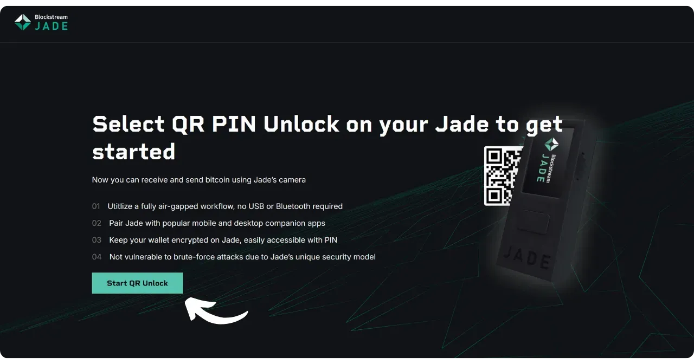
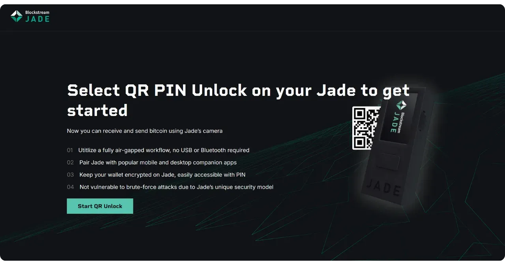
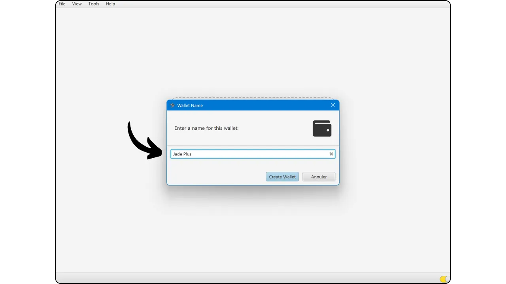
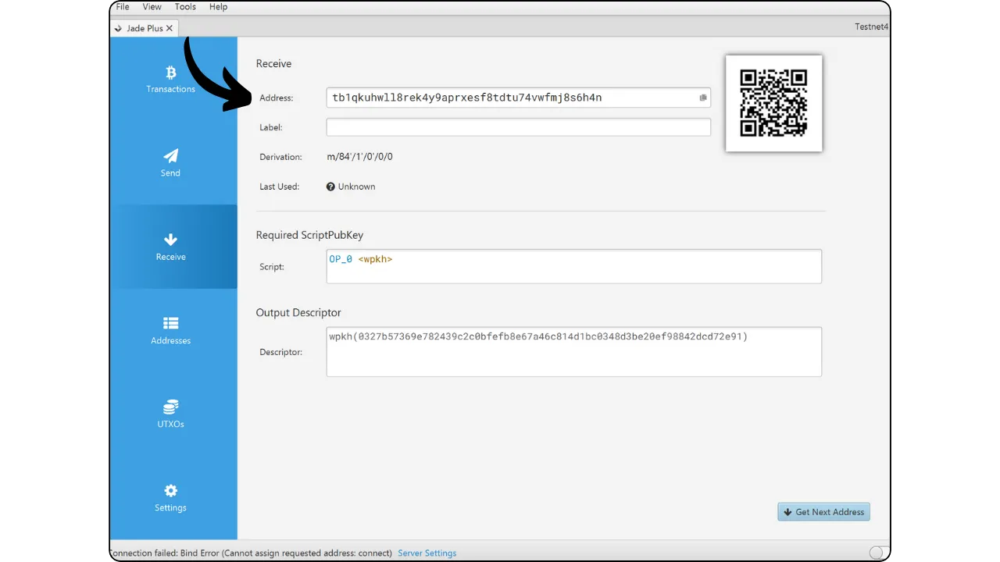
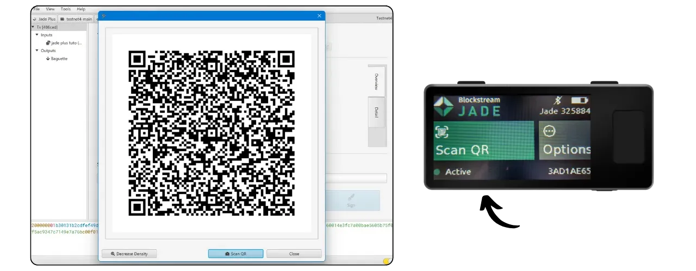
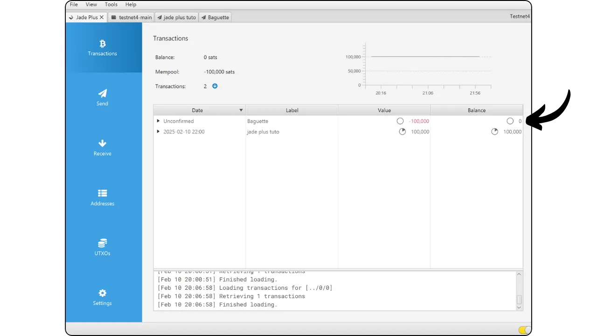

A Jade Plus é uma carteira de hardware exclusiva para Bitcoin concebida pela Blockstream. É a sucessora da clássica Jade, com melhorias de software, mais opções e ergonomia redesenhada para uma utilização mais intuitiva. Esta nova versão possui um magnífico ecrã LCD de 1,9 polegadas, com uma gama de cores mais ampla do que a sua antecessora. Os botões e a navegação nos menus também foram optimizados.

A Jade Plus pode ser utilizada de várias formas: através de uma ligação USB-C com fios, em modo "*Air-Gap*" com um cartão micro SD (é necessário um adaptador), por Bluetooth ou ainda através da troca de códigos QR graças à câmara integrada. Esta carteira de hardware é alimentada por bateria.

Está disponível a partir de 149,99 dólares na versão básica em preto, e o preço pode aumentar até 20 dólares para as versões "*Genesis Grey*" ou "*Lunar Silver*". A Jade Plus é, portanto, uma escolha interessante, com funcionalidades avançadas comparáveis às das carteiras de hardware topo de gama, como a Coldcard Q ou a Passport V2, mas a um preço bastante baixo, próximo dos modelos de gama média.

O Jade Plus é compatível com a maioria dos softwares de gestão de carteiras. Aqui está um resumo da compatibilidade no momento da redação (janeiro de 2025):

| Desktop | Móvel | USB | Bluetooth | QR | JadeLink | Software de gestão

| ------------------- | ------- | ------ | --- | ----------- | --- | -------- |

| Blockstream Green | 🟢 | 🟢 | 🟢 (Mobile) | 🟢 | 🔴 |

| Liana | 🟢 | 🔴 | 🟢 | 🔴 | 🔴 | 🔴 |

pardal | 🟢 | 🔴 | 🟢 | 🔴 | 🟢 | 🟢 | 🟢 |

nunchuk | 🟢 | 🟢 | 🔴 | 🔴 | 🟢 | 🟢 | 🟢 |

| Specter | 🟢 | 🔴 | 🔴 | 🟢 | 🟢 | 🟢 |

| BlueWallet | 🟢 | 🟢 | 🔴 | 🔴 | 🟢 | 🟢 | 🟢 |

electrum | 🟢 | 🔴 | 🟢 | 🔴 | 🔴 | 🔴 | 🔴 | 🔴 |

| Keeper | 🔴 | 🟢 | 🔴 | 🟢 | 🔴 | 🔴 | 🔴 |

Neste tutorial, vamos definir uma configuração avançada do Jade Plus com o software Sparrow Wallet de secretária no modo de códigos QR. Esta configuração é ideal para utilizadores intermédios ou experientes. Se procura uma abordagem mais simples para principiantes, recomendo que dê uma vista de olhos a este tutorial onde utilizamos o Jade Plus com a Green Wallet através de uma ligação Bluetooth:

https://planb.network/tutorials/wallet/hardware/jade-plus-green-873099a4-35ec-4be8-b31a-6e7cd6a41ec0
## O modelo de segurança Jade Plus

O Jade Plus utiliza um modelo de segurança baseado num "elemento seguro virtual", materializado por um "oráculo cego". Em termos concretos, este mecanismo combina o PIN escolhido pelo utilizador, um segredo alojado no Jade e um segredo detido pelo oráculo (um servidor mantido pela Blockstream), para criar uma chave AES-256 distribuída por duas entidades. Durante a iniciação, uma troca de ECDH protege a comunicação com o oráculo e encripta a frase de recuperação na carteira de hardware. Em termos práticos, quando se pretende aceder à seed para assinar transacções, é necessário aceder ao :

- O próprio dispositivo Jade Plus;
- Para o PIN para desbloquear o dispositivo ;
- E ao segredo do oráculo.

A principal vantagem desta abordagem é a ausência de um ponto único de falha ao nível do hardware, uma vez que, se um atacante conseguir aceder ao seu Jade, a extração das chaves requer o comprometimento simultâneo do Jade e do oráculo. Este modelo significa também que o Jade Plus é inteiramente open-source, evitando os constrangimentos associados à utilização de verdadeiros elementos físicos de segurança, como os utilizados no Ledger, por exemplo.

A desvantagem deste sistema é que a utilização do Jade Plus depende do oráculo mantido pela Blockstream. Se este oráculo se tornar inacessível, deixa de ser possível utilizar a carteira de hardware diretamente com o PIN. No entanto, isso não significa que seus bitcoins estão perdidos, pois eles ainda podem ser recuperados usando sua frase de recuperação, que pode ser inserida no Jade Plus no modo "*stateless*". Para contornar esta dependência, também é possível configurar e gerir o seu próprio servidor oracle.

Outra opção para gerir a sua semente é simplesmente não a registar no Jade Plus. Neste caso, o Jade torna-se apenas um dispositivo de assinatura. Durante a inicialização, para além da habitual gravação da frase de recuperação como palavras, também a guarda como um código QR gerado à mão. Desta forma, cada vez que utilizar a sua carteira, pode importar a semente utilizando a câmara do seu Jade. Esta pode ser uma opção interessante para utilizadores avançados, dependendo da sua estratégia de segurança, mas deve ter o cuidado de guardar a sua semente e de a proteger, porque mesmo como código QR, permitiria a qualquer pessoa roubar os seus fundos. Iremos analisar esta opção neste tutorial, mas não é obrigatória.

## Desembalar o Jade Plus

Quando receber o seu Jade Plus, verifique se a caixa e o selo estão em boas condições para garantir que a embalagem não foi aberta.

Na caixa encontrará :

- Le Jade Plus;
- Cabo USB-C;
- Cartões para gravar a sua frase mnemónica como palavras ou como "*CompactSeedQR*";
- Algumas instruções de utilização ;
- Um cordão;
- Alguns autocolantes.

O dispositivo tem 4 botões de navegação:

- O botão no canto inferior direito liga o Jade;
- O botão grande na frente do dispositivo é utilizado para selecionar um item;
- Os dois pequenos botões no topo permitem-lhe navegar para a esquerda e para a direita;
- Também pode selecionar um item clicando simultaneamente nos dois botões na parte superior do dispositivo.

## Configurar uma nova carteira Bitcoin

Clique no botão Iniciar.

Clicar em "*Setup Jade*".

Selecione "Configuração avançada*".

Em seguida, clique em "*Criar uma nova carteira*" para gerar uma nova semente. Pode escolher entre uma frase mnemónica de 12 ou 24 palavras. A segurança da sua carteira permanece equivalente com ambas as opções, pelo que pode ser mais conveniente escolher a opção mais simples de guardar, ou seja, 12 palavras.

Clique no botão "*Continuar*" para visualizar a sua nova frase de recuperação.

O seu Jade Plus mostra a sua frase mnemónica de 12 palavras. **Esta mnemónica dá-te acesso total e sem restrições a todos os teus bitcoins. Qualquer pessoa que possua esta frase pode roubar os teus fundos, mesmo sem acesso físico ao teu Jade Plus. A frase de 12 palavras restaura o acesso aos seus bitcoins em caso de perda, roubo ou quebra do seu Jade. Por isso, é muito importante guardá-la cuidadosamente e armazená-la num local seguro.

Pode gravá-lo no cartão fornecido na caixa ou, para maior segurança, recomendo que o grave numa base de aço inoxidável para o proteger de incêndios, inundações ou desmoronamentos.

Para mais informações sobre a forma correta de guardar e gerir a sua frase mnemónica, recomendo vivamente que siga este outro tutorial, especialmente se for um principiante:

https://planb.network/tutorials/wallet/backup/backup-mnemonic-22c0ddfa-fb9f-4e3a-96f9-46e2a7954270
é claro que nunca deve partilhar estas palavras na Internet, como eu estou a fazer neste tutorial. Este exemplo de portefólio será utilizado apenas na Testnet e será eliminado no final do tutorial

Clique na seta à direita do ecrã para visualizar as seguintes palavras.

Depois de ter guardado a sua frase, o Jade Plus pede-lhe que a confirme. Selecione a palavra correta de acordo com a ordem, utilizando os botões na parte superior do dispositivo, e clique no botão central para passar à palavra seguinte.

Tem então 2 opções. Tal como explicado na introdução, pode optar por guardar a sua semente diretamente no dispositivo e utilizar o sistema de proteção "*Virtual Secure Element*" da Blockstream para aceder à sua carteira (Opção 1), ou guardar a sua semente como um código QR e digitalizá-lo sempre que o utilizar (Opção 2).

Para a opção 1, selecionar "*Não*" e, para a opção 2, selecionar "*Sim*".

### Opção 1: Desbloqueio por QR PIN

Se tiver escolhido a opção 1 (CompactSeedQR: "*No*"), será levado diretamente para a seleção do método de ligação. Neste tutorial, queremos utilizar o dispositivo no modo Air-Gap através de trocas de códigos QR, por isso selecione "*QR*".

Clique em "*Continuar*".

O código PIN é utilizado para desbloquear o seu Jade e oferece proteção contra o acesso físico não autorizado. Este código PIN não está envolvido na derivação das chaves criptográficas da sua carteira. Assim, mesmo sem acesso a este código PIN, a posse da sua frase mnemónica de 12 palavras permitir-lhe-á recuperar o acesso aos seus bitcoins. Recomendamos que escolha um código PIN que seja o mais aleatório possível. Além disso, certifique-se de que guarda este código num local separado do local onde a sua Jade está armazenada, como por exemplo num gestor de palavras-passe.

Escolha um código PIN de 6 dígitos no seu Jade, utilizando os botões esquerdo e direito para percorrer os dígitos e o botão do meio para confirmar cada dígito.

Confirme o seu PIN uma segunda vez.

Como explicado na introdução, a sua semente é armazenada encriptada no Jade Plus. Para a desencriptar, é necessário fornecer :

- O código PIN válido (que acabámos de definir) ;
- O segredo do oráculo mantido pela Blockstream.

Neste tutorial avançado, nós usaremos a Sparrow Wallet para gerenciar nossa carteira Bitcoin. No entanto, ao contrário do software Green Wallet da Blockstream, a Sparrow não tem acesso ao oráculo nos servidores da Blockstream. Portanto, usaremos o site da Blockstream para recuperar o segredo do oráculo cada vez que desbloquearmos o Jade Plus.

Visite https://jadefw.blockstream.com/pinqr/index.html

Clique em "*Iniciar desbloqueio QR*".

Clique em "*Fazer*", uma vez que já escolheu o seu PIN no Jade Plus.

Utilize a câmara do seu computador para digitalizar os códigos QR apresentados no ecrã do seu Jade.

Confirme no seu Jade para aceder ao ecrã seguinte.

Digitalize o código QR agora visível no sítio Web para obter o segredo do oráculo.

Agora que a sua carteira foi criada, pode avançar para os passos seguintes e saltar a subsecção "*Opção 2: CompactSeedQR*".

Sempre que iniciar, clique em "*QR Mode*".

Selecione "*QR PIN Unlock*".

Introduza o seu código PIN.

Em seguida, aceda ao [sítio Web da Blockstream] (https://jadefw.blockstream.com/pinqr/qrpin.html) para trocar códigos QR com o oráculo.

A tua Jade está agora desbloqueada.

### Opção 2: CompactSeedQR

Se escolheu a opção 2 (CompactSeedQR: "*Yes*"), clique novamente em "*Yes*".

Clique em "*Iniciar*".

Pode utilizar a base de código QR fornecida na caixa Jade Plus. Selecione a caixa adequada, consoante tenha optado por uma frase de 12 ou 24 palavras. Também pode [imprimir o modelo a partir do sítio Web da Blockstream] (https://help.blockstream.com/hc/article_attachments/41928319071769).

O seu Jade Plus apresentará cada zona do seu código QR.

Utilize uma caneta para colorir os quadrados e reproduzir a sua semente como um código QR. Seja preciso para que a câmara do Jade Plus possa digitalizá-lo mais tarde. Utiliza a seta para passar à área seguinte.

Quando terminar, clique em "*Está feito*".

Digitalize o seu código QR artesanal com o Jade Plus para verificar a sua validade.

Se a cópia de segurança do papel estiver correta, clique em "*Continuar*".

Neste tutorial, vamos utilizar um modo de ligação baseado exclusivamente na leitura de códigos QR, por isso selecione "*QR*".

Também pode optar por adicionar um PIN para além do seu backup CompactSeedQR, como na opção 1. Isto oferece duas formas de aceder à sua carteira: através do PIN e do sistema "Virtual Secure Element" da Blockstream, ou através do CompactSeedQR.

Se optar pela opção de PIN duplo, selecione "*PIN*" e siga os mesmos passos que na opção 1 para definir o seu código PIN.

Se preferir continuar apenas com o CompactSeedQR, selecione "*SeedQR*".

Agora que o seu portefólio foi criado, pode avançar para os passos seguintes.

Sempre que iniciar, clique no botão "*QR Mode*" e depois em "*Scan SeedQR*".

Utilize a câmara do dispositivo para digitalizar a sua semente guardada como um código QR.

A tua Jade está agora desbloqueada.

## Adicionar uma frase-passe BIP39

Uma frase-passe BIP39 é uma palavra-passe opcional que pode escolher livremente e que é adicionada à sua frase mnemónica para reforçar a segurança da carteira. Com esta funcionalidade activada, o acesso à sua carteira Bitcoin exigirá tanto a mnemónica como a frase-chave. Sem ambos, seria impossível recuperar a carteira.

Antes de configurar esta opção no teu Jade Plus, recomenda-se vivamente que leias este artigo para compreenderes o funcionamento teórico da frase-chave e evitares erros que possam levar à perda dos teus bitcoins:

https://planb.network/tutorials/wallet/backup/passphrase-a26a0220-806c-44b4-af14-bafdeb1adce7
Com o seu Jade ainda bloqueado (a frase-chave só pode ser introduzida quando o aparelho não está desbloqueado), aceda ao menu "*Opções*".

Selecione "*BIP39 Passphrase*".

Na opção "*Frequência*", pode escolher se o Jade Plus irá pedir-lhe para introduzir a sua frase-chave sempre que for iniciado:

- "*Disabled*" desactiva a utilização de uma frase-chave;
- a opção "*Só no próximo início de sessão*" obriga-o a regressar a este menu para ativar o pedido da sua frase-chave no próximo arranque. Esta opção permite-lhe não revelar a sua utilização;
- a opção "*Sempre perguntar*" faz com que o Jade peça sistematicamente a sua frase-chave sempre que é iniciado, revelando assim que a sua carteira está protegida por uma frase-chave.

Escolha a opção de acordo com a sua estratégia de segurança. Pessoalmente, selecciono "*Perguntar sempre*" para o exemplo.

Pode então escolher entre dois métodos para introduzir a sua frase-chave:

- "*Manual*: Um teclado virtual permite-lhe introduzir letras (maiúsculas e minúsculas), números e símbolos, carácter por carácter. Este é o método padrão para todas as carteiras de hardware;
- "*WordList*": Método específico concebido pela Blockstream para o Jade, que acelera a introdução da frase-chave e aumenta a sua entropia. Durante a introdução, o sistema sugere palavras da lista BIP39, facilitando o desbloqueio. Este método gera automaticamente uma frase concatenando as palavras escolhidas, separadas por espaços (exemplo: `abandonar habilidade capaz`).

Pessoalmente, aconselho-o a utilizar o primeiro método, pois é o padrão que encontrará em todos os outros suportes de carteira.

Pode então voltar ao ecrã inicial e desbloquear a sua carteira normalmente, utilizando o seu código PIN ou o seu CompactSeedQR (como se vê acima). Ser-lhe-á então pedido que introduza a sua frase-chave.

Introduza-a no teclado do Jade e certifique-se de que faz uma ou mais cópias de segurança em suporte físico (papel ou metal). Para o exemplo, estou a utilizar uma frase-chave muito fraca, mas é necessário escolher uma frase-chave forte e aleatória que inclua todos os tipos de caracteres e seja suficientemente longa (como uma palavra-passe forte).

Se a frase-chave for válida, confirme.

Tenha em atenção que as frases-passe BIP39 são sensíveis a maiúsculas e minúsculas. Se introduzir uma frase-chave ligeiramente diferente da inicialmente configurada, o Jade não comunicará um erro, mas obterá outro conjunto de chaves criptográficas que não serão as da sua carteira inicial.

Por isso, é importante, ao configurar, tomar nota da impressão digital da chave mestra, que pode ser encontrada no canto inferior direito do ecrã. Por exemplo, com a minha frase-passe `PBN`, a impressão digital da minha chave-mestra é `3AD1AE65`.

Sempre que desbloquear o seu Jade com a sua frase-passe, verifique se a impressão digital é a mesma que introduziu durante a configuração. Se for, sua senha está correta e você está acessando a carteira Bitcoin correta. Se não for, você está na carteira errada e precisa tentar novamente, tomando cuidado para não cometer nenhum erro de entrada.

Antes de receberes os teus primeiros bitcoins na tua carteira, **aconselho-te vivamente a fazeres um teste de recuperação vazio**. Tome nota de algumas informações de referência, como o seu xpub ou o primeiro endereço de receção, depois apague a sua carteira no Jade Plus enquanto ainda está vazia (`Opções -> Dispositivo -> Factory Reset`). Em seguida, tente restaurar a sua carteira utilizando as suas cópias de segurança em papel da frase mnemónica e de qualquer frase-chave. Verifica se a informação do cookie gerada após o restauro corresponde à que escreveste originalmente. Se corresponder, pode ter a certeza de que as suas cópias de segurança em papel são fiáveis. Para saber mais sobre como efetuar uma recuperação de teste, consulte este outro tutorial:

https://planb.network/tutorials/wallet/backup/recovery-test-5a75db51-a6a1-4338-a02a-164a8d91b895
## Configurar a carteira na Sparrow Wallet

Neste tutorial, apresento um uso avançado do Jade Plus usando a Sparrow Wallet. No entanto, esta carteira de hardware é compatível com muitos outros programas, como o Liana, Nunchuk, Specter, Green e Keeper. Estas compatibilidades variam em termos de ligações: USB, Bluetooth ou código QR (ver tabela na introdução para mais pormenores).

Comece por descarregar e instalar a Sparrow Wallet [a partir do site oficial] (https://sparrowwallet.com/) no seu computador, caso ainda não o tenha feito.

Certifique-se de que verifica a autenticidade e a integridade do software antes da instalação. Se não souber como o fazer, consulte este tutorial:

https://planb.network/tutorials/others/general/integrity-authenticity-21d0420a-be02-4663-94a3-8d487f23becc
Quando a Sparrow Wallet estiver aberta, clique no separador "*Arquivo*" e depois em "*Nova carteira*".

Dê um nome à sua carteira e, em seguida, clique em "*Criar carteira*".

Selecione "*Airgapped Hardware Wallet*".

Clique em "*Scan...*" junto à opção "*Jade*".

Desbloqueie o seu Jade Plus e, se estiver a utilizar um, introduza a sua frase-chave. Em seguida, aceda ao menu "*Opções*", selecione "*Carteira*" e clique em "*Exportar Xpub*".

O seu Jade apresentará o seu Keystore através de vários códigos QR. Digitalize-os no seu computador utilizando o Sparrow.

Deverá agora ver o seu xpub e a impressão digital da sua chave mestra, que deverá corresponder à do seu Jade Plus. Clique em "*Aplicar*".

Defina uma palavra-passe forte para proteger o acesso à sua Sparrow Wallet. Esta senha protegerá suas chaves públicas, endereços, etiquetas e histórico de transações de acessos não autorizados. É uma boa ideia guardar esta palavra-passe num gestor de palavras-passe, para que não se esqueça dela.

O seu portefólio está agora corretamente configurado no Sparrow.

## Receber bitcoins

Agora que o seu Jade Plus está configurado, está pronto para receber os seus primeiros sats na sua nova carteira Bitcoin. Para isso, no Sparrow, clique no menu "*Receive*".

O Sparrow apresentará o primeiro endereço de receção em branco no seu portefólio.

Antes de o utilizar, vamos verificá-lo no ecrã do Jade Plus para nos certificarmos de que pertence à nossa carteira Bitcoin. No Jade, clique em "*Scan QR*" e, em seguida, digitalize o código QR do endereço exibido no Sparrow.

Verifique se o endereço apresentado no ecrã do seu Jade corresponde ao apresentado na Sparrow Wallet. Se corresponder, clique na marca de verificação para continuar.

A sua carteira de hardware confirmará então que este endereço faz parte da sua carteira e que possui a chave privada associada.

Se o endereço for validado pela tua Jade, podes agora usá-lo para receber bitcoins. Quando a transação for transmitida na rede, ela aparecerá no Sparrow. Aguarde até ter recebido confirmações suficientes para considerar a transação definitiva.

## Enviar bitcoins

Agora que já tens alguns sats na tua carteira, também podes enviar alguns. Para o fazer, clique no menu "*UTXOs*".

Selecione os UTXOs que pretende utilizar como entradas para esta transação e, em seguida, clique em "*Enviar selecionados*".

Introduza o endereço do destinatário, uma etiqueta para recordar o objetivo da transação e o montante que pretende enviar para esse endereço.

Ajuste a taxa de honorários de acordo com as condições actuais do mercado e, em seguida, clique em "*Criar transação*".

Verifique se todos os parâmetros da transação estão corretos e, em seguida, clique em "*Finalizar transação para assinatura*".

Clique em "*Show QR*" para exibir a PSBT (*Partially Signed Bitcoin Transaction*). O Sparrow construiu a transação, mas ainda faltam as assinaturas para desbloquear os bitcoins usados na entrada. Essas assinaturas só podem ser realizadas pelo Jade Plus, que hospeda sua semente dando acesso às chaves privadas necessárias para assinar a transação.

No seu Jade Plus, clique em "*Scan QR*" para digitalizar o PSBT apresentado no Sparrow.

Confirme se o endereço de entrega e o montante enviado estão corretos e, em seguida, clique na seta para validar.

Certifique-se de que o montante da taxa é o que escolheu e, em seguida, clique no ícone de visto no canto superior esquerdo da interface para assinar a transação.

Na Sparrow Wallet, clique em "*Scan QR*" e digitalize o código QR apresentado no seu Jade.

A sua transação assinada está agora pronta para ser transmitida na rede Bitcoin e incluída num bloco por um mineiro. Se tudo estiver correto, clique em "*Broadcast Transaction*".

A sua transação foi transmitida e está a aguardar confirmação.

Parabéns, agora já sabe como configurar e utilizar o Jade Plus no modo QR. Se achou este tutorial útil, agradecia que deixasse um polegar verde abaixo. Não hesite em partilhar este artigo nas suas redes sociais. Obrigado por partilhar!

Para ir mais longe, recomendo este outro tutorial sobre o Jade Plus, onde o configuramos via Bluetooth com a aplicação móvel Green:

https://planb.network/tutorials/wallet/hardware/jade-plus-green-873099a4-35ec-4be8-b31a-6e7cd6a41ec0