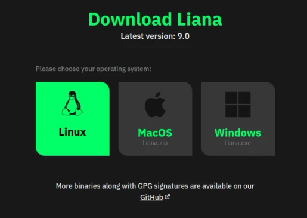
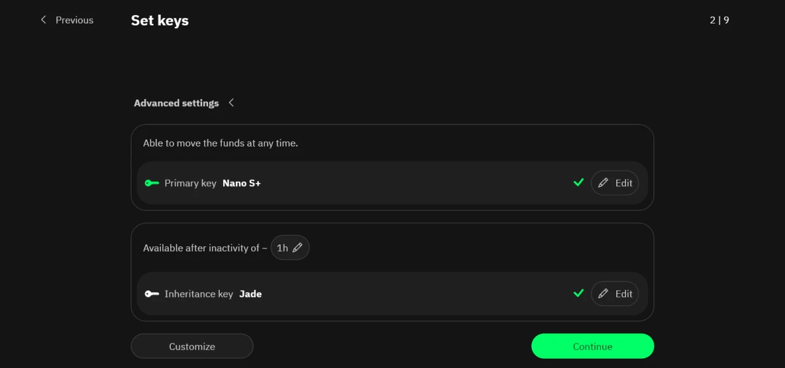

このチュートリアルでは、コンピュータ上でLianaアプリケーションを使用する方法を順を追って説明します。特に、自動継承プランの設定、通常の状況でのビットコインの受取りと送信、一定期間後の既存ポートフォリオからの資金回収の方法を学びます。

2025年1月、Lianaと互換性のあるハードウェアウォレットは以下の通り：BitBox02、Blockstream Jade、Blockstream Jade Plus、COLDCARD MK4、COLDCARD Q、Ledger Nano S、Ledger Nano S Plus、Ledger Nano X、Ledger Flex、Specter DIY。

既存のLianaウォレットから資金を回収したい場合は、以下のプレゼンテーションを読み、直接「ビットコインの回収」のセクションに進んでください。

## Lianaソフトウェアのご紹介

Lianaはオープンソースのソフトウェアパッケージで、高度なポートフォリオの作成と管理のために設計されている。このプロジェクトは、Kévin LoaecとAntoine Poinsotが共同設立したWizardsardine社によって2022年から開発されている。公式サイトでは、Lianaは「個人的なキュレーションのためのシンプルなポートフォリオで、リカバリーと継承機能を備えている」と紹介されている。このソフトウェアは、Linux、MacOS、Windowsのコンピュータ上で動作し、（オープン）ソースコードは[GitHub](https://github.com/wizardsardine/liana)で公開されている。

Lianaはビットコインのプログラマビリティをベースに、先進的なウォレットを開発した。特にタイムロック（*timelocks*）を活用している。タイムロックは、一定期間が経過した資金のみを使用できるようにするもので、ビットコインの回収に関与している。このように、Lianaウォレットは、いくつかの支出経路から構成されています：


- いつでも利用できる主な支出経路；
- 少なくとも1つのリカバリーパスがあり、一定時間後にアクセス可能になる。

下図は、2つの支出経路を持つポートフォリオの運用を示している：


- サクセッション（相続）プランとは、利用者が死亡した場合に相続人が資金を回収できるようにするプランのこと。このテーマについては、BTC102コースの[パート4](https://planb.network/courses/f3e3843d-1a1d-450c-96d6-d7232158b81f/233c88d3-2e8e-5eba-ac06-efe67a209038)をお読みになることをお勧めします。
- リカバリータイム付きのバックアップを強化することで、ユーザーは対応する秘密のフレーズを保持することなく財布を使用することができ、例えば空き巣に入られた際に財布を盗まれるリスクもなくなります。
- ビットコインを使い始めた人のためのセーフティネット：自分のウォレットを管理し、その「後見人」（例えば親族）が一定期間後に資金を回収する権利を留保する。
- マルチ・パーティ署名スキーム（*multisig*）は、企業のパートナーのような参加者の1人または複数が失踪した場合に対応するため、時間の経過とともに要件が減少する。

Lianaの大きな強みは、当座の支出に使われるメイン・キーが紛失した場合に、資金の回収を保証する標準的な方法を導入していることだ。これは、資金をクリーンに保管するための大きな革新である。したがって、Lianaは、最もリスクを避けるユーザーでさえ、ビットコインのサイファーパンクの理念に沿って、資金を保持するためにカストディアン（取引所プラットフォームなど）を使用するのをやめ、資金の所有権を取り戻すよう促すことができる。

もちろん、Lianaには欠点もある。ひとつは、ビットコインのブロックチェーン上で取引を行うことで、定期的にウォレットを更新しなければならないことだ。これは（ソフトウェアの使用頻度にもよるが）面倒であり、（その時の手数料の水準にもよるが）コストがかかるが、セキュリティを高めるために支払う代償である。

第二のマイナス点は、機密性であろう。設定に他人を巻き込むと、その人はあなたのアドレスをすべて知ることになり、あなたの行動を監視することができる。しかし、バックアップを強化したり、相続人がポートフォリオの詳細をすぐに知ることがないような後継者プランを選んだりすれば、この点は問題にならないだろう。

## 準備

このチュートリアルでは、サクセッション・プランを設定します。このチュートリアルでは、.NET Frameworkを使用します：


- Ledger Nano S Plus、日常生活用；

https://planb.network/tutorials/wallet/hardware/ledger-nano-s-plus-75043cb3-2e8e-43e8-862d-ca243b8215a4

- 資金回収に使用されるブロックストリーム・ジェイド；

https://planb.network/tutorials/wallet/hardware/jade-7d62bf0c-f460-4e68-9635-af9b731dabc3

- ポートフォリオ・ディスクリプタを保存するための2つの記憶媒体（USBメモリ）；
- 資金を回収するための指示が記載された引継書；
- 回収装置（ジェイド）が使用されていないことを確認するための、番号入りの密封袋。

## インストールと設定

Wizardsardineの公式サイトにアクセスし、https://wizardsardine.com/liana/、Lianaをダウンロードしてください。また、最新版を[GitHubリポジトリから](https://github.com/wizardsardine/liana/releases)ダウンロードし、ソフトウェアの真正性を確認することもできます。このチュートリアルで使用するバージョンは0.9です。



インストール前にソフトウェアの信頼性と完全性を手動で確認する方法については、このチュートリアルを参照することをお勧めします：

https://planb.network/tutorials/others/general/integrity-authenticity-21d0420a-be02-4663-94a3-8d487f23becc
ソフトウェアをマシンにインストールし、起動します。Create a new Liana wallet*"オプションを選択し、ウォレットを設定します。


ポートフォリオの種類を選択してください。リカバリータイム付きの強化されたバックアップをセットアップしたい場合は、"*Build your own*"オプションを選択し、デフォルトのスキームを選ぶことができます。これは、ハードウェアウォレットのリカバリフレーズを保持する必要がないことを除いて、ほぼ同じ方法で機能します。

ここでは、より複雑なコンフィギュレーションを設定する*拡張マルチシグ*のケースは無視している。

このチュートリアルでは、単純な継承を使用します。


簡単に説明しよう。


説明を読んだら、Lianaウォレットのキーを設定します。これは、あなたのアカウントの支出特性を決定する重要なステップです。


まず、"Advanced Settings"（詳細設定）メニューで、"Descriptor Type"（ディスクリプタ・タイプ）、つまり、チェーン上に契約書を記述する方法を決めることができる。2つのタイプから選択できます：P2WSH（SegWit）またはTaprootです。どちらの場合も、支出条件のセマンティクスは同じである。P2WSHはコントラクトを理解しやすくするが、Taprootは未使用の条件を隠蔽し、検索時のコストを節約できる点で優れている。

この選択は任意である: 疑問があれば、デフォルトのオプション(バージョン0.9の場合はP2WSHだが、これは変更される可能性がある)のままにしておくこと。


次に、主キー（*primary key*）を設定する。このキー（というより、このキーのセット）は、現在の資金支出に使用され、いかなるタイミング条件にも左右されない。Set*」をクリックすると、対応する*署名デバイス*を選択できる。私たちのケースでは、Ledger Nano S Plusハードウェアウォレットを選択しました。

デバイスからの拡張公開鍵の共有を許可する。この鍵に意味のある名前を付けます（この場合は「Nano S+」）。デバイスにインストールされているすべてのアプリケーションは正常に機能し続けることに注意してください。


次に、ペイバック遅延、すなわち、*相続キー*が資金を使用できるようになるまでの時間を設定する。この遅延はブロック単位で定義され、各ブロックは平均10分で区切られる。10分（1ブロック）から約15カ月（65,535ブロック）までの幅がある。この上限は、ロック時間が16ビットでエンコードされているため、ビットコインのプロトコルの制限である。

特別な事情がない限り、最長のリードタイム：15ヶ月または65,535ブロックを選ぶ。この方がコストを節約できます。ただし、「儀式化」して忘れないようにするため、更新手続き（「ポートフォリオの更新」セクションで説明）は年に1回、いつも同じ時期に行うことをお勧めします。

ここでは、回復時間を1時間（6ブロック）に設定してテストを実施した。


最後に、遺産キーを設定する。この鍵（というより鍵のセット）は、あなたが失踪した場合に資金を回収するために使用される。Set*」をクリックし、署名デバイスを選択し、拡張公開鍵の共有を検証する。

このチュートリアルでは、Jadeを選びました。キーには、連想させるような名前（ここでは "Jade"）を付けてください。最初のデバイスと同様に、従来のアカウントは機能し続けます。


これらのアクションがすべて完了したら、すべてが順番通りに行われていることを確認し、「*Continue*」をクリックして選択を確定します。



次のステップは、ポートフォリオ・ディスクリプタを保存することです。これは口座内の資金を見つけるために必要な情報です。ニーモニックフレーズとは逆に、ディスクリプターでは資金を使うことができないので、それを開示しても守秘義務の問題が生じるだけです（相手はあなたの取引をすべて知っていることになります）。

USBメモリなどの電子媒体に記述書のコピーを2部保存する。また、電子メディアが破損した場合にもアクセスできるよう、紙に2部印刷しておくこと。各バックアップには、署名デバイスを関連付ける必要があります。


チュートリアルの最後に分析されている）我々の記述子は以下の通りである：

```plaintext
wsh(or_d(pk([3689a8e7/48'/0'/0'/2']xpub6FKYNH4XbbdADV98yTVxgZZrtB4eE2tiUPreEv5iJAS3U1CvXGAtQGFXSHyFYdYNn9wNa9KU1pwfYoxQhwq4sPXGihD725VncdSy66v9WQa/<0;1>/*),and_v(v:pkh([42e629dd/48'/0'/0'/2']xpub6DpQGv9LkwAQXvghWASvsfA7t1BVj7bGDQ939v32iB6aUJsMRB6inckim26gRp74NBdS2zuyfHNXDZ9dTuNXkFFiz6QvwEeVvBuC2cnRWQd/<0;1>/*),older(6))))#8alrve5h
```

初期ポートフォリオ構成における最後のステップは、署名デバイスとして機能する各ハードウェアポートフォ リオの記述子を検証することである。


各署名デバイスについて同じことを行う。各ハードウェア・ポートフォリオに記述子が追加されていることをチェックし、確認する必要があります。


これであなたのウォレット情報は登録され、あとはビットコインネットワークへの接続方法を設定するだけです。自分のノード（ローカルまたはリモート）を使用するか、WizardSardineのインフラを使用するかを選択できる。後者の場合、電子メールアドレスをウォレットにリンクする必要があり、これによりディスクリプタを取得できるようになる。WizardSardineはあなたの全ての取引にアクセスすることができます。したがって、最初のオプションをお勧めします。


私たちは自分たちのノードを使うことにしました。既存のノードを使うこともできるし、自分のマシンに*剪定されたノード*をインストールすることもできる。他のノードにアクセスできない場合は、自分のマシンに自分のノードをインストールする。


このチュートリアルでは、既存の（公開されている）Electrumサーバーを使用します。しかし、注意してください！このサーバーは、Lianaウォレットでの私たちの全ての活動にアクセスすることができます。プライバシーを守りたければ、自分のノードを使いましょう。


ノードの設定が完了すると、メイン画面が開き、作成したばかりのLianaウォレットが表示されます。

この機会に、回収装置を安全な場所に保管してください。あなたが亡くなった場合に相続人が見つけられるよう、戦略的な場所に保管する必要があります。

セキュリティを強化するために、リカバリーに使用したコンポーネントを密封された袋（*タンパーエビデントバッグ*）に入れ、そのシリアル番号をどこかに書き留めておくことができます。こうすることで、誰にもアクセスされず、デバイスの有効性が保たれます。

この例では、以下の要素を組み立てた：


- ブロックストリーム・ジェイドがエステートの署名装置となる；
- デバイスの接続と充電用のUSBケーブル；
- デバイスの故障や損傷に備えて、文章を紙でバックアップしておくこと（例えばクリプトスチールのカプセルのように、媒体を金属製にして風雨から保護することもできることに注意）；
- ポートフォリオ・ディスクリプタの入ったUSBキー；
- USBキーの故障や破損に備えて、ディスクリプターの紙によるバックアップ（このバックアップはここでは撮影していない）；
- 資金を回収するために取るべき措置を記した引継書。


そして、これらのアイテムを封印した！


## 資金の受け取り

リアナのメイン画面には、残高と、ポートフォリオに関連する取引（過去と現在）が表示される。私たちの場合、残高はゼロである。


資金を受け取るには、「*Receive*」タブで「*Generate address*」をクリックしてください。新しいアドレスが画面に表示されます。従来のポートフォリオよりも長いアドレスで、スタンドアロン契約（P2WSHまたはTaproot）にリンクされたアドレスです。


このアドレスは、"*Verify on hardware device*"をクリックして、ハードウェア・ポートフォリオで確認する必要があります。


送金が完了すると、メイン画面に取引が表示される（最初は未確認、次に確定）。ここでは、50,000サトシ（送金時に50ドル強）を送金してテストしている。もちろん、送金手数料がかかるため、送金額はこの金額より一桁多くなる。


コイン*」タブで資金の有効期限を確認できます。このタブには、あなたのウォレット内の異なるコイン（UTXO）が表示されます。ここでは、私たちの取引で作成された50,000 satoshisコインの有効期限が同日（1時間後）であることがわかります。


Bitcoinで使用されているUTXO表現モデルをよりよく理解するには、Loïc Morelが書いたBitcoinの機密性に関するコースの最初の部分を参照してください：

https://planb.network/courses/65c138b0-4161-4958-bbe3-c12916bc959c
## 当期支出

現在の支出は、Lianaを使用するための通常の状況です。マスターキーによるビットコインの送金は、ElectrumやSparrowのような古典的なビットコインウォレットと同様に機能します。

チャージするには、"*Send*"タブに移動し、受取人のBTCアドレス、送金額、希望のチャージレートなど、必要な情報を入力します。便宜上、説明文（ローカルに保存）を追加することもできます。この例では、10,000サトシをあるBobに送金し、チャージレートは4サトシ/OV、つまり取引時に0.67ドルでした。

どのコイン（UTXO）を使うかを指定します。ここでは、以前作成した50,000サトシのコインを選択しています。


次に、"*Sign*"をクリックして、マスターキーにリンクされた署名デバイスで取引に署名します。ハードウェアウォレットでトランザクションを検証し、確認する必要があります。ここでは、Nano S Plusを使って取引に署名しています。


最後に、"*Broadcast*"をクリックして、取引をネットワーク上にブロードキャストします。資金を送金すると、使用済みコインの回復時間がリセットされますのでご注意ください。


メイン画面に取引が表示され、残高が更新されます。


## ポートフォリオの更新

上で説明したように、Lianaウォレットはブロックチェーン上でトランザクションを実行することで、定期的に資金を更新する必要があります。これを怠ると、相続人によって（あるいはバックアップが強化されている場合はセカンドデバイスによって）資金が回収される可能性があります。このような状況は極端に危険というわけではありませんが、セーフティネットの恩恵を受けながら、信頼できる第三者に頼ることなくビットコインを管理し続けるという、この仕組みを構築した目的を失うことになります。

資金（またはその一部）が期限切れとなり、リカバリーキーで使用できるようになる前に警告が表示されます。これは、あなたの「リカバリー・パス」（*回復パス*）がまもなく利用可能になることを示すものです。私たちの回復時間の短さ（1時間）を考えると、このメッセージは私たちの場合に直接表示されます。


期限が近づくと、当該資金を更新するよう促すボタンが表示されます。


コインを更新するには、「*コイン*」タブを開き、該当するコインボックスの「*コインを更新*」をクリックしてください。複数のコインをお持ちの場合は、機密保持のため、比較的短い間隔で1枚ずつ更新してください。コストを抑えるために、ポートフォリオ全体を新しい受信アドレスに送信して資金を統合することもできますが、これは機密保持に影響します。


取引に必要な手数料率を指定します。これは自分自身への送金なので、特に有効期限の数日前に行う場合は、かなり低い手数料率を設定できます。


この取引（"*自己送金*"と表示されている）は、"*取引*"タブにのみ表示されます。


一度確認されれば、あなたのコインは安全です！次の有効期限までご安心ください。

## ビットコインの回復

Lianaポートフォリオから資金をリカバリーする場合、2つの状況に直面する可能性があります。ソフトウェアがインストールされているコンピュータにアクセスできるかもしれません。その場合は、ソフトウェアを開くだけです（拡張バックアップモデルの場合はそうなります）。しかし、このコンピュータにアクセスできない場合もあります。リカバリーの手順はどちらの場合も同じです。

まずは、[Wizardsardine公式サイト](https://wizardsardine.com/liana/)、または[GitHubリポジトリ](https://github.com/wizardsardine/liana/releases)からLianaをダウンロードし、ソフトウェアの信頼性を確認してください。ソフトウェアをインストールし、実行する。今回使用したバージョンは0.9なので、ビジュアルが変わっているかもしれません。ウェルカム画面で、"Add an existing Liana wallet "を選択します。


ネットワークへの接続方法を設定します。独自のノード（ローカルまたはリモート）を使用するか、WizardSardineのインフラを使用するかを選択できます。後者の場合、ポートフォリオ作成者が使用している電子メールアドレスが必要になります。この情報をお持ちでない場合は、最初のオプションを選択してください。


独自のノードを使用している場合は、ポートフォリオ記述子をインポートします。これは口座の技術的な説明で、その口座に保有されている資金を取り出すことができる。私たちの場合は、以下の情報です：

```plaintext
wsh(or_d(pk([3689a8e7/48'/0'/0'/2']xpub6FKYNH4XbbdADV98yTVxgZZrtB4eE2tiUPreEv5iJAS3U1CvXGAtQGFXSHyFYdYNn9wNa9KU1pwfYoxQhwq4sPXGihD725VncdSy66v9WQa/<0;1>/*),and_v(v:pkh([42e629dd/48'/0'/0'/2']xpub6DpQGv9LkwAQXvghWASvsfA7t1BVj7bGDQ939v32iB6aUJsMRB6inckim26gRp74NBdS2zuyfHNXDZ9dTuNXkFFiz6QvwEeVvBuC2cnRWQd/<0;1>/*),older(6))))#8alrve5h
```


その後、Lianaはニーモニック・フレーズを入力するよう求める。動作する署名デバイス（ハードウェア・ウォレット）をお持ちの場合は、この部分をスキップしてください。デバイスが紛失または破損していても、対応する12または24の単語があれば、このオプションを使うことができます。安全面を考慮し（復元する量が多い場合）、新しいハードウェアウォレットを入手し、ニーモニックを使ってそのハードウェアウォレットの鍵を復元することをお勧めします。

私たちのケースでは、Blockstream Jadeハードウェアウォレットをリカバリデバイスとして使用し、このステップをスキップする（「*スキップ*」）ことを選択します。


画面上で署名デバイスを選択して、署名デバイスの記述子を確認し、保存します。ハードウェアウォレットが表示されない場合は、接続されロックが解除されていることを確認してください。この情報がデバイスに追加されていることを確認します。


ノードを設定します。既存のノードを使用するか、あるいは*剪定されたノード*をマシンにインストールすることができる。ここでは既存のノードを使用する。


このチュートリアルでは、Electrumの公開サーバーを使用しました。しかし、このサーバーはLianaウォレットでの私たちの全ての活動にアクセスすることができます。プライバシーを守りたいのであれば、自分のノードを使った方が良いでしょう。


ノードを設定すると、メインウォレット画面に移動し、アカウントにリンクされている残高や過去の取引を見ることができます。また、資金が取り出せるかどうかも確認できます。ここでは、コインを取り出すことができることを確認しています。


ポートフォリオの資金を回収するには、左下の設定（「*設定*」）から「*回収*」をクリックします。


該当するボックスにチェックを入れて、ウォレット内のコインを使用します。送金先のBTCアドレスと取引手数料を指定します。次に "*Next*"をクリックします。


Sign*」をクリックして取引に署名し、ハードウェアウォレットで取引を検証します。


その後、"*Broadcast*"をクリックしてネットワークにブロードキャストする。


メイン画面にトランザクションが表示されるはずです。確認されたら、リカバリーは完了です！


## ボーナス：ディスクリプター分析

記述子は、アドレスの集合を網羅的に記述した、人間が読める文字列である。これは、アドバンストポートフォリオのパーツ(UTXO)を検索するために不可欠な情報のいくつかを組み合わせたものである。記述子の記述方法は、2019年にAndrew Poelstra、Pieter Wuille、Sanket Kanjalkarによって開発されたスクリプト言語である[Miniscript syntax](https://bitbox.swiss/blog/understanding-bitcoin-miniscript-part-2/)に基づいている。

この文字列がなぜ重要なのかをよりよく理解するために、例の記述子を分析してみよう：

```plaintext
wsh(or_d(pk([3689a8e7/48'/0'/0'/2']xpub6FKYNH4XbbdADV98yTVxgZZrtB4eE2tiUPreEv5iJAS3U1CvXGAtQGFXSHyFYdYNn9wNa9KU1pwfYoxQhwq4sPXGihD725VncdSy66v9WQa/<0;1>/*),and_v(v:pkh([42e629dd/48'/0'/0'/2']xpub6DpQGv9LkwAQXvghWASvsfA7t1BVj7bGDQ939v32iB6aUJsMRB6inckim26gRp74NBdS2zuyfHNXDZ9dTuNXkFFiz6QvwEeVvBuC2cnRWQd/<0;1>/*),older(6))))#8alrve5h
```

この記述子から以下の情報を抽出することができる：


- wsh` (*witness script hash*の略)：作成されるトランザクション出力のタイプである。もしTaprootを使うことにしていたら、識別子は `tr` になっていただろう。
- or_d`：or_d`：これは論理演算子で、出費を認めるには以下の2つの*条件のどちらかを満たす必要があることを示します（`_d`は特定の構文を示します）。
- pk`（*公開鍵*の略）：この演算子は、与えられた署名を次の公開鍵と照合し、その結果をブール値 (TRUE または FALSE) で返します。
- `[3689a8e7/48'/0'/0'/2']`:この要素には、メイン・ハードウェア・ウォレット(この場合は Nano S Plus)のマスターキーの*フィンガープリント*と、リンクされた拡張秘密鍵(他のすべての秘密鍵はここから派生する)への派生パスが含まれる。
- xpub6FKY ...WQa`：これはメイン・ハードウェア・ポートフォリオ（ここでは Nano S Plus）にリンクされた拡張公開鍵である。
- `/<0;1>/*`:0`は受信用、`1`は内部操作(*change*)用で、「ワイルドカード」(`*`)を使用することで、古典的なポートフォリオ・ソフトウェアの「ギャップ制限」管理に似た、設定可能な方法で複数のアドレスを順次派生させることができる。
- and_v`：and_v`: これは論理演算子で、出費を認めるには以下の2つの*条件を満たさなければならないことを示します（`_v`は特定の構文を示します）。
- v:pkh`（*verify: public key hash*の略）：この演算子は、与えられた署名と公開鍵を、その後に続く公開鍵ハッシュ (*hash*) に対して検証する。これは基本的に P2PKH や P2WPKH スクリプトと同じチェックである。
- `[42e629dd/48'/0'/0'/2']`:これは上記と同じ要素（トレースと派生パスからなる）であるが、ハードウェア・リカバリ・ポート フォリオのマスターキー（この場合は Jade）のトレースが示されている。
- xpub6DpQ ...WQd`：ハードウェア・リカバリー・ウォレット（ここでは Jade）にリンクされている拡張公開鍵である。
- `older(6)` : この演算子は、作成されたトランザクション出力が使用されるためには、厳密に6ブロックより大きい年齢を持たなければならないことをチェックする。

最後のデータ項目（`8alrve5h`）は記述子のチェックサムであり、ポートフォリオ識別子に対応する。

このポートフォリオが作成するスクリプトは、以下のような形になる：

```plaintext
<primary_key> CHECKSIG IFDUP NOTIF DUP HASH160 <recovery_key_hash> EQUALVERIFY CHECKSIGVERIFY <locktime> CHECKSEQUENCEVERIFY ENDIF
```

ビットコインウォレットのセキュリティは、その仕組みの理解にも依存するため、Plan ₿ Networkの無料トレーニングコースを受講して、決定論的ウォレットと階層型ウォレットの仕組みを深く学ぶことをお勧めします：

https://planb.network/courses/46b0ced2-9028-4a61-8fbc-3b005ee8d70f