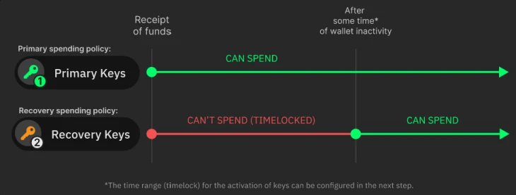
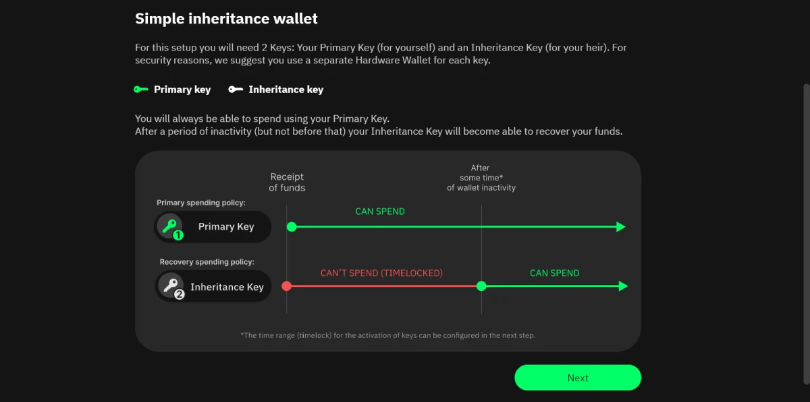
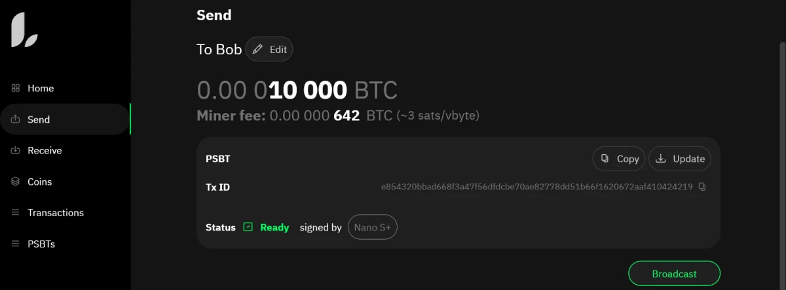
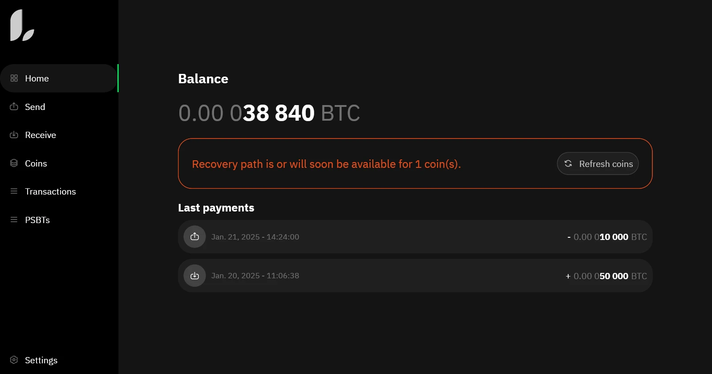

Neste tutorial, explicaremos passo a passo como utilizar a aplicação Liana num computador. Entre outras coisas, aprenderá a configurar um plano de sucessão automatizado, a receber e enviar bitcoins em situações normais e a recuperar fundos de uma carteira existente após um determinado período.

Em janeiro de 2025, as carteiras de hardware compatíveis com Liana eram: BitBox02, Blockstream Jade, Blockstream Jade Plus, COLDCARD MK4, COLDCARD Q, Ledger Nano S, Ledger Nano S Plus, Ledger Nano X, Ledger Flex, Specter DIY.

Se desejar recuperar fundos de uma carteira Liana existente, leia a apresentação abaixo e vá diretamente para a secção "Recuperar bitcoins".

## Apresentação do software Liana

O Liana é um pacote de software de código aberto concebido para a criação e gestão de carteiras avançadas, nomeadamente como parte de um sistema de herança automatizado ou de um mecanismo robusto de cópia de segurança. O projeto tem sido desenvolvido desde 2022 pela Wizardsardine, uma empresa co-fundada por Kévin Loaec e Antoine Poinsot. No sítio Web oficial, o Liana é apresentado como "um portefólio simples para curadoria pessoal, com funcionalidades de recuperação e herança". O software funciona em computadores - Linux, MacOS, Windows - e o seu código-fonte (aberto) está disponível [no GitHub] (https://github.com/wizardsardine/liana).

Liana baseia-se na capacidade de programação do Bitcoin para criar uma carteira avançada. Em particular, tira partido dos bloqueios de tempo (*timelocks*), que permitem que os fundos sejam gastos apenas depois de decorrido um determinado período de tempo e que estão envolvidos na recuperação de Bitcoins. Uma carteira Liana é, portanto, composta de vários caminhos de gastos:


- Uma via principal de despesa, que está sempre disponível;
- Pelo menos um caminho de recuperação, que se torna acessível após um determinado período de tempo.

O diagrama abaixo ilustra o funcionamento de uma carteira com duas trajectórias de despesa:



Esta operação permite-lhe definir várias configurações, incluindo :


- Um plano de sucessão (ou herança), que permite aos herdeiros recuperar os fundos em caso de morte do utilizador. Para mais informações sobre este assunto, recomendamos a leitura da [parte 4](https://planb.network/courses/f3e3843d-1a1d-450c-96d6-d7232158b81f/233c88d3-2e8e-5eba-ac06-efe67a209038) do curso BTC102.
- Uma cópia de segurança reforçada com um tempo de recuperação, dando ao utilizador a possibilidade de utilizar a sua carteira sem ter de guardar a frase secreta correspondente e correr o risco de a ver roubada, por exemplo, durante um assalto.
- Uma rede de segurança para as pessoas que se iniciam na utilização da Bitcoin: gerem a sua própria carteira e o seu "tutor" (um familiar, por exemplo) reserva-se o direito de recuperar os seus fundos após um determinado período.
- Um sistema de assinatura multipartidário (*multisig*) com requisitos reduzidos ao longo do tempo, para fazer face ao desaparecimento de um ou mais participantes, como os sócios de uma empresa.

A grande força do Liana reside no facto de introduzir uma forma normalizada de garantir a recuperação dos fundos em caso de perda da chave principal, utilizada para as despesas correntes. Trata-se de uma grande inovação para a guarda limpa de fundos, que é muito arriscada, sobretudo se não estivermos bem informados sobre o assunto. Liana poderia, portanto, encorajar mesmo os utilizadores mais avessos ao risco a deixar de utilizar um depositário (como uma plataforma de câmbio) para guardar os seus fundos e recuperar a propriedade do seu dinheiro, em conformidade com o espírito cypherpunk da Bitcoin.

Claro que a Liana tem as suas desvantagens. A primeira é que tem de atualizar a sua carteira regularmente, fazendo uma transação na blockchain da Bitcoin. Isto pode ser um incómodo (dependendo da frequência com que utiliza o software) e dispendioso (dependendo do nível de taxas na altura), mas é o preço a pagar pela segurança extra.

Um segundo ponto negativo pode ser a confidencialidade. Quando envolve outra pessoa na configuração, ela fica a par de todos os seus endereços e pode, portanto, monitorizar a sua atividade. No entanto, isto não será um problema se optar por um backup reforçado ou por um plano de sucessão em que o seu herdeiro não tenha conhecimento imediato dos detalhes da carteira.

## Preparação

Neste tutorial, vamos definir um plano de sucessão. Utilizaremos o :


- Um Ledger Nano S Plus, para as despesas quotidianas;

https://planb.network/tutorials/wallet/hardware/ledger-nano-s-plus-75043cb3-2e8e-43e8-862d-ca243b8215a4

- Um Blockstream Jade, utilizado para recuperar fundos;

https://planb.network/tutorials/wallet/hardware/jade-7d62bf0c-f460-4e68-9635-af9b731dabc3

- Dois suportes de armazenamento (pen USB) para guardar o descritor da carteira;
- Uma carta de sucessão, com instruções para a recuperação dos fundos;
- Um saco selado e numerado, para garantir que o dispositivo de recuperação (a Jade) não foi utilizado.

## Instalação e configuração

Visite o sítio Web oficial da Wizardsardine e transfira o Liana em https://wizardsardine.com/liana/. Também pode descarregar a versão mais recente [do repositório GitHub](https://github.com/wizardsardine/liana/releases), onde pode verificar a autenticidade do software. A versão usada neste tutorial é a 0.9.


Para saber como verificar manualmente a autenticidade e a integridade do software antes da instalação, recomendamos que consulte este tutorial :

https://planb.network/tutorials/others/general/integrity-authenticity-21d0420a-be02-4663-94a3-8d487f23becc
Instale o software na sua máquina e inicie-o. Escolha a opção "*Criar uma nova carteira Liana*" para configurar a sua carteira.


Escolha o seu tipo de carteira. Se pretender configurar uma cópia de segurança melhorada com tempo de recuperação, pode selecionar a opção "*Criar a sua própria cópia de segurança*" e optar pelo esquema predefinido. Isto funcionará da mesma forma, exceto que não precisará de manter a frase de recuperação da carteira de hardware.

Estamos a ignorar aqui o caso do *Expanding multisig*, que estabelece uma configuração mais complexa.

Para efeitos deste tutorial, vamos utilizar a herança simples.


Segue-se uma breve explicação.



Depois de leres a explicação, poderás configurar as chaves da tua carteira Liana. Esta etapa é crucial, pois determina as caraterísticas de utilização da tua conta.


Em primeiro lugar, no menu "Definições avançadas", pode decidir sobre o "tipo de descritor", ou seja, a forma como o contrato será escrito na cadeia. Pode escolher entre dois tipos: P2WSH (SegWit) ou Taproot. Em ambos os casos, a semântica das condições de despesa será a mesma. Enquanto o P2WSH torna o contrato mais fácil de compreender, o Taproot é superior na medida em que oculta as condições não utilizadas e poupa custos durante a recuperação.

Esta escolha é opcional: em caso de dúvida, deixe a opção por defeito (P2WSH no caso da versão 0.9, mas esta está sujeita a alterações).


Em seguida, configure a sua chave primária (*primary key*). Esta chave (ou melhor, este conjunto de chaves) será utilizada para a despesa atual de fundos, que não está sujeita a quaisquer condições temporais. Ao clicar em "*Set*", pode selecionar o *dispositivo de assinatura* correspondente. No nosso caso, escolhemos a carteira de hardware Ledger Nano S Plus.

Autorizar a partilha da chave pública alargada do dispositivo. Atribua um nome significativo a esta chave (neste caso, "Nano S+"). Tenha em atenção que todas as aplicações instaladas no dispositivo continuarão a funcionar normalmente.


De seguida, defina o prazo de reembolso, ou seja, o tempo após o qual os fundos podem ser gastos pela *chave de herança*. Este atraso é definido em termos de blocos, com cada bloco separado por uma média de 10 minutos. Pode variar entre 10 minutos (1 bloco) e cerca de 15 meses (65.535 blocos). Este limite superior é uma limitação do protocolo Bitcoin, pois o tempo de bloqueio é codificado em 16 bits.

Salvo circunstâncias especiais, opte pelo prazo de entrega mais longo: 15 meses ou 65.535 blocos. Isto permitir-lhe-á poupar custos. Recomendamos, no entanto, que efectue o procedimento de atualização (descrito na secção "Atualização da carteira") uma vez por ano, sempre na mesma altura do ano, para "ritualizar" esta prática e evitar esquecimentos.

Aqui, definimos um tempo de recuperação de uma hora (6 blocos) para efetuar os nossos testes.


Por fim, crie a sua chave de património. Esta chave (ou melhor, conjunto de chaves) será utilizada para recuperar fundos em caso de desaparecimento. Clique em "*Definir*", escolha o dispositivo de assinatura e valide a partilha da chave pública alargada no mesmo.

Para este tutorial, escolhemos Jade. Dê à chave um nome evocativo (aqui "Jade"). Tal como no primeiro dispositivo, as contas convencionais continuarão a funcionar.


Quando todas estas acções estiverem concluídas, verifique se tudo está em ordem e clique em "*Continuar*" para confirmar as suas escolhas.


O passo seguinte é guardar o descritor da sua carteira. Esta é a informação de que necessita para encontrar os fundos na sua conta. Ao contrário da frase mnemónica, o descritor não lhe permite gastar fundos, pelo que a sua divulgação apenas colocará um problema de confidencialidade (a pessoa saberá todas as suas transacções).

Guarde duas cópias do descritor em suportes electrónicos, como pen drives. Certifique-se de que imprime também duas cópias em papel, de modo a poder aceder-lhes em caso de danos nos suportes electrónicos. Cada cópia de segurança deve ser associada a um dispositivo de assinatura.


O nosso descritor (que é analisado no final do tutorial) é o seguinte:

```plaintext
wsh(or_d(pk([3689a8e7/48'/0'/0'/2']xpub6FKYNH4XbbdADV98yTVxgZZrtB4eE2tiUPreEv5iJAS3U1CvXGAtQGFXSHyFYdYNn9wNa9KU1pwfYoxQhwq4sPXGihD725VncdSy66v9WQa/<0;1>/*),and_v(v:pkh([42e629dd/48'/0'/0'/2']xpub6DpQGv9LkwAQXvghWASvsfA7t1BVj7bGDQ939v32iB6aUJsMRB6inckim26gRp74NBdS2zuyfHNXDZ9dTuNXkFFiz6QvwEeVvBuC2cnRWQd/<0;1>/*),older(6))))#8alrve5h
```

O passo final na configuração inicial do portefólio é verificar o descritor em cada um dos portefólios de hardware que servem como dispositivos de assinatura.


Faça o mesmo para cada dispositivo de assinatura. Terá de verificar e confirmar que o descritor foi adicionado a cada portefólio de hardware.


A informação da sua carteira está agora registada, e tudo o que resta é configurar a forma como pretende ligar-se à rede Bitcoin. Pode optar por usar o seu próprio nó (local ou remoto) ou usar a infraestrutura da WizardSardine. Neste último caso, terá de associar um endereço de correio eletrónico à sua carteira, o que lhe permitirá obter o descritor. A WizardSardine terá acesso a todas as suas transacções. A primeira opção é, portanto, sugerida.


Optámos por utilizar o nosso próprio nó. Pode utilizar um nó existente ou instalar um nó *podado* na sua máquina. Se não tiver acesso a nenhum outro nó, instale o seu próprio nó na sua máquina, o que deve demorar algum tempo (da ordem de vários dias).


Para este tutorial, usámos um servidor Electrum existente (público). Mas cuidado! Ele tinha acesso a toda a nossa atividade com a carteira Liana. Por isso usa o teu próprio nó se quiseres proteger a tua privacidade.


Quando a configuração do nó estiver concluída, o ecrã principal deve abrir, mostrando a sua carteira Liana recém-criada.

Aproveite a oportunidade para guardar a unidade de recuperação num local seguro. Deve ser guardado num local estratégico, para que possa ser encontrado pelos seus herdeiros em caso de morte.

Para maior segurança, pode colocar os componentes utilizados para a recuperação num saco selado (*saco anti-violação*) e anotar o seu número de série num local qualquer. Isto garante que ninguém lhe acedeu e que o seu dispositivo permanece válido.

No nosso exemplo, reunimos os seguintes elementos:


- Blockstream Jade como dispositivo de assinatura para a propriedade;
- Um cabo USB para ligar e recarregar o dispositivo;
- Uma cópia de segurança em papel da frase em caso de mau funcionamento ou de danificação do dispositivo (note-se que o suporte também pode ser metálico e, por conseguinte, estar protegido das intempéries, como é o caso das cápsulas Cryptosteel, por exemplo);
- A chave USB que contém o descritor de portefólio ;
- Uma cópia de segurança em papel do descritor, em caso de mau funcionamento ou de danos na chave USB (esta cópia de segurança não foi fotografada aqui);
- Uma carta de sucessão que descreva as medidas a adotar para recuperar os fundos.


E colocamos estes artigos sob selo!


## Receção de fundos

O ecrã principal do Liana apresenta o seu saldo e as transacções (passadas e actuais) associadas à sua carteira. No nosso caso, o saldo é zero, o que é normal.


Para receber fundos, aceda ao separador "*Receber*" e clique em "*Gerar endereço*". Deve aparecer um novo endereço no seu ecrã. É mais longo do que nas carteiras clássicas: trata-se de um endereço ligado a um contrato autónomo (P2WSH ou Taproot).


É necessário verificar este endereço na sua carteira de hardware clicando em "*Verificar no dispositivo de hardware*".


Depois de os fundos terem sido enviados, a transação aparece no ecrã principal (primeiro como não confirmada e depois como confirmada). Neste caso, enviámos 50.000 satoshis (pouco mais de 50 dólares na altura da transferência) para este teste. Escusado será dizer que o montante transferido no seu caso terá de ser uma ordem de grandeza superior a este valor, devido às taxas de transação.


Pode verificar o estado de expiração dos seus fundos acedendo ao separador "*Moedas*". Este separador mostra-lhe as diferentes moedas (UTXO) na sua carteira. Aqui, podemos ver que a moeda de 50.000 satoshis criada pela nossa transação expira no mesmo dia (uma hora).


Para compreender melhor o modelo de representação UTXO utilizado na Bitcoin, pode consultar a primeira parte do curso sobre confidencialidade na Bitcoin escrito por Loïc Morel :

https://planb.network/courses/65c138b0-4161-4958-bbe3-c12916bc959c
## Despesas correntes

As despesas correntes são a situação normal para usar o Liana. O envio de bitcoins com a chave mestra funciona como em todas as carteiras Bitcoin clássicas como Electrum ou Sparrow.

Para efetuar uma cobrança, vá ao separador "*Enviar*" e introduza as informações essenciais: o endereço BTC do destinatário, o montante a enviar e a taxa de cobrança pretendida. Também pode ser adicionada uma descrição (guardada localmente) para sua conveniência pessoal. No nosso exemplo, enviámos 10.000 satoshis para um determinado Bob, com uma taxa de cobrança de 4 sat/ov, ou seja, 0,67 USD no momento da transação.

O Liana também oferece "controlo de moedas": indica-se qual a moeda (UTXO) que se pretende gastar. Aqui, escolhemos a moeda de 50.000 satoshis criada anteriormente.


Em seguida, assine a transação com o seu dispositivo de assinatura ligado à chave mestra, clicando em "*Assinar*". Terá de verificar e confirmar a transação na sua carteira de hardware. Aqui, utilizámos o Nano S Plus para assinar a transação.


Finalmente, transmita a transação através da rede clicando em "*Broadcast*". Note que o envio de fundos irá reiniciar o tempo de recuperação das moedas usadas.



A transação aparecerá no ecrã principal e o seu saldo será atualizado.


## Atualização da carteira

Como explicado acima, a carteira Liana exige que você atualize seus fundos regularmente, realizando uma transação no blockchain. Se não o fizer, os seus fundos podem ser recuperados pelo seu herdeiro (ou pelo seu segundo dispositivo, no caso de um backup melhorado). Esta situação não é extremamente perigosa, mas anula o objetivo da criação deste mecanismo: manter o controlo dos seus bitcoins sem recorrer a um terceiro de confiança, beneficiando ao mesmo tempo de uma rede de segurança.

Será apresentado um aviso antes de os seus fundos (ou parte deles) expirarem e poderem ser gastos com a chave de recuperação. Indicará que o seu "caminho de recuperação" (*caminho de recuperação*) estará disponível em breve. Dada a brevidade do nosso tempo de recuperação (uma hora), esta mensagem é apresentada diretamente no nosso caso.


Quando o prazo se aproxima, aparece um botão que lhe pede para atualizar os fundos em causa.


Para atualizar as suas moedas, vá ao separador "*Moedas*" e clique em "*Atualizar moeda*" na caixa da moeda correspondente. Se tiver várias moedas, deve actualizá-las uma a uma e a intervalos relativamente curtos, por razões de confidencialidade. Para reduzir os custos, pode consolidar os seus fundos enviando toda a carteira para um novo endereço de receção, mas isso afectará a sua confidencialidade.


Indique a taxa de comissão pretendida para a transação. Uma vez que se trata de uma transferência para si próprio, pode definir uma taxa de comissão bastante baixa, especialmente se o fizer vários dias antes do vencimento.


A transação (identificada como "*autotransferência*") só será visível no separador "*Transacções*".


Uma vez confirmada, a sua moeda está segura! Pode ficar descansado até à próxima data de expiração.

## Recuperação da Bitcoin

Ao recuperar fundos da carteira Liana, pode deparar-se com uma de duas situações. Pode ter acesso ao computador onde o software está instalado e, nesse caso, basta abri-lo (o que acontecerá no caso do modelo de cópia de segurança melhorada). No entanto, pode não ter acesso a esse computador, pelo que vamos começar do zero. Note que o procedimento de recuperação é o mesmo em ambos os casos.

Para começar, descarregue o Liana a partir do [site oficial da Wizardsardine](https://wizardsardine.com/liana/), ou do [repositório GitHub](https://github.com/wizardsardine/liana/releases), onde pode verificar a autenticidade do software. Instale o software e execute-o. A versão utilizada no nosso caso é a 0.9, pelo que o aspeto visual pode ter mudado. No ecrã de boas-vindas, selecione a opção "Add an existing Liana wallet".


Configure a forma como pretende ligar-se à rede. Pode optar por utilizar o seu próprio nó (local ou remoto) ou utilizar a infraestrutura da WizardSardine. Neste último caso, precisará do endereço de correio eletrónico utilizado pelo criador do portefólio, para que os fundos possam ser localizados automaticamente. Se não tiver esta informação, escolha a primeira opção.


Se estiver a utilizar o seu próprio nó, importe o descritor da carteira. Trata-se de uma descrição técnica da conta, que lhe permite recuperar os fundos nela contidos. No nosso caso, são as seguintes informações:

```plaintext
wsh(or_d(pk([3689a8e7/48'/0'/0'/2']xpub6FKYNH4XbbdADV98yTVxgZZrtB4eE2tiUPreEv5iJAS3U1CvXGAtQGFXSHyFYdYNn9wNa9KU1pwfYoxQhwq4sPXGihD725VncdSy66v9WQa/<0;1>/*),and_v(v:pkh([42e629dd/48'/0'/0'/2']xpub6DpQGv9LkwAQXvghWASvsfA7t1BVj7bGDQ939v32iB6aUJsMRB6inckim26gRp74NBdS2zuyfHNXDZ9dTuNXkFFiz6QvwEeVvBuC2cnRWQd/<0;1>/*),older(6))))#8alrve5h
```


Liana pede-lhe então que introduza uma frase mnemónica. Se tiver um dispositivo de assinatura (carteira de hardware) a funcionar, salte esta parte. Se o seu dispositivo estiver em falta ou danificado, mas tiver as 12 ou 24 palavras correspondentes, pode continuar a usar esta opção. Por precaução (se o montante a recuperar for elevado), sugerimos que obtenha uma nova carteira de hardware e utilize a mnemónica para restaurar as chaves nela contidas.

No nosso caso, utilizamos a carteira de hardware Blockstream Jade como dispositivo de recuperação e optámos por saltar ("*Skip*") este passo.


Verifique e guarde o descritor no seu dispositivo de assinatura, selecionando-o no ecrã. Se a sua carteira de hardware não aparecer, verifique se está ligada e desbloqueada. Verifique e confirme que esta informação foi adicionada ao seu dispositivo.


Configure o seu nó. Pode utilizar um nó existente ou instalar um *nó podado* na sua máquina. No nosso caso, utilizámos um nó existente.


Para este tutorial, usámos um servidor Electrum público. No entanto, ele teve acesso a toda a nossa atividade com a carteira Liana. Se quiseres proteger a tua privacidade, é melhor usares o teu próprio nó.


Depois de configurar o seu nó, é levado para o ecrã principal da carteira, onde pode ver o saldo e as transacções anteriores associadas à conta. Também pode ver se os fundos podem ser recuperados. Aqui, vemos que uma moeda pode ser recuperada.



Para recuperar os fundos da carteira, vá a Definições ("*Definições*") no canto inferior esquerdo e clique em "*Recuperação*".


Gastar a moeda na carteira, assinalando a caixa apropriada. Indique o endereço BTC para o qual pretende enviar os fundos, bem como a taxa de transação. Em seguida, clique em "*Próximo*".


Assine a transação clicando em "*Sign*" e validando a transação na sua carteira de hardware.


Em seguida, transmita-o através da rede clicando em "*Broadcast*".


A transação deve aparecer no ecrã principal. Uma vez confirmada, a recuperação está concluída!


## Bónus: análise de descritores

O descritor é uma cadeia de caracteres legível por humanos que descreve exaustivamente um conjunto de endereços. Combina uma série de informações essenciais para recuperar as partes (UTXO) de uma carteira avançada. A forma como o descritor é escrito baseia-se na [Miniscript syntax] (https://bitbox.swiss/blog/understanding-bitcoin-miniscript-part-2/), a linguagem de scripting desenvolvida por Andrew Poelstra, Pieter Wuille e Sanket Kanjalkar em 2019.

Para compreender melhor porque é que esta cadeia de caracteres é importante, vamos analisar o descritor no nosso exemplo, que é :

```plaintext
wsh(or_d(pk([3689a8e7/48'/0'/0'/2']xpub6FKYNH4XbbdADV98yTVxgZZrtB4eE2tiUPreEv5iJAS3U1CvXGAtQGFXSHyFYdYNn9wNa9KU1pwfYoxQhwq4sPXGihD725VncdSy66v9WQa/<0;1>/*),and_v(v:pkh([42e629dd/48'/0'/0'/2']xpub6DpQGv9LkwAQXvghWASvsfA7t1BVj7bGDQ939v32iB6aUJsMRB6inckim26gRp74NBdS2zuyfHNXDZ9dTuNXkFFiz6QvwEeVvBuC2cnRWQd/<0;1>/*),older(6))))#8alrve5h
```

As informações seguintes podem ser extraídas deste descritor:


- `wsh` (abreviatura de *witness script hash*): Este é o tipo de saída transacional criada. Se tivéssemos escolhido usar o Taproot, o identificador seria `tr`.
- `ou_d`: Trata-se de um operador lógico que indica que *uma das duas* condições seguintes deve ser satisfeita para que a despesa seja aceite (o `_d` indica uma sintaxe específica).
- `pk` (abreviatura de *public key*): Este operador verifica uma dada assinatura contra a seguinte chave pública, e dá a resposta como um booleano (TRUE ou FALSE).
- `[3689a8e7/48'/0'/0'/2']`: Este elemento inclui a *impressão digital* da chave mestra para a carteira de hardware principal (neste caso, o Nano S Plus) e o caminho de derivação para a chave privada alargada ligada (a partir da qual todas as outras chaves privadas são derivadas).
- `xpub6FKY ... WQa`: Esta é a chave pública alargada associada à carteira de hardware principal (neste caso, o Nano S Plus)
- `/<0;1>/*`: Estas são as vias de derivação para a obtenção de chaves e endereços simples: `0` para a receção, `1` para operações internas (*change*), com um "wildcard" (`*`) que permite a derivação sequencial de vários endereços de forma configurável, semelhante à gestão do "gap limit" do software clássico de portefólio.
- e_v`: Trata-se de um operador lógico que indica que *as duas* condições seguintes devem ser satisfeitas para que a despesa seja aceite (o `_v` indica uma sintaxe específica).
- `v:pkh` (abreviatura de *verify: public key hash*): Este operador verifica uma dada assinatura e chave pública contra o hash de chave pública (*hash*) que se segue. Esta é essencialmente a mesma verificação dos scripts P2PKH e P2WPKH.
- `[42e629dd/48'/0'/0'/2']`: Trata-se do mesmo elemento que o anterior (constituído pelo traço e pelo caminho de derivação), exceto que é indicado o traço da chave-mestra da carteira de recuperação de hardware (neste caso, o Jade).
- `xpub6DpQ ... WQd`: Esta é a chave pública alargada ligada à carteira de recuperação de hardware (neste caso, a Jade).
- `older(6)` : Este operador verifica que a saída transacional criada deve ter uma idade estritamente superior a 6 blocos para poder ser gasta.

O último item de dados (`8alrve5h`) é a soma de controlo do descritor e corresponde ao identificador da carteira.

Os guiões criados por este portefólio terão a seguinte forma:

```plaintext
<primary_key> CHECKSIG IFDUP NOTIF DUP HASH160 <recovery_key_hash> EQUALVERIFY CHECKSIGVERIFY <locktime> CHECKSEQUENCEVERIFY ENDIF
```

Uma vez que a segurança da sua carteira Bitcoin também depende da sua compreensão de como ela funciona, sugiro que estude os mecanismos das carteiras determinísticas e hierárquicas em profundidade, fazendo este curso de formação gratuito sobre Plan ₿ Network :

https://planb.network/courses/46b0ced2-9028-4a61-8fbc-3b005ee8d70f