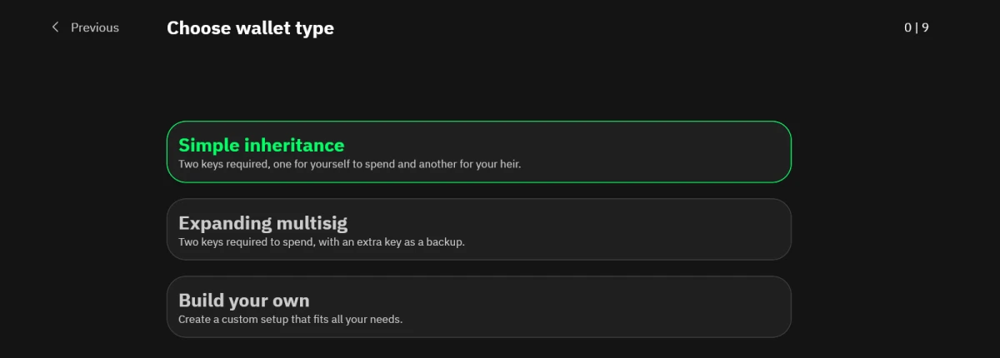
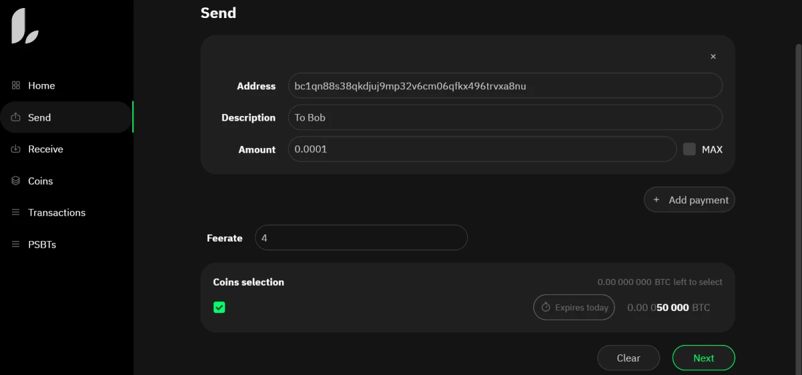

在本教程中，我们将逐步讲解如何在电脑上使用 Liana 应用程序。除其他事项外，您还将学习如何设置自动继承计划、在正常情况下接收和发送比特币，以及在给定期限后从现有投资组合中取回资金。

2025 年 1 月，与 Liana 兼容的硬件钱包有BitBox02、Blockstream Jade、Blockstream Jade Plus、COLDCARD MK4、COLDCARD Q、Ledger Nano S、Ledger Nano S Plus、Ledger Nano X、Ledger Flex、Specter DIY。

如果您想从现有的 Liana 钱包中恢复资金，请阅读下面的介绍并直接转到 "恢复比特币 "部分。

## Liana 软件介绍

Liana 是一款开源软件包，用于创建和管理高级投资组合，特别是作为自动继承系统或强大备份机制的一部分。该项目自 2022 年起由 Wizardsardine 公司开发，该公司由 Kévin Loaec 和 Antoine Poinsot 共同创建。在官方网站上，Liana 被描述为 "个人收藏的简单组合，具有恢复和继承功能"。该软件可在 Linux、MacOS 和 Windows 计算机上运行，其（开放）源代码可在 [GitHub](https://github.com/wizardsardine/liana) 上获取。

Liana 以比特币的可编程性为基础，创建了一个先进的钱包。特别是，它利用了时间锁（*timelocks*），只有在给定的时间内，资金才能被使用，这与比特币的回收有关。因此，Liana 钱包由多个消费路径组成：


- 主要消费路径，随时可用；
- 至少有一条恢复路径，在一定时间后可以访问。

下图说明了具有两种支出路径的投资组合的运作情况：


通过该操作可以设置各种配置，包括 ：


- 继承（或继承）计划，使继承人能够在用户死亡时收回资金。有关此主题的更多信息，建议阅读 BTC102 课程的 [第 4 部分](https://planb.network/courses/f3e3843d-1a1d-450c-96d6-d7232158b81f/233c88d3-2e8e-5eba-ac06-efe67a209038)。
- 有恢复时间的强化备份，让用户可以使用自己的钱包，而不必保留相应的密语，也不必冒钱包被盗的风险，例如在入室盗窃时。
- 为刚开始使用比特币的人提供一个安全网：他们将管理自己的钱包，而他们的 "监护人"（例如亲戚）将保留在一定期限后收回资金的权利。
- 多方签名方案（*multisig*）随着时间的推移要求降低，以应对一个或多个参与者（如公司的合作伙伴）消失的情况。

Liana 的最大优势在于，它采用了一种标准化的方式，在用于日常支出的主钥匙丢失的情况下，保证资金的回收。这对资金的安全保管来说是一个巨大的创新，因为资金的安全保管充满风险，尤其是如果你对这方面不甚了解的话。因此，Liana 可以鼓励最厌恶风险的用户停止使用托管机构（如交易所平台）来保管他们的资金，并重新获得资金的所有权，这也符合比特币的赛弗朋克精神。

当然，Liana 也有缺点。首先，你必须通过在比特币区块链上进行交易来定期更新你的钱包。这可能会很麻烦（取决于你使用软件的频率），而且成本很高（取决于当时的费用水平），但这是你为额外的安全性付出的代价。

第二个不利因素可能是保密性。当您让他人参与配置时，他或她会知道您的所有地址，因此可以监控您的活动。不过，如果您选择加强备份，或者选择继承计划，让继承人无法立即了解投资组合的详细信息，那么这就不是问题了。

## 准备工作

在本教程中，我们将制定一项继任计划。我们将使用.NET Framework 3.0：


- Ledger Nano S Plus，用于日常开支；

https://planb.network/tutorials/wallet/hardware/ledger-nano-s-plus-75043cb3-2e8e-43e8-862d-ca243b8215a4

- Blockstream Jade，用于收回资金；

https://planb.network/tutorials/wallet/hardware/jade-7d62bf0c-f460-4e68-9635-af9b731dabc3

- 两个存储介质（U 盘），用于存储投资组合描述符；
- 继承函，其中包含收回资金的说明；
- 一个编号的密封袋，以确保回收装置（翡翠）未被使用过。

## 安装和配置

请访问 Wizardsardine 官方网站，在 https://wizardsardine.com/liana/ 下载 Liana。您也可以[从 GitHub 存储库](https://github.com/wizardsardine/liana/releases)下载最新版本，在此可以检查软件的真实性。本教程使用的版本为 0.9。


要了解如何在安装前手动验证软件的真实性和完整性，我们建议您参考本教程：

https://planb.network/tutorials/others/general/integrity-authenticity-21d0420a-be02-4663-94a3-8d487f23becc
在机器上安装软件并启动。选择 "*创建一个新的 Liana 钱包*"选项配置您的钱包。


选择投资组合类型。如果您想设置带恢复时间的增强型备份，可以选择 "*自建*"选项，并选择默认方案。除了不需要保留硬件钱包恢复短语外，这将以大致相同的方式运行。

在这里，我们忽略了*Expanding multisig*的情况，它设置了一个更复杂的配置。

在本教程中，我们将使用简单继承。



以下是简要说明。


阅读完说明后，您就可以设置 Liana 钱包的密钥了。这是至关重要的一步，因为它决定了您账户的消费特征。


首先，您可以在 "高级设置 "菜单中决定 "描述符类型"，即合同在链上的书写方式。您可以选择两种类型：P2WSH (SegWit) 或 Taproot。在这两种情况下，支出条件的语义都是一样的。P2WSH 能让合约更容易理解，而 Taproot 的优势在于它能隐藏未使用的条件，并在检索时节省成本。

此选项为可选项：如有疑问，请保留默认选项（0.9 版为 P2WSH，但可能会有变化）。


接下来，配置主键（*primary key*）。这个键（或者说，这组键）将用于当前的资金支出，不受任何时间条件的限制。点击 "*设置*"，可以选择相应的*签名设备*。我们选择的是 Ledger Nano S Plus 硬件钱包。

授权共享设备的扩展公钥。给该密钥起一个有意义的名字（本例中为 "Nano S+"）。请注意，设备上安装的所有应用程序将继续正常运行。


接下来，设置回报延迟，即*继承密钥*可以使用资金的时间。延迟时间以区块为单位，每个区块平均间隔 10 分钟。延迟时间从 10 分钟（1 个区块）到 15 个月（65,535 个区块）不等。这个上限是比特币协议的限制，因为锁定时间是用 16 比特编码的。

如无特殊情况，请选择最长的交货期：15 个月或 65 535 块。这将节省您的成本。不过，我们建议您每年进行一次更新程序（如 "更新投资组合 "部分所述），并始终在每年的同一时间进行，以便将这一做法 "仪式化"，避免遗忘。

在这里，我们设置了一小时（6 个区块）的恢复时间来进行测试。


最后，设置遗产钥匙。这个密钥（或者说，一组密钥）将用于在你失踪时追回资金。点击 "*设置*"，选择签名设备并验证扩展公钥的共享性。

在本教程中，我们选择 Jade。给这把钥匙取一个好听的名字（这里是 "Jade"）。与第一个设备一样，传统账户将继续运行。


完成所有这些操作后，检查一切正常，然后点击 "*继续*"确认您的选择。


下一步是保存您的投资组合描述符。这是您查找账户资金所需的信息。与记忆短语相反，描述符不允许您使用资金，因此披露它只会造成保密问题（对方会知道您的所有交易）。

在 U 盘等电子媒介上保存两份说明。确保同时打印出两份纸质副本，以便在电子媒体损坏时可以访问。每个备份都必须与签名设备相关联。


我们的描述符（将在教程末尾进行分析）如下：

```plaintext
wsh(or_d(pk([3689a8e7/48'/0'/0'/2']xpub6FKYNH4XbbdADV98yTVxgZZrtB4eE2tiUPreEv5iJAS3U1CvXGAtQGFXSHyFYdYNn9wNa9KU1pwfYoxQhwq4sPXGihD725VncdSy66v9WQa/<0;1>/*),and_v(v:pkh([42e629dd/48'/0'/0'/2']xpub6DpQGv9LkwAQXvghWASvsfA7t1BVj7bGDQ939v32iB6aUJsMRB6inckim26gRp74NBdS2zuyfHNXDZ9dTuNXkFFiz6QvwEeVvBuC2cnRWQd/<0;1>/*),older(6))))#8alrve5h
```

初始组合配置的最后一步是验证作为签名设备的每个硬件组合中的描述符。


对每个签名设备执行同样的操作。您需要检查并确认描述符已添加到每个硬件组合中。


您的钱包信息已经注册，剩下的就是配置如何连接比特币网络了。你可以选择使用自己的节点（本地或远程），也可以使用 WizardSardine 的基础设施。在后一种情况下，你需要将一个电子邮件地址链接到你的钱包，这样就可以检索描述符了。WizardSardine 可以访问您的所有交易。因此，建议采用第一种方案。


我们选择使用自己的节点。你可以使用现有的节点，也可以在你的机器上安装一个*剪切过的节点*。如果无法访问其他节点，请在自己的机器上安装自己的节点，这需要一些时间（大约需要几天）。


在本教程中，我们使用了一个现有的（公共）Electrum 服务器。但要小心！它可以访问我们使用 Liana 钱包的所有活动。因此，如果想保护自己的隐私，请使用自己的节点。


节点配置完成后，主屏幕将打开，显示新创建的 Liana 钱包。

利用这个机会将恢复装置存放在安全的地方。应将其存放在战略要地，以便在您去世时，您的继承人可以找到它。

为了提高安全性，您可以将用于恢复的组件放入密封袋（*防篡改袋*）中，并在某处写下其序列号。这样可以确保没有人接触过它，并确保您的设备仍然有效。

在我们的示例中，我们组合了以下元素：


- Blockstream Jade 是庄园的签名设备；
- 用于连接设备和充电的 USB 电缆；
- 在设备发生故障或损坏时，可将句子备份到纸质文件中（注意，介质也可以是金属的，因此可以免受外界环境影响，例如 Cryptosteel 胶囊）；
- 包含投资组合描述符的 USB 密钥 ；
- 描述符的纸质备份，以防 USB 密钥出现故障或损坏（此处未对该备份进行拍照）；
- 一份继承函，说明为收回资金将采取的步骤。


我们将这些物品封存起来！


## 资金收讫

Liana 的主屏幕显示您的余额以及与您的投资组合相关的交易（过去和当前）。在我们的情况下，余额为零，这是正常的。


要接收资金，请转到 "*接收*"选项卡，然后点击 "*生成地址*"。屏幕上会出现一个新地址。它比传统投资组合的地址更长：这是一个与独立合约（P2WSH 或 Taproot）相连的地址。


您需要点击 "*在硬件设备上验证*"，在硬件组合上验证该地址。


资金发送完毕后，交易就会出现在主屏幕上（先是未确认，然后是已确认）。在这里，我们发送了 50,000 萨托希（转账时略高于 50 美元）进行测试。不言而喻，由于交易费用的原因，在您的情况下，转账金额必须比这个数值高出一个数量级。


您可以进入 "*币*"标签查看资金的到期状态。该选项卡会显示钱包中的不同硬币 (UTXO)。在这里，我们可以看到，我们的交易创建的 50,000 萨托希硬币将在同一天（一小时后）到期。


要更好地理解比特币中使用的 UTXO 表示模型，可以参考 Loïc Morel 撰写的比特币保密性课程的第一部分：

https://planb.network/courses/65c138b0-4161-4958-bbe3-c12916bc959c
## 经常性开支

当前支出是使用 Liana 的正常情况。使用主密钥发送比特币与所有经典比特币钱包（如 Electrum 或 Sparrow）一样有效。

要进行充值，请转到 "*发送*"选项卡并输入基本信息：收件人的 BTC 地址、要发送的金额和所需的充值费率。为方便起见，还可添加说明（保存在本地）。在我们的示例中，我们向某个鲍勃发送了 10,000 萨托希斯，收费标准为 4 萨托希斯/每盎司，交易时为 0.67 美元。

Liana 还提供 "硬币控制 "功能：您可以指定要使用的硬币（UTXO）。在这里，我们选择了之前创建的 50,000 萨托希硬币。



然后点击 "*Sign*"，使用与主密钥相连的签名设备签署交易。您需要在硬件钱包上验证和确认交易。在这里，我们使用 Nano S Plus 签署交易。


最后，点击 "*广播*"在网络上广播交易。请注意，发送资金将重置已用硬币的恢复时间。


交易将显示在主屏幕上，您的余额也将更新。


## 投资组合更新

如上所述，Liana 钱包要求您通过在区块链上执行交易来定期更新您的资金。如果您没有这样做，您的资金可能会被您的继承人（或在增强备份的情况下被您的第二个设备）收回。这种情况并不是非常危险，但却违背了建立这种机制的初衷：在不求助于可信第三方的情况下，继续控制自己的比特币，同时从安全网中受益。

在您的资金（或部分资金）过期并可使用恢复密钥之前，系统会显示一个警告。它将显示您的 "恢复路径"（*恢复路径*）即将可用。考虑到我们的恢复时间较短（一小时），我们会直接显示此消息。


截止日期临近时，会出现一个按钮，提示您更新相关资金。


要更新您的硬币，请进入 "*硬币*"选项卡，然后点击相应硬币框中的 "*刷新硬币*"。如果您有多个币，出于保密考虑，应逐个刷新，且刷新时间间隔应相对较短。为了降低成本，您可以通过将整个投资组合发送到一个新的接收地址来合并您的资金，但这将影响您的保密性。


指明交易的理想费率。由于这是向自己转账，您可以设置相当低的费率，尤其是在到期前几天进行转账时。


交易（标有 "*自行转账*"）只能在 "*交易*"选项卡中看到。


一旦确认，您的钱币就安全了！您可以高枕无忧地等待下一个到期日。

## 比特币复苏

从 Liana 投资组合中恢复资金时，您可能会遇到两种情况。您可能可以访问安装软件的计算机，在这种情况下，您只需打开计算机即可（在增强型备份模式下会出现这种情况）。但是，您可能无法访问这台计算机，因此我们将从头开始。请注意，两种情况下的恢复步骤是相同的。

要开始使用，请从[Wizardsardine 官方网站](https://wizardsardine.com/liana/)或[GitHub 存储库](https://github.com/wizardsardine/liana/releases)下载 Liana，在那里可以检查软件的真实性。安装并运行软件。我们使用的版本是 0.9，因此视觉效果可能有所改变。在欢迎界面，选择 "添加现有 Liana 钱包 "选项。


配置连接网络的方式。你可以选择使用自己的节点（本地或远程），也可以使用 WizardSardine 的基础设施。在后一种情况下，你将需要投资组合创建者使用的电子邮件地址，以便自动定位资金。如果没有这些信息，请选择第一个选项。


如果使用的是自己的节点，请导入投资组合描述符。这是对账户的技术描述，可帮助您检索账户中的资金。在我们的例子中，它包含以下信息：

```plaintext
wsh(or_d(pk([3689a8e7/48'/0'/0'/2']xpub6FKYNH4XbbdADV98yTVxgZZrtB4eE2tiUPreEv5iJAS3U1CvXGAtQGFXSHyFYdYNn9wNa9KU1pwfYoxQhwq4sPXGihD725VncdSy66v9WQa/<0;1>/*),and_v(v:pkh([42e629dd/48'/0'/0'/2']xpub6DpQGv9LkwAQXvghWASvsfA7t1BVj7bGDQ939v32iB6aUJsMRB6inckim26gRp74NBdS2zuyfHNXDZ9dTuNXkFFiz6QvwEeVvBuC2cnRWQd/<0;1>/*),older(6))))#8alrve5h
```


然后，Liana 会要求你输入一个记忆短语。如果您有一个正常工作的签名设备（硬件钱包），请跳过这部分。如果您的设备丢失或损坏，但您有相应的 12 或 24 个单词，则仍可使用此选项。为了安全起见（如果需要恢复的密钥数量较多），我们仍然建议您获取一个新的硬件钱包，然后使用记忆短语恢复其中的密钥。

在我们的案例中，我们使用 Blockstream Jade 硬件钱包作为恢复设备，并选择跳过（"*Skip*"）此步骤。


在屏幕上选择签名设备，检查并保存描述符。如果硬件钱包未出现，请检查是否已连接并解锁。检查并确认该信息已添加到您的设备中。


配置节点。您可以使用现有节点，也可以在机器上安装一个*剪切过的节点*。在本例中，我们使用的是现有节点。


在本教程中，我们使用了公共 Electrum 服务器。不过，它可以看到我们使用 Liana 钱包的所有活动。如果你想保护自己的隐私，最好使用自己的节点。


设置好节点后，就会进入钱包主界面，在这里可以查看余额和与账户相关的过往交易。还可以查看是否可以取回资金。在这里，我们看到一个硬币可以取回。


要恢复投资组合中的资金，请进入左下角的设置（"*设置*"），然后点击 "*恢复*"。


在相应的方框内打勾，将钱币存入钱包。指明您希望发送资金的 BTC 地址以及交易费率。然后点击 "*下一步*"。


点击 "*Sign*"签署交易，并在硬件钱包上验证交易。


然后点击 "*广播*"，在网络上进行广播。


交易应显示在主屏幕上。一旦确认，恢复就完成了！


## 奖励：描述符分析

描述符是一个人类可读字符串，详尽描述了一组地址。它结合了检索高级组合部件（UTXO）所需的大量基本信息。描述符的书写方式基于[Miniscript 语法](https://bitbox.swiss/blog/understanding-bitcoin-miniscript-part-2/)，这是安德鲁-波尔斯特拉（Andrew Poelstra）、彼得-乌伊尔（Pieter Wuille）和桑凯特-坎贾卡尔（Sanket Kanjalkar）于 2019 年开发的脚本语言。

为了更好地理解为什么这个字符串很重要，我们来分析一下示例中的描述符，它是 ：

```plaintext
wsh(or_d(pk([3689a8e7/48'/0'/0'/2']xpub6FKYNH4XbbdADV98yTVxgZZrtB4eE2tiUPreEv5iJAS3U1CvXGAtQGFXSHyFYdYNn9wNa9KU1pwfYoxQhwq4sPXGihD725VncdSy66v9WQa/<0;1>/*),and_v(v:pkh([42e629dd/48'/0'/0'/2']xpub6DpQGv9LkwAQXvghWASvsfA7t1BVj7bGDQ939v32iB6aUJsMRB6inckim26gRp74NBdS2zuyfHNXDZ9dTuNXkFFiz6QvwEeVvBuC2cnRWQd/<0;1>/*),older(6))))#8alrve5h
```

可以从该描述符中提取以下信息：


- wsh`（*见证脚本散列*的缩写）：这是创建的事务输出类型。如果我们选择使用 Taproot，标识符应为 `tr`。
- 或_d`：这是一个逻辑运算符，表示必须满足以下两个*条件之一才能接受支出（`_d`表示特定的语法）。
- pk（*公钥*的缩写）：该操作符根据以下公钥检查给定签名，并给出布尔值（"真 "或 "假"）。
- `[3689a8e7/48'/0'/0'/2']`:该元素包括主硬件钱包（此处为 Nano S Plus）主密钥的*指纹*，以及链接扩展私钥的派生路径（所有其他私钥均由此派生）。
- `xpub6FKY ...WQa`：这是与主要硬件组合（此处为 Nano S Plus）相关联的扩展公钥
- `/<0;1>/*`:这些是获取简单密钥和地址的派生路径：`0`用于接收，`1`用于内部操作（*change*），"通配符"（`*`）允许以可配置的方式连续派生多个地址，类似于经典组合软件的 "间隙限制 "管理。
- and_v`：这是一个逻辑运算符，表示必须满足以下两个*条件，费用才能被接受（`_v`表示特定的语法）。
- v:pkh`（*verify: public key hash*的缩写）：该运算符根据后面的公钥散列（*hash*）验证给定的签名和公钥。这与 P2PKH 和 P2WPKH 脚本的检查基本相同。
- `[42e629dd/48'/0'/0'/2']`:这是与上述相同的元素（由轨迹和推导路径组成），不同的是，这里标明了硬件恢复组合（此处为 Jade）的主密钥轨迹。
- `xpub6DpQ ...WQd`：这是链接到硬件恢复钱包（此处为 Jade）的扩展公钥。
- `older(6)` : 该操作符检查创建的事务输出的时间必须严格大于 6 个区块，才能使用。

最后一个数据项（`8alrve5h`）是描述符校验和，与组合标识符相对应。

该组合创建的脚本将采用以下形式：

```plaintext
<primary_key> CHECKSIG IFDUP NOTIF DUP HASH160 <recovery_key_hash> EQUALVERIFY CHECKSIGVERIFY <locktime> CHECKSEQUENCEVERIFY ENDIF
```

由于比特币钱包的安全性也取决于你对其工作原理的理解，我建议你参加 Plan ₿ Network 的免费培训课程，深入学习确定性钱包和分层钱包的机制：

https://planb.network/courses/46b0ced2-9028-4a61-8fbc-3b005ee8d70f