Le Passport est un hardware wallet Bitcoin-only, conçu par Foundation Devices, une entreprise américaine fondée en avril 2020 à Boston.

Le Passport "*Batch 2*" que nous présentons dans ce tutoriel est le successeur de l'édition "*Founder's Edition*". Il se distingue par son design premium, un écran couleur de haute définition et un clavier physique ergonomique. Il fonctionne en mode "*Air-Gap*", ce qui garantit que les clés privées de votre portefeuille restent totalement isolées, avec des échanges possibles via une carte MicroSD ou par QR codes. L'appareil inclut une batterie amovible de 1200 mAh.

Pour ce qui est de la connectivité, le Passport est équipé d'un port MicroSD, d'un port USB-C pour le chargement, et d'une caméra arrière pour scanner les QR codes.

Sur le plan de la sécurité, le Passport intègre un élément sécurisé et le code source de l'appareil est entièrement open-source. Il offre toutes les fonctionnalités attendues sur un bon hardware wallet Bitcoin. À noter, le Passport ne prend pas encore en charge miniscript, mais cette fonctionnalité est prévue pour le deuxième trimestre de 2025.

Proposé à $199, le Passport se positionne comme un hardware wallet haut de gamme, en concurrence avec le Coldcard Q, le Jade Plus, le Tezor Safe 5, ainsi que les modèles haut de gamme de Ledger.

Pour gérer votre portefeuille sécurisé sur un Passport, vous disposez de plusieurs options. Ce hardware wallet est compatible avec la majorité des logiciels de gestion de portefeuille sur le marché, y compris Sparrow Wallet, Specter Desktop, Nunchuk, Keeper, entre autres. Dans ce tutoriel, nous allons apprendre à l'utiliser avec Sparrow Wallet.

Si vous êtes débutant, l'option la plus simple est d'utiliser votre Passport avec l'application native Envoy, développée par Foundation. Pour découvrir comment utiliser Envoy avec votre Passport, consultez cet autre tutoriel :

https://planb.network/tutorials/wallet/mobile/envoy-3ae5d6c7-623b-45b3-bb34-abcf9572b7cb

## Unboxing du Passport

Lorsque vous recevez votre Passport, assurez-vous que la boîte et le sceau sur le carton sont intacts pour confirmer que le paquet n'a pas été ouvert. Une vérification logicielle de l'authenticité et de l'intégrité du dispositif sera également réalisée lors de sa configuration.

Le contenu de la boîte inclut :
- Le Passport ;
- Un papier cartonné pour noter votre phrase mnémonique ;
- Un câble USB-C pour le chargement ;
- Une carte MicroSD ;
- Deux adaptateurs MicroSD vers port Lightning ou USB-C ;
- Des autocollants.

Sur l'appareil, vous trouverez :
- Un clavier (1) ;
- Un port USB-C (2) ;
- Un bouton de suppression (3) ;
- Un bouton de retour (4) ;
- Un bouton de confirmation (5) ;
- Un pavé directionnel (6) ;
- Un bouton on/off (7) ;
- Un indicateur de statut (8) ;
- Un port MicroSD (9) ;
- Un bouton pour changer de mode aA1 (10) ;
- Une caméra arrière.

## Démarrage du Passport

Appuyez sur le bouton on/off situé sur le côté de l'appareil pour le démarrer.

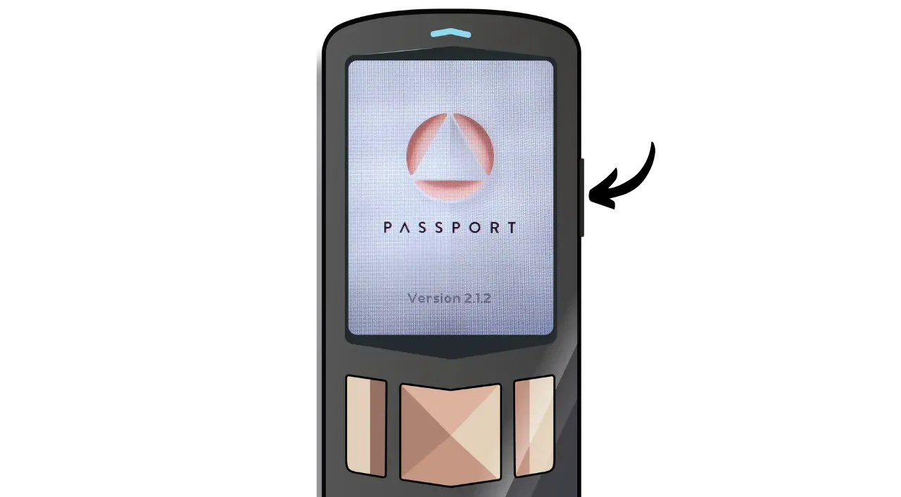

Accédez au menu suivant en appuyant sur le bouton de confirmation.

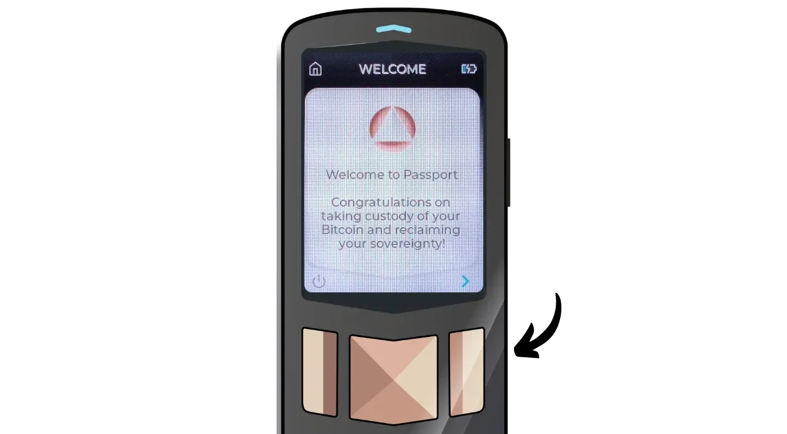

Dans ce tutoriel, nous utiliserons Sparrow Wallet pour gérer le portefeuille sécurisé par le Passport. Sélectionnez donc "*Manual Setup*".

Acceptez ensuite les conditions d'utilisation.

L'étape suivante est la vérification de votre appareil. Cette vérification confirme l'authenticité de votre Passport et assure qu'il n'a pas été altéré durant le transport. Vous serez invité à scanner un QR code.

Rendez-vous sur [le site officiel de vérification](https://validate.foundationdevices.com/) et sélectionnez "*Passport*".

Utilisez la caméra de votre Passport pour scanner le QR code affiché sur le site.

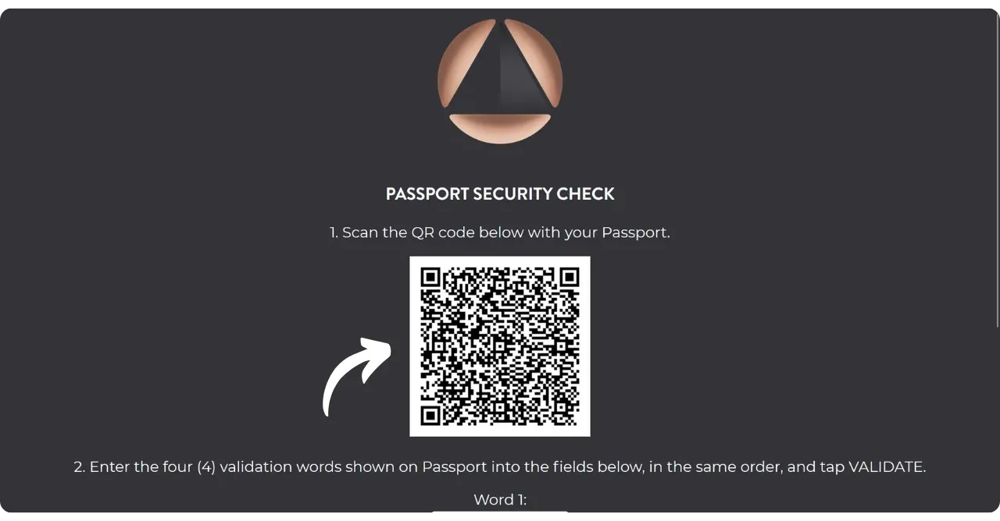

Votre appareil vous affichera alors 4 mots.

Saisissez ces mots sur le site web pour confirmer l'authenticité de votre Passport et cliquez sur "*Validate*".

Si le message "*Passed*" apparaît, votre hardware wallet est bien authentique. Vous pouvez maintenant l'utiliser pour sécuriser un portefeuille Bitcoin.

Confirmez le résultat du test sur votre Passport.

## Mise en place du code PIN

Vient ensuite l'étape du code PIN. Le code PIN permet de déverrouiller votre Passport. C'est donc une protection contre les accès physiques non autorisés. Ce code PIN n'intervient pas dans la dérivation des clés cryptographiques de votre portefeuille. Ainsi, même sans accès à ce code PIN, la possession de votre phrase mnémonique de 12 ou 24 mots vous permettra de retrouver l'accès à vos bitcoins.

Il est recommandé de choisir un code PIN le plus aléatoire possible. Assurez-vous également de sauvegarder ce code dans un lieu distinct de celui où est stocké votre Passport (par exemple, dans un gestionnaire de mot de passe).

Vous pouvez choisir un code PIN entre 6 et 12 chiffres. Je vous conseille de le faire le plus long possible.

Utilisez le clavier pour noter les numéros de votre code PIN. Une fois terminé, cliquez sur le bouton de confirmation.

Confirmez votre PIN une seconde fois.

Votre code PIN a bien été enregistré.

## Mettre à jour le firmware du Passport

Votre hardware wallet vous propose de mettre à jour son micrologiciel. Je vous recommande de procéder à cette mise à jour immédiatement afin de bénéficier des améliorations et des corrections apportées par les dernières versions. Pour continuer, cliquez sur le bouton de confirmation à droite.

Votre Passport est prêt à recevoir le nouveau firmware via une carte MicroSD.

Pour cela, utilisez la carte MicroSD incluse dans la boîte de votre Passport (ou une autre), et insérez-la dans votre ordinateur. Téléchargez la dernière version du firmware depuis [le site de documentation de Foundation](https://docs.foundation.xyz/firmware-updates/passport/) ou [leur dépôt GitHub](https://github.com/Foundation-Devices/passport2/releases).

Avant de l'installer sur votre appareil, il est vivement conseillé de vérifier l'authenticité et l'intégrité du firmware téléchargé. Si vous avez besoin d'aide pour le faire, consultez ce tutoriel : 

https://planb.network/tutorials/others/general/integrity-authenticity-21d0420a-be02-4663-94a3-8d487f23becc

Après avoir vérifié le fichier `.bin`, placez-le sur votre MicroSD, puis insérez-la dans le Passport. L'explorateur de fichiers du Passport s'ouvrira. Sélectionnez le fichier `vN.N.N-passport.bin`.

Cliquez sur "*Select*".

Confirmez ensuite l'installation du firmware.

Patientez pendant la mise à jour.

Une fois la mise à jour terminée, saisissez votre code PIN pour déverrouiller l'appareil et poursuivre la configuration.

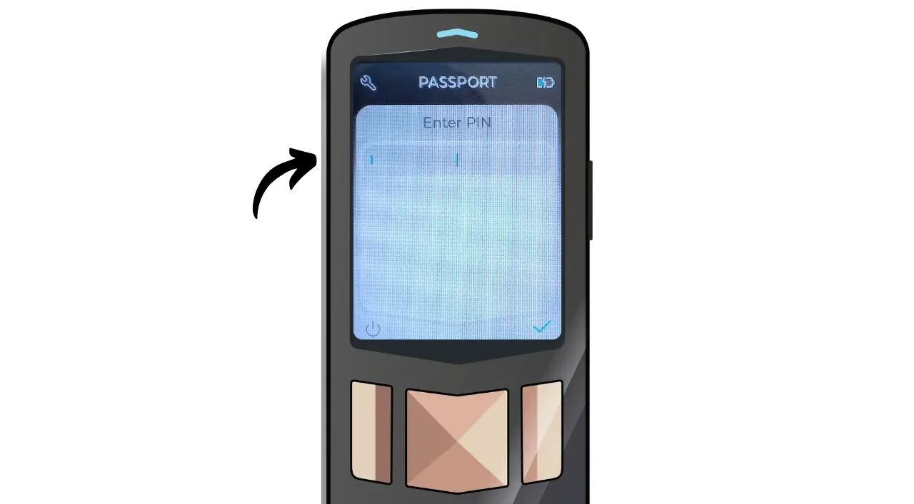

## Créer un nouveau portefeuille Bitcoin

Il est maintenant temps de créer un nouveau portefeuille Bitcoin. Cliquez sur le bouton de confirmation.

Pour créer un nouveau portefeuille, cliquez sur "*Create New Seed*".

Vous pouvez choisir entre une phrase mnémonique de 12 ou 24 mots. La sécurité offerte par les deux options est similaire, donc vous pouvez opter pour celle qui est la plus simple à sauvegarder, soit 12 mots.

Cliquez sur "*Continue*".

Votre Passport va maintenant générer votre "*Backup Code*". Il s'agit d'une série de chiffres permettant de déchiffrer une sauvegarde de votre portefeuille enregistrée sur une MicroSD. Ce système de backup, propre aux appareils de Foundation, constitue une sauvegarde additionnelle à votre phrase mnémonique mais n'est pas compatible avec d'autres logiciels Bitcoin.

Si vous décidez d'utiliser ce "*Backup Code*", assurez-vous de le conserver dans un lieu différent de celui de votre MicroSD contenant la sauvegarde chiffrée de votre portefeuille. Vous pouvez cependant choisir de ne pas utiliser ce système si vous estimez qu'une bonne sauvegarde de votre phrase mnémonique est suffisante.

Saisissez votre "*Backup Code*" pour confirmer que vous l'avez correctement sauvegardé.

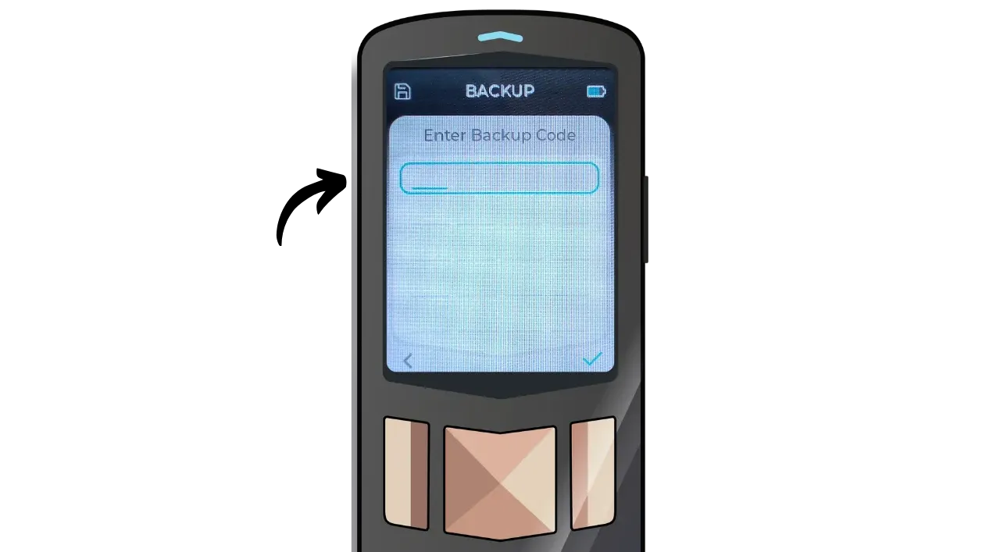

Si une MicroSD a été insérée, la sauvegarde chiffrée de votre portefeuille y a bien été enregistrée.

Votre Passport va vous afficher votre phrase mnémonique de 12 mots. Cette phrase mnémonique donne un accès complet et non restreint à tous vos bitcoins. N'importe qui en possession de cette phrase peut subtiliser vos fonds, même sans accès physique à votre Passport.

La phrase de 12 mots permet de restaurer l'accès à vos bitcoins en cas de perte, vol ou casse de votre Passport. Il est donc très important de la sauvegarder soigneusement et de la stocker dans un endroit sécurisé.

Vous pouvez l'inscrire sur le papier cartonné fourni dans la boite, ou bien pour plus de sécurité, je vous recommande de la graver sur un support en acier inoxydable afin de la protéger contre les risques d'incendies, d'inondations ou d'écroulements.

Cliquez sur le bouton de confirmation pour voir votre phrase mnémonique.

Pour plus d'informations sur la manière adéquate de sauvegarder et de gérer votre phrase mnémonique, je vous recommande vivement de suivre cet autre tutoriel, particulièrement si vous êtes débutant :

https://planb.network/tutorials/wallet/backup/backup-mnemonic-22c0ddfa-fb9f-4e3a-96f9-46e2a7954270

_**Évidemment, vous ne devez jamais partager ces mots sur internet, contrairement à ce que je fais dans ce tutoriel. Ce portefeuille en exemple sera utilisé uniquement sur le Testnet et sera supprimé à l'issue du tutoriel.**_

Réalisez la sauvegarde physique de cette phrase.

La configuration de votre Passport a bien été réalisée. Cliquez sur le bouton de confirmation pour continuer.

## Découverte des menus

L'interface de votre Passport comprend trois menus principaux :
- "*Account*" ;
- "*More*" ;
- "*Settings*".

Pour naviguer entre ces menus, utilisez les flèches gauche et droite du pavé directionnel.

### Menu "*Account*"

Dans le menu "*Account*", vous trouverez les principales fonctionnalités de votre portefeuille Bitcoin. Vous avez la possibilité de signer une transaction soit via la caméra, soit via le port MicroSD.

Le sous-menu "*Account Tools*" offre des options telles que la vérification d'une adresse, la signature d'un message, ou la consultation des adresses de votre portefeuille.

Dans le sous-menu "*Manage Account*", vous avez la possibilité de connecter votre portefeuille Bitcoin à un logiciel gestionnaire de wallet (ce que nous aborderons dans les prochaines étapes de ce tutoriel), ou de consulter et de renommer votre compte.

### Menu "*More*"

Dans le menu "*More*", vous avez la possibilité de créer un nouveau compte dans votre portefeuille, qui sera lié à la même phrase mnémonique.

Vous pouvez aussi saisir une passphrase BIP39 (voir section suivante) ou utiliser une seed temporaire.

### Menu "*Settings*"

Dans le menu "*Settings*", vous retrouvez tous les paramètres relatifs à votre portefeuille et à votre appareil.

Le sous-menu "*Device*" vous offre des options pour personnaliser la luminosité de l'écran, régler le délai avant verrouillage automatique, changer le code PIN, ou renommer l'appareil.

Le sous-menu "*Backup*" permet d'exporter la sauvegarde chiffrée de votre portefeuille, de vérifier la validité d'une sauvegarde existante, ou de consulter de nouveau votre "*Backup Code*".

Le sous-menu "*Firmware*" est destiné à la mise à jour du micrologiciel de votre Passport. Il est recommandé de réaliser ces mises à jour régulièrement pour bénéficier des dernières corrections et fonctionnalités.

Le sous-menu "*Bitcoin*" vous permet de modifier l'unité affichée (BTC ou satoshis), de gérer un éventuel portefeuille Multisig, ou de passer en mode "*Testnet*".

Dans "*Advanced*", vous avez la possibilité de consulter les mots de votre phrase mnémonique, de réaliser des actions sur la MicroSD insérée, de réinitialiser votre Passport aux paramètres d'usine, ou de procéder à une vérification d'authenticité, comme effectué précédemment.

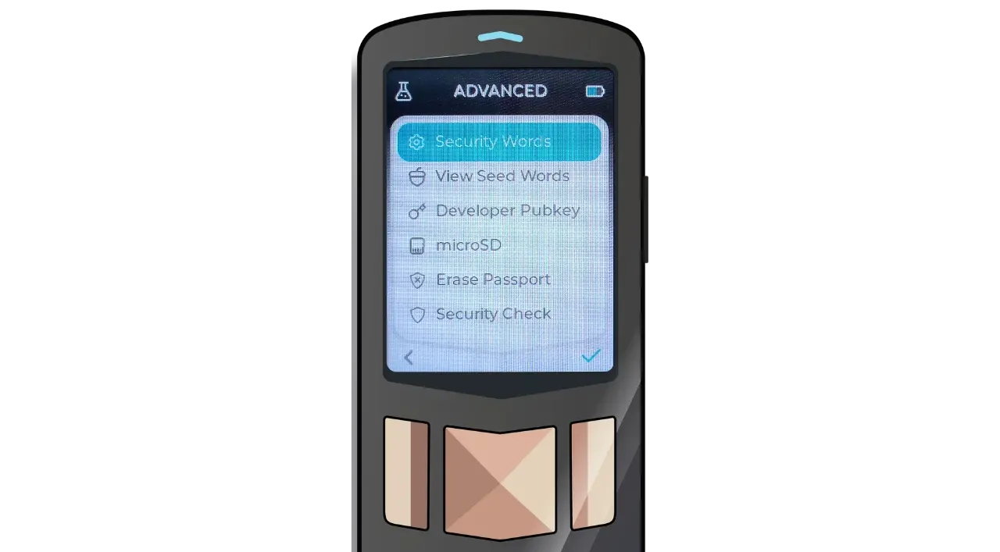

Vous pouvez activer les "*Security Words*", une fonctionnalité qui ajoute une couche de sécurité en affichant deux mots spécifiques lors du déverrouillage de l'appareil après saisie des quatre premiers chiffres du code PIN. Ces mots, à sauvegarder lors de leur configuration, permettent de s'assurer que le Passport n'a pas été remplacé ou altéré. En cas de différence lors d'une utilisation ultérieure, il est conseillé de ne pas utiliser l'appareil. Je vous conseille d'activer cette option pour prévenir la plupart des risques de compromission physique de l'appareil.

Enfin, le sous-menu "*Extensions*" permet d'activer des fonctionnalités spécifiques à certaines utilisations de l'appareil, telles que le protocole de coinjoins Whirlpool.

## Ajouter une passphrase BIP39

Avant de continuer, vous pouvez, si vous le souhaitez, ajouter une passphrase BIP39. Une passphrase BIP39 est un mot de passe optionnel que vous pouvez choisir librement, et qui vient s'ajouter à votre phrase mnémonique pour renforcer la sécurité du portefeuille. Avec cette fonctionnalité activée, l'accès à votre portefeuille Bitcoin nécessitera à la fois la phrase mnémonique et la passphrase. Sans l'une ou l'autre, il serait impossible de récupérer le portefeuille.

Avant de configurer cette option sur votre Passport, il est fortement recommandé de lire cet article pour bien comprendre le fonctionnement théorique de la passphrase et éviter les erreurs qui pourraient entraîner la perte de vos bitcoins :

https://planb.network/tutorials/wallet/backup/passphrase-a26a0220-806c-44b4-af14-bafdeb1adce7

Pour l'activer, rendez-vous dans le menu "*More*" et cliquez sur "*Enter Passphrase*".

Renseignez votre passphrase à l'aide du clavier aA1 et assurez-vous d'en faire une ou plusieurs sauvegardes sur des supports physiques (papier ou métal). Pour l'exemple, j'utilise une passphrase très faible, mais vous devez choisir une passphrase forte, aléatoire, incluant tous les types de caractères et suffisamment longue (comme un mot de passe fort).

Attention, les passphrases BIP39 sont sensibles à la casse et aux fautes de frappe. Si vous entrez une passphrase légèrement différente de celle configurée initialement, le Passport ne signalera pas d'erreur mais dérivera un autre ensemble de clés cryptographiques qui ne seront pas celles de votre portefeuille initial.

Il est donc important, lors de la configuration, de noter quelque part l'empreinte de votre clé maîtresse que l'on vous donne lors de l'étape suivante. Par exemple, avec ma passphrase `Plan B Network`, mon empreinte de clé maîtresse est `745D526B`.

À chaque fois que vous déverrouillez votre Passport, vous devrez revenir dans ce menu pour renseigner votre passphrase et l'appliquer sur votre portefeuille. Le Passport n'enregistre pas la passphrase.

Lors de chaque déverrouillage, après avoir noté la passphrase, vérifiez sur cet écran de confirmation que l'empreinte donnée est bien la même que celle notée lors de la configuration. Si c'est le cas, votre passphrase est correcte et vous accédez au bon portefeuille Bitcoin. Si ce n'est pas le cas, vous n'êtes pas sur le bon portefeuille et vous devez essayer de nouveau, en veillant à ne pas faire d'erreur de saisie.

Avant de recevoir vos premiers bitcoins sur votre portefeuille, **je vous conseille vivement de réaliser un test de récupération à vide**. Notez une information de référence, telle que votre xpub ou la première adresse de réception, puis supprimez votre portefeuille sur le Passport tant qu'il est encore vide (`Settings -> Advanced -> Erase Passport`). Ensuite, essayez de restaurer votre portefeuille en utilisant vos sauvegardes papier de la phrase mnémonique et de l'éventuelle passphrase. Vérifiez que l'information témoin générée après la restauration correspond à celle que vous aviez notée initialement. Si c'est le cas, vous pouvez être assuré que vos sauvegardes papier sont fiables. Pour en savoir plus sur comment effectuer un test de récupération, je vous conseille de consulter cet autre tutoriel :

https://planb.network/tutorials/wallet/backup/recovery-test-5a75db51-a6a1-4338-a02a-164a8d91b895

## Configurer le portefeuille sur Sparrow Wallet

Dans ce tutoriel, je vous présente une utilisation avancée du Passport avec Sparrow Wallet. Cependant, ce hardware wallet est également compatible avec Envoy (l'application de Foundation), Keeper, BlueWallet, Nunchuk, Specter, et bien d'autres...

Commencez par télécharger et installer Sparrow Wallet [depuis le site officiel](https://sparrowwallet.com/) sur votre ordinateur, si ce n'est pas déjà fait.

Assurez-vous de vérifier l'authenticité et l'intégrité du logiciel avant l'installation. Si vous ne savez pas comment procéder, vous pouvez consulter ce tutoriel :

https://planb.network/tutorials/others/general/integrity-authenticity-21d0420a-be02-4663-94a3-8d487f23becc

Une fois Sparrow Wallet ouvert, cliquez sur l'onglet "*File*", puis sur "*New Wallet*".

Nommez votre portefeuille, puis cliquez sur "*Create Wallet*".

Sélectionnez "*Airgapped Hardware Wallet*".

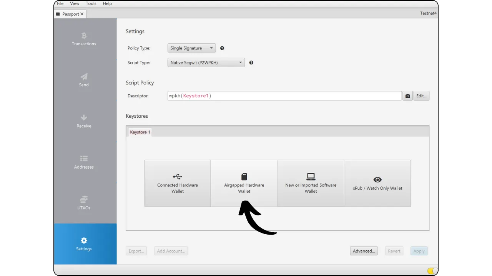

Cliquez sur "*Scan...*" à côté de l'option "*Passport*". Cela va ouvrir votre webcam.

Sur votre hardware wallet, accédez au menu "*Account*", sélectionnez le sous-menu "*Manage Account*", et cliquez sur "*Connect Wallet*".

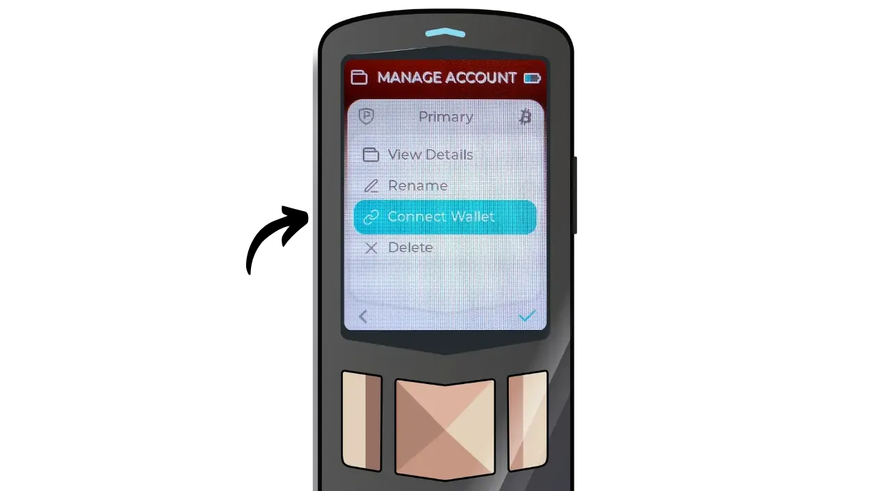

Dans la liste déroulante qui apparaît, choisissez "*Sparrow*".

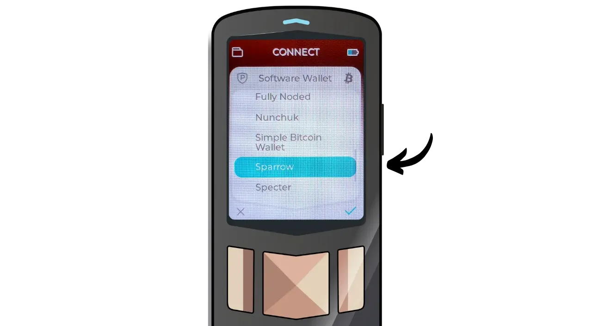

Sélectionnez ensuite "*Single-sig*" pour une configuration normale, sans multisig.

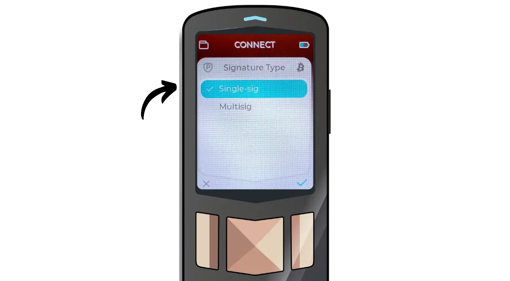

Choisissez l'option "*QR Code*".

Votre Passport générera alors des QR codes dynamiques. Utilisez la webcam de votre ordinateur pour les scanner dans le logiciel Sparrow.

Vous devriez maintenant voir votre xpub et l'empreinte de votre clé maîtresse, qui doit correspondre à celle indiquée sur votre Passport lorsque vous entrez votre passphrase. Cliquez sur le bouton "*Apply*".

Définissez un mot de passe fort pour sécuriser l'accès à votre portefeuille Sparrow Wallet. Ce mot de passe protégera vos clés publiques, vos adresses, vos étiquettes et l'historique de vos transactions contre les accès non autorisés. Il est conseillé de sauvegarder ce mot de passe dans un gestionnaire de mots de passe pour éviter de l'oublier.

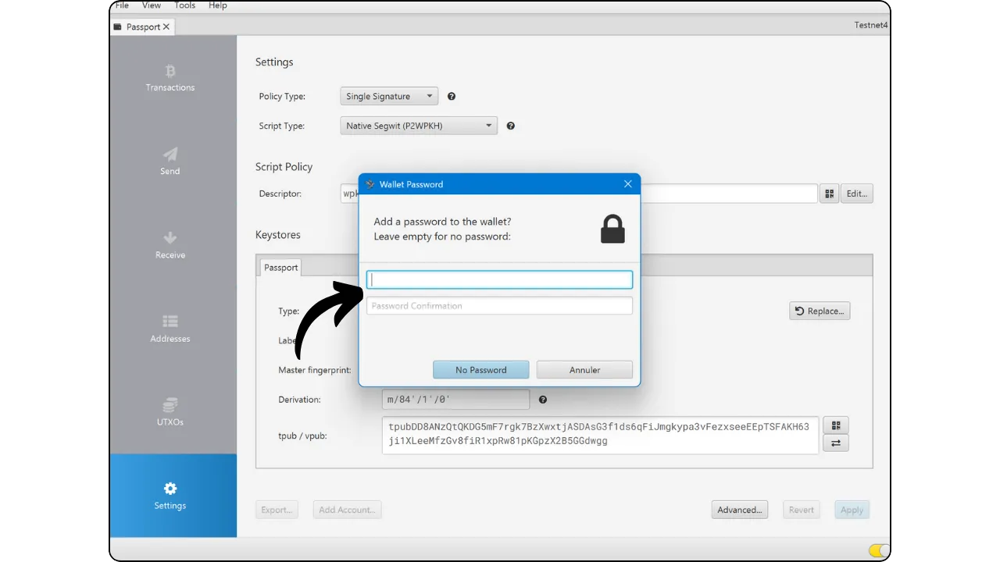

Votre Passport vous invite alors à scanner la première adresse de réception pour confirmer que l'importation s'est correctement déroulée.

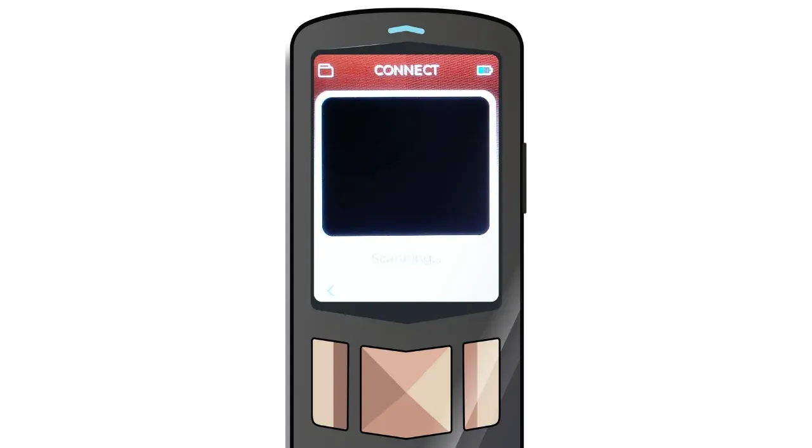

Dans Sparrow, accédez à l'onglet "*Receive*" et scannez le QR code de la première adresse.

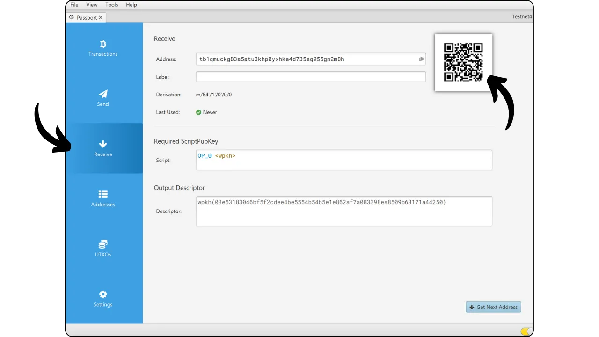

Si l'opération est réussie, votre Passport affichera "*Verified*".

Cela confirme que l'importation a été effectuée avec succès.

## Recevoir des bitcoins

Maintenant que votre Passport est configuré, vous êtes prêt à recevoir vos premiers sats sur votre nouveau portefeuille Bitcoin. Pour ce faire, sur Sparrow, cliquez sur le menu "*Receive*".

Sparrow affichera la première adresse de réception vierge de votre portefeuille. Vous pouvez y ajouter un label.

Avant de l'utiliser, nous allons vérifier l'adresse sur l'écran du Passport pour nous assurer qu'elle appartient bien à notre portefeuille Bitcoin. Sur Sparrow, vous pouvez agrandir le QR code de l'adresse en cliquant dessus si nécessaire. Dans le menu "*Account*" de votre Passport, sélectionnez "*Account Tools*".

Cliquez sur "*Verify Address*", puis scannez le QR code affiché sur Sparrow Wallet.

Assurez-vous que l'adresse affichée sur le Passport corresponde exactement à celle indiquée sur Sparrow et que la mention "*Verified*" apparaisse.

Vous pouvez désormais l'utiliser pour recevoir des bitcoins. Lorsque la transaction sera diffusée sur le réseau, elle apparaîtra sur Sparrow. Attendez d'obtenir suffisamment de confirmations pour considérer la transaction comme définitive.

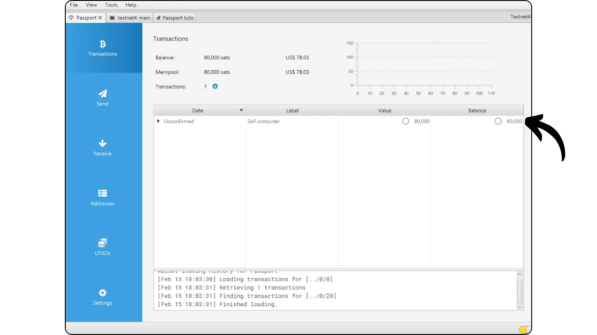

## Envoyer des bitcoins

Maintenant que vous avez quelques sats dans votre portefeuille, vous pouvez également en envoyer. Pour ce faire, cliquez sur le menu "*UTXOs*".

Sélectionnez les UTXOs que vous souhaitez utiliser en tant qu'inputs pour cette transaction, puis cliquez sur "*Send Selected*".

Entrez l'adresse du destinataire, une étiquette pour vous souvenir de l'objectif de la transaction et le montant que vous souhaitez envoyer à cette adresse.

Ajustez le taux de frais en fonction de l'état actuel du marché, puis cliquez sur "*Create Transaction*".

Vérifiez que tous les paramètres de la transaction sont corrects, puis cliquez sur "*Finalize Transaction for Signing*".

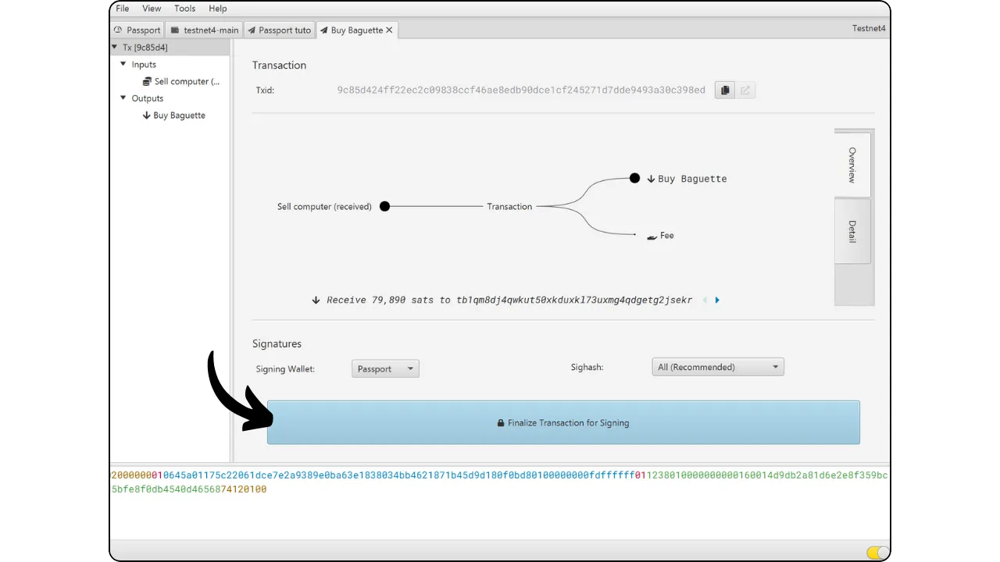

Cliquez sur "*Show QR*" pour afficher la PSBT (*Partially Signed Bitcoin Transaction*). Sparrow a construit la transaction, mais il manque encore les signatures pour déverrouiller les bitcoins utilisés en input. Ces signatures ne peuvent être réalisées que par le Passport, qui héberge votre seed donnant accès aux clés privées nécessaires pour signer la transaction.

Sur votre Passport, accédez au menu "*Account*" et cliquez sur "*Sign with QR Code*".

Scannez la PSBT (*Partially Signed Bitcoin Transaction*) affichée sur Sparrow Wallet.

Confirmez que l'adresse de réception et le montant envoyé sont corrects, puis appuyez sur le bouton de confirmation.

Vérifiez l'adresse de change. Dans mon exemple, il n'y en a pas, car la transaction comprend un seul output.

Assurez-vous que le montant des frais est celui que vous avez choisi.

Si toutes les informations sont bien justes, cliquez sur le bouton de confirmation pour signer la transaction.

Sur Sparrow Wallet, cliquez sur "*Scan QR*" et scannez le QR code affiché sur votre Passport.

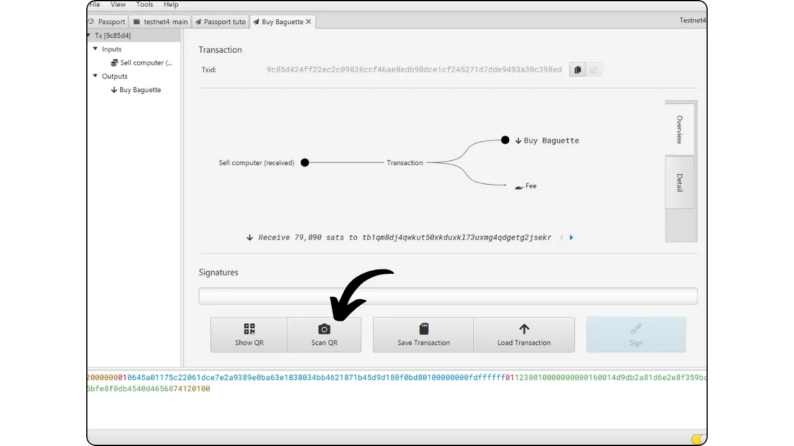

Votre transaction signée est prête à être diffusée sur le réseau Bitcoin pour être ensuite incluse dans un bloc par un mineur. Si tout est correct, cliquez sur "*Broadcast Transaction*".

Votre transaction a été diffusée et est en attente de confirmations.

Félicitations, vous savez dorénavant comment configurer et utiliser le Passport. Si vous avez trouvé ce tutoriel utile, je vous serais reconnaissant de laisser un pouce vert ci-dessous. N'hésitez pas à partager cet article sur vos réseaux sociaux. Merci !

Pour aller plus loin, vous pouvez également consulter notre tutoriel sur le logiciel Liana :

https://planb.network/tutorials/wallet/desktop/liana-306ef457-700c-4fdd-b07a-8fb7a8a29f04
