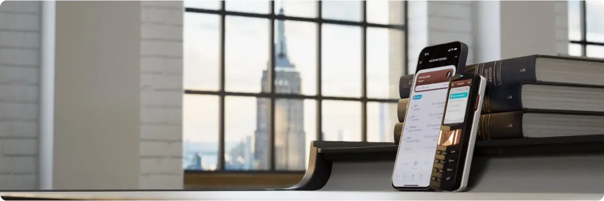

Passport 是一款纯比特币硬件钱包，由 2020 年 4 月在波士顿成立的美国公司 Foundation Devices 设计。

我们在本教程中介绍的 Passport "*Batch 2*"是 "*Founder's Edition*"的后续产品。它采用高档设计、高清彩色屏幕和符合人体工程学的物理键盘。它以 "*Air-Gap*"模式运行，确保钱包私钥完全隔离，可通过 MicroSD 卡或二维码进行交换。该设备配有 1200 毫安时可拆卸电池。

在连接性方面，Passport 配备了一个 MicroSD 端口、一个用于充电的 USB-C 端口和一个用于扫描二维码的后置摄像头。

在安全性方面，Passport 加入了安全元素，设备的源代码完全开源。它具备优秀比特币硬件钱包所应具备的所有功能。需要注意的是，Passport 还不支持 miniscript，但该功能计划在 2025 年第二季度推出。

Passport 售价 199 美元，定位为高端硬件钱包，竞争对手包括 Coldcard Q、Jade Plus、Tezor Safe 5 和 Ledger 的顶级型号。

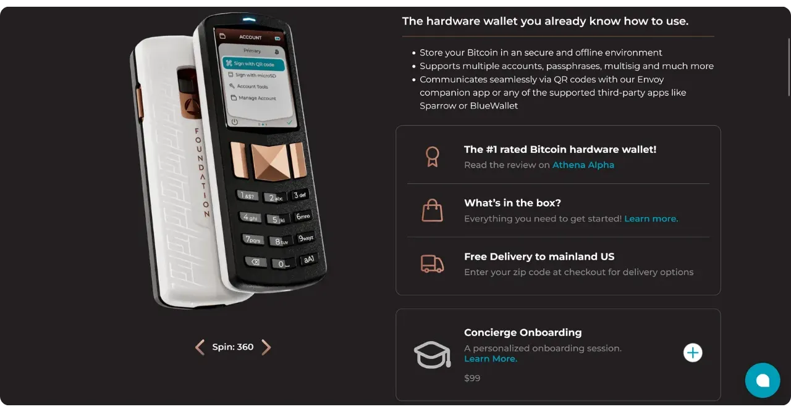

要在 Passport 上管理安全钱包，您有多种选择。这种硬件钱包兼容市面上大多数钱包管理软件，包括 Sparrow Wallet、Specter Desktop、Nunchuk 和 Keeper 等。在本教程中，我们将学习如何将它与 Sparrow Wallet 一起使用。

如果您是初学者，最简单的方法是将 Passport 与基金会开发的本地 Envoy 应用程序配合使用。要了解如何在 Passport 中使用 Envoy，请查看本教程：

https://planb.network/tutorials/wallet/mobile/envoy-3ae5d6c7-623b-45b3-bb34-abcf9572b7cb
## 护照开箱

当您收到 Passport 时，请确保包装盒和纸箱上的封条完好无损，以确认包装未被打开。在设置设备时，还将对设备的真实性和完整性进行软件验证。

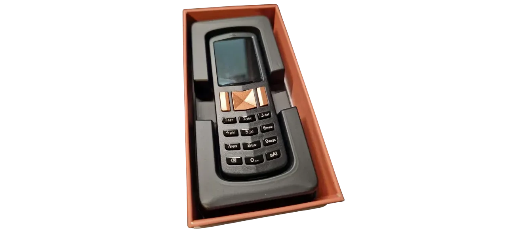

盒内物品包括 ：

- 护照；
- 一张纸板，用来写下你的记忆短语；
- 用于充电的 USB-C 连接线；
- MicroSD 卡 ；
- 两个 MicroSD 转 Lightning 或 USB-C 适配器；
- 贴纸

在设备上，您可以找到 ：

- 键盘 (1) ；
- USB-C 端口 (2)；
- 删除按钮 (3)；
- 返回按钮 (4) ；
- 确认按钮 (5)；
- 方向垫 (6)；
- 开/关按钮 (7)；
- 状态指示灯 (8)；
- MicroSD 接口 (9) ；
- 用于切换模式 aA1 的按钮 (10) ；
- 后置摄像头

## 起始护照

按下设备侧面的开/关按钮启动设备。

按确认按钮进入下一个菜单。

在本教程中，我们将使用 Sparrow Wallet 管理护照安全钱包。选择 "*手动设置*"。

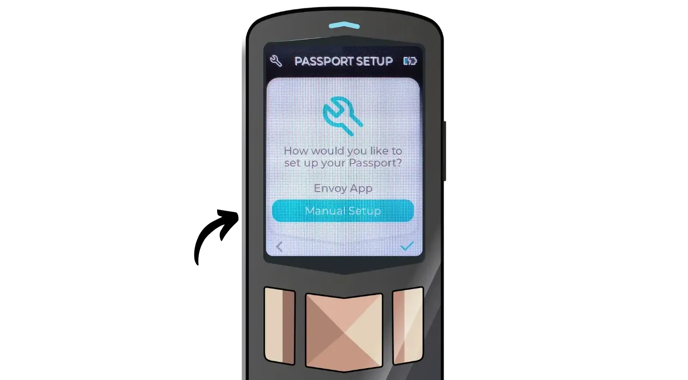

然后接受使用条款。

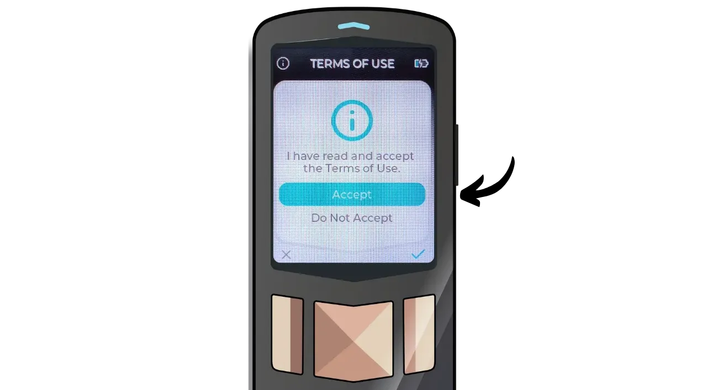

下一步是检查您的设备。这将确认护照的真实性，并确保护照在运输途中未被篡改。您需要扫描一个 QR 码。

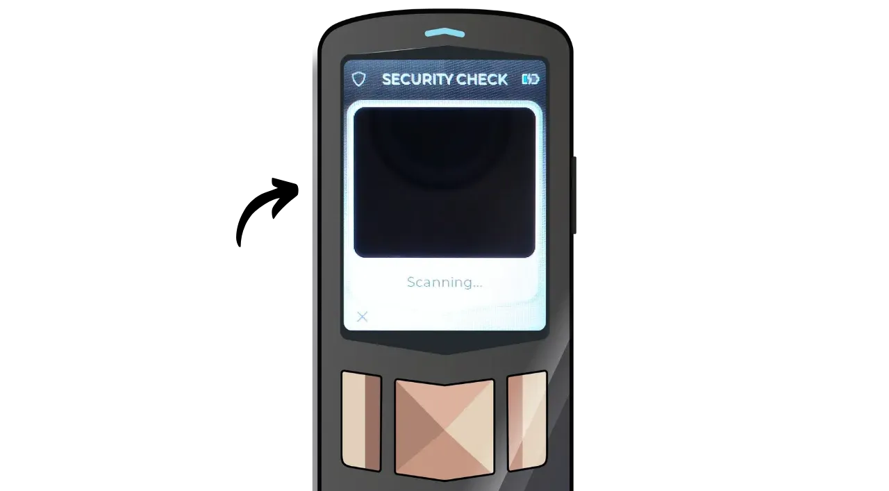

访问 [官方验证网站](https://validate.foundationdevices.com/)，选择 "*护照*"。

使用 Passport 的摄像头扫描网站上显示的 QR 代码。

然后，设备将显示 4 个单词。

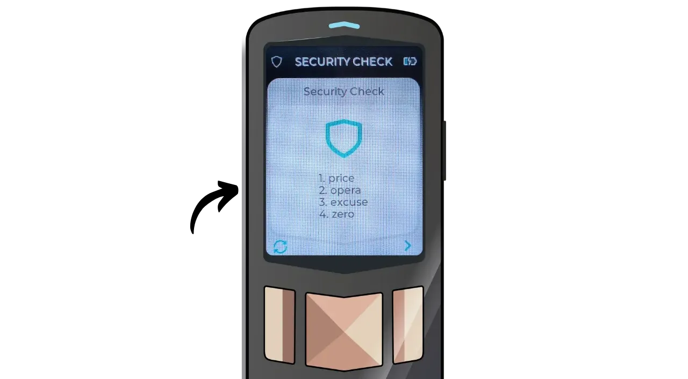

在网站上输入这些文字，确认护照的真实性，然后点击 "*Validate*"（*验证*）。

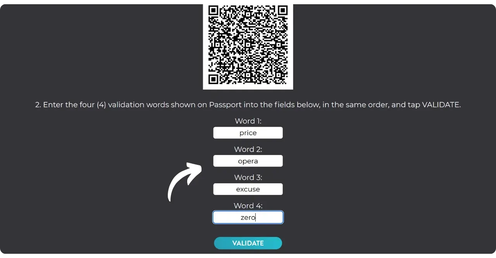

如果出现 "*Passed*（通过）"信息，说明您的硬件钱包是真实的。现在您就可以用它来保护比特币钱包了。

在护照上确认检测结果。

## 设置 PIN 码

接下来是 PIN 码步骤。PIN 码可以解锁您的护照。因此，它可以防止未经授权的物理访问。PIN 码不参与钱包加密密钥的生成。因此，即使无法获得 PIN 码，只要拥有 12 或 24 个字的记忆短语，就能重新获得比特币。

我们建议选择一个尽可能随机的 PIN 码。此外，请务必将该密码保存在与您的护照存储位置不同的地方（如密码管理器中）。

您可以选择 6 到 12 位数字的 PIN 码。我建议您尽量设置得长一些。

使用键盘输入密码。完成后，点击确认按钮。

再次确认 PIN 码。

您的 PIN 码已注册。

## 更新 Passport 固件

您的硬件钱包建议您更新固件。我建议您立即更新，以受益于最新版本带来的改进和修复。要继续，请单击右侧的确认按钮。

您的 Passport 已准备好通过 MicroSD 卡接收新固件。

为此，请使用 Passport 包装盒中的 MicroSD 卡（或其他卡），并将其插入电脑。从[基金会文档网站](https://docs.foundation.xyz/firmware-updates/passport/) 或[其 GitHub 存储库](https://github.com/Foundation-Devices/passport2/releases) 下载最新固件版本。

在您的设备上安装之前，我们强烈建议您检查下载固件的真实性和完整性。如果您需要帮助，请参阅本教程 ：

https://planb.network/tutorials/others/general/integrity-authenticity-21d0420a-be02-4663-94a3-8d487f23becc
检查`.bin`文件后，将其放在 MicroSD 上，然后插入 Passport。Passport 文件资源管理器将打开。选择文件 `vN.N.N-passport.bin`。

点击 "*选择*"。

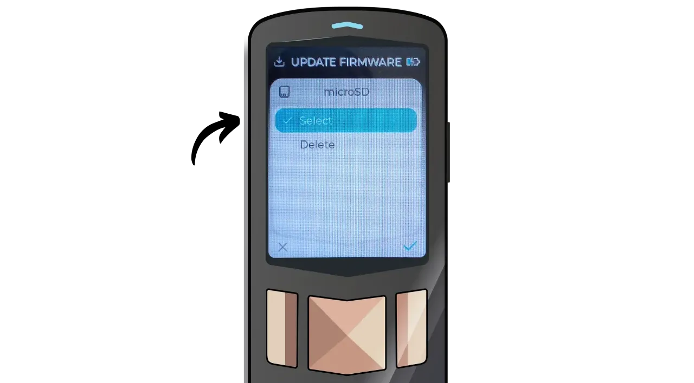

然后确认固件安装。

请等待更新完成。

更新完成后，输入 PIN 码解锁设备并继续配置。

## 创建一个新的比特币钱包

现在是时候创建一个新的比特币钱包了。点击确认按钮。

要创建新的投资组合，请点击 "*创建新种子*"。

您可以选择 12 个字或 24 个字的记忆短语。这两个选项提供的安全性相似，因此您可以选择最容易保存的选项，即 12 个单词。

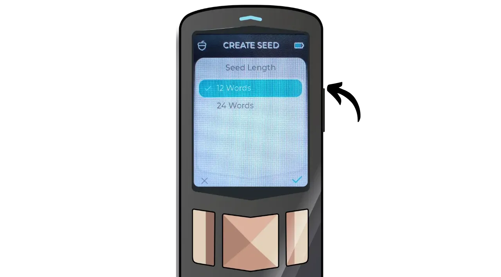

点击 "*继续*"。

现在，您的 Passport 将生成您的 "*备份代码*"。这是一串数字，可用于解密存储在 MicroSD 上的钱包备份。该备份系统是基金会设备特有的，是您记忆短语的额外备份，但与其他比特币软件不兼容。

如果您决定使用此 "*备份代码*"，请务必将其保存在与包含钱包加密备份的 MicroSD 不同的位置。不过，如果您认为有一个好的记忆短语备份就足够了，也可以选择不使用该系统。

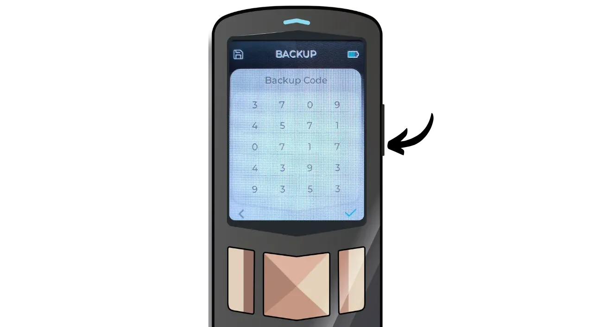

输入 "*备份代码*"，确认保存正确。

如果已插入 MicroSD，则已将投资组合的加密备份保存在其中。

您的 "护照 "将显示您的 12 字记忆短语。有了这个记忆短语，您就可以完全不受限制地使用您的所有比特币。任何拥有这个短语的人都可以盗取你的资金，即使没有你护照的物理访问权限。

如果您的护照丢失、被盗或破损，这 12 个字的短语可以恢复您对比特币的访问。因此，小心保存护照并将其存放在安全的地方非常重要。

您可以在包装盒内提供的纸板上书写，或者为了提高安全性，我建议您将其刻在不锈钢底座上，以防火灾、水灾或倒塌。

点击确认按钮，查看您的记忆短语。

有关保存和管理记忆短语的正确方法的更多信息，我强烈推荐大家阅读另一篇教程，尤其是初学者：

https://planb.network/tutorials/wallet/backup/backup-mnemonic-22c0ddfa-fb9f-4e3a-96f9-46e2a7954270
当然，你绝对不能在互联网上分享这些文字，就像我在本教程中所做的那样。本示例作品集将仅在 Testnet 上使用，并将在教程结束时删除。

对这句话进行物理备份。

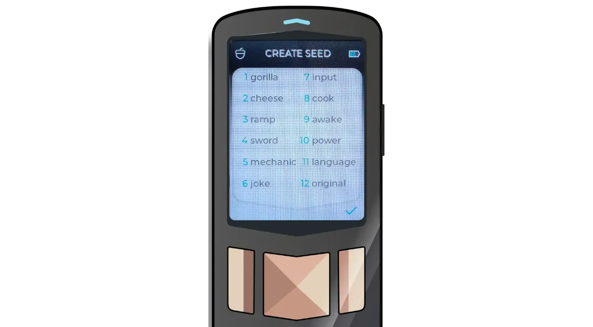

您的护照已成功配置。点击确认按钮继续。

## 发现菜单

Passport 界面有三个主要菜单：

- "*账户*"；
- "*更多*"；
- "*设置*"。

要在这些菜单之间导航，请使用方向盘上的左右箭头。

### *账户*"菜单

在 "*账户*"菜单中，您可以找到比特币钱包的主要功能。您可以通过摄像头或 MicroSD 端口签署交易。

账户工具*"子菜单提供了各种选项，如验证地址、签署邮件或查询您的投资组合中的地址。

在 "*管理账户*"子菜单中，你可以将比特币钱包连接到钱包管理软件（我们将在本教程的下一步介绍），或者查看和重命名你的账户。

### 更多 "菜单

在 "*更多*"菜单中，您可以在您的投资组合中创建一个新账户，并与相同的记忆短语相连。

您也可以输入 BIP39 密码（见下一节）或使用临时种子。

### 设置 "菜单

在 "*设置*"菜单中，您可以找到钱包和设备的所有设置。

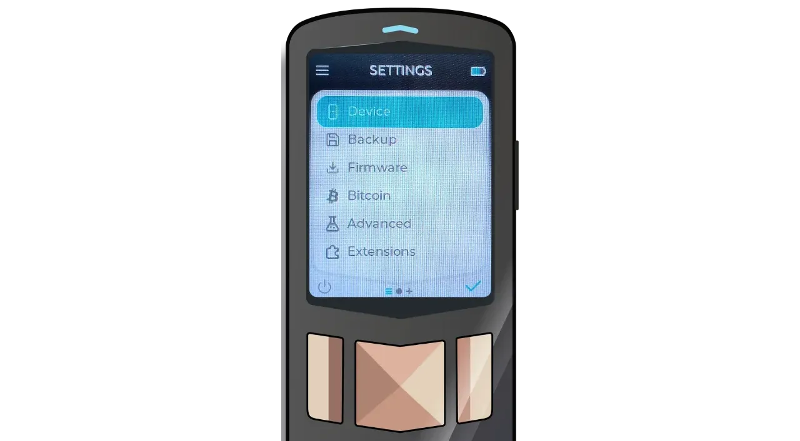

设备*"子菜单提供了自定义屏幕亮度、设置自动锁定前的延迟、更改 PIN 码或重命名设备等选项。

通过 "*备份*"子菜单，您可以导出加密的投资组合备份，检查现有备份的有效性，或再次查询 "*备份代码*"。

固件*"子菜单用于更新 Passport 的固件。我们建议您定期进行这些更新，以便从最新的修复和功能中获益。

通过 "*Bitcoin*"子菜单，您可以更改显示的单位（BTC 或 satoshis），管理可能的 Multisig 钱包，或切换到 "*Testnet*"模式。

在 "*高级*"中，您可以查看记忆短语的单词，对插入的 MicroSD 执行操作，将 Passport 重置为出厂设置，或执行先前执行的真实性检查。

您可以激活 "*安全词*"，该功能可在输入 PIN 码的前四位数字后解锁设备时显示两个特定的词，从而增加一层安全性。这些文字将在配置时保存，以确保 Passport 未被更换或篡改。如果日后出现任何不一致的情况，我们建议您不要使用该设备。我建议您激活此选项，以防止设备受到物理破坏的大部分风险。

最后，"*扩展功能*"子菜单可让您激活设备特定用途的功能，如惠而浦硬币连接协议。

## 添加 BIP39 密码

在继续之前，如果您愿意，可以添加一个 BIP39 口令。BIP39 口令是您可以自由选择的密码，它被添加到您的记忆短语中，以加强钱包的安全性。启用该功能后，访问比特币钱包需要同时使用记忆短语和口令。两者缺一不可，否则就不可能找回钱包。

在 Passport 上配置该选项之前，强烈建议您阅读本文，以充分了解口令的理论操作，避免出现可能导致比特币丢失的错误：

https://planb.network/tutorials/wallet/backup/passphrase-a26a0220-806c-44b4-af14-bafdeb1adce7
要激活它，请进入 "*更多*"菜单并点击 "*输入密码*"。

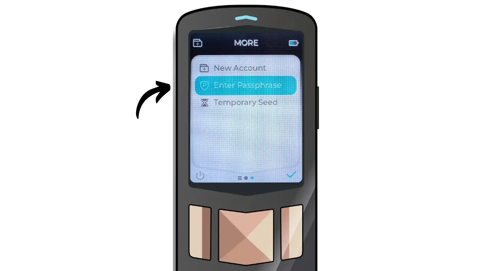

使用 aA1 键盘输入密码，并确保在物理介质（纸张或金属）上保存一次或多次。在示例中，我使用了一个非常弱的口令，但你应该选择一个强大、随机的口令，包括所有字符类型和足够长的口令（就像一个强大的密码）。

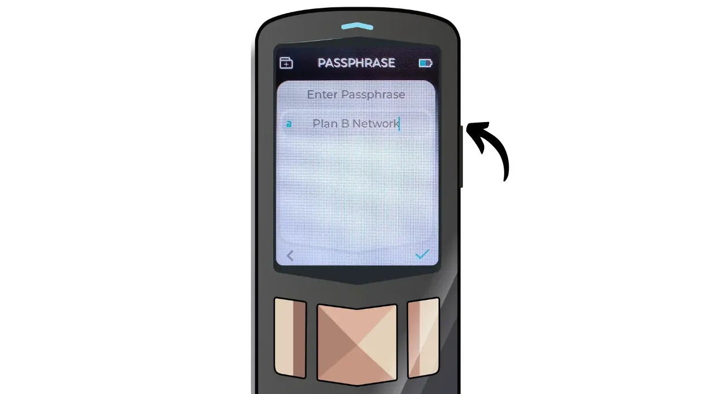

请注意，BIP39 密码对大小写和错别字敏感。如果您输入的口令与最初配置的口令略有不同，Passport 不会报错，但会生成另一组加密密钥，与您初始钱包中的密钥不同。

因此，在配置时一定要记下下一步将给你的主密钥指纹。例如，我的口令是 "Plan B Network"，我的主密钥指纹是 "745D526B"。

每次解锁 Passport 时，您都需要返回此菜单输入密码并将其应用到钱包中。Passport 不会保存密码。

每次解锁时，在写下密码后，请在确认屏幕上检查给出的指纹是否与您在配置时写下的指纹相同。如果是，说明你的密码是正确的，你正在访问正确的比特币钱包。如果不一样，则表示你进入了错误的钱包，需要重试，注意不要输入错误。

在您收到钱包中的第一个比特币之前，**我强烈建议您执行空恢复测试**。记下一些参考信息，如您的 xpub 或第一个接收地址，然后在 Passport 上删除您的钱包，此时钱包还是空的（"设置 -> 高级 -> 删除 Passport"）。然后尝试使用纸质备份的记忆短语和任何密码来恢复钱包。检查还原后生成的 cookie 信息是否与您最初写下的信息一致。如果吻合，您就可以放心，您的纸质备份是可靠的。要了解有关如何进行测试恢复的更多信息，请参阅本教程 ：

https://planb.network/tutorials/wallet/backup/recovery-test-5a75db51-a6a1-4338-a02a-164a8d91b895
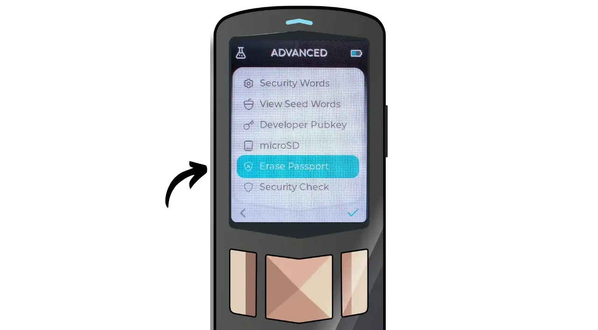

## 在麻雀钱包上配置钱包

在本教程中，我将向您展示 Passport 与麻雀钱包的高级用法。不过，这款硬件钱包也与 Envoy（基金会应用程序）、Keeper、BlueWallet、Nunchuk、Specter 和其他许多应用程序兼容...

如果还没有下载 Sparrow Wallet（麻雀钱包）并将其安装到电脑上，请从官方网站下载](https://sparrowwallet.com/)。

安装前请务必检查软件的真实性和完整性。如果您不知道如何操作，请参考本教程：

https://planb.network/tutorials/others/general/integrity-authenticity-21d0420a-be02-4663-94a3-8d487f23becc
打开麻雀钱包后，点击 "*文件*"标签，然后点击 "*新建钱包*"。

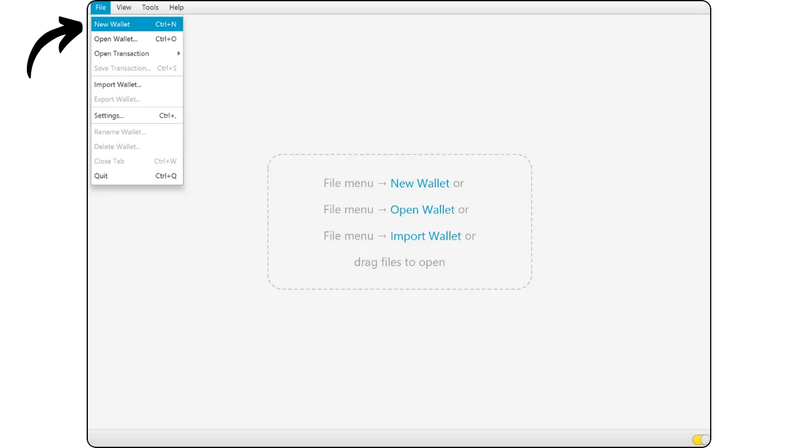

为钱包命名，然后点击 "*创建钱包*"。

选择 "*空格硬件钱包*"。

点击 "*护照*"选项旁边的 "*扫描...*"。这将打开您的网络摄像头。

在硬件钱包上，进入 "*账户*"菜单，选择 "*管理账户*"子菜单，然后点击 "*连接钱包*"。

在出现的下拉列表中，选择 "*Sparrow*"。

然后选择 "*Single-sig*"（*单密码*），进行不带多密码的正常配置。

选择 "*QR 码*"选项。

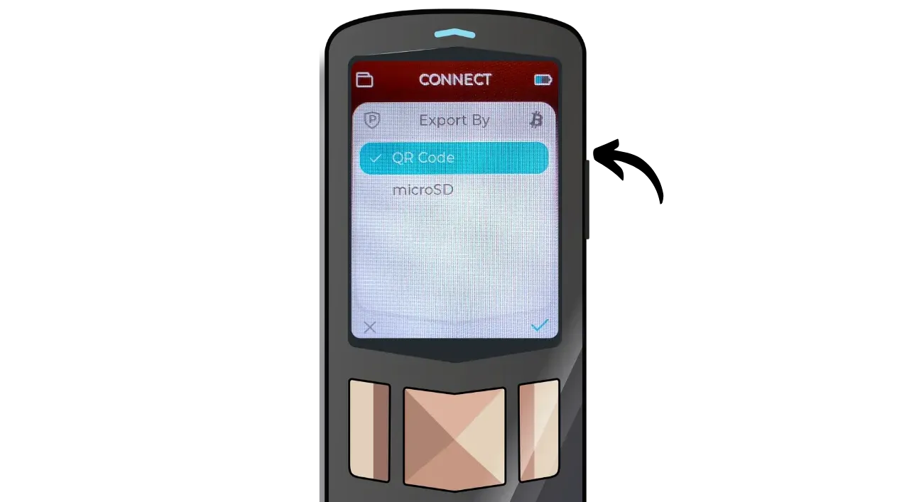

然后，您的 Passport 将生成动态 QR 码。使用电脑摄像头将它们扫描到 Sparrow 软件中。

现在你应该可以看到你的 xpub 和主密钥指纹，它们应该与你输入密码时在 Passport 上显示的指纹一致。点击 "*应用*"按钮。

设置一个强大的密码，以确保安全访问您的麻雀钱包。该密码将保护您的公钥、地址、标签和交易历史记录，防止未经授权的访问。最好将密码保存在密码管理器中，以免忘记。

然后，"护照 "会提示您扫描第一个接收地址，以确认导入成功。

在 Sparrow 中，转到 "*接收*"选项卡，扫描第一个地址的二维码。

如果操作成功，您的护照将显示 "*已验证*"。

这表明导入成功。

## 接收比特币

现在，您的 Passport 已经设置好了，您可以在新的比特币钱包上接收第一笔交易了。为此，请在 Sparrow 上点击 "*接收*"菜单。

Sparrow 将在您的产品组合中显示第一个空白收据地址。您可以添加标签。

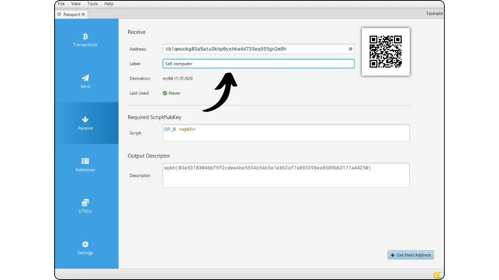

在使用之前，我们要检查 Passport 屏幕上的地址，确保它属于我们的比特币钱包。在 Sparrow 上，如有必要，您可以通过点击地址的二维码来放大它。在 Passport 的 "*账户*"菜单中选择 "*账户工具*"。

点击 "*验证地址*"，然后扫描麻雀钱包上显示的二维码。

确保护照上显示的地址与 Sparrow 上显示的地址完全一致，并显示 "*已验证*"。

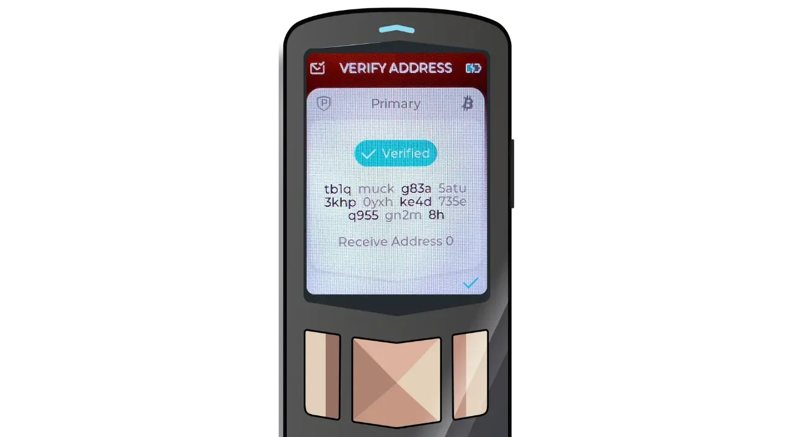

现在你可以用它来接收比特币了。当交易在网络上广播时，它就会出现在 Sparrow 上。等到收到足够多的确认信息后，交易才算完成。

## 发送比特币

既然钱包里已经有了一些卫星，您也可以发送一些卫星。为此，请点击 "*UTXOs*"菜单。

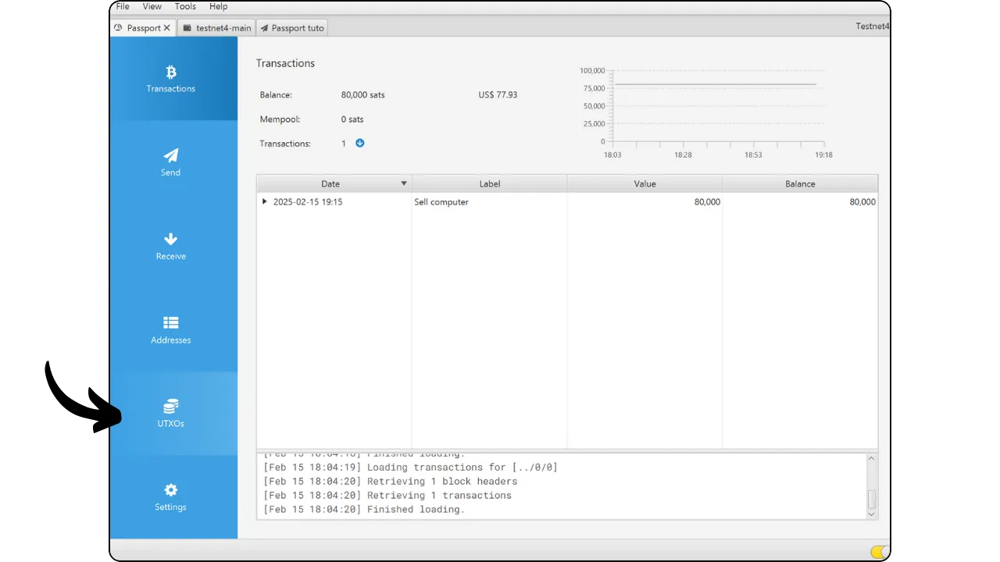

选择希望用作此交易输入的UTXO，然后点击 "*发送所选*"。

输入收件人地址、提醒您交易目的的标签以及您希望发送到该地址的金额。

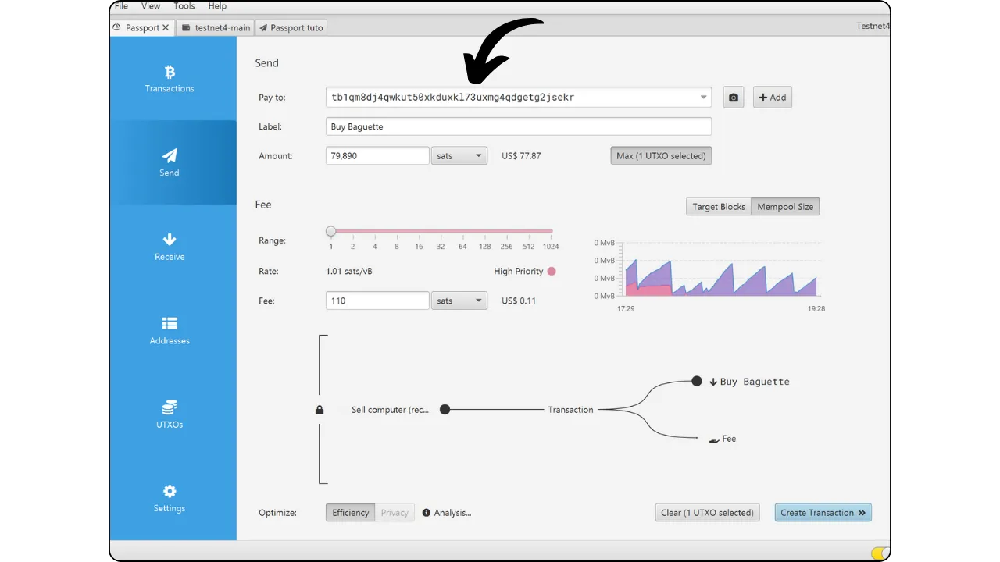

根据当前市场情况调整收费率，然后点击 "*创建交易*"。

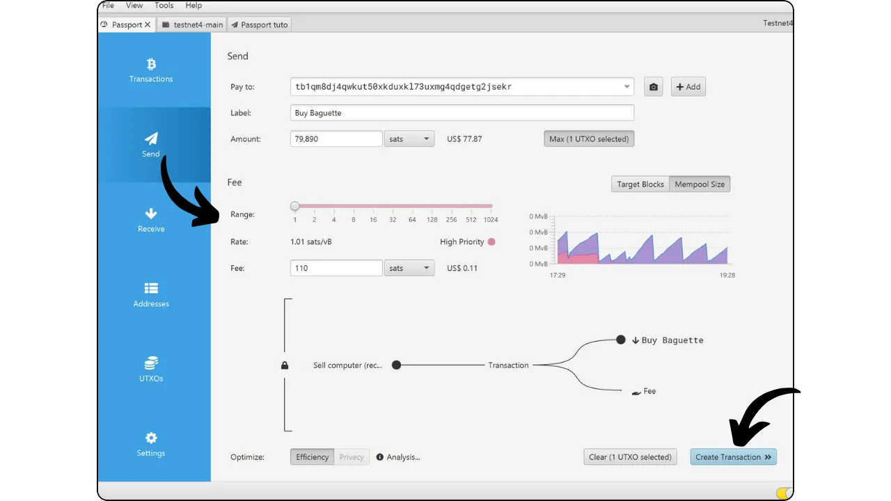

检查所有交易参数是否正确，然后点击 "*最终完成交易以供签署*"。

点击 "*显示 QR*"来显示 PSBT（*部分签名比特币交易*）。麻雀已经建立了交易，但还缺少签名来解锁输入中使用的比特币。这些签名只能由 Passport 来完成，因为 Passport 承载着你的种子，可以获取签署交易所需的私钥。

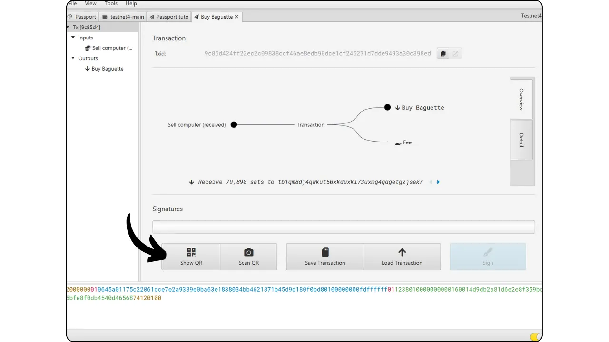

在护照上进入 "*账户*"菜单，点击 "*使用二维码*签名"。

扫描麻雀钱包上显示的 PSBT（*部分签名比特币交易*）。

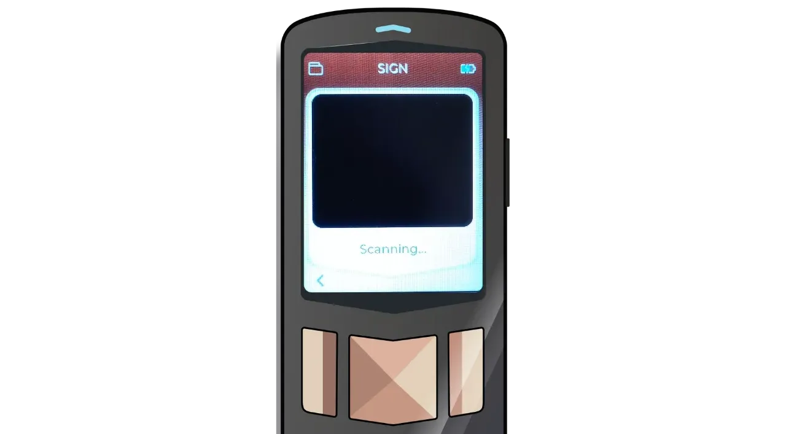

确认接收地址和发送金额无误，然后按确认按钮。

检查交换地址。在我的例子中，没有交换地址，因为交易只包含一个输出。

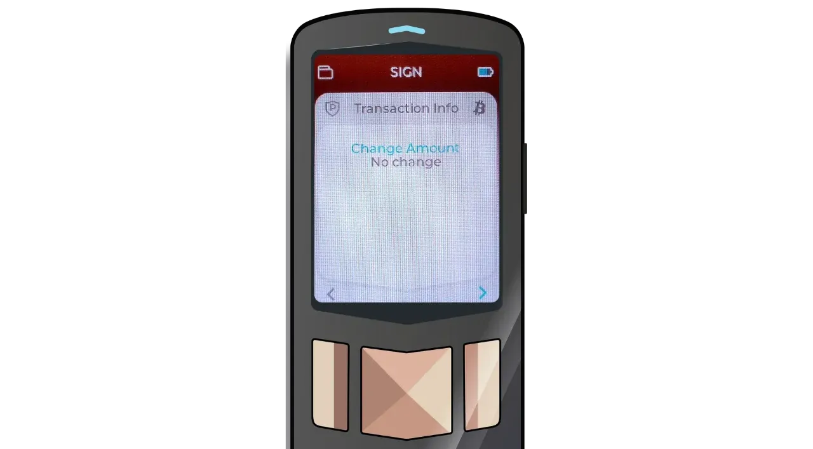

确保费用是您所选择的。

如果所有信息都正确无误，请单击确认按钮签署交易。

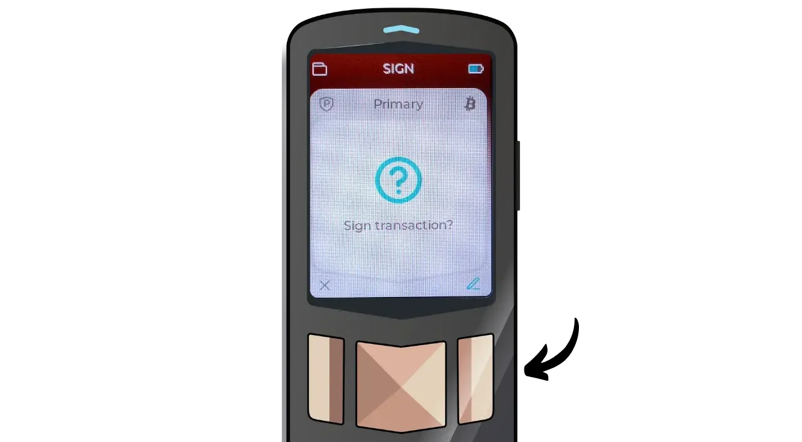

在麻雀钱包上点击 "*扫描二维码*"，扫描护照上显示的二维码。

您签署的交易现在可以在比特币网络上广播，并被矿工纳入一个区块。如果一切正常，请点击 "*广播交易*"。

您的交易已被广播，正在等待确认。

恭喜你，现在你已经知道如何配置和使用 Passport 了。如果您觉得本教程有用，请在下方留下绿色拇指，我将不胜感激。欢迎在您的社交网络上分享本文。感谢您的分享！

如需了解更多信息，请参阅我们的 Liana 软件教程：

https://planb.network/tutorials/wallet/desktop/liana-306ef457-700c-4fdd-b07a-8fb7a8a29f04