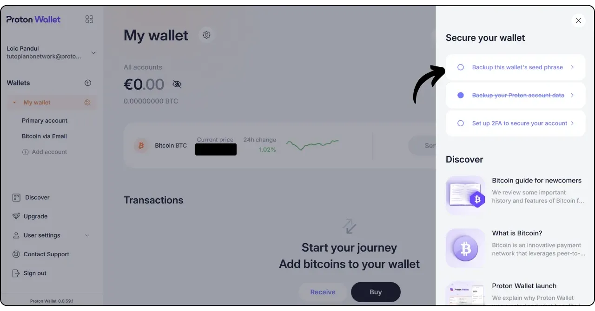
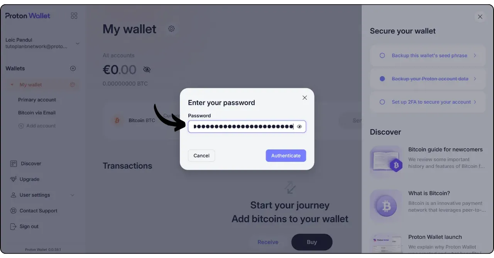
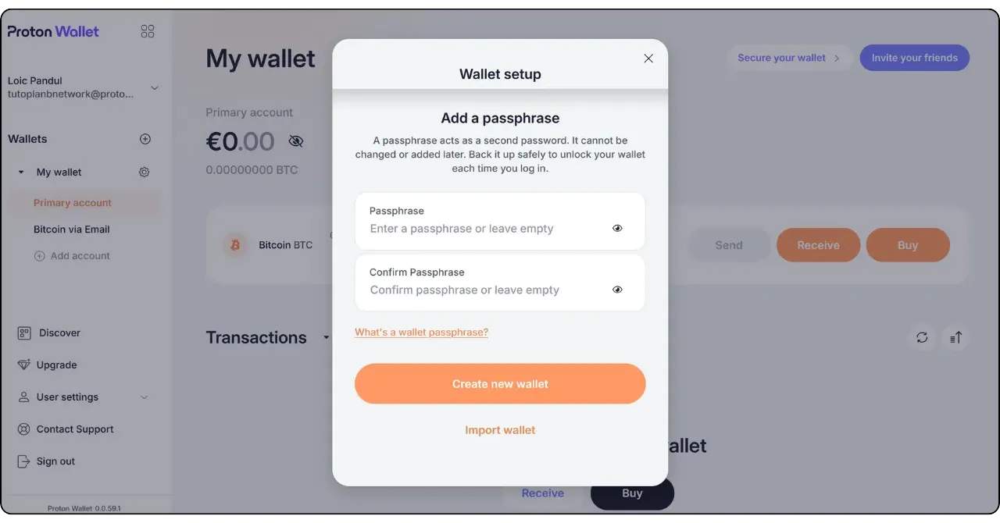
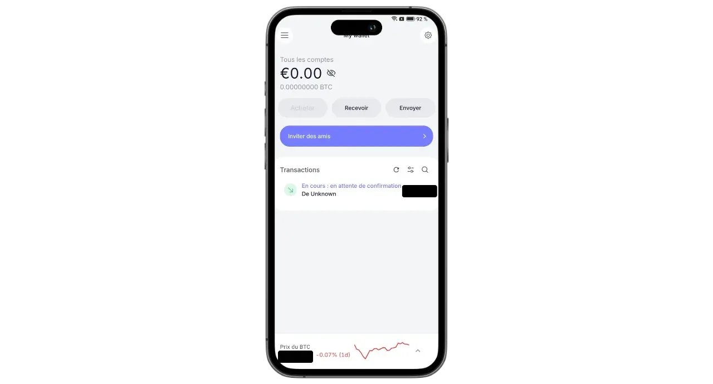

Proton est une entreprise suisse spécialisée dans la confidentialité numérique, fondée en 2014 par des scientifiques du CERN. Connue pour ses solutions open source, Proton propose une suite de services avec notamment Proton Mail, Proton VPN ou encore Proton Drive.

Proton a récemment introduit Proton Wallet, un portefeuille Bitcoin open-source en self-custody disponible sous forme d'application mobile ou de client web, lié à votre compte Proton. Les fonctionnalités du portefeuille sont relativement classiques pour le moment, avec les outils essentiels attendus d'un bon portefeuille Bitcoin, tels que RBF (*Replace-By-Fee*), l'étiquetage, ou encore la possibilité d'ajouter une passphrase BIP39.

La particularité de ce portefeuille est la possibilité d'envoyer des bitcoins en utilisant l'adresse email du destinataire, pour laquelle Proton génère automatiquement une adresse Bitcoin vierge liée au portefeuille de l'utilisateur. Proton envisage d'ajouter de nouvelles fonctionnalités à l'avenir, notamment Lightning et les coinjoins (en utilisant probablement Whirlpool, comme le suggèrent les activités sur leur dépôt GitHub).

## Créer un compte Proton

Pour utiliser Proton Wallet, vous devez obligatoirement posséder un compte Proton. Vous pouvez en créer un gratuitement en suivant les premières étapes de ce tutoriel dédié à la création d'une boîte mail Proton (seulement la section "*Créer un compte Proton*"). Une fois votre compte configuré, vous pourrez poursuivre avec la suite de ce tutoriel.

https://planb.network/tutorials/others/general/proton-mail-c3b010ce-254d-4546-b382-19ab9261c6a2

## Se connecter à Proton Wallet

Rendez-vous sur [le site de Proton Wallet](https://proton.me/wallet) et cliquez sur le bouton "*Get Proton Wallet*".

Choisissez l'option d'abonnement "*Free*", puis cliquez sur "*Sign In*".

Entrez l'email et le mot de passe associés à votre compte Proton pour vous connecter.

Votre compte devrait maintenant être affiché. Cliquez sur "*Start using Proton Wallet now*".

## Créer un portefeuille Bitcoin

Sélectionnez la devise fiat par défaut pour votre compte, puis cliquez sur "*Create new wallet*".

Votre portefeuille Bitcoin est maintenant créé. Vous pouvez théoriquement commencer à l'utiliser immédiatement, mais il est très important de sauvegarder d'abord votre phrase mnémonique. Pour cela, cliquez sur "*Secure your wallet*" situé en haut à droite de l'interface.

Si ce n'est pas déjà fait sur Proton, il vous sera demandé d'établir une sauvegarde pour votre compte et de le sécuriser via une méthode de 2FA. Ces mesures de sécurité, bien qu'applicables à l'ensemble de votre compte Proton, sont d'autant plus pertinentes que votre portefeuille Bitcoin y est intégré. Je vous recommande vivement de les mettre en place.

Pour sauvegarder votre phrase mnémonique, cliquez sur "*Backup this wallet's seed phrase*".

Entrez votre mot de passe Proton.

Cliquez ensuite sur "*View wallet seed phrase*" pour afficher la phrase mnémonique de votre portefeuille.

Proton Wallet vous affiche votre phrase mnémonique de 12 mots. **Cette phrase mnémonique donne un accès complet et non restreint à tous vos bitcoins**. N'importe qui en possession de cette phrase peut subtiliser vos fonds, même sans accès à votre compte Proton. La phrase de 12 mots permet de restaurer l'accès à vos bitcoins si vous perdez l'accès à votre compte. Il est donc très important de la sauvegarder soigneusement et de la stocker dans un endroit sécurisé.

Vous pouvez l'inscrire sur un bout de papier, ou bien pour plus de sécurité, je vous recommande de la graver sur un support en acier inoxydable afin de la protéger contre les risques d'incendies, d'inondations ou d'écroulements.

Pour plus d'informations sur la manière adéquate de sauvegarder et de gérer votre phrase mnémonique, je vous recommande vivement de suivre cet autre tutoriel, particulièrement si vous êtes débutant :

https://planb.network/tutorials/wallet/backup/backup-mnemonic-22c0ddfa-fb9f-4e3a-96f9-46e2a7954270

_**Évidemment, vous ne devez jamais prendre en photo ces mots, contrairement à ce que je fais dans ce tutoriel.**_

Cliquez sur le bouton "*Done*" une fois votre phrase sauvegardée.

## Découvrir l'interface

L'interface de Proton Wallet est très intuitive. À gauche, vous trouverez vos différents portefeuilles ainsi que les comptes qui y sont associés. Le compte "*Primary*" est votre compte principal. Pour des raisons de confidentialité, les bitcoins reçus via l'adresse email de Proton sont placés dans un compte distinct, nommé "*Bitcoin via Email*".

Pour ajouter un nouveau compte, cliquez sur "*Add account*".

Pour créer un nouveau portefeuille, cliquez sur le symbole "*+*" à côté de "*Wallets*".

C'est à cette étape que vous avez la possibilité d'ajouter une passphrase BIP39 à un nouveau portefeuille.

Pour approfondir vos connaissances sur la passphrase, je vous recommande de consulter ce tutoriel :

https://planb.network/tutorials/wallet/backup/passphrase-a26a0220-806c-44b4-af14-bafdeb1adce7

## Recevoir des bitcoins

Pour recevoir des bitcoins dans votre portefeuille, sélectionnez le compte souhaité à gauche de l'interface, puis cliquez sur le bouton "*Receive*".

Proton Wallet génère alors automatiquement une nouvelle adresse vierge.

Une fois la transaction effectuée, vous la trouverez dans la section "*Transactions*". Cliquez sur "*+Add*" pour associer une étiquette à cette transaction.

## Envoyer des bitcoins

Maintenant que vous disposez de bitcoins dans votre portefeuille, vous avez la possibilité d'en envoyer. Sélectionnez le compte de votre choix sur la gauche de l'interface, puis cliquez sur "*Send*".

Entrez l'adresse Bitcoin du destinataire. Vous pouvez scanner un QR code en cliquant sur le petit logo. Pour envoyer à une adresse email, saisissez-la directement dans ce champ. Après avoir renseigné l'adresse Bitcoin, cliquez sur la petite flèche puis sur "*Confirm*".

Indiquez le montant à envoyer, que ce soit en monnaie fiat ou en bitcoins, puis cliquez sur "*Review*".

Sélectionnez le montant des frais de transaction en fonction de la situation actuelle du marché.

Ajoutez une étiquette à votre transaction, puis revérifiez tous les détails. Si tout est correct, cliquez sur "*Confirm and send*" pour signer et diffuser la transaction.

Votre transaction apparaîtra désormais en attente de confirmation dans la section "*Transactions*" de votre compte.

## Se connecter sur l'application

En plus du client web, Proton Wallet est aussi accessible via une application mobile. Grâce à l'association du portefeuille à votre compte Proton, vous pouvez synchroniser votre portefeuille entre le client web et l'application mobile.

Téléchargez Proton Wallet depuis votre store d'applications :
- [Sur l'App Store](https://apps.apple.com/us/app/proton-wallet-secure-btc/id6479609548) ;
- [Sur le Google Play Store](https://play.google.com/store/apps/details?id=me.proton.wallet.android).

Après l'installation, cliquez sur "*Se connecter*" et entrez votre adresse email ainsi que votre mot de passe Proton.

Vous accéderez alors à votre portefeuille Bitcoin, avec les mêmes fonctionnalités que sur le client web.

Félicitations, vous savez dorénavant comment configurer et utiliser Proton Wallet. Si vous avez trouvé ce tutoriel utile, je vous serais reconnaissant de laisser un pouce vert ci-dessous. N'hésitez pas à partager cet article sur vos réseaux sociaux. Merci !

Pour aller plus loin, je vous recommande de consulter ce tutoriel sur le Jade Plus, le tout dernier hardware wallet de Blockstream :

https://planb.network/tutorials/wallet/hardware/jade-plus-sparrow-938abf16-e10a-4618-860d-cd771373a262
