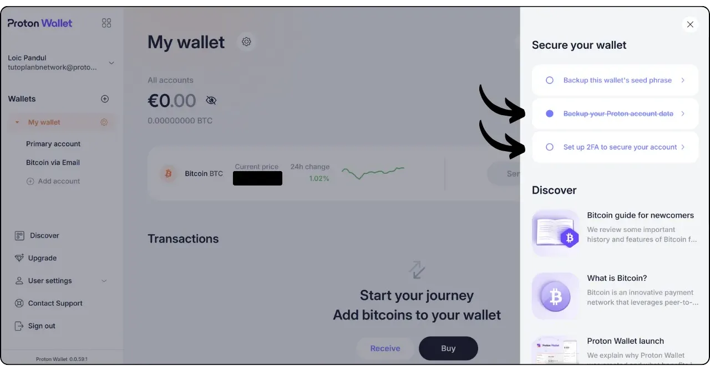
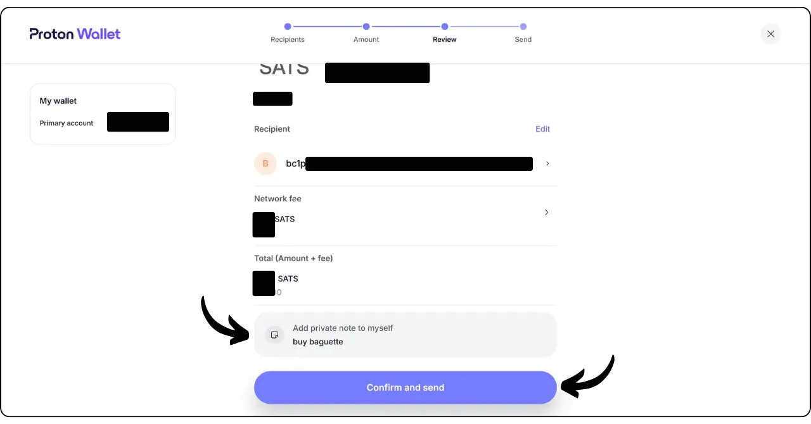
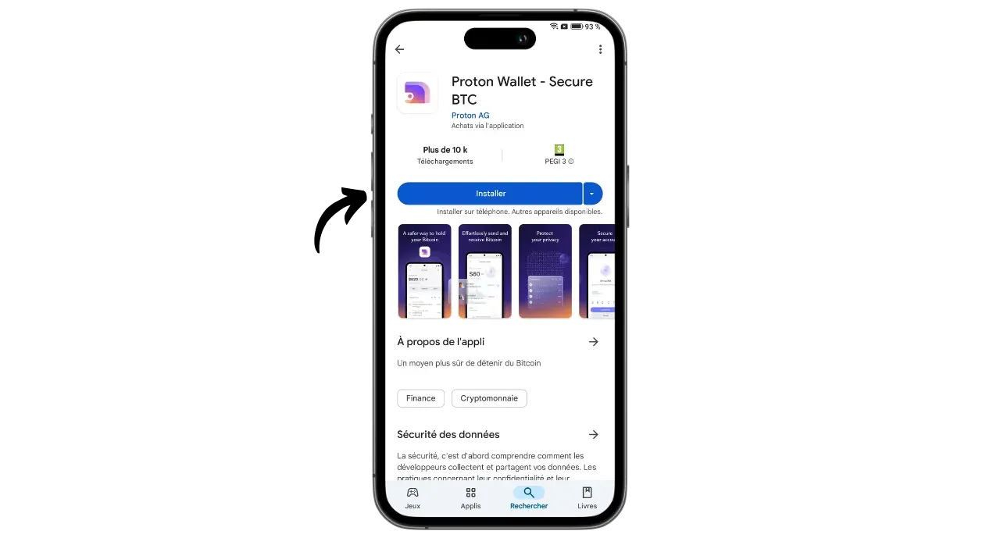

A Proton é uma empresa suíça especializada em privacidade digital, fundada em 2014 por cientistas do CERN. Conhecida pelas suas soluções de código aberto, a Proton oferece um conjunto de serviços que inclui o Proton Mail, o Proton VPN e o Proton Drive.

A Proton introduziu recentemente a Proton Wallet, uma carteira Bitcoin de código aberto e auto-custódia, disponível como uma aplicação móvel ou cliente web, ligada à sua conta Proton. As funcionalidades da carteira são relativamente clássicas para o momento, com as ferramentas essenciais esperadas de uma boa carteira Bitcoin, como RBF (*Replace-By-Fee*), marcação, ou a capacidade de adicionar uma senha BIP39.

A caraterística especial desta carteira é a capacidade de enviar bitcoins utilizando o endereço de correio eletrónico do destinatário, para o qual a Proton gera automaticamente um endereço Bitcoin em branco ligado à carteira do utilizador. A Proton planeia adicionar novas funcionalidades no futuro, incluindo Lightning e coinjoins (provavelmente utilizando Whirlpool, como sugerido pela atividade no seu repositório GitHub).

## Criar uma conta Proton

Para utilizar a Carteira Proton, precisa de uma conta Proton. Pode criar uma gratuitamente seguindo os primeiros passos deste tutorial dedicado à criação de uma caixa de correio Proton (apenas a secção "*Criar uma conta Proton*"). Assim que a sua conta estiver configurada, pode continuar com o resto deste tutorial.

https://planb.network/tutorials/others/general/proton-mail-c3b010ce-254d-4546-b382-19ab9261c6a2
## Ligar à Carteira Proton

Aceda ao [sítio Web da Proton Wallet] (https://proton.me/wallet) e clique no botão "*Get Proton Wallet*".

Escolha a opção de subscrição "*Gratuito*" e, em seguida, clique em "*Iniciar sessão*".

Introduza o e-mail e a palavra-passe associados à sua conta Proton para iniciar sessão.

A sua conta deve agora ser apresentada. Clique em "*Comece a utilizar a Carteira Proton agora*".

## Criar uma carteira Bitcoin

Selecione a moeda fiduciária predefinida para a sua conta e, em seguida, clique em "*Criar nova carteira*".

A sua carteira Bitcoin foi criada. Teoricamente, pode começar a utilizá-la imediatamente, mas é muito importante guardar primeiro a sua mnemónica. Para o fazer, clique em "*Segurar a sua carteira*" no canto superior direito da interface.

Se ainda não o tiver feito no Proton, ser-lhe-á pedido que crie uma cópia de segurança para a sua conta e que a proteja utilizando um método 2FA. Estas medidas de segurança, embora aplicáveis a toda a sua conta Proton, são ainda mais relevantes quando a sua carteira Bitcoin está integrada na mesma. Recomendo vivamente que as implemente.

Para guardar a sua frase mnemónica, clique em "*Cópia de segurança da frase semente desta carteira*".

Introduza a sua palavra-passe Proton.

Em seguida, clique em "*Ver frase de semente da carteira*" para visualizar a frase mnemónica da sua carteira.

A Proton Wallet apresenta a sua frase mnemónica de 12 palavras. **Esta mnemónica dá-lhe acesso total e sem restrições a todos os seus bitcoins. Qualquer pessoa na posse desta frase pode roubar os seus fundos, mesmo sem acesso à sua conta Proton. A frase de 12 palavras pode ser usada para restaurar o acesso aos seus bitcoins se perder o acesso à sua conta. Por isso, é muito importante guardá-la cuidadosamente e armazená-la num local seguro.

Pode escrevê-lo num pedaço de papel ou, para maior segurança, recomendo que o grave numa base de aço inoxidável para o proteger de incêndios, inundações ou desmoronamentos.

Para mais informações sobre a forma correta de guardar e gerir a sua frase mnemónica, recomendo vivamente que siga este outro tutorial, especialmente se for um principiante:

https://planb.network/tutorials/wallet/backup/backup-mnemonic-22c0ddfa-fb9f-4e3a-96f9-46e2a7954270
é claro que nunca se deve tirar uma fotografia destas palavras, ao contrário do que faço neste tutorial

Clique no botão "*Finalizado*" depois de ter guardado a sua frase.

## Descobrir a interface

A interface da Proton Wallet é muito intuitiva. À esquerda, encontra as suas diferentes carteiras e as respectivas contas associadas. A conta "*Primária*" é a sua conta principal. Por razões de confidencialidade, os bitcoins recebidos através do endereço de correio eletrónico Proton são colocados numa conta separada, denominada "*Bitcoin via Email*".

Para adicionar uma nova conta, clique em "*Adicionar conta*".

Para criar uma nova carteira, clique no símbolo "*+*" junto a "*Carteiras*".

É aqui que pode adicionar uma frase-passe BIP39 a uma nova carteira.

Para aprofundar os seus conhecimentos sobre a frase-chave, recomendo este tutorial:

https://planb.network/tutorials/wallet/backup/passphrase-a26a0220-806c-44b4-af14-bafdeb1adce7
## Receber bitcoins

Para receber bitcoins na sua carteira, selecione a conta desejada no lado esquerdo da interface e clique no botão "*Receber*".

A Proton Wallet gera automaticamente um novo endereço em branco.

Quando a transação estiver concluída, encontra-se na secção "*Transacções*". Clique em "*+Adicionar*" para atribuir uma etiqueta à transação.

## Enviar bitcoins

Agora que tem bitcoins na sua carteira, pode enviá-los. Selecione a conta da sua escolha no lado esquerdo da interface e, em seguida, clique em "*Enviar*".

Introduzir o endereço Bitcoin do destinatário. Pode digitalizar um código QR clicando no pequeno logótipo. Para enviar para um endereço de e-mail, introduza-o diretamente neste campo. Depois de ter introduzido o endereço Bitcoin, clique na pequena seta e depois em "*Confirmar*".

Introduza o montante a enviar, em moeda fiduciária ou em bitcoins, e depois clique em "*Review*".

Selecionar a taxa de transação com base na situação atual do mercado.

Adicione uma etiqueta à sua transação e, em seguida, verifique novamente todos os detalhes. Se tudo estiver correto, clique em "*Confirmar e enviar*" para assinar e enviar a transação.

A sua transação aparecerá agora a aguardar confirmação na secção "*Transacções*" da sua conta.

## Iniciar sessão na aplicação

Para além do cliente Web, a Carteira Proton também está acessível através de uma aplicação móvel. Ao associar a carteira à sua conta Proton, pode sincronizar a sua carteira entre o cliente Web e a aplicação móvel.

Transfira a Proton Wallet da sua loja de aplicações:

- [Na App Store] (https://apps.apple.com/us/app/proton-wallet-secure-btc/id6479609548);
- [Na Google Play Store] (https://play.google.com/store/apps/details?id=me.proton.wallet.android).

Após a instalação, clique em "*Log in*" e introduza o seu endereço de correio eletrónico e a palavra-passe Proton.

Terá então acesso à sua carteira Bitcoin, com as mesmas funcionalidades que no cliente Web.

Parabéns, agora já sabe como configurar e utilizar a Carteira Proton. Se você achou este tutorial útil, eu ficaria muito grato se você deixasse um polegar verde abaixo. Sinta-se à vontade para partilhar este artigo nas suas redes sociais. Obrigado por partilhar!

Para ir mais longe, recomendo este tutorial sobre a Jade Plus, a mais recente carteira de hardware da Blockstream:

https://planb.network/tutorials/wallet/hardware/jade-plus-sparrow-938abf16-e10a-4618-860d-cd771373a262