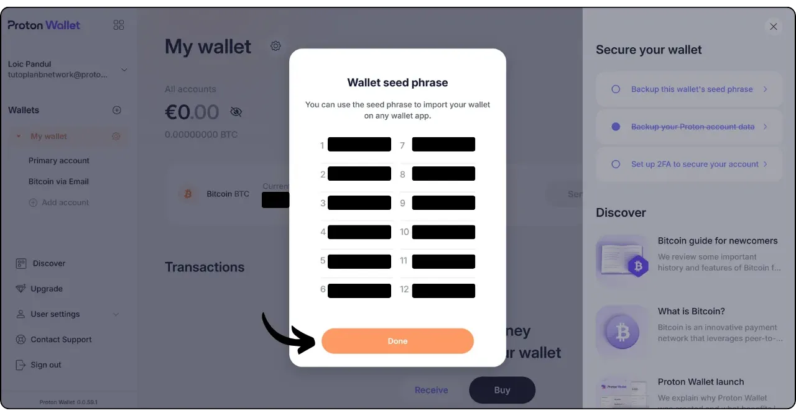
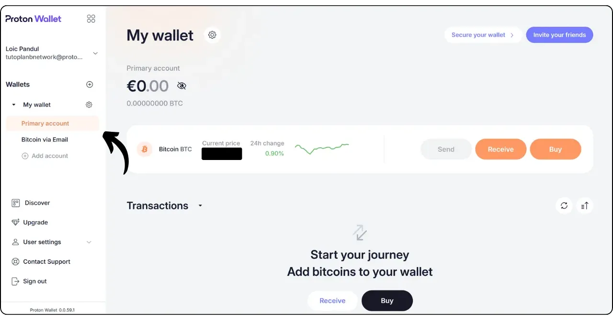

Proton là một công ty Thụy Sĩ chuyên về quyền riêng tư kỹ thuật số, được thành lập vào năm 2014 bởi các nhà khoa học CERN. Được biết đến với các giải pháp nguồn mở, Proton cung cấp một bộ dịch vụ bao gồm Proton Mail, Proton VPN và Proton Drive.

Proton gần đây đã giới thiệu Proton Wallet, một ví Bitcoin tự lưu trữ mã nguồn mở có sẵn dưới dạng ứng dụng di động hoặc máy khách web, được liên kết với tài khoản Proton của bạn. Các chức năng của ví tương đối cổ điển vào thời điểm hiện tại, với các công cụ thiết yếu được mong đợi của một ví Bitcoin tốt, chẳng hạn như RBF (*Thay thế bằng Phí*), gắn thẻ hoặc khả năng thêm cụm mật khẩu BIP39.

Tính năng đặc biệt của ví này là khả năng gửi bitcoin bằng địa chỉ email của người nhận, Proton sẽ tự động tạo một địa chỉ Bitcoin trống được liên kết với ví của người dùng. Proton có kế hoạch bổ sung các tính năng mới trong tương lai, bao gồm Lightning và coinjoins (có thể sử dụng Whirlpool, theo gợi ý của hoạt động trên kho lưu trữ GitHub của họ).

## Tạo tài khoản Proton

Để sử dụng Proton Wallet, bạn cần có tài khoản Proton. Bạn có thể tạo một tài khoản miễn phí bằng cách làm theo các bước đầu tiên của hướng dẫn này dành riêng cho việc tạo hộp thư Proton (chỉ phần "*Tạo tài khoản Proton*"). Sau khi tài khoản của bạn được thiết lập, bạn có thể tiếp tục phần còn lại của hướng dẫn này.

https://planb.network/tutorials/others/general/proton-mail-c3b010ce-254d-4546-b382-19ab9261c6a2
## Kết nối với Ví Proton

Truy cập [trang web Proton Wallet](https://proton.me/wallet) và nhấp vào nút "*Nhận Proton Wallet*".

Chọn tùy chọn đăng ký "*Miễn phí*", sau đó nhấp vào "*Đăng nhập*".

Nhập email và mật khẩu được liên kết với tài khoản Proton của bạn để đăng nhập.

Tài khoản của bạn sẽ được hiển thị. Nhấp vào "*Bắt đầu sử dụng Proton Wallet ngay*".

## Tạo ví Bitcoin

Chọn loại tiền tệ fiat mặc định cho tài khoản của bạn, sau đó nhấp vào "*Tạo ví mới*".

Ví Bitcoin của bạn hiện đã được tạo. Về mặt lý thuyết, bạn có thể bắt đầu sử dụng ngay lập tức, nhưng điều rất quan trọng là phải lưu mã ghi nhớ của bạn trước. Để thực hiện việc này, hãy nhấp vào "*Bảo mật ví của bạn*" ở góc trên bên phải của giao diện.

Nếu bạn chưa thực hiện trên Proton, bạn sẽ được yêu cầu thiết lập bản sao lưu cho tài khoản của mình và bảo mật bằng phương pháp 2FA. Các biện pháp bảo mật này, mặc dù áp dụng cho toàn bộ tài khoản Proton của bạn, nhưng càng có liên quan hơn khi ví Bitcoin của bạn được tích hợp vào đó. Tôi thực sự khuyên bạn nên triển khai chúng.

Để lưu cụm từ ghi nhớ của bạn, hãy nhấp vào "*Sao lưu cụm từ hạt giống của ví này*".

Nhập mật khẩu Proton của bạn.

Sau đó nhấp vào "*Xem cụm từ hạt giống ví*" để hiển thị cụm từ ghi nhớ của ví bạn.

Ví Proton hiển thị cụm từ ghi nhớ 12 từ của bạn. **Cụm từ ghi nhớ này cung cấp cho bạn quyền truy cập đầy đủ, không giới hạn vào tất cả bitcoin của bạn**. Bất kỳ ai sở hữu cụm từ này đều có thể đánh cắp tiền của bạn, ngay cả khi không truy cập vào tài khoản Proton của bạn. Cụm từ 12 từ có thể được sử dụng để khôi phục quyền truy cập vào bitcoin của bạn nếu bạn mất quyền truy cập vào tài khoản của mình. Do đó, điều rất quan trọng là phải lưu nó cẩn thận và lưu trữ ở một vị trí an toàn.

Bạn có thể viết nó trên một tờ giấy, hoặc để an toàn hơn, tôi khuyên bạn nên khắc nó trên một đế thép không gỉ để bảo vệ nó khỏi hỏa hoạn, lũ lụt hoặc sụp đổ.

Để biết thêm thông tin về cách lưu và quản lý cụm từ ghi nhớ đúng cách, tôi thực sự khuyên bạn nên làm theo hướng dẫn khác này, đặc biệt nếu bạn là người mới bắt đầu:

https://planb.network/tutorials/wallet/backup/backup-mnemonic-22c0ddfa-fb9f-4e3a-96f9-46e2a7954270
_**Tất nhiên, bạn không bao giờ nên chụp ảnh những từ này, không giống như những gì tôi làm trong hướng dẫn này.**_

Nhấp vào nút "*Xong*" sau khi bạn đã lưu cụm từ của mình.

## Khám phá giao diện

Giao diện của Proton Wallet rất trực quan. Ở bên trái, bạn sẽ tìm thấy các ví khác nhau và các tài khoản liên quan của chúng. Tài khoản "*Chính*" là tài khoản chính của bạn. Vì lý do bảo mật, bitcoin nhận được qua địa chỉ email Proton sẽ được đặt trong một tài khoản riêng, có tên là "*Bitcoin qua Email*".

Để thêm tài khoản mới, hãy nhấp vào "*Thêm tài khoản*".

Để tạo danh mục đầu tư mới, hãy nhấp vào biểu tượng "*+*" bên cạnh "*Ví*".

Đây là nơi bạn có thể thêm mật khẩu BIP39 vào ví mới.

Để hiểu sâu hơn về cụm mật khẩu, tôi xin giới thiệu hướng dẫn này:

https://planb.network/tutorials/wallet/backup/passphrase-a26a0220-806c-44b4-af14-bafdeb1adce7
## Nhận bitcoin

Để nhận bitcoin vào ví của bạn, hãy chọn tài khoản mong muốn ở bên trái giao diện, sau đó nhấp vào nút "*Nhận*".

Sau đó, Proton Wallet sẽ tự động tạo một địa chỉ mới, trống.

Sau khi giao dịch hoàn tất, bạn sẽ thấy giao dịch trong phần "*Giao dịch*". Nhấp vào "*+Thêm*" để gán nhãn cho giao dịch.

## Gửi bitcoin

Bây giờ bạn đã có bitcoin trong ví, bạn có thể gửi chúng. Chọn tài khoản bạn chọn ở phía bên trái của giao diện, sau đó nhấp vào "*Gửi*".

Nhập địa chỉ Bitcoin của người nhận. Bạn có thể quét mã QR bằng cách nhấp vào logo nhỏ. Để gửi đến địa chỉ email, hãy nhập trực tiếp vào trường này. Sau khi nhập địa chỉ Bitcoin, hãy nhấp vào mũi tên nhỏ rồi nhấp vào "*Xác nhận*".

Nhập số tiền cần gửi, bằng tiền pháp định hoặc bitcoin, sau đó nhấp vào "*Xem lại*".

Chọn mức phí giao dịch dựa trên tình hình thị trường hiện tại.

Thêm nhãn vào giao dịch của bạn, sau đó kiểm tra lại tất cả các chi tiết. Nếu mọi thứ đều chính xác, hãy nhấp vào "*Xác nhận và gửi*" để ký và gửi giao dịch.

Giao dịch của bạn bây giờ sẽ hiển thị chờ xác nhận trong phần "*Giao dịch*" trong tài khoản của bạn.

## Đăng nhập vào ứng dụng

Ngoài ứng dụng web, Proton Wallet cũng có thể truy cập thông qua ứng dụng di động. Bằng cách liên kết ví với tài khoản Proton của bạn, bạn có thể đồng bộ hóa ví của mình giữa ứng dụng web và ứng dụng di động.

Tải xuống Proton Wallet từ cửa hàng ứng dụng của bạn:

- [Trên App Store](https://apps.apple.com/us/app/proton-wallet-secure-btc/id6479609548);
- [Trên Cửa hàng Google Play](https://play.google.com/store/apps/details?id=me.proton.wallet.android).

Sau khi cài đặt, nhấp vào "*Đăng nhập*" và nhập địa chỉ email và mật khẩu Proton của bạn.

Sau đó, bạn sẽ có quyền truy cập vào ví Bitcoin của mình với các tính năng tương tự như trên máy khách web.

Xin chúc mừng, giờ bạn đã biết cách thiết lập và sử dụng Proton Wallet. Nếu bạn thấy hướng dẫn này hữu ích, tôi sẽ rất biết ơn nếu bạn để lại một ngón tay cái màu xanh lá cây bên dưới. Hãy thoải mái chia sẻ bài viết này trên mạng xã hội của bạn. Cảm ơn vì đã chia sẻ!

Để tìm hiểu sâu hơn, tôi xin giới thiệu hướng dẫn này về Jade Plus, ví phần cứng mới nhất của Blockstream:

https://planb.network/tutorials/wallet/hardware/jade-plus-sparrow-938abf16-e10a-4618-860d-cd771373a262